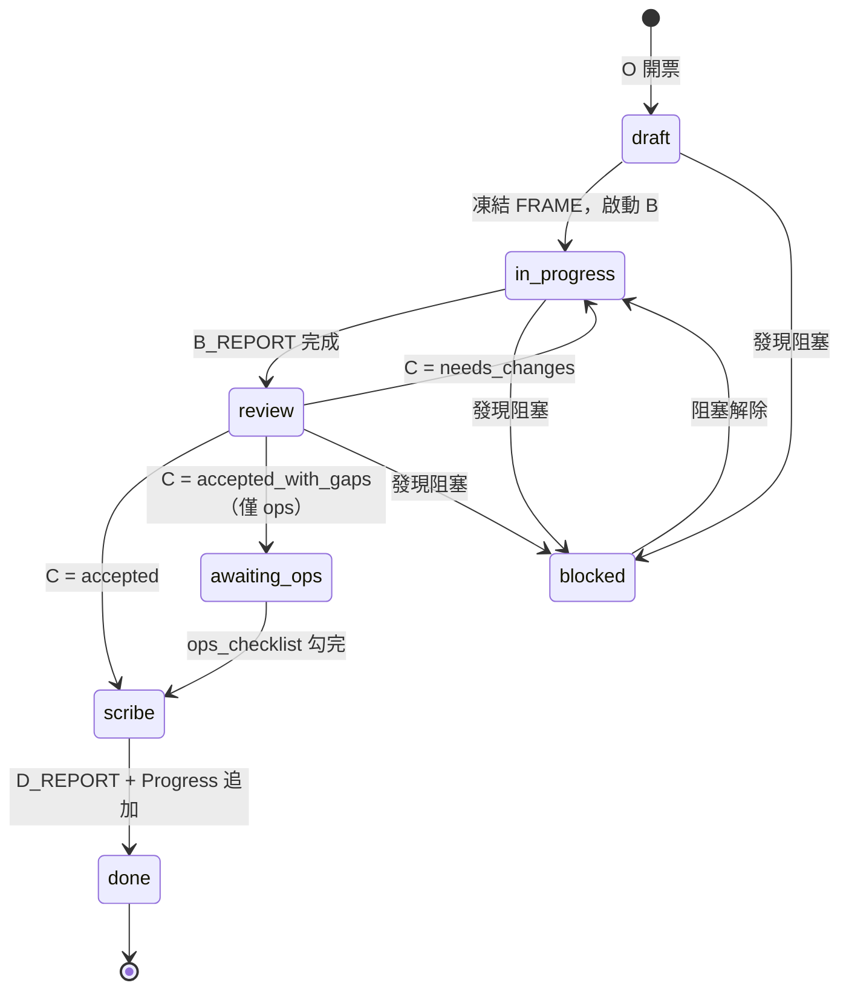

# Multi-Chat Ticket Workflow Skill

> 適用於平行對話的四角色工作流（O → B → C → D），以 `<ticket_id>_state.md` 為單一真相源（SSOT）。
> **不覆蓋**：`AGENTS.md` 接戰／封存、`ENGINEERING_CONTRACT.md` 四流派／12-rule、`.cursor/rules/multi_chat_roles.mdc` 角色邊界。

---

## Quick Start：O → B → C → D 流水

```text
Orchestrator / Operator (O)   Implementer (B)           Reviewer (C)              Scribe (D)
     │                         │                        │                        │
     ▼                         ▼                        ▼                        ▼
建立 <ticket>_state.md    讀 FRAME                 唯讀 diff               讀 B/C_REPORT
填 FRAME + STATE          起手列已讀+計畫           對照 FRAME 驗收          更新 docs
凍結 scope                在 AllowedPaths 內施工     寫 C_REPORT             追加 Progress
啟動 B / 更新 STATE       寫 B_REPORT              結論 accepted/          寫 D_REPORT
     │                    （changed_files /          needs_changes           ▲
     │                     verification）             更新 STATE ─────────────┘
     │                         │                        │
     └─────────────────────────┴────────────────────────┘
                              循環直到 overall_status = done
```

**交接口令**（新 chat 首句）：
```
角色：<orchestrator | implementer | reviewer | scribe>
票號：<TICKET-ID>
State 路徑：04_Workflows/tickets/<TICKET-ID>_state.md
```

> **代號**：流水 **O → B → C → D**。O = Orchestrator／Operator（廢止 A）。勿與 lifecycle_phase `O`（Observe）或 `awaiting_ops` 混淆。

---

## 四角色責任矩陣

| 角色 | 核心職責 | 可寫區塊 | 禁止行為 |
|------|----------|----------|----------|
| **Orchestrator / Operator (O)** | 開票、凍結 FRAME/STATE、排票順序、解衝突、收口 | FRAME、STATE | 不繞過 Reviewer 標 done；不大改程式 |
| **Implementer (B)** | 在 AllowedPaths 內實作、執行 runner、結構化回報 | B_REPORT | 不改 FRAME/STATE/C/D_REPORT；不擴 scope |
| **Reviewer (C)** | 唯讀審查 diff + B_REPORT、對照 FRAME 驗收 | C_REPORT | 不撰寫/修改程式碼；不改 FRAME/STATE/B/D_REPORT |
| **Scribe (D)** | 更新 docs、整理戰報、追加 Progress 末尾 | D_REPORT | 不改 code/tests/FRAME/STATE/B/C_REPORT |

**與 Cursor Subagents 對照**：O ≈ coordinator、B ≈ implementation-worker、C ≈ checker-reviewer、D 無對應（文檔專職）。

---

## Orchestrator 開票 Checklist

開票前確認以下項目已寫入 FRAME：

- [ ] **Goal**：一句話可驗收目標
- [ ] **Scope**：MUST／MAY 條列（本票必做）
- [ ] **NonScope**：明確不做（含鄰票邊界、fixture 是否只讀）
- [ ] **AllowedPaths**：允許改動的 glob／目錄（具體到檔案層）
- [ ] **BlockedPaths**：憲法 §7 禁區類型、治理母本、他人 core、FRAME/STATE 區塊、CI/L2/L3（除非 AC 明示）
- [ ] **Dependencies**：前置票號、外部依賴、必讀 doc
- [ ] **relay_mode**：`same_chat` 或 `multi_chat`（見下方專節）
- [ ] **AcceptanceCriteria**：3–7 條可重跑驗收條件（命令 + 預期結果，非操作腳本）

**架構紅線五類對照表**（必須映射至 BlockedPaths 或附註「引用 §6.6.2 預設紅線」）：

| 紅線類別 | 典型路徑 | 處理方式 |
|----------|----------|----------|
| 憲法 §7 禁區類型 | env、venv、runtime/checkpoints | 寫入 BlockedPaths |
| 治理母本 | `HARNESS_CONSTITUTION.md`、`ENGINEERING_CONTRACT.md` | 寫入 BlockedPaths |
| 全局 live STATE | `00_Agent_Work_Progress.md`、`master_status.md` | 寫入 BlockedPaths（Scribe 僅末尾追加） |
| CI／L2／L3 | `.github/workflows/*`、branch protection | 寫入 BlockedPaths |
| 他人 core／FRAME | 非本票 `core/*`、其他票 `*_state.md` | 寫入 BlockedPaths |

---

## Ticket State 模板結構

每張票對應 `04_Workflows/tickets/<ticket_id>_state.md`，含五區塊：

### FRAME（Orchestrator 填 · 開票時凍結）

```markdown
- Goal: <!-- 一句話 -->
- Scope:
  - <!-- MUST -->
  - <!-- MAY -->
- NonScope: <!-- 明確不做 -->
- AllowedPaths:
  - `path/to/allowed/**`
- BlockedPaths:
  - `core/*`、`AGENTS.md`、`FRAME`、`STATE` 等
- Dependencies: <!-- 前置票／阻塞／必讀 doc --> 無
- relay_mode: same_chat | multi_chat  <!-- 見下方「relay_mode」 -->
- AcceptanceCriteria:
  - AC-1: <!-- 可重跑命令 + 預期結果 -->
  - AC-2: <!-- ... -->
```

### STATE（Orchestrator 維護 · 每次交棒更新）

```markdown
- overall_status: draft | in_progress | review | scribe | awaiting_ops | done | blocked
- current_owner: orchestrator | implementer | reviewer | scribe | ops
- next_action: <!-- 一句話 -->
- last_updated: YYYY-MM-DD · 角色縮寫
- ops_checklist: <!-- awaiting_ops 時必填；否則「無」 -->
  - [ ] <!-- 例：commit／push 本票三檔 -->
  - [ ] <!-- 例：workflow_dispatch → 貼 run_url -->
- status_by_role:
  - orchestrator: pending | done | n/a
  - implementer: pending | in_progress | done | n/a
  - reviewer: pending | in_progress | done | n/a
  - scribe: pending | in_progress | done | n/a
```
### B_REPORT（Implementer 填 · 施工後）

```markdown
- changed_files: <!-- 實際變更路徑條列 -->
- artifacts: <!-- 新建產物 --> 無
- verification: <!-- 命令與關鍵結果（ok / 失敗） -->
- behavior_notes: <!-- 設計取捨 -->
- deferred_items: <!-- 留待下一票 --> 無
```

### C_REPORT（Reviewer 填 · 審查後）

```markdown
- conclusion: accepted | accepted_with_gaps | needs_changes | rejected
- blocking_issues: <!-- 必須修；無則「無」 -->
- checks_summary: <!-- 對照 FRAME 邊界檢查摘要 -->
- risk_level: low | medium | high
- suggestions: <!-- 非阻塞建議 --> 無
```

### D_REPORT（Scribe 填 · 收口後）

```markdown
- docs_updates: <!-- 建議更新文檔路徑 --> 無
- progress_entry: <!-- 建議寫入 Progress 末尾的 1–3 句摘要 -->
- followup_suggestions: <!-- 後續票或尚書省待裁決 --> 無
```

---

## 標準交接格式

新 chat 接戰時，複製以下三行作為起手式：

```
角色：<orchestrator | implementer | reviewer | scribe>
票號：<TICKET-ID>
State 路徑：04_Workflows/tickets/<TICKET-ID>_state.md
```

**範例**：
```
角色：implementer
票號：BATCH-MVP-01
State 路徑：04_Workflows/tickets/BATCH-MVP-01_state.md
```

---

## 狀態流轉建議

典型狀態流：

```
draft (O 開票)
  ↓ 凍結 FRAME，啟動 B
in_progress (B 施工中)
  ↓ B_REPORT 完成，O 更新 STATE
review (C 審查中)
  ├── needs_changes → 回 in_progress (B 再施工)
  ├── accepted → O 更新 STATE → scribe
  └── accepted_with_gaps（僅差 human ops）→ awaiting_ops
scribe (D 收口)
  ↓ D_REPORT + Progress 追加
done
```

**Mermaid 狀態圖**：



---

## relay_mode（同輪快車 vs 真分 Chat）

開票時在 FRAME 標明交棒方式（與 Phase 4 contract §8「可合併執行、AC／C_REPORT 不可省」對齊）：

| `relay_mode` | 何時用 | 交棒作法 |
|--------------|--------|----------|
| `same_chat` | doc/spec、單檔 bugfix、估計 ≤1 循環 | **同一 chat** 依序寫 B→C→D→STATE；**不必**每棒重跑完整 boot／重貼三行起手 |
| `multi_chat` | 跨模組、高風險、需獨立 Reviewer 模型 | 每棒開新 chat，貼角色起手三行 + 同一 state 路徑 |

**預設**：未填時依票面判斷——`ticket_class: doc/spec` 且 `estimated_cycles: 1` → 建議 `same_chat`；其餘 → `multi_chat`。  
**硬約束**：無論哪種模式，仍須寫入 B／C／D_REPORT 與 STATE；禁止「口頭 accepted、檔案未寫」。

---

## awaiting_ops（本機綠、等人 push／dispatch）

近票常見：本機／advisory 綠 → Reviewer `accepted_with_gaps` → 卡在 commit／push／`workflow_dispatch`／貼 `run_url`。

| 欄位 | 用法 |
|------|------|
| `overall_status: awaiting_ops` | AI 施工段結束；**不是** `done`，也**不是**重開完整 O→B→C |
| `ops_checklist` | 條列 human／ops 動作（commit、push、dispatch、貼 run_url…） |
| QUEUE | 對應列可標 `DONE_WITH_GAPS`；`priority_next` 用 `mode: human` |

**人做完 checklist 後**：只派 **Scribe 微收口**（或同 chat 一句「回填 AC-n」）→ 更新證據 → `overall_status: done`。  
**禁止**：把 awaiting_ops 當新功能票重跑 Implementer；禁止未勾完 checklist 標 Phase closure。
---

## Rule / Skill 分界

本 skill 為 **Multi-Chat 工作流操作手冊**，提供 O→B→C→D 流水步驟與 ticket state 檔案結構規範。

**以下約束仍由上游文件管轄，本 skill 不取代**：

| 主題 | 權威文件 | 本 skill 角色 |
|------|----------|---------------|
| 接戰／封存流程 | `AGENTS.md` §初始化校準／§封存協議 | 引用，執行前須完成 |
| 四流派／12-rule | `ENGINEERING_CONTRACT.md` §4–§5 | 引用，施工時遵守 |
| 角色邊界（做什麼／不做什麼） | `.cursor/rules/multi_chat_roles.mdc` | 引用，角色分工依據 |
| 憲法禁區類型 | `HARNESS_CONSTITUTION.md` §7 | 引用，寫入 FRAME.BlockedPaths |
| Work Report 格式 | `ENGINEERING_CONTRACT.md` 附錄 A | 引用，B_REPORT 驗證欄位對齊 |
| 結構化回傳形狀 | `ENGINEERING_CONTRACT.md` 附錄 B | 引用，verification 欄位參考 |

**衝突處理**：本 skill 與上述文件衝突時，依 `ENGINEERING_CONTRACT.md` §5 位階表向上裁決（尚書省指令 ＞ 憲法 ＞ 合約 ＞ 本 skill ＞ 個票 brief）。

---

## 常見起手動作

| 角色 | 開場動作 |
|------|----------|
| Orchestrator | 讀 `AGENTS.md` → 建 `<ticket>_state.md` → 填 FRAME → 凍結 → 啟動 B |
| Implementer | 讀 `multi_chat_roles.mdc` §Implementer → 讀 ticket FRAME → 列已讀清單 → 施工 → 寫 B_REPORT |
| Reviewer | 讀 `multi_chat_roles.mdc` §Reviewer → 讀 FRAME + B_REPORT → 唯讀審查 diff → 寫 C_REPORT |
| Scribe | 讀 `multi_chat_roles.mdc` §Scribe → 讀 B/C_REPORT → 更新 docs → 追加 Progress → 寫 D_REPORT |

---

## 注意事項

1. **FRAME 凍結後僅 Orchestrator 可修**（施工中發現不足 → B_REPORT 提案 → O+C 同意後 O 修訂）
2. **Reviewer 不代改程式碼**，僅透過 C_REPORT 提出 needs_changes
3. **Scribe 僅末尾追加 Progress**，不重排歷史段落（憲法 §6.2）
4. **驗收證據須可重跑**，禁止「整理草稿冒充已跑過的驗收」
5. **BlockedPaths 為硬約束**，Worker 無自行解讀空間
