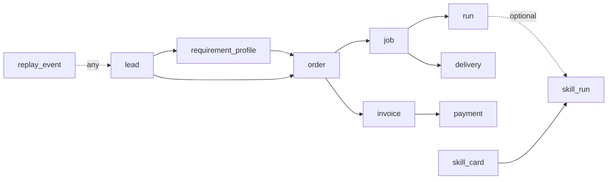

# DATA_CONTRACT_AND_EVENT_MODEL v0.1 — Phase 6.5 MVP

**Tier**: mvp_v0.1 · **NOT production-ready**  
**Authority order**: this document → `shared/schemas/phase6_5_*_v1.json` → `core/schemas/phase6_5_*.py` → `core/contracts/phase6_5_data_contract.py`

---

## 1. Purpose and scope

Phase 6.5 establishes a **schema-only** data contract and event model for the commercial / skills execution chain:

`lead` → `requirement_profile` → `order` → `job` → `run`, plus `delivery`, `invoice`, `payment`, `skill_card`, `skill_run`, and `replay_event`.

**In scope (MVP)**

- JSON Schema (strict) for 11 entities and event envelopes
- Pydantic mirrors for runtime validation
- Unit tests (`tests.test_data_contracts_*`)

**Out of scope (this wave)**

- Postgres tables / migrations
- HTTP API routes
- Outbox / message bus
- Runbook (`PHASE6_5_DATA_CONTRACT_RUNBOOK` deferred)

---

## 2. Semantic layering: order → job → run

| Layer | Entity | Meaning |
|-------|--------|---------|
| Commercial | `order` | Customer commitment (line items, currency) |
| Work package | `job` | Fulfillment unit under an order |
| Execution | `run` | One execution attempt / session under a job |
| Skills | `skill_run` | Invocation of a `skill_card`; **`run_id` optional** in MVP |

**Distinction from Gov Core ops naming** (`shared/naming.py`):

| Phase 6.5 | Gov Core ops (existing) | Notes |
|-----------|-------------------------|-------|
| `run.id` | `run_id` / budget `run_id` | Same wire key where linked; different lifecycle |
| `job.id` | `task_id` | Do not alias; `job` is commercial work package |
| — | `workflow_id` | LangGraph / pipeline scope, not `order` |

Correlation: optional `trace_id` on entities and events aligns with `FIELD_TRACE_ID`.

---

## 3. Entity relationship (MVP)



---

## 4. Shared field contract

All domain entities (except where noted) include:

| Field | Type | Required | Notes |
|-------|------|----------|-------|
| `schema_version` | string | yes | const `v1` (`PHASE6_5_ENTITIES_SCHEMA_VERSION`) |
| `id` | string (UUID) | yes | `FIELD_ENTITY_ID` |
| `status` | string (enum) | yes | per-entity enum in contracts |
| `created_at` | string (date-time) | yes | ISO-8601 UTC recommended |
| `updated_at` | string (date-time) | yes | ISO-8601 |
| `trace_id` | string | no | ops correlation |

**PII**: use `contact_ref` / `*_ref` opaque ids — no raw email/phone in MVP payloads.

**Strict JSON**: root and nested objects use `additionalProperties: false` where defined in `phase6_5_entities_v1.json`.

---

## 5. Per-entity summary

### 5.1 `lead`

- **FK**: none  
- **Key fields**: `source`, `contact_ref`, `owner_ref`  
- **Status**: `draft` \| `qualified` \| `archived`

### 5.2 `requirement_profile`

- **FK**: `lead_id`  
- **Key fields**: `summary`, `constraints` (object, strict)  
- **Status**: `draft` \| `active` \| `closed`

### 5.3 `order`

- **FK**: `lead_id`, `requirement_profile_id` (optional in wire but nullable)  
- **Key fields**: `line_items[]` (strict line item), `currency`  
- **Status**: `draft` \| `placed` \| `confirmed` \| `cancelled`

### 5.4 `job`

- **FK**: `order_id`  
- **Key fields**: `job_type`, `priority`  
- **Status**: `created` \| `started` \| `completed` \| `cancelled`

### 5.5 `run`

- **FK**: `job_id`  
- **Key fields**: `run_kind`, `started_at`, `ended_at`  
- **Status**: `pending` \| `running` \| `completed` \| `failed`

### 5.6 `delivery`

- **FK**: `job_id`  
- **Key fields**: `artifact_refs[]`, `accepted_at`  
- **Status**: `pending` \| `submitted` \| `accepted` \| `rejected`

### 5.7 `invoice`

- **FK**: `order_id`  
- **Key fields**: `amount`, `currency`, `issued_at`  
- **Status**: `draft` \| `issued` \| `voided`

### 5.8 `payment`

- **FK**: `invoice_id`  
- **Key fields**: `amount`, `currency`, `method`, `paid_at`  
- **Status**: `initiated` \| `captured` \| `failed`

### 5.9 `skill_card`

- **FK**: none (catalog)  
- **Key fields**: `skill_key`, `version`, `spec` (strict object)  
- **Status**: `draft` \| `published` \| `deprecated`

### 5.10 `skill_run`

- **FK**: `skill_card_id`; `run_id` **optional**; `job_id` optional  
- **Key fields**: `input_ref`, `output_ref`  
- **Status**: `pending` \| `running` \| `completed` \| `failed`

### 5.11 `replay_event`

- **FK**: `target_entity_type`, `target_entity_id`  
- **Key fields**: `replay_kind`, `snapshot_ref`, `causation_event_id` (optional)  
- **Status**: `recorded` (MVP single state)

---

## 6. Event model

### 6.1 Envelope (fixed fields)

| Field | Required |
|-------|----------|
| `event_id` | yes |
| `event_type` | yes |
| `entity_type` | yes |
| `entity_id` | yes |
| `occurred_at` | yes |
| `schema_version` | yes (`v1`) |
| `payload` | yes (object) |
| `metadata` | yes (object, may be empty `{}`) |

Wire keys: `FIELD_EVENT_*` in `shared/naming.py`.

### 6.2 Event catalog (MVP)

| event_type | entity_type | Notes |
|------------|-------------|-------|
| `lead.created` | lead | |
| `lead.qualified` | lead | |
| `lead.archived` | lead | |
| `requirement_profile.created` | requirement_profile | |
| `requirement_profile.updated` | requirement_profile | |
| `order.placed` | order | |
| `order.confirmed` | order | |
| `order.cancelled` | order | |
| `job.created` | job | |
| `job.started` | job | |
| `job.completed` | job | |
| `run.started` | run | |
| `run.completed` | run | |
| `run.failed` | run | |
| `delivery.submitted` | delivery | |
| `delivery.accepted` | delivery | |
| `invoice.issued` | invoice | |
| `invoice.voided` | invoice | |
| `payment.initiated` | payment | |
| `payment.captured` | payment | |
| `payment.failed` | payment | |
| `skill_card.published` | skill_card | |
| `skill_card.deprecated` | skill_card | |
| `skill_run.started` | skill_run | |
| `skill_run.completed` | skill_run | |
| `skill_run.failed` | skill_run | |
| `replay_event.recorded` | replay_event | |

Unknown payload shapes may use `GenericEntityPayload` (`changes` object) in Pydantic; catalogued events have typed payloads.

### 6.3 Allowed pairs

Enforced in tests via `ENTITY_EVENT_ALLOWED` in `core/contracts/phase6_5_data_contract.py`.

---

## 7. Artifact paths

| Artifact | Path |
|----------|------|
| Entities JSON Schema | `gov_core_system/shared/schemas/phase6_5_entities_v1.json` |
| Events JSON Schema | `gov_core_system/shared/schemas/phase6_5_events_v1.json` |
| Contracts | `gov_core_system/core/contracts/phase6_5_data_contract.py` |
| Pydantic | `gov_core_system/core/schemas/phase6_5_{common,entities,events}.py` |
| Tests | `gov_core_system/tests/test_data_contracts_*.py` |

---

## 8. Verification

```text
python -m unittest tests.test_data_contracts_entities tests.test_data_contracts_events tests.test_data_contracts_schema_files -v
```

---

## 9. Non-goals / next wave

- Persistence and idempotent outbox
- API CRUD and authz
- Production SLA and KMS field encryption
- Runbook with CLI soak steps
- Full jsonschema validation dependency (MVP uses structural key/required checks in tests)

---

## Changelog

| Date | Note |
|------|------|
| 2026-05-21 | v0.1 MVP — schema-only, 11 entities, event envelope |
