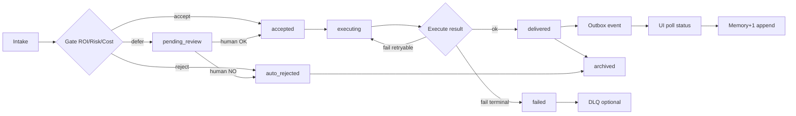

# SPEC — Phase 7.5 最小閉環 PoC（Intake → Gate → Execute → Outbox → UI → Memory+1）

> **版本**：`min_loop_v0.1` · **狀態**：dev-ready 架構草案 · **非 production-ready**  
> **範圍**：在既有 Phase 3–8 / Wave 1–4 之上**疊加**一層工單生命週期，不修改 retry／DLQ／ingest 契約。  
> **權威對照**：`PHASE7_5_INTAKE_GATE_MVP_PLAN_v0.1.md`（資料清洗 gate MVP）· `intake_gate_v1` · `orchestration_bridge_v1` · `orchestration_bridge_event_v1`

---

## 0. 設計邊界（必讀）

| 項目 | 本 PoC 做 | 本 PoC 不做 |
|------|-----------|-------------|
| Intake | 通用 `intake_schema_v1` + 5 類需求最小欄位 | 全自動 NLP 分類器、ML gate |
| Gate | ROI / risk / cost 啟發式打分 + 規則拒單 | 與 Phase 7 成本帳本硬連動（樣本不足時僅估算） |
| Execute | 委派既有 pipeline（如 `ask_pipeline`、`minimal_intake_browser`） | 新 runner、改 Wave retry 策略 |
| Outbox | 擴充 `orchestration_bridge_outbox` 或平行 `work_order_outbox` | 改 `dlq_failed_tasks` schema |
| UI | 只定義**可輪詢狀態欄位**（無前端實作） | Production dashboard |
| Memory+1 | 每單一筆結構化 memory 條目（JSONL / 表預留） | Learning Mode 訓練管線 |

**Wave 1–4 不變承諾**：`task_runs`／`step_runs` ingest、`error_taxonomy`、`retry_invoke`、`dlq`、`auto_recovery` 旗標與行為維持現狀；本層僅在 metadata 中**引用** `trace_id`，不重寫失敗路徑。

---

## 1. 最小閉環總覽



**一句話**：用統一工單 ID 串起 intake 契約、啟發式接單閘、既有執行 trace、outbox 事件與事後 memory，形成可重跑 PoC 閉環。

---

## 2. 典型需求類型與最小欄位

### 2.1 類型枚舉（`request_type`）

| `request_type` | 說明 | 典型執行錨點 |
|----------------|------|--------------|
| `info_query` | 資訊查詢、摘要、對照 | `ask_pipeline` |
| `small_automation` | 小型腳本／CLI／單檔轉換 | `chariot.factory` / 自訂 script runner |
| `browser_task` | DOM／瀏覽器步驟計畫 | `minimal_intake_browser` · Phase 8.5 |
| `report_organize` | 報表整理、批次彙整、表格清洗 | `code_cleaning_pipeline_v2` · `dark.data` |
| `other` | 未分類；強制較嚴 gate | 人工路由 |

### 2.2 各類最小欄位表

#### 共通基底（所有類型）

| 欄位 | 必填 | 類型 | 說明 |
|------|------|------|------|
| `schema_version` | 是 | string | 固定 `intake_schema_v1` |
| `work_order_id` | 是 | string | 客戶端或閘道產生的 UUID／ULID |
| `request_type` | 是 | enum | 見 §2.1 |
| `description` | 是* | string | 自然語言需求（*可與 `tags` 互補，至少其一） |
| `source_channel` | 否 | enum | `telegram` \| `cli` \| `watchdog` \| `api` \| `unknown` |
| `tags` | 否 | string[] | 自由標籤 |
| `submitter_id` | 否 | string | 邏輯使用者 ID（非 PII 原文） |
| `deadline_hint` | 否 | ISO8601 | 期望完成時間（僅排序用） |

#### `info_query`

| 欄位 | 必填 | 類型 | 說明 |
|------|------|------|------|
| `query_text` | 是 | string | 問題本體 |
| `context_refs` | 否 | string[] | 邏輯文件 ID／collection 名 |
| `expected_output_format` | 否 | enum | `text` \| `json` \| `table` |
| `max_answer_tokens` | 否 | int | 預估輸出上限（gate 算 cost） |

#### `small_automation`

| 欄位 | 必填 | 類型 | 說明 |
|------|------|------|------|
| `automation_goal` | 是 | string | 要做什麼 |
| `input_artifact_hints` | 否 | string[] | 邏輯輸入描述（禁絕對路徑） |
| `output_artifact_hints` | 否 | string[] | 期望產物描述 |
| `runtime_profile` | 否 | enum | `inline` \| `batch` |
| `estimated_runtime_sec` | 否 | int | 執行時間估算 |

#### `browser_task`

| 欄位 | 必填 | 類型 | 說明 |
|------|------|------|------|
| `target_url_or_app` | 是 | string | URL 或邏輯 app 名 |
| `browser_plan` | 否 | object | Phase 8.5 plan（有則跳過啟發式生成） |
| `step_count_hint` | 否 | int | 步驟數（gate 算 risk／cost） |
| `requires_login` | 否 | bool | 登入需求 → 提高 risk |
| `sensitive_data_expected` | 否 | bool | 是否可能觸及敏感資料 |

#### `report_organize`

| 欄位 | 必填 | 類型 | 說明 |
|------|------|------|------|
| `dataset_hint` | 是 | string | 資料集／表邏輯名 |
| `file_extension_hints` | 否 | string[] | `.csv`、`.json` 等 |
| `batch_size_hint` | 否 | int | 筆數／檔案數 |
| `inbound_path_hint` | 否 | string | **邏輯**路徑；含 `:\` 或 leading `/` → 驗證拒絕 |
| `explicit_task_type` | 否 | string | 已知時填 `chariot.factory` / `dark.data` |

#### `other`

| 欄位 | 必填 | 類型 | 說明 |
|------|------|------|------|
| `description` | 是 | string | 必須足夠長（≥ 20 字建議） |
| `human_review_required` | 是 | bool | 預設 `true` |
| `fallback_notes` | 否 | string | 補充脈絡 |

### 2.3 與既有 `intake_gate_v1` 的關係

- `report_organize` **向下相容** 現有 `IntakeGateRequest`（`PHASE7_5` 資料清洗 MVP）。
- 其餘類型在 PoC 可經 **adapter** 映射為 gate 輸入 + `work_category` 擴充（不改舊 JSON Schema 必填集；新增欄位走 `extensions` 物件）。

---

## 3. `intake_schema_v1` 草案

```json
{
  "$schema": "https://json-schema.org/draft/2020-12/schema",
  "$id": "gov_core://schemas/intake_schema/v1",
  "title": "IntakeSchemaV1",
  "description": "Phase 7.5 min-loop intake. Tier: min_loop_v0.1 · NOT production-ready.",
  "type": "object",
  "additionalProperties": false,
  "required": ["schema_version", "work_order_id", "request_type", "description"],
  "properties": {
    "schema_version": { "const": "intake_schema_v1" },
    "work_order_id": { "type": "string", "minLength": 8, "maxLength": 64 },
    "request_type": {
      "type": "string",
      "enum": ["info_query", "small_automation", "browser_task", "report_organize", "other"]
    },
    "description": { "type": "string", "maxLength": 8000 },
    "source_channel": {
      "type": "string",
      "enum": ["telegram", "cli", "watchdog", "api", "unknown"],
      "default": "unknown"
    },
    "tags": { "type": "array", "items": { "type": "string" }, "maxItems": 32 },
    "submitter_id": { "type": "string", "maxLength": 128 },
    "deadline_hint": { "type": "string", "format": "date-time" },
    "type_payload": {
      "type": "object",
      "description": "Discriminated by request_type; see SPEC §2.2 tables"
    },
    "gate_hints": {
      "type": "object",
      "properties": {
        "force_accept": { "type": "boolean", "default": false },
        "force_review": { "type": "boolean", "default": false },
        "budget_cap_usd": { "type": "number", "minimum": 0 }
      },
      "additionalProperties": false
    },
    "extensions": {
      "type": "object",
      "description": "Forward-compatible bag; e.g. legacy intake_gate_v1 fields"
    }
  }
}
```

**Pseudo-code（校驗 + 分流）**：

```python
def parse_intake_schema_v1(raw: dict) -> dict:
    """Returns {ok, message, intake, request_type} or {ok: false, ...}."""
    base = validate_common(raw)
    if not base.ok:
        return base.to_dict()
    payload = validate_type_payload(raw["request_type"], raw.get("type_payload", {}))
    if not payload.ok:
        return payload.to_dict()
    # report_organize: optional map → IntakeGateRequest for legacy decider
    legacy = maybe_to_intake_gate_v1(raw) if raw["request_type"] == "report_organize" else None
    return {"ok": True, "intake": raw, "legacy_gate_request": legacy}
```

---

## 4. ROI / 成本 / 風險打分

### 4.1 輸出欄位（`gate_scores`）

| 欄位 | 尺度 | 說明 |
|------|------|------|
| `roi_score` | 0–100 | 越高越值得接；**啟發式**非財務 ROI |
| `risk_score` | 0–100 | 越高風險越大 |
| `cost_level` | `low` \| `med` \| `high` | 粗粒度成本帶 |
| `cost_estimate_usd` | float | PoC 估算值；**不得**作為 Phase 7 帳本依據 |
| `human_touch_level` | `none` \| `light` \| `heavy` | 預估人工介入 |

### 4.2 由欄位推導（啟發式公式 v0.1）

**基礎 token 估算 `est_tokens`**（用於 cost）：

| `request_type` | 公式（上限 cap 各 50k） |
|----------------|-------------------------|
| `info_query` | `len(query_text)//4 + (max_answer_tokens or 2000)` |
| `small_automation` | `2000 + 500 * len(input_artifact_hints)` |
| `browser_task` | `1500 + 400 * (step_count_hint or len(plan.steps))` |
| `report_organize` | `1000 + 50 * (batch_size_hint or 1)` |
| `other` | `len(description)//3` |

**`cost_level`**（由 `est_tokens` + `runtime`）：

| 條件 | `cost_level` |
|------|--------------|
| `est_tokens < 8_000` 且 `estimated_runtime_sec < 120`（或缺省） | `low` |
| `est_tokens < 30_000` 或 runtime < 600 | `med` |
| 否則 | `high` |

`cost_estimate_usd ≈ est_tokens * 0.000002`（PoC 常數；上線前須換成 Phase 7 單價表）。

**`risk_score`（0–100，加總後 cap）**：

| 信號 | 加分 |
|------|------|
| `requires_login == true` | +25 |
| `sensitive_data_expected == true` | +30 |
| `browser_task` 且 `step_count_hint > 15` | +20 |
| `inbound_path_hint` 觸發絕對路徑拒絕規則 | +100（直接拒單） |
| `request_type == other` | +15 |
| `source_channel == unknown` | +10 |
| 描述含關鍵字：`delete`、`drop table`、`credential`、`.env` | +40 each（cap 100） |

**`roi_score`（0–100）**：

```
base = TYPE_BASE[request_type]   # info_query:70, small_automation:65, browser_task:55,
                                 # report_organize:60, other:40
value_bonus = min(20, len(tags)*3)
urgency_bonus = 10 if deadline within 24h else 0
cost_penalty = {low:0, med:15, high:35}[cost_level]
risk_penalty = risk_score * 0.4
human_penalty = {none:0, light:10, heavy:25}[human_touch_level]
roi_score = clamp(0, 100, base + value_bonus + urgency_bonus - cost_penalty - risk_penalty - human_penalty)
```

`human_touch_level`：`other` → `heavy`；`browser_task`+login → `light`；其餘預設 `none`。

### 4.3 接單判定規則（至少 5 條）

規則按序評估；命中即停止（記錄 `gate_rule_id`）。

| ID | 條件 | 結果 | `lifecycle_status` |
|----|------|------|---------------------|
| R1 | intake 校驗失敗 | 拒單 | `auto_rejected` |
| R2 | `risk_score >= 85` | 拒單 | `auto_rejected` |
| R3 | `roi_score < 25` 且 `cost_level == high` | 拒單 | `auto_rejected` |
| R4 | `roi_score < 40` 或 `risk_score >= 60` | 轉人工 | `pending_review` |
| R5 | `request_type == other` 且非 `force_accept` | 轉人工 | `pending_review` |
| R6 | `cost_level == high` 且 `gate_hints.budget_cap_usd` 存在且 `cost_estimate_usd > budget_cap_usd` | 拒單 | `auto_rejected` |
| R7 | `report_organize` 且 legacy `decide_intake_gate` → `reject` | 拒單 | `auto_rejected` |
| R8 | `report_organize` 且 legacy → `defer` | 轉人工 | `pending_review` |
| R9 | `roi_score >= 55` 且 `risk_score < 60` 且 `cost_level != high` | 自動接單 | `accepted` |
| R10 | `force_review == true` | 轉人工 | `pending_review` |
| R11 | `force_accept == true` 且 `risk_score < 85` | 接單（審計標記 override） | `accepted` |
| R12 | 其餘 | 轉人工 | `pending_review` |

**Gate 回應擴充欄位**（在既有 `intake_gate` / bridge 上疊加）：

```json
{
  "gate_scores": {
    "roi_score": 62,
    "risk_score": 35,
    "cost_level": "med",
    "cost_estimate_usd": 0.042,
    "human_touch_level": "none"
  },
  "gate_rule_id": "R9",
  "lifecycle_status": "accepted",
  "work_order_id": "wo_01H..."
}
```

---

## 5. 工單生命週期狀態機

### 5.1 狀態定義

| 狀態 | 含義 | UI 顯示建議 |
|------|------|-------------|
| `intake_received` | 已持久化 intake，尚未完成 gate | 「已收件」 |
| `auto_rejected` | 規則拒單 | 「未接單」 |
| `pending_review` | 待人類批准 | 「待審」 |
| `accepted` | 已接單，尚未派工 | 「已接單」 |
| `executing` | 已派工執行中 | 「執行中」 |
| `delivered` | 執行成功、結果可讀 | 「已交付」 |
| `archived` | 終態封存（含拒單） | 「已歸檔」 |
| `failed` | 執行失敗且不再自動重試 | 「失敗」 |

### 5.2 轉移表

| 自 | 事件 / 條件 | 至 |
|----|-------------|-----|
| `—` | `POST intake` 成功 | `intake_received` |
| `intake_received` | gate R1–R3,R6–R7 → reject | `auto_rejected` |
| `intake_received` | gate R4–R5,R8,R10,R12 → defer | `pending_review` |
| `intake_received` | gate R9,R11 → accept | `accepted` |
| `pending_review` | 人工 `approve` | `accepted` |
| `pending_review` | 人工 `reject` | `auto_rejected` |
| `accepted` | `dispatch_execute()` 開始 | `executing` |
| `executing` | pipeline `ok=true`（或 bridge `ok=true`） | `delivered` |
| `executing` | pipeline 失敗且 **retry 仍可能**（Wave 3） | `executing`（不變狀態，僅更新 attempt） |
| `executing` | 失敗且 `non_retryable` 或 retry 耗盡 | `failed` |
| `delivered` | outbox 寫入 + memory 追加後 TTL | `archived` |
| `auto_rejected` | 審計保留期後 | `archived` |
| `failed` | 人工確認／DLQ 結案 | `archived` |

**禁止**：從 `archived` 回到 `executing`（PoC）；重開需新 `work_order_id`。

### 5.3 與既有觀測資產的對應

| 本層概念 | 既有資產 | 對應方式 |
|----------|----------|----------|
| `work_order_id` | — | 新欄；寫入 outbox payload、`task_runs.metadata.work_order_id` |
| `executing` | Langfuse `trace_id` | 1:1 或 1:N（重試同 trace 更新） |
| `executing` | PG `task_runs` | ingest 後 `status in (running, success, failed)` |
| `executing` | `step_runs` | 逐步驟狀態；UI 可顯示子進度 |
| `failed` | `dlq_failed_tasks` | **僅當** Wave 3 旗標開啟且 retry 耗盡；不改 DLQ 寫入邏輯 |
| `failed` | `error_category` / `non_retryable` | 從 `task_runs.metadata` 唯讀顯示 |
| `delivered` | `orchestration_bridge_outbox` | 事件 `minimal_intake_browser.completed` 或擴充 `work_order.delivered` |
| UI 輪詢 | `GET /monitoring/overview` + 工單表 | PoC：`GET /api/work-orders/{id}`（待實作） |

**Execute 派工映射（PoC）**：

| `request_type` | 預設 executor |
|----------------|---------------|
| `info_query` | `ask_pipeline` |
| `browser_task` | `run_minimal_orchestration_bridge()` |
| `report_organize` | `decide_intake_gate` → `chariot.factory` / `code_cleaning_pipeline_v2` |
| `small_automation` | `pending_review` 優先（高風險腳本） |
| `other` | 不自動派工 |

#### 5.4 Tool Flow 白名單派工（v1，非終局）

對於已通過 Phase 7.5 gate 並標記為 `accepted` 的 `info_query` 類請求，若呼叫方顯式帶入 `tool_flow` 區段，且不含可執行的 browser plan，則目前存在一條最小白名單路徑會透過 Tool Layer 執行工具鏈。

- gate / ROI / 風險計分仍由本章定義的 Phase 7.5 規則負責；
- 實際工具選擇與執行則委由 `SPEC_tool_catalog_and_selector_v1.md` §10 所述的 Tool Flow 白名單路徑處理；
- 非白名單請求（無 `tool_flow`、非 `info_query`、未 `accepted`、含 browser plan）一律走 legacy bridge（intake → browser）。

詳細條件、流程圖與 Tool Layer 實作現況，請參考 `SPEC_tool_catalog_and_selector_v1.md` §10。

---

## 6. Outbox 與 UI 狀態

### 6.1 Outbox 事件（疊加 Phase 8.7e）

在 `orchestration_bridge_event_v1` payload 增加：

| 欄位 | 說明 |
|------|------|
| `work_order_id` | 工單主鍵 |
| `lifecycle_status` | 觸發時狀態 |
| `gate_scores` | §4.1 快照 |
| `trace_id` | 執行期填入 |
| `deliverable_summary` | ≤ 500 字結果摘要 |

**事件類型（PoC）**：

- `work_order.intake_received`
- `work_order.gate_decided`
- `work_order.execution_started`
- `work_order.delivered`（與既有 bridge completed 可合併或雙寫）
- `work_order.failed`
- `work_order.archived`

### 6.2 UI 最小讀模型

```json
{
  "work_order_id": "wo_01H...",
  "lifecycle_status": "executing",
  "request_type": "browser_task",
  "roi_score": 58,
  "risk_score": 42,
  "cost_level": "med",
  "trace_id": "trace-abc",
  "last_error_category": null,
  "dlq_retryable": null,
  "updated_at": "2026-05-22T12:00:00Z"
}
```

- **不**在 UI 暴露完整 intake 原文（僅摘要）。
- DLQ 按鈕走既有 `POST /api/dlq/retry/{task_id}`，工單層只顯示連結狀態。

---

## 7. Memory+1 閉環

### 7.1 觸發條件

在轉入 `delivered` 或 `archived`（拒單／失敗結案）時，追加**恰好一條** memory 記錄（冪等鍵 = `work_order_id`）。

### 7.2 Memory 條目欄位（`task_memory_entry_v1`）

| 欄位 | 必填 | 說明 |
|------|------|------|
| `schema_version` | 是 | `task_memory_entry_v1` |
| `memory_id` | 是 | UUID |
| `work_order_id` | 是 | 冪等鍵 |
| `request_type` | 是 | §2.1 |
| `request_summary` | 是 | ≤ 300 字；來自 `description` 摘要 |
| `result_summary` | 否 | ≤ 300 字；成功時必填 |
| `outcome` | 是 | `success` \| `rejected` \| `failed` \| `cancelled` |
| `gate_scores_at_intake` | 是 | §4.1 快照 |
| `gate_scores_actual` | 否 | 事後填：實際 token／cost（若 task_runs 有值） |
| `roi_score_actual` | 否 | 事後 ROI 重算 |
| `risk_score_actual` | 否 | 是否觸發敏感操作 |
| `trace_id` | 否 | 執行 trace |
| `pipeline` | 否 | 如 `ask_pipeline`、`minimal_intake_browser` |
| `lessons` | 否 | string[] 簡短教訓 |
| `follow_up_suggestions` | 否 | string[] 後續建議（給人類或下一單 gate） |
| `created_at` | 是 | ISO8601 |

**儲存 PoC**：`runtime/task_memory.jsonl`（append-only）；不取代 `Chariot_Registry` 指紋帳本。

### 7.3 Learning Mode v1 消費方式（設計意圖）

| 用途 | 作法 |
|------|------|
| 類似任務推薦 | 以 `request_type` + `tags` 做粗篩，再以 `request_summary` embedding（v1 可用關鍵字 Jaccard）取 top-k |
| Gate 校準 | 比對 `gate_scores_at_intake` vs `gate_scores_actual`，累積「高估／低估 cost」統計 |
| 拒單複盤 | 篩 `outcome=rejected`，聚類 `gate_rule_id` |
| 人工審核優先 | `pending_review` 歷史中 `outcome=success` 且 `roi_score_actual` 高者，下調 R4 觸發率 |
| 風險黑名單 | `risk_score_actual >= 80` 的 `target_url_or_app` 模式寫入 denylist 建議表 |

**不宣稱**：自動學習、線上權重更新；v1 僅**只讀**聚合報表 + 建議字串。

---

## 8. 實作切片建議（非本輪施工）

| 切片 | 檔案（建議） | 驗收 |
|------|--------------|------|
| S1 | `core/schemas/intake_schema.py` + JSON | 單元校驗五類 payload |
| S2 | `core/intake_gate_scorer.py` | R1–R12 表驅動測試 |
| S3 | `core/work_order_lifecycle.py` | 狀態機轉移表測試 |
| S4 | 擴充 `orchestration_bridge_outbox` | outbox 含 `work_order_id` |
| S5 | `core/task_memory.py` | memory 冪等 append 測試 |

**回歸（不破壞既有）**：

```text
python -m unittest tests.test_intake_decider tests.test_orchestration_bridge_outbox -v
```

---

## 9. 非目標與風險聲明

- 本規格為 **min_loop PoC**，不等同 Phase 7 成本治理定稿。
- `cost_estimate_usd` 與 `task_runs.total_cost_usd` 在 Wave 2 樣本不足時**不可混讀**。
- 不改 `GOV_CORE_RETRY_POLICY_ENABLED` / `GOV_CORE_DLQ_ENABLED` 預設值。
- `small_automation` 預設轉人工，避免 PoC 變成任意代碼執行入口。

---

## 10. 文檔工單自檢（APP-DOC）

| 項 | 是／否 | 證據 |
|----|--------|------|
| 可移植正文零本機絕對路徑 | 是 | 全文邏輯路徑／別名 |
| 對齊 W0／不覆蓋 Conditions／Progress | 是 | 新檔於 `04_Workflows/` |
| 禁區僅類型 | 是 | 未寫 env／venv／DB 實例值 |
| 未宣稱 production-ready | 是 | 檔頭與 §9 |
| 未改 Wave 1–4 契約 | 是 | §0、§5.3 |

---

*修訂：Phase 7.5 架構設計輪 · min_loop_v0.1*
