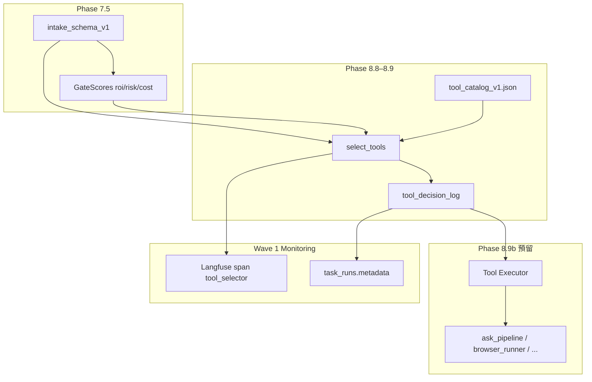
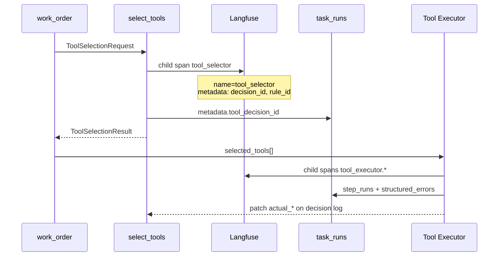

# SPEC — Tool Catalog + Selector v1（gov_core_system Tool Layer）

> **版本**：`tool_layer_v1` · **狀態**：**T1–T3 權威文件**（施工約束見 §5.6）· **非 production-ready**  
> **範圍**：Phase 8.8 Tool Catalog、Phase 8.9 Tool Selector；**不含** Phase 8.9b Tool Executor 實作、動態安裝新工具、Learning Mode 線上訓練。  
> **權威對照**：`SPEC_phase7_5_min_loop.md`（`intake_schema_v1` · GateScores）· `intake_gate_scorer.py` · `orchestration_bridge_v1` · Wave 1–4（`structured_errors` · `retry_invoke` · `task_runs`／Langfuse span）

---

## 0. 設計邊界（必讀）

| 項目 | v1 做 | v1 不做 |
|------|-------|---------|
| 工具池 | **有限、靜態** catalog（JSON／設定檔載入） | MCP 動態註冊、pip 安裝、執行期擴池 |
| 選擇 | 啟發式規則 + 可審計 reason log | ML ranker、embedding 自動選工具 |
| 執行 | 僅定義 Executor **介面預留**與 `tool_id` 綁定 | 8.9b 全節點實作、改 LangGraph 圖 |
| 錯誤／重試 | 決策與執行失敗走既有 `structured_errors` + `retry_policy` | 新 error schema version |
| 觀測 | 一筆 `tool_decision_log` ↔ 一個 Langfuse child span + `task_runs.metadata` 摘要 | 改 `step_runs` 主鍵或 DLQ schema |

**Wave 1–4 不變承諾**：工具層在 pipeline **之前或旁路**插入「選什麼工具」；執行仍委派既有 `ask_pipeline`、`minimal_intake_browser` 等；失敗時 `retryable` 由工具 `risk_level` + error `code` 共同決定，不覆寫 `_NON_RETRYABLE_ERROR_CODES`。

---

## 1. 一句話總覽

用 JSON 管理的有限工具目錄 + 表驅動 Selector，依工單描述與 Phase 7.5 ROI／風險分數選出 0–N 個工具並寫入可對齊 trace 的決策日誌，供 Executor 與 Learning Mode 只讀消費。

---

## 2. 架構位置



| Phase | 元件 | 本 SPEC |
|-------|------|---------|
| 8.8 | Tool Catalog | §3–§4 |
| 8.9 | Tool Selector | §5–§7 |
| 8.9b | Tool Executor | §8（介面骨架 only） |
| 7.5 | Gate / `request_type` | Selector 輸入 |
| Memory+1 / Learning | 事後聚合 | §7.4、`actual_*` 欄位預留 |

---

## 3. Tool Catalog 結構設計

### 3.1 檔案與載入

| 項目 | 約定 |
|------|------|
| 權威 JSON | `shared/schemas/tool_catalog_v1.json`（wire contract） |
| 執行期載入 | `core/tool_catalog.py`：`load_catalog() -> dict`（校驗 `schema_version`、去重 `tool_id`） |
| 熱更新 | v1 **不支援**；改 JSON 後重啟進程或 bump `catalog_revision` |
| 擴充欄位 | 單一工具 `extensions: {}`；catalog 級 `policy_defaults` |

### 3.2 Catalog 頂層欄位

| 欄位 | 必填 | 說明 |
|------|------|------|
| `schema_version` | 是 | 固定 `tool_catalog_v1` |
| `catalog_revision` | 是 | semver 或日期字串，如 `1.0.0` |
| `tier` | 是 | `mvp_v0.1` · 標示非 production-ready |
| `policy_defaults` | 否 | 全域預設（如 `max_tools_per_task: 3`） |
| `tools` | 是 | 工具定義陣列（6–8 項 v1） |

### 3.3 單一工具定義欄位

| 欄位 | 必填 | 類型 | 說明 |
|------|------|------|------|
| `tool_id` | 是 | string | 穩定 ID，如 `llm.ask` |
| `type` | 是 | enum | 工具族（見 §3.4） |
| `display_name` | 否 | string | UI／日誌用短名 |
| `enabled` | 是 | bool | `false` 時 Selector 不得選中 |
| `input_schema` | 是 | object | JSON Schema 子集／邏輯欄位表（§3.5） |
| `expected_output` | 是 | object | 預期產物形狀摘要 |
| `cost_hint` | 是 | object | `unit` + `estimate_usd_p50` + `cost_level` |
| `risk_level` | 是 | enum | `low` \| `med` \| `high` \| `critical` |
| `latency_hint` | 是 | object | `p50_ms` / `p95_ms` |
| `tags` | 否 | string[] | 檢索、規則匹配用 |
| `executor_binding` | 是 | object | 對應既有 runner（邏輯名，非磁碟路徑） |
| `retry_profile` | 否 | object | 與 `retry_policy` 對齊的提示（§3.6） |
| `extensions` | 否 | object | 前向相容 |

### 3.4 工具族 `type` 枚舉（v1）

| `type` | 說明 | 典型 `executor_binding` |
|--------|------|-------------------------|
| `llm` | 生成／問答 | `ask_pipeline` |
| `code` | 受控腳本／CLI | `chariot.factory` |
| `browser` | DOM 步驟計畫 | `browser_runner`（Phase 8.5） |
| `data` | 唯讀 DB／倉儲查詢 | `dark.data` |
| `file` | 邏輯檔讀寫（禁絕對路徑） | `gov_paths` 解析後 I/O |
| `notify` | 外發通知 | `telegram` / `webhook` |
| `retrieval` | RAG／向量檢索 | `ask_pipeline.retrieve` |
| `human` | 人工覆核斷點 | `interrupt_service`（Wave 4b） |

### 3.5 `input_schema` / `expected_output` 約定

- **不引入新 JSON Schema draft**；與 `intake_schema_v1` 相同風格：必填欄位列表 + `properties` 簡表，執行期由 Pydantic 鏡像校驗（建議 `core/schemas/tool_catalog.py`）。
- `input_schema.required`：Selector 只保證「任務是否帶齊欄位」；缺欄 → 不選該工具或降級 `llm.ask`。
- `expected_output.shape`：`text` \| `json` \| `table` \| `artifact_ref` \| `empty`。
- `expected_output.fields`：邏輯鍵名陣列，供 Learning Mode 對照實際產物。

### 3.6 `retry_profile` 與 structured_errors 對齊

| `retry_profile.default_retryable` | 行為 |
|-----------------------------------|------|
| `true` | Executor 拋出 `system_error` 類時可走 `retry_invoke` |
| `false` | 強制 `retryable: false`（除非 policy 標 `non_retryable`） |

工具執行失敗時 Executor **必須**使用既有 `build_structured_error()`：

- `node`: `tool_executor.<tool_id>`（點號改底線亦可，但需固定映射表）
- `code`: 新增工具域碼僅限 `TOOL_SELECTOR_FAILED` / `TOOL_EXECUTION_FAILED` / `TOOL_INPUT_INVALID`（v1 三碼）；其餘沿用 `ErrorCode`
- `details.tool_id` / `details.decision_id`：供 taxonomy 與 DLQ 審計

`risk_level >= high` 的工具：預設 `default_retryable: false`，避免高風險操作自動重試放大損害。

---

## 4. 核心工具清單（8 類）

| # | `tool_id` | `type` | 用途摘要 | `risk_level` | `cost_level` |
|---|-----------|--------|----------|--------------|--------------|
| 1 | `llm.ask` | `llm` | RAG 問答／摘要 | `low` | `med` |
| 2 | `rag.retrieve` | `retrieval` | 僅檢索上下文 | `low` | `low` |
| 3 | `code.runner` | `code` | 小型自動化腳本 | `med` | `med` |
| 4 | `browser.dom_task` | `browser` | DOM 計畫執行 | `med` | `med` |
| 5 | `db.read_query` | `data` | 參數化唯讀 SQL | `med` | `low` |
| 6 | `file.io` | `file` | 邏輯路徑讀寫 | `med` | `low` |
| 7 | `notify.channel` | `notify` | Telegram／Webhook 通知 | `low` | `low` |
| 8 | `human.review_checkpoint` | `human` | 人工覆核／defer | `low` | `low` |

完整 JSON 草案見同目錄配套：`tool_catalog_v1.json`（§4 末引用路徑：`shared/schemas/tool_catalog_v1.json`）。

---

## 5. Selector 決策邏輯 v1

### 5.1 輸入契約 `ToolSelectionRequest`

| 欄位 | 必填 | 來源 |
|------|------|------|
| `schema_version` | 是 | 固定 `tool_selection_request_v1` |
| `work_order_id` | 是 | `intake_schema_v1.work_order_id` |
| `request_type` | 是 | §2.1 五類 |
| `description` | 是 | 自然語言需求 |
| `tags` | 否 | intake.tags |
| `type_payload` | 否 | 各類子欄位 |
| `gate_scores` | 否* | Phase 7.5 `GateScores` 字典；無則現場 `compute_gate_scores()` |
| `lifecycle_status` | 否 | `accepted` / `pending_review` / `auto_rejected`（gate 後） |
| `gate_rule_id` | 否 | 如 `R4`、`R9` |
| `trace_id` | 否 | 若已開 root trace |
| `selector_hints` | 否 | `force_no_tools` / `force_tool_ids[]` / `max_tools` |

\* `auto_rejected` 時仍可記錄決策（工具列表為空），供 Learning 複盤。

### 5.2 輸出契約 `ToolSelectionResult`

| 欄位 | 必填 | 說明 |
|------|------|------|
| `ok` | 是 | 選擇流程是否完成（非執行成功） |
| `schema_version` | 是 | `tool_selection_result_v1` |
| `work_order_id` | 是 | |
| `decision_id` | 是 | UUID／ULID，冪等鍵 |
| `needs_tools` | 是 | 是否建議調用工具 |
| `selected_tools` | 是 | `{tool_id, priority, params}` 有序列表 |
| `rejected_candidates` | 是 | `{tool_id, reason_code, reason}` |
| `selector_rule_id` | 是 | 命中規則 `S1`–`S12` |
| `human_review_required` | 是 | 是否必須人工覆核後才能執行 |
| `message` | 是 | 人讀摘要 |
| `reasons` | 是 | string[] 逐步理由 |
| `estimates` | 否 | 聚合 `cost_usd` / `risk_score` / `latency_ms_p95` |
| `tool_decision_log` | 是 | §7 完整條目（可內嵌或外存） |

### 5.3 決策表（規則優先序：自上而下首條命中）

| ID | 條件（if） | 動作（then） | `needs_tools` | 典型 `selected_tools` |
|----|------------|--------------|---------------|------------------------|
| **S1** | `selector_hints.force_no_tools == true` | 純推理／管理動作 | `false` | `[]` |
| **S2** | `lifecycle_status == auto_rejected` **或** `gate_scores.risk_score >= 85` | 不執行工具；僅記錄 | `false` | `[]` |
| **S3** | `request_type == info_query` **且** `gate_scores.roi_score >= 40` **且** `risk_score < 60` **且** 僅需既有知識庫 | 檢索 + 問答 | `true` | `rag.retrieve` → `llm.ask` |
| **S4** | `request_type == info_query` **且**（`roi_score < 40` **或** `cost_level == high`） | 縮減為單步 LLM，降成本 | `true` | `[llm.ask]` |
| **S5** | `request_type == browser_task` **或** `type_payload` 含 `browser_plan` / `requires_login` | 必須 browser | `true` | `[browser.dom_task]`；若 `requires_login` 加 `human.review_checkpoint` |
| **S6** | `request_type == small_automation` | 代碼執行；高風險升級覆核 | `true` | `[code.runner]`；`risk_score >= 60` 時前置 `human.review_checkpoint` |
| **S7** | `request_type == report_organize` **且** `tags` 含 `db` 或 `type_payload.source == database` | 讀庫 + 整理 | `true` | `db.read_query` → `llm.ask` |
| **S8** | `request_type == report_organize`（預設） | 檔案讀取 + LLM 整理 | `true` | `file.io` → `llm.ask` |
| **S10** | `description` 匹配通知意圖（`notify`/`telegram`/`alert` 關鍵字）**且** `risk_score < 60` | 低風險外發 | `true` | `[notify.channel]` |
| **S9** | **未命中 S5／S6／S10** **且**（`request_type == other` **或** `lifecycle_status == pending_review` **或** `gate_rule_id in (R4,R5,R8,R10,R12)`） | 不自動執行 side-effect 工具 | `false`* | `[]`；`human_review_required=true` |
| **S11** | `gate_scores.cost_level == high` **且** `request_type != browser_task` | 禁止 `code.runner`／`db.read_query`；保留低風險 | `true` | `[llm.ask]` 或 `[rag.retrieve]` |
| **S12** | （預設）其餘 `accepted` 工單 | 通用問答 | `true` | `[llm.ask]` |

\* S9：`needs_tools=false` 表示不自動調用 side-effect 工具；仍可把 `human.review_checkpoint` 寫入 `selected_tools` 作為**流程工具**（`priority=0`），Executor 解讀為 interrupt 而非外部 API。

**規則評估順序（實作）**：`S1 → S2 → S5 → S6 → S10 → S9 → S3 → S4 → S7 → S8 → S11 → S12`（S10 必須在 S9 之前，以滿足「未命中 S10」前提）。

### 5.6 施工約束（T1–T3 必守）

| # | 約束 | 實作要點 |
|---|------|----------|
| C1 | **S9 生效邊界** | 僅當 S5／S6／S10 均未命中，且工單處於 `other`／`pending_review`／defer 類 `gate_rule_id` |
| C2 | **`force_tool_ids[]`** | 不得覆蓋 S2；不得選 `enabled=false`；不得免除 `risk_level in (high, critical)` 工具之 `human_review_required` |
| C3 | **`selected_tools.params`** | 僅來自安全過濾後之 `type_payload`／`description` 衍生欄位；禁 secrets、原始大段 prompt、未過濾絕對路徑 |
| C4 | **`input_schema`** | 每工具至少含 `required[]` + `properties{}` + `examples[]`（一組最小合法範例） |
| C5 | **`actual_*`** | 僅 Executor／post-run patcher 回填；Selector 只寫初始 decision log（不含 `actual_*` 或顯式 `null` 占位） |

#### C3 安全過濾（params 白名單）

- 字串長度上限（如 `query_text` ≤ 4000、`task_summary` ≤ 300）。
- 拒絕鍵名含 `password`／`secret`／`token`／`api_key`／`.env`（大小寫不敏感）。
- 路徑類欄位：剔除匹配絕對路徑啟發式（與 `intake_gate_scorer` 同級）。
- `description` 不得整段注入 params；僅允許截斷摘要欄（如 `query_text`、`automation_goal`、`review_reason`）。

#### C2 `force_tool_ids` 處理順序

1. 若 S2 命中 → 忽略 `force_tool_ids`，`reasons` 記 `force_tool_ids ignored: S2`。
2. 否則驗證每 id：`enabled`、存在於 catalog、通過 C3 params 建構。
3. 若含 `high`／`critical` 工具 → `human_review_required=true`（不可被 hint 關閉）。

### 5.4 `request_type` → 工具族快速映射（候選池）

| `request_type` | 候選 `tool_id`（過濾前） |
|----------------|-------------------------|
| `info_query` | `rag.retrieve`, `llm.ask` |
| `small_automation` | `code.runner`, `human.review_checkpoint` |
| `browser_task` | `browser.dom_task`, `human.review_checkpoint` |
| `report_organize` | `file.io`, `db.read_query`, `llm.ask` |
| `other` | `human.review_checkpoint` only |

候選再經 §5.3 規則與 catalog `enabled` / `risk_level` 過濾。

### 5.5 與 Phase 7.5 Gate 的銜接

| Gate 信號 | Selector 行為 |
|-----------|---------------|
| `roi_score < 25` 且 `cost_level == high`（R3） | S2 同效，空工具 |
| `roi_score < 40` 或 `risk_score >= 60`（R4） | S9，`human_review_required` |
| `request_type == other`（R5） | S9 |
| `force_accept`（R11） | 跳過 S9 的 pending 限制，但仍遵守 S2（高風險） |
| `accepted`（R9） | 落入 S3–S8 或 S12 |

---

## 6. `tool_catalog_v1.json` 草案

權威副本路徑：`01_Environments/python_venvs/gov_core_system/shared/schemas/tool_catalog_v1.json`。

要點：

- 8 個 `tools[]` 條目，欄位齊 §3.3。
- `policy_defaults.max_tools_per_task: 3`。
- `browser.dom_task.executor_binding.runner = browser_runner` 對齊 Phase 8.5。
- `human.review_checkpoint` 的 `executor_binding.runner = interrupt_service`。

（JSON 全文見 `shared/schemas/tool_catalog_v1.json`，避免本 SPEC 重複貼 400+ 行。）

---

## 7. Reason Log / 決策記錄

### 7.1 `tool_decision_log_v1` 欄位

| 欄位 | 必填 | 說明 |
|------|------|------|
| `schema_version` | 是 | `tool_decision_log_v1` |
| `decision_id` | 是 | 與 `ToolSelectionResult.decision_id` 相同 |
| `work_order_id` | 是 | |
| `trace_id` | 否 | 執行期填入 |
| `observation_id` | 否 | Langfuse observation id（ingest 後補） |
| `created_at` | 是 | ISO8601 UTC |
| `selector_rule_id` | 是 | `S1`–`S12` |
| `request_type` | 是 | |
| `task_summary` | 是 | `description` 截斷 ≤300 字 |
| `gate_scores_snapshot` | 否 | intake 時 GateScores 快照 |
| `candidate_tools` | 是 | `{tool_id, eligible, filter_reason?}[]` |
| `selected_tools` | 是 | `{tool_id, priority, params, cost_hint_usd?, risk_level}` |
| `rejected_tools` | 是 | `{tool_id, reason_code, reason}` |
| `reasons` | 是 | string[] |
| `estimates` | 否 | `{cost_usd, risk_score, latency_ms_p95}` |
| `human_review_required` | 是 | bool |
| `needs_tools` | 是 | bool |
| `actual_outcome` | 否 | **僅 Executor／post-run patcher 回填**；Selector 初始 log **不得寫入** |
| `actual_cost_usd` | 否 | 同上；來自 `task_runs.total_cost_usd` |
| `actual_latency_ms` | 否 | 同上 |
| `actual_tools_used` | 否 | 同上 |
| `structured_error_refs` | 否 | 失敗時 `code` 列表；由 Executor 回填，Selector 不寫 |
| `extensions` | 否 | |

### 7.2 `reason_code` 枚舉（拒絕原因）

| `reason_code` | 說明 |
|---------------|------|
| `disabled_in_catalog` | `enabled: false` |
| `risk_budget_exceeded` | 工單風險過高 |
| `cost_budget_exceeded` | 對齊 R3／S11 |
| `request_type_mismatch` | 不在候選池 |
| `gate_deferred` | pending_review / S9 |
| `missing_input` | `input_schema` 必填缺欄 |
| `superseded_by_rule` | 被更高優先規則取代 |
| `force_no_tools` | S1 |
| `human_review_only` | 僅允許人工節點 |

### 7.3 與 trace / monitoring 結合



| 整合點 | 做法 |
|--------|------|
| **Langfuse** | 在既有 root trace 下 `start_as_current_observation(as_type="span", name="tool_selector")`；`metadata` 含 `decision_id`、`selector_rule_id`、`selected_tool_ids[]`（ASCII-safe，見 `build_safe_propagated_metadata`） |
| **Executor spans** | 每個執行工具 `tool_executor.<tool_id>` child span；成本 observation 掛在 executor 子樹 |
| **task_runs** | `metadata.tool_decision_id`、`metadata.selected_tools`、`metadata.human_review_required`；與 Wave 1 `trace_id` 同列 |
| **step_runs** | 每工具一步 `step_name=tool.<tool_id>`；失敗 `status=failed` + taxonomy |
| **structured_errors** | `node=tool_selector` 或 `tool_executor.<id>`；`retryable` 依工具 `retry_profile` 與 `ErrorCode` |
| **DLQ** | 僅 **Executor** 失敗且 exhaust retries 時入隊；Selector 邏輯錯誤用 `TOOL_SELECTOR_FAILED`、`non_retryable` |
| **JSONL 帳本** | PoC：`runtime/tool_decisions.jsonl` append-only；與 `task_memory.jsonl` 平行 |

**對應關係**：1 個 `decision_id` = 1 個 `tool_selector` span = 1 行 `tool_decisions.jsonl` = `task_runs.metadata` 摘要；Executor 可多 span，但共享同一 `decision_id`。

### 7.4 Learning Mode 消費（只讀）

| 用途 | 欄位 |
|------|------|
| 選錯工具複盤 | `selected_tools` vs `actual_tools_used` |
| 過度拒絕 | `rejected_tools` + `outcome=success` 事後標註 |
| Gate 校準 | `gate_scores_snapshot` vs `actual_cost_usd` |
| 規則調參建議 | 聚合 `selector_rule_id` + `reason_code` |

不宣稱線上自動改規則；僅輸出報表與 `follow_up_suggestions` 字串（對齊 `task_memory_entry_v1`）。

---

## 8. 實作骨架（Python pseudo-code）

```python
# core/tool_selector.py — v1 skeleton only

from typing import Any, TypedDict


class ToolSelectionRequest(TypedDict, total=False):
    schema_version: str  # "tool_selection_request_v1"
    work_order_id: str
    request_type: str
    description: str
    tags: list[str]
    type_payload: dict[str, Any]
    gate_scores: dict[str, Any] | None
    lifecycle_status: str | None
    gate_rule_id: str | None
    trace_id: str | None
    selector_hints: dict[str, Any]


class SelectedTool(TypedDict):
    tool_id: str
    priority: int
    params: dict[str, Any]


class ToolSelectionResult(TypedDict):
    ok: bool
    schema_version: str  # "tool_selection_result_v1"
    work_order_id: str
    decision_id: str
    needs_tools: bool
    selected_tools: list[SelectedTool]
    rejected_candidates: list[dict[str, Any]]
    selector_rule_id: str
    human_review_required: bool
    message: str
    reasons: list[str]
    estimates: dict[str, Any] | None
    tool_decision_log: dict[str, Any]


def load_tool_catalog() -> dict[str, Any]:
    """Load shared/schemas/tool_catalog_v1.json; validate schema_version."""
    ...


def select_tools(task: ToolSelectionRequest) -> ToolSelectionResult:
    """
    1. Resolve gate_scores (compute if missing).
    2. Build candidate pool from request_type + catalog.enabled.
    3. Evaluate rules S1..S12 in order; first match wins.
    4. Filter candidates; build selected_tools + rejected_candidates.
    5. Emit tool_decision_log_v1; optional Langfuse span + JSONL append.
    Returns stable dict for API / orchestration bridge extensions.
    """
    ...


def append_tool_decision_log(entry: dict[str, Any]) -> dict[str, Any]:
    """Append-only JSONL; idempotent on decision_id. Returns {ok, message}."""
    ...
```

**預期呼叫點**（後續切片，非本輪）：

- `minimal_orchestration_bridge`：gate `accepted` 後、`run_plan` 前呼叫 `select_tools`。
- `POST /api/orchestration/bridge`：回應增 `tool_selection` 區塊（`extra` 允許則獨立 endpoint）。

---

## 9. 實作切片

| 切片 | 檔案 | 狀態 | 驗收 |
|------|------|------|------|
| T1 | `shared/schemas/tool_catalog_v1.json` + `tool_decision_log_v1.json` | **完成** | `tests/test_tool_layer_schemas.py` |
| T2 | `core/schemas/tool_catalog.py` + `core/tool_catalog.py` | **完成** | `load_catalog()` · 重複 `tool_id` 拒絕 |
| T3 | `core/tool_selector.py` + `core/tool_params.py` + `tests/test_tool_selector.py` | **完成** | S1–S12 表驅動 · §5.6 約束 |
| T4 | `core/tool_decision_log.py` | **完成** | T4 decision log v1 已完成；測試見 `tests.test_tool_decision_log*`；詳細行為見 `TOOL_LAYER_V1_RUNBOOK.md` |
| T5 | `core/tool_selector_observability.py` | **完成** | T5 selector observability v1 已完成；測試見 `tests.test_tool_selector_observability*`；詳細行為見 `TOOL_LAYER_V1_RUNBOOK.md` |
| T6 | `core/tool_executor.py` · `tool_flow_bridge.py` 等 | **完成** | 見 `TOOL_LAYER_V1_RUNBOOK.md` §1.3 |

**Bridge 白名單**：`minimal_orchestration_bridge` + `tests.test_minimal_orchestration_bridge_tool_flow`，完成（v1 窄路徑：`info_query` + `accepted` + `tool_flow` + 無 browser plan）。接線現況見 §10。

**回歸（不破壞既有）**：

```text
python -m unittest tests.test_intake_min_loop_gate tests.test_minimal_orchestration_bridge -v
python -m unittest tests.test_minimal_orchestration_bridge_tool_flow -v
```

---

## 10. Bridge 接線現況（Tool Flow 白名單 v1）

本節描述目前已實作、已測試的最小 Tool Flow 白名單路徑。此路徑僅適用於顯式帶 `tool_flow` 的 `info_query` 類請求，並不代表最終終局設計。

**Phase B1（第二波）**：另增窄路徑 `report_organize.file-only`（`_is_b1_report_file_only_tool_flow_whitelisted` → selector S8、`tool_flow.whitelist_lane=B1_report_file_only`）；測試見 `tests/test_minimal_orchestration_bridge_tool_flow_b1.py`。不影響既有 `info_query` 白名單條件。

### 10.1 白名單條件與行為

| 類別 | 條件 / 行為 | 來源 |
|------|-------------|------|
| 請求校驗 | `OrchestrationBridgeRequest` pydantic 通過 | `core/schemas/orchestration_bridge.py` |
| 啟用條件 1 | `tool_flow` 區塊存在（非 null） | `OrchestrationBridgeRequest.tool_flow` |
| 啟用條件 2 | `tool_flow.selection_request` 為非空 dict | ToolFlow 段 schema |
| 啟用條件 3 | `selection_request.request_type == "info_query"` | `TOOL_FLOW_WHITELIST_REQUEST_TYPE` 常數 |
| 啟用條件 4 | `selection_request.lifecycle_status == "accepted"` | `TOOL_FLOW_WHITELIST_LIFECYCLE` 常數 |
| 啟用條件 5 | `ToolSelectionRequest` pydantic 驗證通過 | `core/schemas/orchestration_bridge.py` / `core/schemas/tool_catalog.py` |
| 啟用條件 6 | 無可執行 browser plan（`browser.plan.steps` 為空或缺省） | `_has_browser_plan_in_request()` |
| 排除條件 | 任一條件不滿足 → 走 legacy（仍執行 `parse_and_decide` 等原流程） | `_is_tool_flow_whitelisted()` |
| 流程入口 | `run_minimal_orchestration_bridge()` 早期白名單分支 | `core/minimal_orchestration_bridge.py` |
| 白名單處理函式 | `_run_tool_flow_whitelist_path()` | 同上 |
| Tool Flow 入口 | `run_tool_flow(selection_request, trace_id)` | `core/tool_flow_bridge.py` |
| Tool Flow 鏈 | `select_tools` → `append_tool_decision_log` → `execute_selected_tools` → `patch_tool_decision_log_with_actuals` | `run_tool_flow()` |
| Bridge 成功語意 | `out["ok"] == flow_out["ok"]`（四步皆成功才為 true） | `_assemble_tool_flow_result()` |
| Tool Flow 結果 | `tool_flow.actual_outcome` 來自 `patch_result.actual_outcome`，或由 execution / `flow_out` 推導；可為 `success` / `partial` / `failed` / `skipped` | `_tool_flow_actual_outcome()` / `compute_actual_outcome()` |
| Bridge 失敗語意 | `out["ok"] == False` 時不回退 legacy intake / browser，避免雙重執行與語意混淆 | 測試 `test_tool_flow_failure_returns_bridge_not_ok` |
| 回應欄位擴充 | `tool_flow = { routed, decision_id, actual_outcome, result: flow_out }` | bridge `tool_flow` 區塊 |
| Legacy 區塊 | `intake` / `browser` 在白名單路徑中為 stub / skip（例如 `tool_flow_routed`、`SKIP_TOOL_FLOW_PATH`） | 白名單路徑專用 |

> 備註：`tool_flow.actual_outcome` 用於審計與後續決策，不直接決定 bridge `ok` 值；bridge 層 `ok` 以 `run_tool_flow()` 回傳的 `ok` 為準。

### 10.2 ASCII 流程圖（v1）

```text
[HTTP POST /api/orchestration/bridge]
             |
             v
    payload dict  -->  OrchestrationBridgeRequest (pydantic)
             |
             +-- invalid -------------------------------> bridge ok=false
             |                                            (intake stub + message)
             v
    _is_tool_flow_whitelisted(req) ?
             |
    NO ------+------------------------------------------+
    |                                                     |
    |   [Legacy path]                                     |
    |        |                                            |
    |        v                                            |
    |   parse_and_decide(req.intake)                      |
    |        |                                            |
    |        +--> optional browser.plan.steps             |
    |                 |                                   |
    |                 v                                   |
    |            validate_plan + run_plan (if accept/force)|
    |                 |                                   |
    |                 v                                   |
    |        _assemble_result()                           |
    |        (intake + browser stages; no tool_flow key)  |
    |                                                     |
    YES (tool_flow + info_query + accepted                |
         + valid ToolSelectionRequest                     |
         + no executable browser plan)                    |
             |                                            |
             v                                            |
    _run_tool_flow_whitelist_path()                       |
             |                                            |
             v                                            |
    run_tool_flow(selection_request, trace_id)            |
      |                                                   |
      |-- select_tools                                    |
      |-- append_tool_decision_log                        |
      |-- execute_selected_tools                          |
      |-- patch_tool_decision_log_with_actuals            |
             |                                            |
             v                                            |
    _assemble_tool_flow_result(flow_out)                  |
      - intake: stub (tool_flow_routed=true)              |
      - browser: skipped (skip_reason=tool_flow_path)     |
      - tool_flow: { routed, decision_id,                 |
                    actual_outcome, result: flow_out }    |
             |                                            |
             +----------------------+---------------------+
                                    v
                       record_orchestration_bridge_event(out)
                                    |
                                    v
                             return bridge dict
```

---

## 11. 非目標與風險

- 不引入動態工具、不修改 `retry_policy` / DLQ schema。
- `code.runner` 在 PoC 與 `small_automation` 預設綁定；`risk_level >= med` 時必須 S6／S9 人工閘。
- `cost_hint.estimate_usd_p50` 為啟發式，**不可**與 Wave 2 `task_runs` 實測混為財務口徑。
- Catalog 路徑僅邏輯名；禁止在 SPEC 或 JSON 寫入本機絕對路徑。

---

## 12. 文檔工單自檢（APP-DOC）

| 項 | 是／否 | 證據 |
|----|--------|------|
| 可移植正文零本機絕對路徑 | 是 | §3、§11 |
| 對齊 Phase 7.5 / Wave 1–4 | 是 | §0、§5.5、§7.3 |
| 禁區僅類型 | 是 | 未寫 env／venv 實例值 |
| 未宣稱 production-ready | 是 | 檔頭 tier |
| skeleton 分欄 | 是 | §8–§9 標非本輪施工 |

---

*修訂：Tool Layer 設計輪 · tool_layer_v1 · Phase 8.8–8.9*
