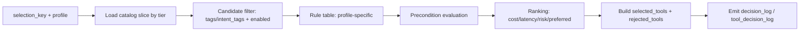

# SPEC — 通用 Tool Layer vNext 草案（戰線 A · Week 3 · A-W3-1）

> **版本**：`tool_layer_vnext_draft` · **狀態**：**設計草案**（非定稿、非 production-ready）  
> **工單**：A-W3-1 · 規劃兵 · **不接線、不改程式**  
> **權威對照**：`SPEC_repo_tool_catalog_v1.md` · `SPEC_tool_catalog_and_selector_v1.md` · `TOOL_LAYER_V1_RUNBOOK.md`  
> **實作錨點**（僅索引，不貼實例路徑）：暗部 cabin `gov_core_system` · `shared/schemas/*` · `core/repo_tool_*` · `core/tool_*`

---

## 0. 文件定位與約束

| 項 | 說明 |
|----|------|
| **本票做什麼** | 把 Week 2 **repo 專用** Tool Layer（Catalog / Selector / Executor / Facade）已驗證模式，抽象為 Phase 8.6/8.7 編排路徑可共用的 **vNext 契約草案** |
| **本票不做什麼** | 不重構 `repo_tool_*`／`tool_*` 既有模組；不接 ask pipeline；不做 live integration；不取代 `tool_catalog_v1` |
| **讀者** | 尚書省裁決、Week 3–4 施工票、Phase 8.8 Tool Layer 維護者 |
| **完成定義** | 本文 §1–§8 齊全；§9 標明沿用／缺口／禁入 scope |

---

## 1. 背景與目的

### 1.1 為何要從 repo 線抽象

Week 1 在戰車根／暗部完成了 **repo pipeline** 實機驗收（index、graph、embed、retrieve、document_chunks 回歸）。Week 2 在此之上疊了一層 **repo 專用 Tool Layer**，把「工具是什麼、何時可選、如何執行、如何一鍵跑通」從散落的 CLI／模組呼叫，收斂為四個可測、可審計的邊界：

1. **Catalog** — 靜態工具規格 + 前置條件 + 錯誤碼表 + 可觀測欄位  
2. **Selector** — intent／規則驅動候選 → precondition 評估 → 排序 → decision log  
3. **Executor** — validate → registry dispatch → normalize error → trace  
4. **Facade** — 單步 `select → execute`（不做多步編排）

這套模式已在 unittest 與 Week 1 smoke 路徑上 **PASS**，證明「目錄驅動 + 表驅動選擇 + registry 派發」在 **高副作用、強前置** 的工具域（DB job、artifact、Qdrant）同樣可行。

### 1.2 與 Phase 8.8 現有 Tool Layer 的關係

| 維度 | Phase 8.8（`tool_catalog_v1` + `tool_selector` + `tool_executor`） | Week 2 repo 線 |
|------|---------------------------------------------------------------------|----------------|
| **消費者** | intake／Gate／`minimal_orchestration_bridge`（8.6）工單編排 | repo pipeline／戰線 A 實驗線 |
| **選擇輸入** | `request_type`、GateScores、S1–S12 規則 | `intent` + `intent_tags` + precondition buckets |
| **工具池** | orchestration（llm、browser、code、data…） | repo_index、graph、embed、retrieve |
| **Executor** | `executor_binding.runner` + `register_executor_handler` | `implementation_ref` + `repo_tool_dispatch` 表 |
| **Facade** | `run_tool_flow`（select → ledger → execute → patch） | `run_repo_tool_flow`（select → execute 單工具） |

**本草案的定位**：**不是取代** `tool_catalog_v1`，而是提供 **升級方向**——把 repo 線已證明的 **preconditions、side_effects、structured_error_refs、observability_fields、統一 execution envelope** 回灌到通用層，使 Phase 8.6/8.7 編排與 Phase 8.8 主線在未來能用 **同一套契約形狀** 掛載多 tier 工具，而非維持兩套語意分裂的 catalog。

### 1.3 與 Phase 8.6 / 8.7 的銜接語意

- **Phase 8.6**（Minimal Orchestration Bridge）：intake → pre-state → optional browser；Tool Layer 應在 bridge **accepted** 之後提供「選什麼、怎麼執行、失敗如何結構化」的旁路，**不**改 bridge 核心狀態機。  
- **Phase 8.7**（outbox／事件疊加，見 `SPEC_phase7_5_min_loop.md` §6.1）：工具決策與執行結果應能進 **同一 decision_id / trace_id** 語意，供事後聚合；vNext 保留 `decision_id` 與 ledger 掛鉤，與 repo 線 `decision_log` 對齊。

---

## 2. 現狀盤點（as-is）

### 2.1 Week 2 repo 專用 Tool Layer 已具備能力

#### 2.1.1 Catalog（`repo_tool_catalog_v1`）

| 能力 | 說明 | 權威 |
|------|------|------|
| **Catalog schema** | 根：`schema_version`、`catalog_revision`、`tier`、`tools[]` | `shared/schemas/repo_tool_catalog_v1.json` |
| **RepoToolSpec** | 每工具：`tool_id`、`human_name`、`description`、`intent_tags`、`input_schema`／`output_schema`（`required`+`properties`+`examples`）、`preconditions[]`、`cost_class`、`latency_class`、`failure_modes`、`structured_error_refs`、`side_effects`、`observability_fields`、`example_calls`、`usage_notes`、`enabled`、`implementation_ref` | `core/schemas/repo_tool_catalog.py` |
| **載入 API** | `load_repo_tool_catalog()`、`list_tools(intent_tag=...)`、`get_tool_spec(tool_id)` → 全 `dict`（`ok`／`message`） | `core/repo_tool_catalog.py` |
| **DB 預留** | `012_repo_tool_catalog_schema.sql`（可選熱更新，v0.1 未接線） | Data Vault |

#### 2.1.2 Selector（`repo_tool_selector`）

| 能力 | 說明 |
|------|------|
| **Request** | `ToolSelectionRequest`：`intent`、`constraints`、`runtime_context`、`preferred_cost_class`、`preferred_latency_class` |
| **Result** | `ToolSelectionResult`：`ok`、`message`、`requested_intent`、`selected_tools[]`、`rejected_tools[]`、`decision_log[]`、`catalog_revision` |
| **流程** | intent 規則解析 → catalog `intent_tags` 交集 → `evaluate_tool_preconditions` → 穩定排序（cost／latency／primary pin）→ 可選多選，facade 取首項 |
| **規則表** | `repo_tool_selection_rules`：`intent_tags_for`、`primary_tool_id_for` |
| **不做** | LLM、Executor 派發、ask pipeline |

#### 2.1.3 Precondition evaluator（`repo_tool_preconditions`）

| `kind` | Week 2 行為 |
|--------|-------------|
| `env` | `runtime_context.env[key]` 存在且非空 |
| `artifact` | `runtime_context.artifact[key]` |
| `job_status` | `runtime_context.job_status[key]` |
| `qdrant_collection` | `runtime_context.qdrant_collection[key]` |
| `db_table` / `db_row` | **Deferred**：僅當 caller 在對應 bucket 斷言時才 satisfied；預設不 live 查 PG |

**評估輸出**：`preconditions_ok`、`missing_preconditions[]`、`evaluations[]`（每條含 `satisfied`、`reason`）。

#### 2.1.4 Executor（`repo_tool_executor` + `repo_tool_dispatch`）

| 能力 | 說明 |
|------|------|
| **Request** | `RepoToolExecutionRequest`：`tool_id`、`request_payload`、`runtime_context` |
| **Envelope** | `RepoToolExecutionResult`：`ok`、`message`、`tool_id`、`implementation_ref`、`actual_input`、`actual_output`、`structured_error`、`trace_fields`、`validation_errors[]`、`runtime_context_snapshot`、`started_at`、`finished_at` |
| **四步** | ① `validate_tool_input`（catalog `input_schema`）② `get_dispatch_handler(tool_id)` ③ 執行 Week 1 入口 ④ `normalize_execution_error`（對照 catalog `structured_error_refs`）+ `build_trace_fields`（`observability_fields`） |
| **Registry** | `DISPATCH_TABLE: tool_id → Callable`（非 if/elif 鏈） |

#### 2.1.5 Facade（`repo_tool_facade`）

| 能力 | 說明 |
|------|------|
| **入口** | `run_repo_tool_flow(intent, request_payload=..., runtime_context=...)` |
| **流程** | `select_tools` → 若 `selected_tools` 非空則 `execute_repo_tool(first)` |
| **回傳** | `{ok, phase, selection_result, execution_result, structured_error?}`；`phase` 為 `selection` 或 `execution` |
| **不做** | 多步編排、ledger append、Langfuse patch |

### 2.2 Phase 8.8 主線 Tool Layer 已具備（對照）

| 能力 | Phase 8.8 現況 |
|------|----------------|
| Catalog | `tool_catalog_v1`：`type`、`executor_binding`、`retry_profile`、`cost_hint`、`risk_level`、`tags`；**無** `preconditions`／`side_effects`／`structured_error_refs` 一級欄位 |
| Selector | `ToolSelectionRequest` 綁工單／Gate；S1–S12；`tool_decision_log_v1`；Langfuse + JSONL |
| Executor | `execute_selected_tools` 序貫 fail-fast；`register_executor_handler`；stub 為主 |
| Facade | `run_tool_flow`：select → append log → execute → patch actuals |

### 2.3 Repo 線特有、尚不能直接一般化的部分

| 項目 | 原因 | vNext 建議 |
|------|------|------------|
| **`intent` + `intent_tags` 語意** | repo 任務以 pipeline 階段標籤為主，與工單 `request_type` 不同 | 通用層用 `selection_key` 抽象：`intent`（repo）或 `request_type`（orchestration），由 selector profile 解讀 |
| **`tier: week2_a_v0.1`** | 實驗線修訂號 | 改為 `tool_tier` 枚舉（見 §3） |
| **Precondition 僅讀 `runtime_context` bucket** | Week 2 刻意不做 live PG／Qdrant probe | 通用層保留 **宣告式** precondition；live probe 放 **Executor 前檢** 或 Infra 適配器（Week 4+） |
| **`implementation_ref` 模組字串** | repo 直連 `core.repo_*` | 通用層改 `dispatch_ref`：`{registry, handler_id}` 或 `{runner, mode}` 並表 |
| **單工具 facade** | repo smoke 只需一步 | orchestration 需多工具序貫 + ledger；通用 facade 分 **narrow**／**full** 兩種 profile |
| **job_id／artifact 路徑約定** | 綁 `repo_index` job 模型 | 留在 `tier=repo` 的 `extensions`；不強迫寫入 orchestration 工具 |

### 2.4 Phase 8.8 現況缺口（vNext 要補的設計面）

| 缺口 | repo 線已有 | vNext 目標 |
|------|-------------|------------|
| Catalog 級 **preconditions** | ✅ | 通用 `ToolSpecVNext.preconditions` |
| Catalog 級 **structured_error_refs** | ✅ | 與 `build_structured_error` 對照表 |
| Catalog 級 **observability_fields** | ✅ | 統一 `trace_fields` 提取 |
| **output_schema**（非僅 `expected_output.shape`） | ✅ | 並存：`expected_output`（orchestration）+ `output_schema`（執行驗證） |
| **side_effects** 宣告 | ✅ | Selector 風險過濾、Executor 審計 |
| **統一 execution envelope** | repo 較完整 | 對齊 Phase 8.8 patch／Langfuse 欄位 |
| **tier 分池** | 隱含 repo only | 顯式 `tool_tier` + 合併索引 |

---

## 3. 通用 Tool Catalog vNext 草案

### 3.1 Schema 版本與根物件

```json
{
  "schema_version": "tool_catalog_vnext",
  "catalog_revision": "0.1.0-draft",
  "policy_defaults": { "max_tools_per_task": 3 },
  "tiers": ["repo", "orchestration", "external", "system"],
  "tools": []
}
```

> **注意**：`tool_catalog_vnext` 為 **新 schema 名**；落地時可採 **union catalog**（單檔多 tier）或 **分檔 + 合併 loader**（見 §3.4）。

### 3.2 單一工具 `ToolSpecVNext`（generalized）

| 欄位 | 必填 | 類型 | 說明 | repo 線 | Phase 8.8 |
|------|------|------|------|---------|-----------|
| `tool_id` | 是 | string | 穩定 ID | **沿用** 命名規則 | **沿用**（允許 `.`） |
| `tool_tier` | 是 | enum | `repo` \| `orchestration` \| `external` \| `system` | **新增**（repo 線隱含） | **新增**（預設 orchestration） |
| `type` | 條件 | enum | orchestration 工具族（llm/code/…） | 可選／空 | **沿用** |
| `human_name` / `display_name` | 否 | string | 顯示名 | `human_name` **沿用** | `display_name` **映射** |
| `description` | 是 | string | 人讀說明 | **沿用** | 可從 tags 補 |
| `intent_tags` | 條件 | string[] | repo／檢索用 | **沿用** | 與 `tags` **合併或別名** |
| `tags` | 否 | string[] | orchestration 規則 | 可映射 | **沿用** |
| `input_schema` | 是 | object | `required`+`properties`+`examples` | **沿用** | **沿用** |
| `output_schema` | 條件 | object | 執行期輸出契約 | **沿用** | **擴充**（現僅 `expected_output`） |
| `expected_output` | 否 | object | shape/fields 摘要 | 可選 | **沿用** |
| `preconditions` | 否 | array | §3.3 | **沿用** | **新增** |
| `cost_class` | 否 | enum | trivial/low/medium/high | **沿用** | 映射自 `cost_hint.cost_level` |
| `latency_class` | 否 | enum | interactive/batch_* | **沿用** | 映射自 `latency_hint` |
| `cost_hint` | 否 | object | USD 估算 | 可選 | **沿用** |
| `risk_level` | 否 | enum | low/med/high/critical | 可選 | **沿用** |
| `side_effects` | 否 | object | writes_db/artifact/api… | **沿用** | **新增** |
| `structured_error_refs` | 否 | array | code/message_hint/retryable | **沿用** | **新增**（現散落在 executor） |
| `observability_fields` | 否 | string[] | trace 建議鍵 | **沿用** | **新增** |
| `failure_modes` | 否 | string[] | 文檔化失敗語意 | **沿用** | 可選 |
| `implementation_ref` | 否 | string | 模組提示（repo） | **沿用** | 漸進廢止 → `dispatch_ref` |
| `dispatch_ref` | 否 | object | `{registry, handler_id}` 或 `{runner, mode, sandbox?}` | **擴充** dispatch 表 | **沿用** `executor_binding` |
| `retry_profile` | 否 | object | 與 Wave retry 對齊 | 可選 | **沿用** |
| `enabled` | 是 | bool | Selector 硬過濾 | **沿用** | **沿用** |
| `extensions` | 否 | object | tier 專用（job 模型等） | **沿用** | **沿用** |

### 3.3 `ToolPrecondition`（通用）

```json
{
  "kind": "env",
  "key": "DATABASE_URL",
  "description": "PostgreSQL DSN",
  "required": true
}
```

**Core kinds（vNext 建議列為 normative）**：

| `kind` | 用途 | 評估責任 |
|--------|------|----------|
| `env` | 環境變數／密鑰存在（**不**讀值） | Selector：bucket；可選 Executor 複驗 |
| `artifact` | 檔案／邏輯 artifact 存在 | Selector：caller 斷言；Executor 可驗 path |
| `job_status` | 非同步 job 狀態 | Selector：bucket；repo job 模型 |
| `qdrant_collection` | 向量集合可搜 | Selector：bucket；live probe 延後 |
| `db_table` | 表／migration 已套用 | 預設 deferred；caller 或 Infra 斷言 |
| `db_row` | 列存在 | 同上 |
| `feature_flag` | 功能開關 | **新增**：`runtime_context.feature_flag[key]==true` |

**不納入 catalog precondition**：LLM 判斷、自然語言規劃、動態 MCP 註冊。

### 3.4 Catalog 存放方式建議

| 方案 | 說明 | 優點 | 缺點 |
|------|------|------|------|
| **JSON seed（分 tier）** | `repo_tool_catalog_v1.json` + `tool_catalog_v1.json` 並存，loader `merge_catalogs()` | 與現狀相容、易 diff | 兩檔需同步 revision |
| **JSON seed（union）** | 單檔 `tool_catalog_vnext.json` 含全部 tier | 單一真相 | 遷移成本高 |
| **Hybrid** | JSON 權威 + DB seed（`repo_tool_catalog` 表）熱更新 | 利於營運調 `enabled` | Week 4+；需 migration |

**Week 3 建議**：維持 **雙 JSON seed**（Option A 精神），在 loader 層定義 **`ToolSpecVNext` 正規化函數**，不搬移既有 seed 檔名。

### 3.5 欄位沿用／擴充摘要

| 動作 | 欄位 |
|------|------|
| **直接沿用 repo** | `tool_id`、`intent_tags`、`input_schema`、`output_schema`、`preconditions`、`cost_class`、`latency_class`、`side_effects`、`structured_error_refs`、`observability_fields`、`enabled`、`implementation_ref` |
| **直接沿用 Phase 8.8** | `type`、`executor_binding`→`dispatch_ref`、`retry_profile`、`risk_level`、`cost_hint`、`tags`、`policy_defaults` |
| **需擴充／映射** | `tool_tier`、`feature_flag` precondition、`dispatch_ref` 統一、`output_schema` 併入 orchestration 條目 |
| **本輪不做** | 動態 catalog、MCP 註冊、跨進程熱更新 |

---

## 4. 通用 Selector vNext 草案

### 4.1 Generalized request shape

```python
# 邏輯名；落地為 Pydantic + dict API（與現有一致）

class ToolSelectionRequestVNext:
    schema_version: str  # "tool_selection_request_vnext"
    selection_profile: str  # "repo_intent" | "orchestration_gate"
    selection_key: str  # intent 或 request_type（由 profile 解釋）
    constraints: dict
    runtime_context: dict  # buckets: env, artifact, job_status, ...
    selector_hints: dict  # force_tool_ids, force_no_tools, preferred_*
    # orchestration-only（profile=orchestration_gate 時必填子集）:
    work_order_id: str | None
    description: str | None
    gate_scores: dict | None
    lifecycle_status: str | None
```

### 4.2 Generalized result shape

```python
class ToolSelectionResultVNext:
    ok: bool
    message: str
    schema_version: str  # "tool_selection_result_vnext"
    selection_profile: str
    selection_key: str
    decision_id: str  # orchestration 必填；repo 可生成 UUID
    catalog_revision: str
    needs_tools: bool
    selected_tools: list  # [{tool_id, tool_tier, priority, params?, preconditions_ok, ...}]
    rejected_tools: list  # [{tool_id, reason_code, reason, ...}]
    decision_log: list   # 逐步審計（規則 id、precondition eval）
    tool_decision_log: dict | None  # orchestration 完整條目；repo 可簡化
    human_review_required: bool
    reasons: list[str]
```

**與 repo 線對齊**：`decision_log` **沿用**；補 `decision_id`／`needs_tools` 與 Phase 8.8 對齊。

### 4.3 標準流程（normative pipeline）



| 步驟 | 說明 |
|------|------|
| 1. Intent → candidates | `selection_profile=repo_intent`：`intent_tags` 交集 + `repo_tool_selection_rules`；`orchestration_gate`：`request_type` 池 + S1–S12 |
| 2. Precondition evaluation | 僅 **宣告式**；結果寫入 `decision_log` 每條 `{rule: "precondition", kind, key, satisfied}` |
| 3. Ranking | 穩定排序；`preconditions_ok` 優先；同 tier 內 `cost_class`／`latency_class`；orchestration 再加 `risk_level` |
| 4. Decision log | 必須可重放：**不得**依賴 LLM；規則 id 固定字串（`R-*` repo、`S*` orchestration） |

### 4.4 Core precondition kinds

見 §3.3。vNext **規範化**七種：`env`、`artifact`、`job_status`、`qdrant_collection`、`db_table`、`db_row`、`feature_flag`。

### 4.5 不應放進 Selector 的職責

| 禁止 | 應放哪裡 |
|------|----------|
| LLM 選工具／重排 | 上游規劃器或未來 Learning（離線） |
| 多步 DAG／依賴展開 | Orchestrator／LangGraph（8.6+） |
| 實際執行／重試 | Executor |
| Live DB/Qdrant 探測（預設） | Infra 適配器或 Executor 前置檢 |
| secrets 解析／.env 讀取 | 禁區；僅 `[OK]`/`[FAILED]` 類檢查 |

---

## 5. 通用 Executor vNext 草案

### 5.1 Generalized execution envelope

```python
class ToolExecutionResultVNext:
    ok: bool
    message: str
    schema_version: str  # "tool_execution_result_vnext"
    tool_id: str
    tool_tier: str
    dispatch_ref: dict
    actual_input: dict
    actual_output: dict | None
    structured_error: dict | None  # {code, message, retryable, raw_error_type?}
    trace_fields: dict
    validation_errors: list  # [{field, code, message}]
    runtime_context_snapshot: dict
    started_at: str  # ISO8601 UTC
    finished_at: str
    # orchestration extensions（可選）:
    status: str | None  # completed | failed | human_review_required
    output_summary: dict | None
    skipped_execution: bool | None
```

**與 repo `RepoToolExecutionResult` 對齊度**：欄位 **幾乎 1:1**；增加 `tool_tier`、`dispatch_ref`；orchestration 保留 `status`／`output_summary` 以相容 `tool_executor.py`。

### 5.2 標準四步（normative）

| 步驟 | 職責 | repo 現況 | Phase 8.8 現況 |
|------|------|-----------|----------------|
| **1. Validate** | 對照 catalog `input_schema` | `validate_tool_input` ✅ | 部分／params 預檢 |
| **2. Dispatch** | `registry[tool_id]` 或 `registry[runner]` | `get_dispatch_handler` ✅ | `register_executor_handler` ✅ |
| **3. Normalize error** | 對照 `structured_error_refs` → `structured_error` | `normalize_execution_error` ✅ | `build_structured_error` ✅ |
| **4. Trace** | 從 `actual_output` 抽 `observability_fields` | `build_trace_fields` ✅ | Langfuse + step_runs ✅ |

### 5.3 為何 dispatch registry 優於 if/elif

Week 2 `repo_tool_dispatch.DISPATCH_TABLE` 與 Phase 8.8 `_EXECUTOR_REGISTRY` 已採 **登記制**：

1. **開放封閉**：新增 `tool_id` 只增表項，不改 Executor 核心。  
2. **tier 插件**：`register_dispatch(tier, tool_id, handler)` 可掛 repo／orchestration 而不交叉 import。  
3. **測試替身**：unittest 可 `register` stub，無需 monkeypatch 分支。  
4. **與 catalog 對齊**：`dispatch_ref.handler_id` 與表鍵一致，避免 `implementation_ref` 字串漂移。

### 5.4 `structured_error_refs` / `observability_fields` 為何是一級 catalog 欄位

| 欄位 | 理由 |
|------|------|
| **structured_error_refs** | Selector 可把「預期失敗」寫入 decision log；Executor 做 **確定性** code 映射（非解析自由文本）；與 Wave `structured_errors`／DLQ taxonomy 對齊；利於跨 tier 統一 `retryable` 策略 |
| **observability_fields** | 無需讀 handler 原始碼即可知道 trace 鍵；Langfuse／`task_runs.metadata` 可機械提取；新工具上線時 observability 契約隨 catalog PR 審核 |

二者放在 catalog 而非 handler docstring，是 **契約先行**（contract-first observability）。

### 5.5 Executor 請求形狀

```python
class ToolExecutionRequestVNext:
    tool_id: str
    request_payload: dict
    runtime_context: dict
    decision_id: str | None
    trace_id: str | None
```

---

## 6. Facade / Bridge 建議

### 6.1 Facade 應存在哪一層

| 層級 | 職責 | 範例 |
|------|------|------|
| **Tool Facade（本層）** | 單次「選 + 執行」、統一 envelope | `run_tool_flow_*` |
| **Orchestration Bridge（8.6）** | intake、Gate、browser 串接 | `minimal_orchestration_bridge` |
| **Ask / LangGraph** | 生成式推理 | **不在本層** |

Repo 的 `run_repo_tool_flow` 與 Phase 8.8 的 `run_tool_flow` 皆屬 **Tool Facade**；bridge 應 **呼叫** facade，不內嵌 selector 邏輯。

### 6.2 通用 facade shape

```python
def run_tool_flow(
    selection_key: str,
    *,
    selection_profile: str = "repo_intent",  # or orchestration_gate
    request_payload: dict | None = None,
    runtime_context: dict | None = None,
    tool_tier: str | None = None,  # optional filter
    facade_profile: str = "narrow",  # narrow | full
    trace_id: str | None = None,
) -> dict:
    """
    narrow: select → execute first selected tool (repo 線對齊)
    full:   select → append_tool_decision_log → execute → patch actuals (8.8 對齊)
    """
```

**回傳（narrow，對齊 repo）**：

```json
{
  "ok": true,
  "phase": "execution",
  "facade_profile": "narrow",
  "selection_result": { "requested_intent": "...", "selected_tools": [], "decision_log": [] },
  "execution_result": { "...ToolExecutionResultVNext..." },
  "structured_error": null
}
```

**回傳（full，對齊 Phase 8.8）**：在 narrow 基礎上增加 `decision_id`、`append_result`、`patch_result`。

### 6.3 Facade 只做／不做

| 只做 | 不做 |
|------|------|
| `select`（委託 Selector） | 多步工具鏈編排 |
| `execute` 已選工具（首個或序貫由 profile 決定） | LLM 規劃 |
| 統一 envelope + `structured_error` 提升 | 改 ask pipeline |
| optional：append／patch（full profile） | 動態安裝工具 |

---

## 7. 與現有 Phase 8.8 合流策略

### Option A — 雙系統並存，主線逐步吸收 schema

| 項 | 內容 |
|----|------|
| **做法** | 保留 `repo_tool_catalog_v1` + `tool_catalog_v1`；新增 `ToolSpecVNext` **正規化層**（read-only adapter）；Week 4 起新工具寫 vNext 形狀 |
| **優點** | 風險最低；repo smoke 零回歸；施工可並行 |
| **缺點** | 兩套 loader 維護；欄位漂移需 CI 檢查 |
| **適用** | Week 3–4 預設 |

### Option B — 先對齊 execution envelope，再合 catalog

| 項 | 內容 |
|----|------|
| **做法** | `RepoToolExecutionResult` 與 `tool_executor` per-tool 結果 **欄位映射**；Phase 8.8 patch actuals 吃統一 shape；catalog 仍分檔 |
| **優點** | observability／DLQ 先統一；Selector 可暫不動 |
| **缺點** | catalog 語意分裂延後；precondition 仍僅 repo 可見 |
| **適用** | 觀測／戰報壓力高時 |

### Option C — Registry plugin：repo tier 掛進通用 Executor

| 項 | 內容 |
|----|------|
| **做法** | `register_executor_handler` 擴充 `tier=repo`；`repo_tool_dispatch` 表併入總 registry；Selector 仍分 profile |
| **優點** | 執行路徑單一；bridge 可透過同一 `execute_tool` 呼叫 repo 工具 |
| **缺點** | 觸暗部 `core`；需嚴格邊界測試；與 Option A 衝突需裁決 |
| **適用** | Week 4 小範圍接線票 |

### 建議順序

```text
Week 3:  Option A（schema 草案定稿 + 欄位對齊表） 
Week 3.5: Option B（envelope 對齊 PoC，僅 adapter／unittest） 
Week 4:  Option A 持續 + Option C 試點（1–2 個 repo tool_id 走通用 registry） 
         → 再評估是否合併 catalog 單檔（非本輪）
```

---

## 8. 建議里程碑（Week 3 / Week 4）

### 8.1 Week 3 — SPEC 定稿 + 欄位對齊

| 交付 | DoD |
|------|-----|
| 本文升級為 `tool_layer_vnext` **v0.1 定稿**（尚書省簽核） | 無開放性 TBD 阻塞施工 |
| **欄位對齊表**（repo ↔ 8.8 ↔ vNext）附錄 | 每欄位標 `carry`／`map`／`new` |
| Pydantic 草稿 `core/schemas/tool_layer_vnext.py`（**可選、只新增**） | `tests.test_tool_layer_schemas` 擴充通過；**不改**既有 loader 行為 |
| CI：JSON schema 校驗雙 seed 與 vNext 草案一致 | unittest 綠燈 |

### 8.2 Week 3.5 — 通用 execution envelope 對齊 PoC

| 交付 | DoD |
|------|-----|
| `execution_envelope_adapter.py`（或同級 **新增** 模組） | repo 結果 → `ToolExecutionResultVNext` 雙向映射 |
| unittest 覆蓋成功／validation_error／structured_error 三徑 | 無修改 `repo_tool_executor` 對外語意 |
| 對照 `tool_executor` stub 輸出映射 | 文件記錄差異欄位 |

### 8.3 Week 4 — Phase 8.8 selector/executor 小範圍接線

| 交付 | DoD |
|------|-----|
| `tool_catalog` 讀取 vNext 正規化（或 extensions 注入 preconditions） | 至少 1 個 orchestration 工具帶 `preconditions: []` 不壞 |
| Option C 試點：`repo_code_retrieve_smoke` 經 **通用 registry** 派發（feature flag 關閉時走舊路） | 舊路徑 unittest 仍綠 |
| **不接** ask pipeline；bridge 僅 dry-run／unit 層驗證 | `tests.test_minimal_orchestration_bridge*` 無回歸 |

### 8.4 明確不在 Week 3–4 的範圍（防 scope creep）

- 合併 `repo_tool_catalog_v1.json` 與 `tool_catalog_v1.json` 為單檔  
- Selector 引入 LLM 或 embedding ranker  
- Live PG／Qdrant precondition probe 預設開啟  
- `minimal_orchestration_bridge` 預設啟用 repo tier  
- ask pipeline／LangGraph 節點改動  
- production catalog 熱更新／DB 權威切換  

---

## 9. 附錄

### 9.1 模組索引（as-is，供施工票引用）

| 元件 | repo 線 | Phase 8.8 主線 |
|------|---------|----------------|
| Catalog | `core/repo_tool_catalog.py` | `core/tool_catalog.py` |
| Selector | `core/repo_tool_selector.py` | `core/tool_selector.py` |
| Preconditions | `core/repo_tool_preconditions.py` | — |
| Executor | `core/repo_tool_executor.py` | `core/tool_executor.py` |
| Dispatch | `core/repo_tool_dispatch.py` | `register_executor_handler` in `tool_executor.py` |
| Facade | `core/repo_tool_facade.py` | `core/tool_flow_bridge.py` |
| SPEC | `SPEC_repo_tool_catalog_v1.md` | `SPEC_tool_catalog_and_selector_v1.md` |

### 9.2 欄位對齊速查（carry / map / new）

| vNext 欄位 | 來源 |
|------------|------|
| `tool_id`, `intent_tags`, `input_schema`, `output_schema`, `preconditions`, `cost_class`, `latency_class`, `side_effects`, `structured_error_refs`, `observability_fields`, `enabled` | **carry** repo |
| `type`, `dispatch_ref`←`executor_binding`, `retry_profile`, `risk_level`, `cost_hint`, `tags`, `policy_defaults` | **carry/map** 8.8 |
| `tool_tier`, `feature_flag` precondition, unified `selection_profile` | **new** |

### 9.3 文檔工單自檢（APP-DOC）

| 項 | 是／否 | 證據 |
|----|--------|------|
| 可移植正文零本機絕對路徑 | 是 | 全文用邏輯模組名 |
| 未改既有執行模組 | 是 | 本票僅新增本 SPEC |
| 對齊 W0／未覆蓋 Conditions／Progress | 是 | 未寫入 Progress |
| 未自標 v1.0 定稿 | 是 | 標為 draft |

---

## 10. 變更記錄

| 日期 | 票號 | 說明 |
|------|------|------|
| 2026-05-25 | A-W3-1 | 初稿：通用 Tool Layer vNext 抽象（僅文件） |
