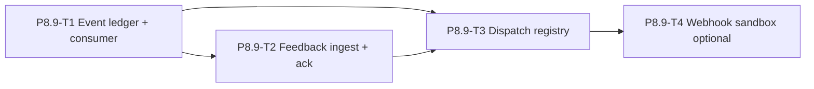

# P8.9 Outbox / Feedback Layer — 62% → 80% Plan

> **Role**: System Planner  
> **Date**: 2026-06-16  
> **Scope**: Planning & ticket breakdown only — **no runtime code changes in this round**  
> **SSOT inputs**: `docs/WAVE_PROGRESS_DASHBOARD.md` · `04_Workflows/reports/W6-standard-case-v2-closure-report.md` · `04_Workflows/testing/standard-case-hitl-resume-notify-matrix.md` · `04_Workflows/checklists/standard-case-change_quality-checklist.md` · W6-T10 / W6-T11 ticket states · `docs/outbox-and-feedback-layer-contract-v1.md`

---

## 1. Executive summary

P8.9 **official target** is **80%** (Dashboard Phase table); **runtime estimate ~62%**. The gap is not missing emitters or checkpoint writes — it is the **consumer / tracking / feedback / dispatch closure** on the workflow event bus W6-T10 introduced.

**Recommended sequence**: Event ledger + tracking consumer → Feedback ingest + ack loop → Downstream dispatch registry (local handlers) → Webhook sandbox wiring (optional 4th ticket).

**Priority call**: **Feedback ingest before webhook adapter wiring.** Webhook without ingest/tracking only adds an unreliable egress; ingest closes the loop and makes dispatch observable.

---

## 2. Current state assessment (~62%)

### 2.1 Capability matrix

| Dimension | Status | Evidence | Gap |
|-----------|--------|----------|-----|
| **Event emit** | **Strong (~85%)** | W6-T10 gateway: 5 `event_type`s; orchestrator S4/S12/S10/return; human approve via delivery CLI; checkpoint A/B integration writes | Resume path notify not matrix-tested (G-7); `run.blocked` no dedicated test (G-11); production `delivery.bundle_ready` not wired |
| **Event storage** | **Partial (~70%)** | Per-event JSON under `outbox/notifications/<case_ref>/`; append `outbox/notification_events.jsonl`; checkpoint JSON + `checkpoint_events.jsonl` | **`notification_*` namespace absent from WB-T3 §2 / `outbox_layer_v1.json`**; dual streams (checkpoint vs notification) not unified in contract |
| **Event tracking** | **Weak (~45%)** | Orchestrator `notifications[]` + `notification_event_id`; audit quickview joins checkpoints; metrics scan regression artifacts | **No read-only workflow-event consumer**; audit spec §2.3.1 has no `workflow_notifications` section; matrix G-6/G-7/G-10 |
| **Feedback writeback** | **Weak (~40%)** | HITL `record_human_decision` → checkpoint JSON; nested `feedback` summary in regression artifacts (WB-T3 §4.3) | **No downstream ack / ingest ledger**; no `feedback_status` on emitted workflow events; controlled notify remains parallel fat-payload path |
| **Downstream dispatch** | **Minimal (~25%)** | `notification_webhook_adapter_v1.py` skeleton (`dry_run=True`); W7-T3 simulated notify via separate CLI flag | **No handler registry**; webhook **not wired** to gateway; `delivery.bundle_ready` does not auto-trigger W7-T3 |

### 2.2 What is already landed (do not re-build)

- WB-T3 contract SSOT + schema index (6 namespaces, feedback semantics, join_with_case_history)
- WB-T5 audit quickview spec + CLI (checkpoint-centric investigation view)
- W3-TL-T4 tabular outbox consumer (tool-run audit; not workflow-event bus)
- W6-T5/T6 checkpoint integration + outbox-root fallback
- W6-T10 notification gateway P2/P3 (local sink, human approve emit, jsonl lock)
- W6-T11 resume loop (fail-close; 43 orchestrator tests)
- Closure report, test matrix (63 rows), quality checklist (65 items), onboarding guide

### 2.3 Why ~62% (planner judgment)

| Layer | Weight | Score | Notes |
|-------|--------|-------|-------|
| Contract / schema index | 20% | **90%** | WB-T3 done; notification namespace drift |
| Producers (tabular + agent + HITL) | 25% | **80%** | Tabular + checkpoint strong; notify on experiment line |
| Storage & retention semantics | 15% | **65%** | Local files OK; contract incomplete for notify stream |
| Tracking / observability | 20% | **45%** | Audit quickview omits notification timeline |
| Feedback ingest / ack | 10% | **35%** | Human → checkpoint only; no downstream loop |
| Downstream dispatch | 10% | **25%** | Skeleton only |

Weighted ≈ **62%** — aligns with Dashboard target vs runtime gap narrative.

---

## 3. Minimum standard for 80%

P8.9 may be marked **80% runtime** when **all** of the following hold (still **not** prod webhook SLA / DLQ / exactly-once):

### 3.1 Must have

| ID | Criterion | Verification |
|----|-----------|--------------|
| M1 | **Notification namespace codified** in WB-T3 / `outbox_layer_v1.json`: `outbox/notifications/`, `notification_events.jsonl`, `schema_id=notification_event_v1` | Contract unittest extended |
| M2 | **Read-only workflow event consumer** lists/filters by `case_ref`, `event_type`, `event_id`; merges checkpoint + notification streams into one timeline projection | New CLI + unittest; example in plan §6 |
| M3 | **Audit quickview** (or derived investigation view) includes `workflow_notifications` section + timeline `event_kind=workflow_notification` entries | `run_agent_audit_quickview.py` + spec §2.3.1 extension |
| M4 | **Feedback ingest v1 (local)**: downstream handler records **ack** (`received` / `failed`) keyed by `event_id` → persisted under `outbox/feedback/<case_ref>/` | Ingest module + unittest |
| M5 | **Downstream dispatch v1 (local)**: post-emit hook invokes **≥1 registered local handler** on real orchestrator run (recommended: `delivery.bundle_ready` → optional W7-T3 controlled notify when flag set) | Integration test on sandbox e2e path |
| M6 | **Resume / terminal event tracking**: matrix gaps G-6, G-7, G-11 closed OR explicitly documented as `gaps[]` with consumer-side detection (`orphan_checkpoint_without_notify`, etc.) | Test matrix §9 updated |
| M7 | **Standard-case regression smoke** includes enabled-notifications run + consumer shows correlated events for `demo_phase` | Documented command bundle |

### 3.2 Explicitly not required for 80%

- Real HTTP webhook to external systems (sandbox HTTP = optional Ticket 4)
- DLQ, retry, HMAC, multi-tenant routing
- Production `build_case_delivery_bundle` notify path
- Resume for `revise_plan` / `hold` / `request_changes`
- Local UI / Grafana
- Changes to tabular writer/consumer behavior (WB-T3 NonScope preserved)

---

## 4. Ticket breakdown (3 + 1 optional)

### Ticket 1 · **P8.9-T1-workflow-event-ledger-and-tracking-consumer-v1**

> **Detailed design**: §4.1 below (System Designer · plan-only · 2026-06-16)

| Field | Content |
|-------|---------|
| **Goal** | Make W6-T10 emits **discoverable and correlatable** — contract + read-only tracking consumer + merged case timeline |
| **Scope** | See §4.1 (ledger schema, consumer, CLI, audit merge, contract extension) |
| **NonScope** | See §4.1 |
| **Acceptance criteria** | See §4.1 AC-1 … AC-7 |
| **Dependencies** | W6-T10 (done) · WB-T3 · WB-T5 |
| **Stub vs runtime** | Consumer is **read-only runtime** (must ship); contract doc-only portion can land first |

---

## 4.1 P8.9-T1 — Event ledger + tracking consumer (detailed design)

> **Ticket ID**: `P8.9-T1-workflow-event-ledger-and-tracking-consumer-v1`  
> **Role**: System Designer · plan-only  
> **Baseline**: W6-T10 gateway emits 5 `event_type`s to local sink; dual raw streams (`notification_events.jsonl` + `checkpoint_events.jsonl`); no unified read path (tracking ~45%).

### 4.1.1 Goal

Establish a **contract-defined event ledger (read model)** and a **tracking consumer** that normalizes existing raw sinks into a single per-`case_ref` timeline — without introducing external queues, retry/DLQ, or webhook dispatch. T1 is the **foundation** for P8.9-T2 (feedback ack) and P8.9-T3 (dispatch registry).

### 4.1.2 Event ledger — storage & relationship to raw sinks

#### Storage decision (T1)

| Layer | Location | Writer | T1 role |
|-------|----------|--------|---------|
| **Raw — workflow notifications** | `outbox/notification_events.jsonl` | `notification_gateway_v1.send_notification` (append) | **Keep unchanged** — producer SSOT for W6-T10 events |
| **Raw — per-event files** | `outbox/notifications/<case_ref>/<event_type>_<ts>_<id8>.json` | gateway primary sink | Reconciliation / deep inspect; consumer may cross-check |
| **Raw — checkpoint lifecycle** | `outbox/checkpoint_events.jsonl` | `hitl/checkpoints_v1.append_checkpoint_event` | **Keep unchanged** — HITL SSOT |
| **Ledger (read model)** | *No new on-disk table in T1* | **None** (computed projection) | Consumer returns normalized `ledger_rows[]` + `timeline[]` on demand |

**Why not SQLite / new jsonl table in T1?**

- Existing repo pattern is append-only JSONL + per-artifact JSON (WB-T3, W6-T10).
- T1 scope is **收、存（沿用 raw）、基本查詢** — raw streams already persist events; duplicating into a second write path adds drift risk before T2 ack fields exist.
- **Optional post-T1 stretch** (not required for AC): materialized cache `outbox/ledger/_cache/<case_ref>.json` written by consumer for large outboxes — defer unless perf blocks smoke tests.

**Relationship to `notification_events.jsonl`**

| Question | Answer |
|----------|--------|
| Replace? | **No** — gateway continues appending full `notification_event_v1` envelopes |
| Extend raw schema? | **No producer change in T1** — envelope already has `event_id`, `event_type`, `emitted_at`, `case_ref`, `source`, etc. |
| Ledger relationship | Ledger **projects** rows from raw lines + checkpoint lines; adds `source_stream`, `ledger_schema_version`, correlation keys |
| Contract | WB-T3 §2 gains explicit **notification namespace** + pointer: ledger row shape = §4.1.3 |

#### Ledger row schema (`workflow_event_ledger_v1`)

Each row is a **normalized read-model** entry (not a second write format for producers).

| Field | Type | Required | Source / notes |
|-------|------|----------|----------------|
| `ledger_schema_version` | string | yes | Always `workflow_event_ledger_v1` |
| `ledger_row_id` | string | yes | Stable: `{source_stream}:{native_id}` e.g. `notification:550e8400-…` or `checkpoint:A-intake-confirmation:checkpoint_created:2026-06-16T12:00:00Z` |
| `source_stream` | string | yes | `notification` \| `checkpoint` |
| `native_id` | string | yes | `event_id` (notification) or synthetic from checkpoint event fields |
| `event_type` | string | yes | Notification: enum (5 types). Checkpoint: maps `event` → `checkpoint.created` / `checkpoint.human_decision` |
| `case_ref` | string | yes | Normalized slug |
| `emitted_at` | string | yes | ISO-8601 UTC; notification uses `emitted_at`; checkpoint uses `timestamp` or `created_at` |
| `source_step` | string \| null | no | From notification `source.step_id` (S4/S10/S12/…) when present |
| `checkpoint_id` | string \| null | no | `A-intake-confirmation` / `B-delivery-confirmation` when applicable |
| `status` | string \| null | no | Checkpoint `status` or notification `checkpoint_status` |
| `tracking_status` | string | yes | T1: always `recorded` (raw line parsed OK). Reserved for T2+: `pending_ack`, `acked`, `failed` |
| `attempts` | int | yes | T1: `0` (placeholder; T3 dispatch increments) |
| `last_error` | string \| null | yes | T1: `null` |
| `idempotency_key` | string \| null | no | From notification envelope when present |
| `source_path` | string \| null | no | Repo-relative path to per-event JSON or checkpoint file when resolved |
| `payload_ref` | object | no | `{schema_version, event_id}` pointer — **not** full payload duplicate |

**Pseudo-JSON (merged timeline entry)**

```json
{
  "ledger_schema_version": "workflow_event_ledger_v1",
  "ledger_row_id": "notification:550e8400-e29b-41d4-a716-446655440000",
  "source_stream": "notification",
  "native_id": "550e8400-e29b-41d4-a716-446655440000",
  "event_type": "checkpoint.awaiting_human",
  "case_ref": "demo_phase",
  "emitted_at": "2026-06-16T12:00:00Z",
  "source_step": "S4",
  "checkpoint_id": "A-intake-confirmation",
  "status": "awaiting_human",
  "tracking_status": "recorded",
  "attempts": 0,
  "last_error": null,
  "idempotency_key": "demo_phase:checkpoint.awaiting_human:A-intake-confirmation:2026-06-16T12-00-00Z",
  "source_path": "outbox/notifications/demo_phase/checkpoint.awaiting_human_2026-06-16T12-00-00Z_550e8400.json"
}
```

**Notification `event_type` enum (unchanged from W6-T10)**

`checkpoint.awaiting_human` · `checkpoint.approved` · `delivery.bundle_ready` · `run.completed` · `run.blocked`

### 4.1.3 Tracking consumer — responsibilities

Module: `delivery/workflow_event_consumer_v1.py` (read-only; no producer mutation).

| Responsibility | In T1? | Description |
|----------------|--------|-------------|
| **Ingest raw sinks** | ✅ | Parse `notification_events.jsonl` + `checkpoint_events.jsonl` (+ optional per-file scan under `outbox/notifications/<case_ref>/`) |
| **Normalize → ledger rows** | ✅ | Map each raw line to `workflow_event_ledger_v1` row; dedupe by `ledger_row_id` |
| **Case timeline aggregation** | ✅ | Sort merged rows by `emitted_at` ascending; expose as `timeline[]` |
| **Basic stats** | ✅ | `count`, `count_by_event_type`, `streams_read` |
| **Filter / query API** | ✅ | Python functions + CLI wrapper |
| **Gap hints (read-only)** | ✅ light | e.g. `checkpoint_created` on disk without nearby `checkpoint.awaiting_human` notification → `hints[]` (not blocking) |
| **Write ledger file** | ❌ | No materialized ledger persistence in T1 |
| **Retry / DLQ / webhook** | ❌ | T3/T4 |
| **Downstream ack** | ❌ | T2 |
| **Mutate gateway or checkpoint** | ❌ | Forbidden |

#### Core API (structured `dict`)

```python
load_workflow_events(
    case_ref: str,
    *,
    event_type: str | None = None,
    event_id: str | None = None,
    since: str | None = None,
    repo_root: Path | None = None,
    outbox_root_override: str | None = None,
) -> dict
```

**Success shape**

```json
{
  "ok": true,
  "read_only": true,
  "schema_version": "workflow_event_consumer_v1",
  "case_ref": "demo_phase",
  "message": "found 4 ledger rows from 2 streams",
  "streams_read": ["outbox/notification_events.jsonl", "outbox/checkpoint_events.jsonl"],
  "count": 4,
  "count_by_event_type": {"checkpoint.awaiting_human": 1, "run.completed": 1, "checkpoint.created": 2},
  "events": ["...ledger rows..."],
  "timeline": ["...same rows sorted by emitted_at..."],
  "hints": []
}
```

**CLI**: `scripts/inspect_workflow_events.py`

| Flag | Purpose |
|------|---------|
| `--case-ref` | Required filter |
| `--event-type` | Optional filter |
| `--event-id` | Optional single-event lookup |
| `--since` | ISO timestamp lower bound |
| `--format json\|text` | Default `text`; JSON for automation |
| `--outbox-root` | Test / scratch override |

Exit `0` when `ok=true` (including zero events for valid case_ref); `1` on parse/config errors.

#### Audit integration (WB-T5 extension)

Extend `run_agent_audit_quickview` investigation view:

- New section `workflow_notifications` (`section_id`, `found`, `summary`, `source_paths`)
- New timeline `event_kind=workflow_notification` entries sourced from consumer merge
- New optional gaps (T1 light): `orphan_checkpoint_without_notify`, `notify_without_checkpoint` — severity `info`/`warning`

Spec touch: `docs/audit-quickview-and-case-history-spec-v1.md` §2.3.1 table + §2.3.3 gap rules.

### 4.1.4 What T1 unlocks for P8.9 (62% → next step)

| Stakeholder | After T1 you can… |
|-------------|-------------------|
| **Debugger / implementer** | Run `inspect_workflow_events --case-ref demo_phase` to see full notify + checkpoint timeline for one run; correlate `notification_event_id` on orchestrator result |
| **Resume loop** | Verify CP-A/B write → `checkpoint.awaiting_human` emitted → human approve → `checkpoint.approved` sequence without grep-ing jsonl |
| **Notify / gateway** | Confirm 5 event types landed in raw sink; detect missing emits (matrix G-6/G-7 prep) |
| **PM / ops** | Audit quickview gains notification section; one JSON export for case investigation |
| **T2 / T3 prep** | Stable `event_id` + `ledger_row_id` keys for ack and dispatch attempt tracking |

T1 alone does **not** close 80% (needs T2 ack + T3 dispatch for M4/M5) — but satisfies **M1 + M2** and partial **M3/M6**.

### 4.1.5 Scope / Non-scope

#### Scope

1. WB-T3 contract + `outbox_layer_v1.json`: codify notification namespace paths and `notification_event_v1` / `workflow_event_ledger_v1` schema ids
2. Read-only consumer module + unittest
3. CLI `inspect_workflow_events.py`
4. Audit quickview projection extension (read-only)
5. Matrix G-6 closure via consumer assertions in test
6. Onboarding cross-ref: `standard-case-hitl-resume-notify-matrix.md` § operator debug commands

#### Non-scope

- External queue (Redis, PG, SQS), daemon poller, webhook HTTP
- Retry, DLQ, HMAC, multi-tenant routing
- Writing to `notification_events.jsonl`, `checkpoint_events.jsonl`, or gateway emit path
- Feedback ack persistence (T2)
- Dispatch handler registry or post-emit hooks (T3)
- Production `build_case_delivery_bundle` notify wiring
- Local UI / Grafana / full analytics dashboard
- Tabular outbox consumer behavior changes (WB-T3 NonScope preserved)
- SQLite or mandatory materialized ledger file

### 4.1.6 Acceptance criteria

| ID | Criterion | Verification |
|----|-----------|--------------|
| **AC-1** | WB-T3 §2 lists `outbox/notifications/`, `outbox/notification_events.jsonl`, `schema_id=notification_event_v1`; ledger projection documented as read-model | `tests/test_outbox_and_feedback_layer_contract_v1.py` extended |
| **AC-2** | Consumer returns stable dict: `ok`, `read_only`, `case_ref`, `events[]`, `timeline[]`, `count`, `count_by_event_type` | `tests/test_workflow_event_consumer_v1.py` |
| **AC-3** | Filter `--event-id` / `--event-type` / `--since` returns correct subset | Same unittest + CLI smoke |
| **AC-4** | Merged timeline includes both notification + checkpoint streams for sandbox run with `--enable-notifications` | Integration: run experiment + consumer shows ≥2 stream types |
| **AC-5** | Audit quickview JSON investigation view includes `workflow_notifications` section when notification files exist | Extend `tests/test_agent_audit_quickview_v1.py` |
| **AC-6** | **Best-effort main flow**: consumer/CLI failures do not affect orchestrator (N/A to orchestrator — consumer is operator-side only); gateway behavior unchanged | Regression: `tests.test_notification_gateway_v1` + orchestrator suite green |
| **AC-7** | Matrix **G-6** closed: resume path with notifications enabled → consumer shows expected `event_type` set (document command in plan §8) | Matrix §9 update + test or documented smoke |

### 4.1.7 AllowedPaths (implementation draft)

| Path | Action | Notes |
|------|--------|-------|
| `delivery/workflow_event_consumer_v1.py` | **create** | Core read-only consumer |
| `scripts/inspect_workflow_events.py` | **create** | CLI wrapper |
| `docs/outbox-and-feedback-layer-contract-v1.md` | extend §2 | Notification namespace + ledger read-model |
| `docs/schemas/outbox_layer_v1.json` | extend | Namespace + schema index entries |
| `docs/audit-quickview-and-case-history-spec-v1.md` | extend §2.3 | `workflow_notifications` section + timeline kind |
| `scripts/run_agent_audit_quickview.py` | extend | Wire consumer into projection |
| `tests/test_workflow_event_consumer_v1.py` | **create** | Consumer unit + integration |
| `tests/test_agent_audit_quickview_v1.py` | extend | Notification section assertions |
| `tests/test_outbox_and_feedback_layer_contract_v1.py` | extend | Contract AC-1 |
| `tests/test_audit_quickview_and_case_history_spec_v1.py` | extend | Spec parity |
| `04_Workflows/plans/P8.9-outbox-feedback-to-80-plan.md` | update | This section |
| `04_Workflows/tickets/P8.9-T1-workflow-event-ledger-and-tracking-consumer-v1_state.md` | **create** (when opened) | Ticket STATE |
| `04_Workflows/testing/standard-case-hitl-resume-notify-matrix.md` | extend §9 / operator | Debug command for consumer |
| `04_Workflows/onboarding/standard-case-hitl-resume-notify_guide.md` | extend | Replace grep-only debug with CLI |
| `delivery/notification_gateway_v1.py` | **read-only** | Do not change emit behavior in T1 unless contract typo fix |
| `hitl/checkpoints_v1.py` | **read-only** | No changes |
| `scripts/run_agent_standard_case_experiment.py` | **read-only** | Smoke command source |

**Forbidden paths (T1)**: `notification_webhook_adapter_v1.py`, dispatch modules, orchestrator emit wiring changes, `.env`, venv, `runtime/checkpoints/**`.

### 4.1.8 Operator smoke (post-implementation)

```bash
# 1. Run with notifications
python scripts/run_agent_standard_case_experiment.py \
  --task-type tabular.cleaning.mvp --case-dir cases/demo_phase \
  --mode run --auto-approve-intake --enable-notifications --format json

# 2. Inspect merged ledger / timeline
python scripts/inspect_workflow_events.py --case-ref demo_phase --format json

# 3. Audit view (includes workflow_notifications section)
python scripts/run_agent_audit_quickview.py --case-ref demo_phase --format json
```

---

### Ticket 2 · **P8.9-T2-feedback-ingest-and-downstream-ack-v1**

| Field | Content |
|-------|---------|
| **Goal** | Close the **feedback loop locally**: downstream handlers acknowledge workflow events; audit surfaces missing/stale acks |
| **Scope** | `delivery/feedback_ingest_v1.py`: `ingest_pending_events()`, `record_downstream_ack(event_id, handler_id, status, message)`; storage `outbox/feedback/<case_ref>/acks/<event_id>_<handler_id>.json`; optional scan cursor `outbox/feedback/_ingest_cursor.json`; wire **local poll mode** CLI `scripts/run_feedback_ingest.py --case-ref --dry-run`; extend audit `gaps[]`: `missing_downstream_ack`, `downstream_ack_failed`; contract §4 feedback extension for `feedback_kind=downstream_ack`; tests |
| **NonScope** | External HTTP; mutating checkpoint JSON; auto-resume based on ack; PG queue |
| **Acceptance criteria** | AC-1: ack round-trip for emitted event in unittest; AC-2: duplicate ack idempotent; AC-3: ingest dry-run lists pending without write; AC-4: audit projection shows ack status when present; AC-5: fail-open (ingest error does not break orchestrator — N/A to orchestrator, but CLI exits 0 with message) |
| **Dependencies** | **P8.9-T1** (event_id + consumer) |
| **Stub vs runtime** | **Must be real runtime** for ack persistence; poll CLI can start as manual operator step (no daemon required for 80%) |

---

### Ticket 3 · **P8.9-T3-downstream-dispatch-handler-registry-v1**

| Field | Content |
|-------|---------|
| **Goal** | First **real downstream dispatch** on the experiment line via pluggable **local handler registry** (not HTTP) |
| **Scope** | `delivery/notification_dispatch_v1.py`: registry (`register_handler`, `dispatch_event`); config `routing/notification_handlers_v1.yaml` (handler_id → event_types → module entrypoint); post-emit call from `notification_gateway_v1.send_notification` or orchestrator `_emit_and_track` (fail-open); **Handler v1**: `delivery.bundle_ready` → invoke `controlled_notify_experiment_v1` when `--enable-controlled-notify-on-dispatch` or env gate; record dispatch attempt in feedback ingest (T2); close G-7 test: resume + notifications enabled → consumer shows events; add G-11 `run.blocked` emit test |
| **NonScope** | Webhook HTTP by default; prod delivery bundle; retry/DLQ; non-tabular main chain |
| **Acceptance criteria** | AC-1: registry dispatches at least one handler on sandbox e2e run; AC-2: dispatch failure does not set orchestrator `ok=false`; AC-3: handler skip when flag off; AC-4: dispatch + ack visible via T1 consumer + T2 ingest; AC-5: matrix G-7 + G-11 closed |
| **Dependencies** | **P8.9-T1** · **P8.9-T2** (recommended) · W7-T3 · W6-T10 |
| **Stub vs runtime** | Registry + local handler invoke = **must runtime wire**; YAML can list stub handler that only writes ack |

---

### Ticket 4 (optional) · **P8.9-T4-webhook-sandbox-dispatch-v1**

| Field | Content |
|-------|---------|
| **Goal** | Wire existing webhook skeleton as **second dispatch sink**, sandbox allowlist only |
| **Scope** | Connect `notification_webhook_adapter_v1.py` into T3 registry; `GOV_NOTIFICATION_WEBHOOK_ENABLED` + allowlist `additional_demo`; mock HTTP tests; document retry/DLQ as future |
| **NonScope** | Prod URLs; secrets in repo; mandatory CI HTTP |
| **Acceptance criteria** | AC-1: dry_run default unchanged; AC-2: sandbox flag on → mock server receives POST in test; AC-3: failure fail-open |
| **Dependencies** | **P8.9-T3** |
| **Stub vs runtime** | Real HTTP **only in sandbox/tests**; default remains dry_run |

---

## 5. Order, dependencies, and parallelism



| Phase | Tickets | Rationale |
|-------|---------|-----------|
| **1** | T1 | Without tracking, 80% gate M2/M3 fail; unblocks all else |
| **2** | T2 | Feedback ingest before webhook — validates loop before egress |
| **3** | T3 | Dispatch registry needs event IDs + ack sink from T1/T2 |
| **4** | T4 (optional) | Webhook is one sink; defer if capacity constrained — **80% achievable without T4** |

**Parallelism**: T2 design can start during T1 contract review; **do not implement T3 before T1 lands** (dispatch without consumer = opaque).

---

## 6. Webhook vs feedback ingest — planner answer

| Option | Value for 62→80% | Risk if done first |
|--------|------------------|-------------------|
| **Feedback ingest first (recommended)** | Closes loop; enables ack gaps in audit; makes dispatch measurable | Low — local files only |
| **Webhook adapter first** | Adds egress only; no visibility if delivery failed | High — flakiness without tracking; minimal % gain |

**Conclusion**: Implement **T1 → T2 → T3**; treat **T4 webhook as stretch** for 80% (local dispatch satisfies M5).

---

## 7. Stub / local vs must wire (summary)

| Work | Stub / local OK? | Must runtime wire? |
|------|------------------|-------------------|
| WB-T3 notification namespace docs | ✅ doc-only first | — |
| Read-only event consumer CLI | — | ✅ |
| Audit timeline merge | — | ✅ |
| Feedback ack files | ✅ format can be draft in T1 | ✅ write path in T2 |
| Handler registry YAML | ✅ stub handler | ✅ at least one real handler in T3 |
| Webhook adapter | ✅ dry_run default | ❌ for 80%; sandbox only in T4 |
| W7-T3 on `bundle_ready` | — | ✅ if chosen as handler v1 |
| Daemon / queue / PG | ❌ out of scope | ❌ |

---

## 7.1 Related cleanup (non-blocking for 80%)

These improve P8.9 coherence but **should not block** the 62→80% slice:

| Item | Source | Suggestion |
|------|--------|------------|
| W6-T10 orchestrator redirect cleanup | Dashboard follow-up | Separate cleanup ticket |
| `checkpoint_path` semantics docs | W6-T5/T6 C_REPORT | Docs ticket; T1 consumer docs can reference |
| Production `delivery.bundle_ready` | Closure report | Post-80% / W12+ |
| Matrix G-1/G-4/G-5 resume gaps | Matrix §9 | HITL-OPS package or T3 test appendix |

---

## 8. Verification bundle (target state @ 80%)

```bash
# Baseline W6 suites (unchanged)
python -m unittest tests.test_notification_gateway_v1 tests.test_agent_standard_case_experiment -v

# P8.9 slice (after T1–T3)
python -m unittest tests.test_workflow_event_consumer_v1 tests.test_feedback_ingest_v1 tests.test_notification_dispatch_v1 -v

# Operator smoke
python scripts/run_agent_standard_case_experiment.py \
  --task-type tabular.cleaning.mvp --case-dir cases/demo_phase \
  --mode run --auto-approve-intake --enable-notifications --format json

python scripts/inspect_workflow_events.py --case-ref demo_phase --format json
python scripts/run_feedback_ingest.py --case-ref demo_phase --dry-run
python scripts/run_agent_audit_quickview.py --case-ref demo_phase --format json

# Contract regression
python -m unittest tests.test_outbox_and_feedback_layer_contract_v1 tests.test_audit_quickview_and_case_history_spec_v1 -v
```

---

## 9. Dashboard update (post-delivery)

When T1–T3 complete, Scribe append to `docs/WAVE_PROGRESS_DASHBOARD.md` Phase table:

- **P8.9** evidence: T1 contract extension + consumer; T2 ack loop; T3 local dispatch
- Runtime estimate **62% → 80%** with command bundle §8

---

## 10. Ticket naming for WORKFLOW_INDEX

| Ticket ID | Short name |
|-----------|------------|
| P8.9-T1 | workflow-event-ledger-and-tracking-consumer-v1 |
| P8.9-T2 | feedback-ingest-and-downstream-ack-v1 |
| P8.9-T3 | downstream-dispatch-handler-registry-v1 |
| P8.9-T4 | webhook-sandbox-dispatch-v1 (optional) |

State files (when opened): `04_Workflows/tickets/P8.9-T1-workflow-event-ledger-and-tracking-consumer-v1_state.md` (etc.)

---

## 11. 已完成 / 下一步（Scribe 更新 · 2026-06-19）

### 已完成（T1–T2）

| 票號 | 能力 | 驗證命令 |
|------|------|----------|
| **P8.9-T1** | Workflow Event Consumer：合併 notification + checkpoint 雙流為 timeline；`inspect_workflow_events.py` CLI | `python scripts/inspect_workflow_events.py --case-ref demo_phase --format json` |
| **P8.9-T2** | Feedback Ingest：downstream ack 寫入與追蹤；audit gaps + workflow_notifications 區塊 | `python scripts/run_feedback_ingest.py --case-ref demo_phase --dry-run` |

### 下一步（T3 → 80%）

| 票號 | 目標 | 說明 |
|------|------|------|
| **P8.9-T3** | Dispatch Handler Registry | local handler registry + post-emit hook；至少一個 handler（建議 `delivery.bundle_ready` → W7-T3 controlled notify）|
| **P8.9-REGRESSION** | Integration smoke doc + matrix | G-6/G-7/G-11 閉環驗證 |

---

*System Planner · P8.9 62→80% · plan-only · 2026-06-16*
