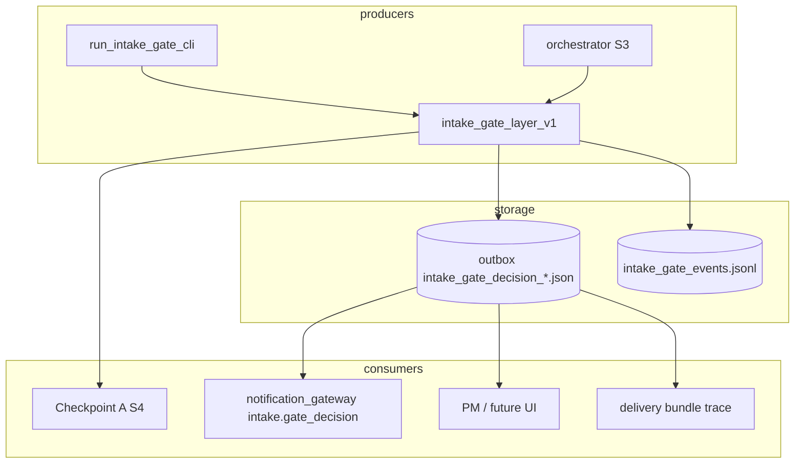
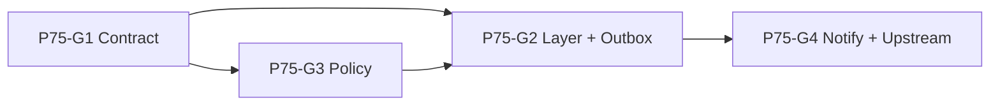

# Phase 7.5 智慧接單 / Intake Gate — 62% → 80% 規劃

> **角色**：Product-Technical Planner  
> **版本**：v0.1 · 2026-06-16  
> **性質**：規劃與拆票 only — **不改 code**  
> **輸入**：`04_Workflows/briefs/W7-hitl-delivery-v2_input-for-pm.md` · `04_Workflows/roadmaps/W7-standard-case-v2_tech-roadmap-draft.md` · `04_Workflows/reports/W6-standard-case-v2-closure-report.md` · Phase 7.5 / intake 既有 spec 與 ticket states  
> **基線假設（尚書省提供）**：Phase 7.5 Intake Gate 約 **62%**

---

## 1. 現況判斷 — 已有什麼、為何只有 62%

### 1.1 已交付（分兩軌，尚未收斂為「對外 Gate」）

| 軌道 | 資產 | 能力 | 完成度貢獻 |
|------|------|------|------------|
| **Tabular / Agent Standard Line（戰車根）** | `routing/intake_decision_rules_v1.py` · v2 · W4-T1 glue · W5-T1B demo CLI | 對 `task_type` + `case_dir` 輸出 `auto_accept` / `needs_review` / `reject` + `rationale` + `suggested_route` | ~25% |
| **同上 · 主鏈實驗線** | `scripts/run_agent_standard_case_experiment.py` S3 | 呼叫 v1 decision；reject → `final_status=blocked`；needs_review → Checkpoint A | ~15% |
| **HITL 下游（非 Gate 本體）** | W6-T5 Checkpoint A · W6-T10 notify stub · W6-T11 resume | 決策**之後**的人工確認、事件、續跑 | ~12% |
| **Phase 7.5 暗部 / 通用 spec** | `PHASE7_5_INTAKE_GATE_MVP_PLAN_v0.1.md` · `SPEC_phase7_5_min_loop.md` · `gov_core_system/core/intake_decider.py`（規格指向） | `accept` / `reject` / `defer` + `gate_checks` + Phase 6.5 映射 | ~10% |
| **治理草案（未接線）** | `WAVE6_CLEAN_INTAKE_ELIGIBILITY_v0.1.md` | ACCEPT / REVIEW / REJECT 維度表（規模、來源、敏感度） | ~0%（規格 only） |

### 1.2 關鍵缺口（62% 的上限原因）

1. **無單一對外 Gate 契約**  
   上游／PM 需分別理解：v1/v2 decision helper、Checkpoint A、暗部 `intake_decider`、min_loop `gate_scores` — 四套詞彙、四套入口。

2. **決策未產品化為 durable record**  
   S3 結果只在 orchestrator JSON 內；**沒有** `outbox/<case_ref>/intake_gate_decision.json` 類 SSOT；notify 無 `intake.gate_decision` 事件（現有 5 種事件從 checkpoint 開始）。

3. **accept / reject / review 語意未對齊**  
   - Tabular：`auto_accept` / `needs_review` / `reject`  
   - Phase 7.5：`accept` / `defer` / `reject`  
   - HITL：`approve` / `revise_plan` / `reject`（Checkpoint A **之後**）  
   「review_needed」對外名稱未定；defer 與 needs_review 是否同義未拍板。

4. **白名單／黑名單未成 config SSOT**  
   v1 allowlist 硬編在 rules（demo_phase / sampleco）；v2 有 A–D tier 但仍散落程式；`WAVE6_CLEAN_INTAKE_ELIGIBILITY` 紅線（PHI、web_scraping 等）**未**接入任何 runtime gate。

5. **與 outbox / notify / delivery 串接不完整**  
   - reject：無標準 notify（`run.blocked` 語意模糊）  
   - review_needed：靠 Checkpoint A，但 gate 本身不發「待審」事件  
   - accept → 標準案例線：有 S3→S7 路徑，但缺 gate record → notify → delivery 的可追溯鏈

6. **工程入口仍偏內部**  
   `run_agent_intake_decision_demo.py` 標明 plan-only、無 outbox；主鏈 intake CLI / `new_cleaning_case.py` 未消費 gate；W4-T1（Phase 7.5 gate scorer 票）仍 **draft**。

7. **explainability 有資料、無契約**  
   `rationale[]` 存在但無穩定 `rule_id` / `gate_checks[]` 跨 v1·v2·orchestrator 對齊；不符合 PM／稽核「為何拒收」產品需求。

### 1.3 62% 口徑說明（規劃用）

| 維度 | 權重 | 估計 | 依據 |
|------|------|------|------|
| 規則引擎（decider / rules v1·v2） | 25% | **22%** | v1+v2+glue 可跑；v2 非 orchestrator 預設 |
| 三態決策 + explainability | 20% | **12%** | 三態有；對外 enum + rule_id SSOT 無 |
| 標準案例線串接 | 20% | **14%** | S3+CP-A 有；缺 gate record |
| outbox / decision log | 15% | **5%** | checkpoint 有；intake decision 無 |
| notify / 上游可消費 | 10% | **4%** | stub 有；無 intake gate 事件 |
| 白名单 / 黑名单 | 10% | **5%** | 硬编码 allowlist；无 deny SSOT |
| **合計** | 100% | **~62%** | |

---

## 2. 「80% Gate」最小能力定義

> **目標**：形成 **單一可對外說明、可審計、可接標準案例線** 的 Intake Gate MVP+；**不**要求 web UI、webhook SLA、multi-tenant、LLM judge。

### 2.1 必須支援（In scope for 80%）

| # | 能力 | 80% 最小定義 | 備註 |
|---|------|--------------|------|
| M1 | **三態決策** | 對外統一：`accept` · `reject` · `review_needed`（內部映射 v1/v2/defer） | PM 拍板對照表（見 §4） |
| M2 | **Rule-based explainability** | 每筆決策含 `gate_checks[]`（`rule_id`, `passed`, `detail`）+ `reason_codes[]` + 人讀 `message` | 對齊 Phase 7.5 `gate_checks` 形狀 |
| M3 | **白名单 / 黑名单** | `routing/intake_gate_policy_v1.yaml`（或等價 SSOT）：fixture profile tier、task_type 族、explicit deny codes | deny 內容需 PM；schema 工程可先寫 |
| M4 | **標準案例線串接** | `run_agent_standard_case_experiment` S3 改走 **Intake Gate 層**（v2 預設 + v1 fallback）；reject 不進 CP-A；review_needed 觸發 CP-A | 實驗線 only，不改 production main-chain |
| M5 | **Intake decision log / outbox record** | Run 模式寫入 `outbox/<case_ref>/intake_gate_decision_<ts>.json` + append `outbox/intake_gate_events.jsonl` | Preview 只算 `would_decide`，不寫檔 |
| M6 | **Notify 最小串接** | 新增事件 `intake.gate_decision`（best-effort，沿用 W6 gateway；fail-open） | 不阻塞主流程；SLA 沿用 brief Q3-A |

### 2.2 明確不做（80% Non-Goals）

- HTTP `POST /api/intake/gate`（留 90%+ 或暗部票）
- Web UI / dashboard（W7 HITL-SURFACE 另線）
- Webhook retry / DLQ（NOTIFY-v2 Package 3）
- ML / LLM 輔助判斷
- 改 `cases/index.json` 或 production `new_cleaning_case.py` 預設行為
- `revise_plan` / defer 自動澄清 workflow（僅標 `review_needed` + CP-A）
- 完整 `WAVE6_CLEAN_INTAKE_ELIGIBILITY` 全維度打分（僅接入 PM 批准的 deny 子集）

### 2.3 80% 驗收口徑

```bash
# Gate CLI（新票交付後）
python scripts/run_intake_gate_cli.py \
  --task-type tabular.cleaning.mvp --case-dir cases/demo_phase --mode preview --format json

python scripts/run_intake_gate_cli.py \
  --task-type tabular.cleaning.mvp --case-dir cases/unknown_client --mode run --format json
# 預期：reject + outbox record +（若 --enable-notifications）intake.gate_decision 事件

python -m unittest tests.test_intake_gate_layer_v1 tests.test_intake_decision_rules_v2 \
  tests.test_agent_standard_case_experiment -v
```

**結構化驗收**：gate result `dict` 必含 `ok`, `decision`, `decision_normalized`, `gate_checks`, `reason_codes`, `suggested_route`, `outbox_record_path`（run 且 accept/review/reject 任一）, `schema_version=intake_gate_v1`.

---

## 3. 拆票清單（4 張）

### Ticket 1 · **P75-G1-intake-gate-contract-and-vocabulary-v1**

| 欄位 | 內容 |
|------|------|
| **Goal** | 建立 Intake Gate 對外 SSOT：canonical 三態（`accept` / `reject` / `review_needed`）、`intake_gate_result_v1` schema、`intake_decision_id` 關聯規範、與 v1/v2/Phase7.5/CP-A 映射表 |
| **Scope** | `docs/intake-gate-contract-v1.md` · `shared/schemas/intake_gate_result_v1.json` · reason_codes 初版 enum · 消費者邊界圖 · PM-D1–D6 對照 · `WORKFLOW_INDEX` 一條 · **詳規見下節 G1-1…G1-7** |
| **Non-scope** | Gate layer 實作、policy YAML、outbox 寫入、notify emit、改 rules 程式 |
| **Acceptance criteria** | AC-1…AC-9（見下節 G1-5） |
| **PM 決策** | **Blocker**：PM-D1、D2、D3（關票前須裁定或採預設）；D4–D6 可記建議預設 + TODO |
| **依賴** | 無（可先行 draft；freeze 待 PM-D1–D3） |
| **估計** | ~3–5 人日 |

#### P75-G1 詳規（Product-Technical Design · v0.1）

> **本節性質**：設計與拆票 only；**不改 code**。G1 交付物為 contract doc + JSON schema + 映射表；實作由 G2/G3/G4 消費。

##### G1-1. 三態詞彙與狀態空間

**對外 canonical 三態（Gate SSOT）**

| `decision`（canonical） | 語意 | 下游預設行為 |
|-------------------------|------|--------------|
| `accept` | 規則允許接單；可進標準案例線（S7+） | 不觸發 Checkpoint A（除非 `risk_level` 強制 review，見 G1-1.3） |
| `reject` | 規則拒收；不進 HITL | 不建立 CP-A；可寫 outbox + notify（PM-D5） |
| `review_needed` | 規則無法自動接單；需人工確認 | 觸發 Checkpoint A（S4）；不視為已接單 |

**命名裁決（對照 PM-D1）**：對外統一用 `review_needed`（snake_case）；**不**對外暴露 `defer`、`needs_review`、`pending_review`。`defer`（Phase 7.5）與 `needs_review`（v1/v2）均映射至 `review_needed`。

**內部來源 → canonical 映射表（G1 必交付）**

| 來源層 | 內部值 | → canonical | 備註 |
|--------|--------|-------------|------|
| v1/v2 rules | `auto_accept` | `accept` | 保留 `decision_internal` 供 regression |
| v1/v2 rules | `needs_review` | `review_needed` | |
| v1/v2 rules | `reject` | `reject` | |
| Phase 7.5 `intake_decider` | `accept` | `accept` | |
| Phase 7.5 | `defer` | `review_needed` | PM-D1 預設：併入 review_needed |
| Phase 7.5 | `reject` | `reject` | |
| min_loop `lifecycle_status` | `accepted` | `accept` | 僅 lifecycle 對照；非 gate output 欄位 |
| min_loop | `pending_review` | `review_needed` | |
| min_loop | `auto_rejected` | `reject` | |
| Checkpoint A **人工** | `approve` / `revise_plan` / `reject` | **不映射** | 屬 HITL 層；見 G1-3 |

**子態與原因碼（建議：要，但分層）**

| 欄位 | Required | 用途 |
|------|----------|------|
| `reason_codes[]` | **是**（可空陣列） | 機器可聚合拒收／待審原因；G3 deny 命中、unknown task 等 |
| `gate_checks[]` | **是**（可空陣列） | 可審計規則逐條結果；對齊 Phase 7.5 `{rule_id, passed, detail}` |
| `risk_level` | **是** | `low` \| `medium` \| `high`；影響 CP-A 是否強制觸發 |
| `risk_flags[]` | optional | 訊號標籤（如 `experimental_fixture_profile`）；不取代 `reason_codes` |
| `message` | **是** | 人讀一句摘要 |
| `decision_internal` | optional | 引擎原始值（`auto_accept` 等）；僅稽核／regression |

**`reason_codes` 初版 enum（G1 文件化；G3 擴充）**

| code | 典型 `decision` | PM 狀態 |
|------|-----------------|---------|
| `supported_task` | `accept` | 工程預設 |
| `allowlist_fixture` | `accept` | 工程預設 |
| `manual_review_required` | `review_needed` | 工程預設 |
| `experimental_fixture` | `review_needed` | 工程預設 |
| `unknown_client_profile` | `review_needed` | PM-D6 預設 |
| `unsupported_task_type` | `reject` | PM-D2 預設 |
| `non_tabular_without_flag` | `reject` | PM-D4 預設 |
| `case_dir_not_found` | `reject` | 工程預設 |
| `glue_plan_failed` | `reject` | 工程預設 |
| `policy_deny_phi` | `reject` | PM-D3 TODO |
| `policy_deny_web_scraping` | `reject` | PM-D3 TODO |
| `policy_deny_audio_video` | `reject` | PM-D3 TODO |
| `policy_deny_scale_exceeds` | `reject` | PM-D3 TODO |

**G1-1.3 風險覆寫（與 Checkpoint A 邊界）**

即使 `decision=accept`，若 `risk_level` 為 `medium` 或 `high`，**仍**觸發 Checkpoint A（沿用 W6-T5／`should_trigger_checkpoint_a`）。契約須明確：

- **Gate `decision`**：規則引擎三態 SSOT  
- **CP-A `human_action`**：`approve` \| `revise_plan` \| `reject` — 發生在 gate **之後**  
- Gate `reject` ≠ CP-A 人工 `reject`（前者無 checkpoint 檔）

##### G1-2. Contract schema — `intake_gate_result_v1`

**物件角色**：單次 gate 評估的**結構化輸出**（preview 與 run 共用形狀；run 另增持久化指標）。

**建議未來檔案位置（本輪不建檔）**

| 檔案 | 角色 |
|------|------|
| `docs/intake-gate-contract-v1.md` | 敘述 SSOT：詞彙、邊界、消費者、PM 決策對照 |
| `shared/schemas/intake_gate_result_v1.json` | 機器驗證 schema（JSON Schema draft-07） |
| `shared/schemas/intake_gate_reason_codes_v1.json` | 可選：reason_code enum 獨立檔，供 policy 引用 |

**Pseudo-JSON（成功路徑）**

```json
{
  "ok": true,
  "schema_version": "intake_gate_result_v1",
  "intake_decision_id": "igd_2026-06-16T10-00-00Z_demo_phase_tabular.cleaning.mvp",
  "decision": "review_needed",
  "decision_normalized": "review_needed",
  "decision_internal": "needs_review",
  "task_type": "tabular.cleaning.mvp",
  "case_ref": "demo_phase",
  "case_dir": "cases/demo_phase",
  "risk_level": "medium",
  "risk_flags": ["manual_review_required"],
  "reason_codes": ["manual_review_required", "allowlist_fixture"],
  "message": "decision=review_needed risk=medium",
  "gate_checks": [
    {"rule_id": "G-TASK-01", "passed": true, "detail": "tabular.cleaning.mvp in supported set"},
    {"rule_id": "G-RISK-02", "passed": false, "detail": "medium signals: manual_review_required"}
  ],
  "suggested_route": {
    "selector_task_type": "e2e",
    "planned_tools": ["validate.eligibility", "clean.phase_demo", "export.delivery_bundle"],
    "orchestration_tool_id": "orchestrate.e2e"
  },
  "policy_version": "intake_gate_policy_v1",
  "rules_engine": "intake_decision_rules_v2",
  "rules_engine_version": "v2",
  "decider": "intake_gate_layer_v1",
  "mode": "preview",
  "created_at": "2026-06-16T10:00:00Z",
  "pm_decisions_applied": {
    "PM-D1": "defer_merged_into_review_needed",
    "PM-D2": "unsupported_task_type_reject",
    "PM-D6": "unknown_client_review_needed"
  },
  "outbox_record_path": null,
  "checkpoint_a": {
    "would_trigger": true,
    "trigger_reason": "decision_review_needed"
  },
  "glue_plan": { "ok": true, "planned_tool_count": 3 }
}
```

**欄位清單**

| 欄位 | Required | 說明 |
|------|----------|------|
| `ok` | **是** | `false` 僅表輸入／引擎錯誤，非業務 reject |
| `schema_version` | **是** | 固定 `intake_gate_result_v1` |
| `intake_decision_id` | **是**（run）；preview 可省略或 `would_*` | 關聯鍵；見 G1-3 |
| `decision` | **是** | canonical 三態 |
| `decision_normalized` | **是** | 與 `decision` 相同（向後相容別名；G2 可寫相同值） |
| `decision_internal` | optional | v1/v2/Phase7.5 原始值 |
| `task_type` | **是** | |
| `case_ref` | **是** | 從 `case_dir` 推導的穩定 ref |
| `case_dir` | **是** | repo 相對路徑 |
| `risk_level` | **是** | `low` \| `medium` \| `high` |
| `reason_codes` | **是** | 字串陣列；可 `[]` |
| `gate_checks` | **是** | 物件陣列；可 `[]` |
| `message` | **是** | |
| `risk_flags` | optional | |
| `suggested_route` | optional | `accept`/`review_needed` 時常有；`reject` 為 `null` |
| `policy_version` | optional（G3 後 **建議必填**） | |
| `rules_engine` | **是** | 如 `intake_decision_rules_v2` |
| `rules_engine_version` | **是** | |
| `decider` | **是** | 固定 `intake_gate_layer_v1`（G2 起） |
| `mode` | **是** | `preview` \| `run` |
| `created_at` | **是** | ISO-8601 UTC |
| `pm_decisions_applied` | optional | 記錄採用的 PM-D 預設／批文 |
| `outbox_record_path` | run：**是**；preview：`null` | G2 寫入後回填 |
| `checkpoint_a` | optional | `{would_trigger, trigger_reason}` 預覽用 |
| `glue_plan` | optional | W4-T1 稽核子集 |
| `message`（error） | `ok=false` 時 **是** | 錯誤說明 |

**`ok: false` 形狀**：保留 `schema_version`、`task_type`、`case_dir`（若已知）、`message`；**不**發明 `decision=reject`（與業務拒收區分）。

**Durable record（G2 寫入；G1 定義形狀）**

- 路徑：`outbox/<case_ref>/intake_gate_decision_<compact_ts>.json`
- 內容：上述 result 物件 + `record_type: "intake_gate_decision"` + 相同 `intake_decision_id`
- 彙總：`outbox/intake_gate_events.jsonl` 每行 `{intake_decision_id, case_ref, decision, created_at, record_path}`

##### G1-3. 消費者與關聯



| 層 | 讀／寫 | 責任 |
|----|--------|------|
| **`intake_gate_layer_v1`（G2）** | 寫 result；run 寫 outbox | 唯一 canonical 產生者 |
| **`run_intake_gate_cli`（G2/G4）** | 呼叫 layer；印 JSON | 上游 documented entry |
| **`run_agent_standard_case_experiment` S3** | 讀 result；傳入 S4 | 不再直接呼叫 v1 rules |
| **Checkpoint A（S4）** | 讀 `decision`/`risk_level`/`gate_checks` | `review_needed` 或 risk 覆寫 → 建 CP-A；payload 內嵌 gate 摘要 + **`intake_decision_id`** |
| **outbox** | 寫 durable record | SSOT 審計；CP-A 檔可引用 `intake_decision_id` |
| **notification_gateway（G4）** | 讀 record path | 新事件 `intake.gate_decision`；payload 含 `intake_decision_id`、`decision`、`reason_codes` |
| **delivery bundle / sandbox trace** | 讀 optional | 交付追溯鏈 |
| **future UI** | 讀 outbox + jsonl | 非 80% scope |

**`intake_decision_id` 規範**

- 格式：`igd_<compact_ts>_<case_ref>_<task_type_slug>`（G2 實作可再加短 uuid 防碰撞）
- **必須**出現在：outbox record、jsonl 行、`intake.gate_decision` event、CP-A `agent_output.intake_gate.intake_decision_id`
- **不必**出現在 orchestrator 頂層（可透過 `checkpoint_a_status.integration` 引用）

**與現有 notify 事件關係**

| 現有事件 | 與 Gate 關係 |
|----------|--------------|
| `checkpoint.awaiting_human` | CP-A 建立**後**；可含 `intake_decision_id` 交叉引用 |
| `checkpoint.approved` | 人工批准**後**；與 gate 無同義 |
| `run.completed` / `delivery.bundle_ready` | 下游；gate 無關 |
| **`intake.gate_decision`（G4 新增）** | gate 決策當下；三態皆可有事件 |

##### G1-4. PM 決策點對照（G1 視角）

| ID | G1 是否 blocker | 說明 | 建議預設 |
|----|-----------------|------|----------|
| **PM-D1** | **是** — schema freeze | 對外三態命名；`defer` 是否併入 `review_needed` | **是** — 併入 `review_needed` |
| **PM-D2** | **是** — reason_codes enum | unknown `task_type` 映射進契約 | **reject** + `unsupported_task_type` |
| **PM-D3** | **是** — deny reason_codes 子集 | G1 文件化 enum 占位；G3 填內容 | PHI、web_scraping、audio_video、scale_exceeds |
| **PM-D4** | 否（G1 可記預設） | 影響 G3 policy | **reject** + `non_tabular_without_flag` |
| **PM-D5** | 否（G2/G4） | G1 契約含 `outbox_record_path` 欄位定義即可 | **是** — reject 也寫 outbox + notify |
| **PM-D6** | 否（G1 可記預設） | 影響 G3 default tier | **review_needed** + `unknown_client_profile` |

**G1 關票條件**：PM-D1、D2、D3 須有書面裁定或採用建議預設並寫入 `pm_decisions_applied`；D4–D6 可標 `TODO` + 預設值。

##### G1-5. Acceptance Criteria（G1 票）

| AC | 內容 |
|----|------|
| AC-1 | `docs/intake-gate-contract-v1.md` 存在且為 Intake Gate **唯一敘述 SSOT** |
| AC-2 | `shared/schemas/intake_gate_result_v1.json` 可驗證 §G1-2 pseudo-JSON 成功／失敗樣例 |
| AC-3 | 內部↔canonical 映射表完整覆蓋 v1、v2、Phase7.5、min_loop lifecycle |
| AC-4 | 明確區分 Gate 三態 vs Checkpoint A 人工三動作（附邊界圖） |
| AC-5 | `reason_codes` 初版 enum + PM-D3 `TODO` 標記 |
| AC-6 | `intake_decision_id` 關聯規範寫清（outbox / notify / CP-A） |
| AC-7 | PM-D1–D6 對照表入 doc；D1–D3 blocker 狀態標示 |
| AC-8 | `WORKFLOW_INDEX.md` 新增 Intake Gate contract 索引一條 |
| AC-9 | 與 W6 closure S3/CP-A 行為對照表無矛盾（或標註 G2 將改的接線點） |

##### G1-6. Scope / Non-scope（G1 票）

| In scope | Out of scope |
|----------|--------------|
| Contract doc + JSON schema + reason_code enum 草案 | `intake_gate_layer_v1` 實作（G2） |
| 映射表 + 消費者邊界圖 | Policy YAML 內容（G3） |
| `intake_decision_id` 與 outbox 路徑**規範** | 實際寫 outbox／jsonl（G2） |
| PM-D 對照與 TODO 標記 | `intake.gate_decision` emit（G4） |
| WORKFLOW_INDEX 一條 | 改 v1/v2 rules 程式 |

##### G1-7. 後續票接口摘要

| 票 | 如何使用 G1 contract |
|----|----------------------|
| **G2** | `evaluate_intake_gate()` 回傳 `intake_gate_result_v1`；映射 v2→canonical；run 寫 outbox 並填 `outbox_record_path` |
| **G3** | Policy 命中轉 `gate_checks` + `reason_codes`；`policy_version` 必填；不改 canonical 三態 |
| **G4** | 讀 outbox record；emit `intake.gate_decision`；event payload 欄位子集對齊 schema |

---

### Ticket 2 · **P75-G2-intake-gate-layer-and-outbox-record-v1**

| 欄位 | 內容 |
|------|------|
| **Goal** | 新增 **Intake Gate 整合層**，將 v2 decision 包裝為 gate result，並在 run 模式寫入 outbox decision record + jsonl |
| **Scope** | `routing/intake_gate_layer_v1.py` → `evaluate_intake_gate(task_type, case_dir, *, mode, policy_path?)` · orchestrator S3 改呼叫此層 · `scripts/run_intake_gate_cli.py` · tests · `docs/intake-gate-contract-v1.md` 實作章節 |
| **Acceptance criteria** | AC-1 v2 預設 + v1 fallback · AC-2 run 寫 `outbox/<case_ref>/intake_gate_decision_*.json` + jsonl · AC-3 preview 不寫檔、含 `would_decide` · AC-4 reject 不觸發 CP-A · AC-5 review_needed 行為與現 CP-A 一致 · AC-6 unittest + orchestrator regression 全綠 |
| **PM 決策** | **部分** — 工程可實作層與 record 形狀；PM 確認 reject 是否寫 outbox（建議：**是**，供稽核） |
| **依賴** | P75-G1（schema 凍結後施工；可 parallel 若 schema draft 先出） |
| **估計** | ~1–1.5 週 |

---

### Ticket 3 · **P75-G3-intake-gate-policy-allowlist-denylist-v1**

| 欄位 | 內容 |
|------|------|
| **Goal** | 白名单／黑名单 config 化；降低硬编码；接入 PM 批准的 deny reason codes |
| **Scope** | `routing/intake_gate_policy_v1.yaml` · policy loader · 整合進 `intake_gate_layer_v1` · 對齊 W4-GUARD-01 extended fixture 旗標 · tests · policy 文件 |
| **Acceptance criteria** | AC-1 demo_phase/sampleco tier-A/B 行為與 v2 一致 · AC-2 C/D fixture 需 explicit flag 或 policy tier · AC-3 deny list 命中 → `reject` + 固定 `reason_code` · AC-4 policy 變更不需改 Python 規則核心 · AC-5 至少 10 條 policy 單測 |
| **PM 決策** | **是** — deny 清單（PHI、web_scraping、unsupported format 等取子集）；non-tabular 預設 reject vs review_needed；新 client 預設策略 |
| **依賴** | P75-G1（reason_code enum）· 可與 G2 並行 policy schema，G2 後半接入 |
| **估計** | ~1 週（含 PM workshop 1 次） |

---

### Ticket 4 · **P75-G4-intake-gate-notify-and-upstream-entry-v1**

| 欄位 | 內容 |
|------|------|
| **Goal** | Gate 決策進 notify 總線；提供上游單一 CLI 入口；reject/review 可被 downstream 訂閱（best-effort） |
| **Scope** | `delivery/notification_gateway_v1.py` 新增 `intake.gate_decision` · orchestrator / gate CLI 在 `--enable-notifications` 時 emit · reject 時可選映射 `run.blocked`（document only）· upstream runbook 一節 · tests |
| **Acceptance criteria** | AC-1 三態均產生 event（enabled + run）· AC-2 event payload 含 gate record path + decision + reason_codes · AC-3 notify 失敗不影響 gate ok · AC-4 `run_intake_gate_cli` 為 documented upstream entry · AC-5 gateway unittest 擴充 |
| **PM 決策** | **部分** — notify tier 預設 best-effort（同 W7 brief Q3-A）；是否對 reject 發送與 accept 同級通知 |
| **依賴** | P75-G2（需有 outbox record path） |
| **估計** | ~3–5 人日 |

---

### 建議順序



| 階段 | 票 | 完成後 Phase 7.5 估計 |
|------|-----|----------------------|
| 僅 G1 | 契約 | ~65% |
| G1+G2 | 可跑 gate + record | ~74% |
| +G3 | 產品化 policy | ~78% |
| +G4 | 上游可訂閱 | **~80%** |

---

## 4. 工程可先做 vs 需 PM 決策

### 4.1 工程可先做（無需 PM 或僅事後確認）

| 工作 | 票 |
|------|-----|
| Gate result JSON schema 草案 + 映射表 **草稿** | G1 |
| `intake_gate_layer_v1` 包裝 v2、outbox jsonl 寫入、orchestrator S3 接線 | G2 |
| `run_intake_gate_cli.py` preview/run 雙模式 | G2 |
| Policy YAML **loader 骨架** + tier A/B/C/D 從 v2 遷移 | G3 |
| `intake.gate_decision` 事件型別 + gateway 單測 | G4 |
| 對齊 W6 fail-open notify 語意 | G4 |
| 文檔：Gate vs Checkpoint A 邊界圖 | G1 |

### 4.2 必須 PM 先拍板（阻塞 80% 定義）

| 決策 ID | 問題 | 影響 | 建議預設 |
|---------|------|------|----------|
| **PM-D1** | 對外三態命名：`review_needed` 是否涵蓋 v2 `needs_review` + Phase7.5 `defer`？ | G1 schema、上游 API | **是** — defer 對外併入 review_needed |
| **PM-D2** | 未知 / 超範圍 `task_type`：`reject` 還是 `review_needed`？ | G3 deny 規則 | **reject** + `reason_code=unsupported_task_type` |
| **PM-D3** | Deny 清單取 `WAVE6_CLEAN_INTAKE_ELIGIBILITY` 哪子集？ | G3 policy 內容 | 第一版：PHI、web_scraping、audio_video、scale_exceeds（4 碼） |
| **PM-D4** | non-tabular 無 `--include-extended-fixtures`：reject 或 review？ | G3 + orchestrator allowlist | **reject**（與現實驗線一致） |
| **PM-D5** | Gate reject 是否寫 outbox + 發 notify？ | G2/G4 | **是** — 供 PM 看拒收原因 |
| **PM-D6** | 新 client（非 allowlist）預設策略 | G3 | **review_needed**（保守） |

### 4.3 PM 決策 vs W7 HITL 路線圖關係

- **W7 Package 1–3**（HITL-OPS / SURFACE / NOTIFY-v2）解決 **Checkpoint A/B 之後** 的操作與通知可靠性。  
- **本規劃 P75-G*** 解決 **進入 CP-A 之前** 的接單 Gate。  
- 兩線可並行；G4 notify 與 W7 NOTIFY-v2 共用 gateway，但 **不** 引入 retry/DLQ（80% 範圍外）。

---

## 5. 風險與緩解

| 風險 | 嚴重度 | 緩解 |
|------|--------|------|
| 票號 W4-T1 與 routing glue 同名混淆 | 中 | 新票統用 **P75-G*** 前綴；文件註明非 Tabular W4-T1 glue |
| v1/v2 行為漂移 | 中 | G2 強制 v2 預設 + regression 錨點 demo_phase/sampleco |
| Policy 與 W4-GUARD-01 重疊 | 低 | G3 引用 `--include-extended-fixtures` 為 tier-D 顯式旗標 |
| 80% 後仍無 HTTP API | 低 | 明示 Non-Goal；CLI + outbox 即 80% DoD |

---

## 6. 參考索引

| artifact | path |
|----------|------|
| W7 PM brief | `04_Workflows/briefs/W7-hitl-delivery-v2_input-for-pm.md` |
| W7 tech roadmap | `04_Workflows/roadmaps/W7-standard-case-v2_tech-roadmap-draft.md` |
| W6 closure | `04_Workflows/reports/W6-standard-case-v2-closure-report.md` |
| Decision rules v1/v2 | `docs/intake-decision-rules-v1.md` · `docs/intake-decision-rules-v2.md` |
| Phase 7.5 MVP | `04_Workflows/PHASE7_5_INTAKE_GATE_MVP_PLAN_v0.1.md` |
| Min loop spec | `04_Workflows/SPEC_phase7_5_min_loop.md` |
| Eligibility 草案 | `04_Workflows/WAVE6_CLEAN_INTAKE_ELIGIBILITY_v0.1.md` |
| Checkpoint A | `docs/checkpoint-a-integration-v1.md` |
| Notification gateway | `delivery/notification_gateway_v1.py` |

---

## 7. 已完成 / 下一步（Scribe 更新 · 2026-06-19）

### 已完成（G1–G3）

| 票號 | 能力 | 驗證命令 |
|------|------|----------|
| **P75-G1** | Intake Gate Contract：對外三態詞彙、`intake_gate_result_v1` schema、PM-D 對照表 | `cat docs/intake-gate-contract-v1.md` |
| **P75-G2** | Intake Gate Layer：`evaluate_intake_gate()` 統一產出、outbox 持久化、orchestrator S3/S4 接線 | `python scripts/run_intake_gate_cli.py --task-type tabular.cleaning.mvp --case-dir cases/demo_phase --mode preview --format json` |
| **P75-G3** | Intake Gate Policy：YAML SSOT、deny reason_code 機制、golden fixtures、48 tests | `python -m unittest tests.test_intake_gate_policy_loader_v1 tests.test_intake_gate_policy_evaluator_v1 tests.test_intake_gate_policy_bridge_v1 tests.test_intake_gate_policy_integration_v1 -v` |

### 下一步（G4 → 80%）

| 票號 | 目標 | 說明 |
|------|------|------|
| **P75-G4** | Intake Gate Notify | `intake.gate_decision` event 經由 notification gateway 發送；上游 CLI entry 收斂 |
| **PHASE-80-SCRIBE** | Dashboard + verification bundle | Phase 7.5 / P8.9 / Phase 8 統一收口驗證 |

---

*規劃稿 — 待尚書省／PM 確認 PM-D1–D6 後開 Implementer 票。*
