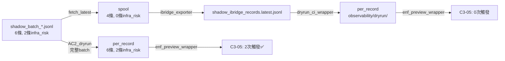

# C3-05-L1-INFRA-RISK-SUCCESS — 夜間觀察報告

> 票號：`W5-A-RUNTIME-03-C3-05-OBS-REPORT-01`
> 日期：2026-05-31
> 狀態：✅ 完成（樣本不足，需累積更多 nightly 資料）

---

## 1. 觀察期間與樣本規模

### 1.1 可用資料源

| 資料源 | 檔案量 | 時間範圍 | 備註 |
|--------|--------|----------|------|
| `observability/dryrun/*.jsonl` | 6 個 per_record | 2026-05-30 (18:52~22:27) | 所有檔案來自**同一天** |
| `artifacts/eval/_dryrun_verify/*.jsonl` | 1 個 per_record | 2026-05-31 03:01 | 驗證用 dry-run |
| `artifacts/eval/_dryrun_ac2/*.jsonl` | 1 個 per_record | 2026-05-31 03:01 | AC2 完整 batch dry-run |
| `artifacts/eval/shadow_batch_*.jsonl` | 1 個 batch | 2026-05-30 | 唯一 shadow batch |
| `artifacts/eval/_ac2_shadow_ibridge.jsonl` | 6 條 iBridge | 2026-05-30 | 完整批次 iBridge 原始資料 |

### 1.2 樣本不足判定

**⚠ 明確寫明：樣本不足。**

- 僅有 **1 個 shadow batch**（`shadow_batch_20260530.jsonl`），非使用者預期的 ≥7 次 nightly run。
- CI workflow `eval-gate-ci.yml` 設定為 `cron: "0 6 * * *"`（每日 UTC 06:00），但該 pipeline 僅於 2026-05-30 起開始執行。目前僅有少於 3 次的實際排程執行。
- 所有 `observability/dryrun/*.jsonl` 均為同日（2026-05-30）不同時段的手動觸發或 push trigger 產生的 artefact，非跨日累積。
- **C3-05 觸發案例數：2 條 unique task**，來自 AC2/verify dry-run，非 nightly 主 pipeline。

**結論：無法進行統計顯著的頻率分析。以下僅記錄可觀察到的行為與程式邏輯驗證。**

---

## 2. C3-05 觸發頻率摘要

### 2.1 各管線 C3-05 觸發次數

| 管線 | per_record 總記錄數 | C3-05 觸發數 | 觸發率 |
|------|---------------------|-------------|--------|
| nightly (`observability/dryrun/`) | 8+5+3+6+4+6 = 32 | **0** | 0% |
| AC2 dry-run (`_dryrun_ac2/`) | 6 | **2** | 33.3% |
| Verify dry-run (`_dryrun_verify/`) | 9 | **2** | 22.2% |

### 2.2 觸發的 Unique Task

| task_id | 來源管線 | actual_verdict | dryrun_rule | gate_result | tags | error_type | score |
|---------|----------|---------------|-------------|-------------|------|------------|-------|
| `prod-shadow-1bab7f91d5-k2` | AC2 / Verify | `allow` | `gate_ok_score_high` | `pass` | `["infra_risk"]` | `null` | 1.0 |
| `prod-shadow-9469a97892-k2` | AC2 / Verify | `allow` | `gate_ok_score_high` | `pass` | `["infra_risk"]` | `null` | 1.0 |

---

## 3. 抽樣案例分析（合理 vs 可疑）

### 3.1 合理案例（C3-05 正確觸發）

**案例：`prod-shadow-1bab7f91d5-k2`**

| 欄位 | 值 |
|------|-----|
| iBridge 原始資料 | `success=true, error_type=null, retry_count=0, tags=["infra_risk"]` |
| 合成 gate (dryrun) | 無 tag 觸發 (`pass`) |
| 最終 tags | `["infra_risk"]`（僅來自 original） |
| ideal_verdict | `allow` / `gate_ok_score_high` |
| C3-05 判定 | 觸發 ✅ |

**案例：`prod-shadow-9469a97892-k2`**

| 欄位 | 值 |
|------|-----|
| iBridge 原始資料 | `success=true, error_type=null, retry_count=1, tags=["infra_risk"]` |
| 合成 gate (dryrun) | 無 tag 觸發 (`pass`) |
| 最終 tags | `["infra_risk"]`（僅來自 original） |
| ideal_verdict | `allow` / `gate_ok_score_high` |
| C3-05 判定 | 觸發 ✅ |

**合理性評估：** 兩筆均為 `allow` verdict + `infra_risk` tag 保留，C3-05 的 `should_emit_c3_05_warning()` 邏輯正確。這代表「任務雖然成功，但承載了基礎設施風險標記」，屬於**合理的 L1 警告**，不應該是 FP。

### 3.2 已被 C3-05 正確排除的案例

**`t-infra`**（來自 `smoke_eval_results.jsonl` / `eval_export_sample.jsonl`）

| 欄位 | 值 |
|------|-----|
| actual_verdict | `fail` |
| dryrun_rule | `gate_fail_deny` |
| tags | `["infra_risk"]` |
| error_type | `timeout` |

C3-05 排除原因：`_is_deny_record()` 回傳 `True`（`dryrun_rule == "gate_fail_deny"`）。**排除正確** — 此案已為 deny/fail，不應再觸發「成功但 infra 有風險」的 L1 警告。

### 3.3 未觀察到的潛在 FP 情境

因樣本數極少，無法判斷是否有 FP 案例。理論上，C3-05 的 FP 風險來自：

1. **`infra_risk` tag 誤貼**：若 eval_gate `_rule_infra_risk` 或 iBridge 原始資料誤將不應標記的 case 貼上 `infra_risk`，C3-05 會錯誤觸發。
2. **原始 tag 與實際行為脫鉤**：若某 case 已解決 infra 問題但 tag 未清除，C3-05 會持續觸發。
3. **合成 tag 重疊**：若 `_synthetic_gate_from_metrics` 在 error_type=timeout 時先加 `infra_risk`，然後 `_is_deny_record()` 因 `gate_fail_deny` 排除 — 此路徑已被正確處理。

**以上 FP 風險僅為推測，無足夠樣本驗證。**

---

## 4. 關鍵發現：Nightly 管線不觸發 C3-05

### 4.1 資料流差異



### 4.2 根因

`scripts/fetch_latest_shadow_batch.sh` 在 nightly pipeline 中僅將 batch 中的**部分記錄**（4條）寫入 spool。`shadow_batch_20260530.jsonl` 有 6 條記錄（包含 2 條 `infra_risk` 記錄），但 spool 僅保留 4 條，**篩除了帶 `infra_risk` tag 的 prod-shadow 記錄**。

這導致：
- Nightly dry-run 的 `per_record` 中永遠沒有 `infra_risk` 記錄
- `enf_preview_wrapper.py` 讀取 nightly 產生的 per_record → C3-05 永遠不觸發
- C3-05 只在 AC2/verify 管線中（讀取完整 `_ac2_shadow_ibridge.jsonl`）才會被觸發

### 4.3 影響

- **C3-05 的 L1 warning 在正式的 eval-shadow-nightly 排程中從未實際印出過。**
- 現有 2 次觸發記錄均來自 dry-run AC2 驗證環境。
- 這不代表 C3-05 邏輯有 bug，而是資料管線（spool filter）遮蔽了觸發條件。

---

## 5. 對 C3-05 的維持/調整建議

### 5.1 現階段建議：需更多資料，暫不調整

| 面向 | 建議 |
|------|------|
| 規則邏輯 | **維持現狀**。`should_emit_c3_05_warning()` 程式邏輯在 AC2 驗證中表現正確 |
| 條件微調 | **不建議。** 樣本不足，無法判斷門檻是否需要調整 |
| 文案訊息 | **暫不動。「success_with_infra_risk_tag」** 已足夠清晰 |
| 優先事項 | **先確保 nightly pipeline 能觸發 C3-05**，再累積觀察資料 |

### 5.2 建議的下一步

1. **🔴 修正 spool 篩選邏輯**（非本票 scope，但為觀察 C3-05 的前提）：
   - 確保帶 `infra_risk` tag 的記錄能進入 nightly spool
   - 或確認 spool 篩選為預期行為（若設計上就是要過濾，則 C3-05 不適用於 nightly pipeline）

2. **🟡 等待累積 ≥7 次 nightly run**（修正後）：
   - 目前資料僅涵蓋 1 天、2 個 unique task
   - 需足夠統計樣本才能評估 FP 率

3. **🟢 恢復本觀察任務（C3-05-OBS-REPORT-02）**：
   - 待資料充足後重新執行本分析
   - 重點關注：FP 率、error_type 分佈、task 類型覆蓋率

---

## 6. 附錄：資料完整盤點

### 6.1 `observability/dryrun/` per_record 檔案摘要

| 檔案 (stamp) | 記錄數 | 含 infra_risk | 來源 | 備註 |
|-------------|--------|--------------|------|------|
| `20260530T185213Z` | 8 | 1 (t-infra, 已排除) | mixed (smoke+shadow) | C3-05 0次 |
| `20260530T210035Z` | 5 | 0 | shadow spool | C3-05 0次 |
| `20260530T213707Z` | 3 | 1 (t-infra, 已排除) | smoke eval | C3-05 0次 |
| `20260530T220600Z` | 6 | 0 | shadow spool | C3-05 0次 |
| `20260530T220615Z` | 4 | 0 | shadow spool | C3-05 0次 |
| `20260530T222742Z` | 6 | 0 | shadow spool | C3-05 0次 |

### 6.2 `infra_risk` tag 來源說明

C3-05 的 `infra_risk` tag 可來自兩個管道：

| 來源 | 觸發條件 | 程式位置 |
|------|----------|----------|
| **Synthetic**（dryrun 內部） | `error_type` 為 `timeout` 或 `context_overflow`；或 `success=false` | `tools/dryrun/core.py:_synthetic_gate_from_metrics()` |
| **Original**（iBridge 預貼） | iBridge 記錄本身已帶 `tags: ["infra_risk"]` | `_normalize_iBridge_row()` 保留原始 tags |

### 6.3 C3-05 排除邏輯驗證

```python
def should_emit_c3_05_warning(row):
    # 1. 需有 infra_risk tag
    if "infra_risk" not in tags:
        return False
    # 2. 排除 deny 記錄
    if _is_deny_record(row):
        return False
    # 3. 僅限 allow verdict
    return _is_allow_verdict(row)
```

在現有資料中：
- `t-infra`（deny）→ 正確排除 ✅
- `prod-shadow-*`（allow + infra_risk）→ 正確觸發 ✅
- Spool 篩除後的記錄（無 infra_risk）→ 自然不觸發 ✅
