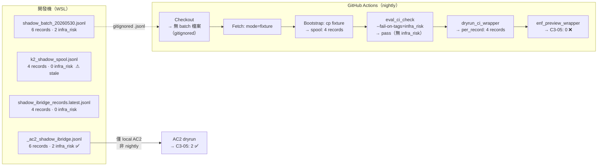

# W5-A-RUNTIME-03-SHADOW-SAMPLING-DESIGN-01 — Nightly Shadow Sampling 設計

> 票號：W5-A-RUNTIME-03-SHADOW-SAMPLING-DESIGN-01
> 日期：2026-05-31
> 狀態：✅ 設計完成（workspace-only，不修改 repo）

---

## 1. 現況定位：為何 nightly 看不到 infra_risk

### 1.1 完整資料流拆解



### 1.2 三層排除，三層過濾

| 層級 | 位置 | 機制 | 對 infra_risk 的影響 |
|------|------|------|---------------------|
| **L1 — 批次不存在** | `artifacts/eval/*.jsonl` 在 `.gitignore` 第 56 行 | CI checkout 後無 `shadow_batch_*.jsonl`，fetch 腳本紀錄 `mode=fixture` | **批次的 2 條 infra_risk 記錄從未進入 CI** |
| **L2 — Spool 固化** | `fetch_latest_shadow_batch.sh` → cp | 即使批次存在，也僅複製最新一期；若批次未定期更新（目前為單次手動寫入），spool 始終是同一批 | 無法反映近期風險變動 |
| **L3 — eval_ci_check gate** | `eval-gate-ci.yml` 行 329: `--fail-on-tags "infra_risk"` | 若 infra_risk 記錄真的到了 CI，eval_ci_check 會 `exit 1`，**CI job 中斷**，dryrun/ENF preview 永不執行 | **就算有 infra_risk 資料，C3-05 也沒機會印** |

### 1.3 現有批次內容（local-only）

| # | task_id | tags | 類型 | 備註 |
|---|---------|------|------|------|
| 1 | shadow-k2-flow-1 | `[]` | 一般 | healthy, pass |
| 2 | shadow-merge-2 | `[]` | 一般 | healthy, pass |
| 3 | shadow-greeting | `[]` | 一般 | healthy, pass |
| 4 | shadow-retry | `["high_retry"]` | 風險 | needs_review, retry=2 |
| 5 | **prod-shadow-9469a97892-k2** | **`["infra_risk"]`** | **風險** | **allow + infra_risk** |
| 6 | **prod-shadow-1bab7f91d5-k2** | **`["infra_risk"]`** | **風險** | **allow + infra_risk** |

對照現行 CI fixture（4 records）：僅 shadow-k2-flow-1 ~ shadow-retry，**無 infra_risk 記錄**。

---

## 2. 現有 Sampling 偏差分析

### 2.1 偏差事實

| 面向 | 現況值 | 健康參考值 | 偏差方向 |
|------|--------|-----------|---------|
| healthy records ratio | 3/4 (75%) | 未知（需先有 baseline） | 偏高 — fixture 無風險記錄 |
| infra_risk 覆蓋 | 0/4 (0%) | 2/6 (33%) — 完整 batch | **完全失明** |
| high_retry 覆蓋 | 1/4 (25%) | 1/6 (17%) | 正常（該 case 在 fixture 中） |
| 多樣性 | 3 種 task 類型 | 4–5 種 | 偏低 — 缺 prod-shadow |

### 2.2 現狀優缺點

| | 優點 | 缺點 |
|--|------|------|
| ✅ | Nightly 穩定：同一批 fixture 永遠通過 | ❌ | C3-05 無法被 nightly 驗證 — OBS-REPORT-01 的關鍵發現無法確認是否已修復 |
| ✅ | 低噪音：無 false positive | ❌ | **對 infra_risk 完全失明** — 即使 prod 中真實存在 infra_risk 記錄，nightly 也看不到 |
| ✅ | fixture 可預測，方便除錯 | ❌ | eval_ci_check 的 `--fail-on-tags infra_risk` 從未被真正測試（因為從未有 infra_risk 資料進入 CI） |
| ✅ | 現有 pipeline 步驟皆正常執行 | ❌ | 風險取樣不具代表性 — ENF-RULE-1 / C3-05 的 preview 結果不等於真實分布預測 |

---

## 3. 新 Sampling 策略設計

### 3.1 設計原則

| 原則 | 說明 |
|------|------|
| **P1 — 保留現有 pipeline 不變** | `ibridge_exporter`、`dryrun_ci_wrapper`、`enf_preview_wrapper`、`eval_ci_check` 的資料格式不變 |
| **P2 — 比例而非全量** | 一般樣本仍是多數；風險樣本為「附加保留」而非「取代」 |
| **P3 — 標籤驅動而非規則驅動** | 依原始 tags 判定風險，不依 ENF rule 或 verdict 結果（避免 feedback loop） |
| **P4 — stable minimum** | 每次 nightly 至少保留 K 條風險記錄（若該期 batch 不足 K，則用全部可得），讓 C3-05 有穩定的觀察窗口 |
| **P5 — fetch-fallback 順序不變** | fixture 仍是 fallback（當 batch 不存在或損毀時） |

### 3.2 核心策略：Two-Pool Sampling

```
          Batch (shadow_batch_*.jsonl)
                   │
          ┌────────┴────────┐
          ▼                 ▼
   Baseline Pool      Risk-Retained Pool
   (一般樣本)           (風險樣本保留)
   │                    │
   └────────┬───────────┘
            ▼
        SHADOW_SPOOL
     (ibridge_exporter → dryrun → enf_preview)
```

#### Baseline Pool（一般樣本）
- 來源：batch 中**不含**指定風險 tags 的記錄
- 採樣：取最近 N 條（N 由 CI env var 控制，預設 20）
- 若 N 超過可用量，使用全部可用 baseline 記錄

#### Risk-Retained Pool（風險保留）
- 來源：batch 中**含**指定風險 tags 的記錄
- 保留策略：
  - 對每個風險 tag，最多保留 R 條（R 建議 3~5，由 CI env var 控制）
  - 若該 tag 不足 R 條，使用全部可得
  - **去重**：同一 task_id 只保留最新一筆

#### 最終 Spool 組合
```
spool = baseline_pool + risk_retained_pool
```
- 無序合併（排序由下游 `ibridge_exporter` 處理）
- 不保證 risk 比例固定（動態：視該期 batch 的風險記錄數而定）
- 不覆蓋 fixture fallback 邏輯

### 3.3 參數建議

| 參數 | 預設值 | 說明 | CI env var |
|------|--------|------|-----------|
| `BASELINE_LIMIT` | 20 | 一般樣本上限 | `SHADOW_BASELINE_LIMIT` |
| `RISK_RETAIN_LIMIT` | 3 | 每種風險 tag 最多保留條數 | `SHADOW_RISK_RETAIN_LIMIT` |
| `RISK_TAGS` | `infra_risk, high_retry` | 需要保留的風險 tags | `SHADOW_RISK_TAGS` |
| 去重 key | `task_id` | 同一 task 只保留最新記錄 | 固定 |

### 3.4 為什麼這樣不會讓 nightly 失真

| 論點 | 說明 |
|------|------|
| **一般樣本仍為多數** | Baseline limit (20) 遠大於 risk retain limit (3/tag, 最多 2 tags = 6)。在 batch >= 26 筆時，一般樣本佔 77%+。 |
| **Risk 比例不取代一般樣本** | Risk-retained pool 是「附加保留」，不是「取代同數量的 baseline 記錄」。spool 總數 = baseline + risk。 |
| **不改變 eval_ci_check 行為** | eval_ci_check 的 `--fail-on-tags infra_risk` 仍然作用於「含 infra_risk 的記錄」。風險保留不影響 eval_ci_check 的 fail 條件。 |
| **feedback loop 防護** | 保留條件只依原始 tags（記錄中既有的 `infra_risk` / `high_retry`），不依 ENF-RULE-1/2 或 C3-05 的觸發結果。 |

### 3.5 為何這能讓 C3-05 / ENF-RULE-1 被觀察到

| 機制 | 影響 |
|------|------|
| **Risk-retained pool 固定保留 infra_risk 記錄** | C3-05 的 `should_emit_c3_05_warning()` 每次 nightly 都會有至少 1 條 infra_risk + allow 記錄可以評估 |
| **allow + infra_risk 記錄被保留** | 這是 C3-05 的唯一觸發條件；若該期 batch 中有此類記錄，nightly 就會印出 `[ENF-WARN] rule=C3-05-...` |
| **ENF-RULE-1 也需要 infra_risk + error_type** | Risk-retained pool 保留的 infra_risk 記錄若同時有 error_type，ENF-RULE-1 也有機會觸發 |
| **多期累積後可觀察趨勢** | 每次 nightly 都保留風險樣本，長期累積可回答「infra_risk 的發生率是否隨時間變化」 |

---

## 4. 不要做的事（硬性邊界）

| 事項 | 原因 |
|------|------|
| ❌ 不修改 `tools/enf_preview_wrapper.py` | C3-05 的 `should_emit_c3_05_warning()` 不需調整 |
| ❌ 不修改 `tools/dryrun/core.py` | dryrun 的 `_synthetic_gate_from_metrics`、`compute_ideal_verdict`、`build_comparison_rows` 不動 |
| ❌ 不修改 `observability/eval_gate.py` | eval_gate 的 tag 規則不動 |
| ❌ 不修改 `observability/eval_ci_check.py` | eval_ci_check 的 `--fail-on-tags` 行為不動（本設計只改變 spool 的資料組成） |
| ❌ 不修改 `observability/ibridge_exporter.py` | ibridge_exporter 的 normalize/export 邏輯不動 |
| ❌ 不修改 CI gate 條件 | **不**改變 `--fail-on-tags infra_risk` 的 CI 失敗行為。此處僅做 sampling，不改變 gate policy。|
| ❌ 不讓 spool 只剩風險樣本 | Baseline pool + risk-retained pool 確保一般樣本仍為多數（除非 batch 中一般樣本極少） |
| ❌ 不引入新的治理規則 | sampling 策略不建立新的 `would_block` / `would_warn` 規則 |
| ❌ 不改變 downstream artefact schema | `per_record.jsonl`、`[DRYRUN-LOG]`、`[GOV-ENF-PREVIEW]` 的格式不因 sampling 而變 |

---

## 5. 實作範圍（Handoff to Cursor）

### 5.1 允許修改的檔案

| 優先級 | 路徑 | 修改內容 |
|--------|------|---------|
| **HIGH** | `scripts/fetch_latest_shadow_batch.sh` | 在 cp 後追加 sampling 步驟：從 batch 中選取 baseline pool + risk-retained pool → 寫入 spool |
| **HIGH** | `scripts/build_shadow_spool.sh`（**新增**） | 抽離 sampling 邏輯為獨立腳本，fetch 腳本呼叫此腳本 |
| **MEDIUM** | `.github/workflows/eval-gate-ci.yml` | 新增 `SHADOW_BASELINE_LIMIT` / `SHADOW_RISK_RETAIN_LIMIT` / `SHADOW_RISK_TAGS` env vars |
| **LOW** | `observability/shadow-pipeline/README.md` | 更新文件說明 sampling 策略 |

### 5.2 禁止修改的範圍

- `tools/enf_preview_wrapper.py`
- `tools/dryrun/core.py` / `tools/dryrun/output.py`
- `observability/eval_gate.py`
- `observability/eval_ci_check.py`
- `observability/ibridge_exporter.py`
- `observability/eval_exporter.py`
- `observability/eval_stats.py`
- `tests/` 下任何檔案（CI pipeline 測試之外）

### 5.3 不在此設計範圍內處理的事項

| 事項 | 原因 | 後續票 |
|------|------|--------|
| `shadow_batch_*.jsonl` 的自動匯出 | 既有 CI-DATA-PIPELINE-DESIGN-01 的 v0+v1 scope | CI-DATA-PIPELINE-IMPL-02 |
| eval_ci_check 的 `--fail-on-tags` 區分策略 | 本設計不改變 gate policy | RUNTIME-04 系列 |
| C3-05 的條件微調 | OBS-REPORT-01 已建議「需更多資料」 | C3-05-OBS-REPORT-02 |
| multi-batch 跨日累積 | 超出 nightly sampling 範圍 | RUNTIME-04 / MINING 系列 |

---

## 6. 驗收條件

| # | 條件 | 驗證方式 |
|---|------|---------|
| 1 | Nightly spool 不再系統性漏掉 `infra_risk` / `high_retry` 樣本 | 執行 `build_shadow_spool.sh` 後檢查 spool 內容含至少 1 條 infra_risk 記錄 |
| 2 | 一般樣本仍為多數（記錄總數 > 風險保留數 × 2） | `jq` 統計 spool JSONL 的 tags 分布 |
| 3 | 沒有改變 downstream artefact schema | dryrun 及 enf_preview 仍正常執行（不因 sampling 報错） |
| 4 | `eval-shadow-nightly` 仍可正常跑完 | CI workflow 模擬執行，exit 0 |
| 5 | Risk-heavy 樣本若存在，至少有最小數量被保留 | 手動準備含 5 條 infra_risk 的 batch，驗證 spool 含 3 條（上限） |
| 6 | 同一 task_id 去重 | 準備重複 task_id 的 batch，spool 只保留最新一筆 |
| 7 | Batch 不存在或為空時 fallback 到 fixture | 腳本驗證：無 batch → spool 內容 = fixture |
| 8 | 新增腳本印出 `[SHADOW-PIPELINE]` 結構化行 | 符合現有 pipeline log 格式 |

---

## 附錄 A — 腳本行為示意（Python-like Pseudocode）

```python
def build_spool(shadow_spool, batch_path, baseline_limit=20, risk_retain_limit=3, risk_tags=frozenset({"infra_risk", "high_retry"})):
    all_records = load_jsonl(batch_path)
    
    # Step 1: classify
    risk_records = {tag: [] for tag in risk_tags}
    baseline = []
    for rec in all_records:
        rec_tags = set(rec.get("tags") or [])
        matched = rec_tags & risk_tags
        if matched:
            for tag in matched:
                risk_records[tag].append(rec)
        else:
            baseline.append(rec)
    
    # Step 2: dedup by task_id (keep newest)
    def dedup(records):
        seen = {}
        for rec in records:
            tid = rec.get("task_id")
            if tid is None:
                continue
            seen[tid] = rec  # last wins (later in iteration = newer)
        return list(seen.values())
    
    # Step 3: sample baseline (tail = newest)
    baseline = baseline[-baseline_limit:] if len(baseline) > baseline_limit else baseline
    
    # Step 4: retain risk records (capped per tag)
    retained = []
    for tag in sorted(risk_tags):
        pool = dedup(risk_records[tag])
        retained.extend(pool[:risk_retain_limit])
    
    # Step 5: merge & write
    spool = baseline + retained
    write_jsonl(shadow_spool, spool)
    
    # Emit structured log
    print(f"[SHADOW-PIPELINE] sampling: baseline={len(baseline)} risk_retained={len(retained)} tags={ {t: len(risk_records[t]) for t in risk_tags} }")
```

---

## 附錄 B — 與現有文件對齊

| 現有文件 | 對應 |
|---------|------|
| CI-DATA-PIPELINE-DESIGN-01 §3.2 — 資料流拓樸 | 本設計在 fetch step 之後追加 sampling step；不改變拓樸主結構 |
| CI-DATA-PIPELINE-DESIGN-01 §4.5 — 治理鏈 | 治理鏈（dryrun + enf_preview）不變，只改變 spool 內容 |
| C3-05-OBS-REPORT-01 §5.2 — 建議下一步 | 🔴「先確保 nightly 能觸發 C3-05」— 本設計直接回應此項 |
| RUNTIME-03-LIMITED-DENY-ADDENDUM | blocking canary 依賴 nightly 真實樣本；本設計確保 risk 樣本進入 nightly |
