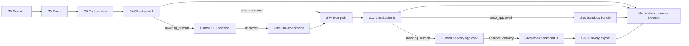

# W6 Standard-Case Pipeline v2 — Technical Closure Report

> **Audience**: Engineering lead, future maintainers  
> **Scope**: W6 checkpoint / HITL / resume / notify batch (W6-T5, W6-T6, W6-T10 wiring + notification gateway, W6-T11)  
> **Status snapshot**: 2026-06-16 · sourced from ticket state files, tests, and implementation  
> **Not in scope**: New requirements; this document consolidates delivered behavior only.

---

## Overview

Wave 6 extended the **agent standard-case experiment line** (`scripts/run_agent_standard_case_experiment.py`) from a preview/run orchestrator into a **HITL-aware pipeline** with durable checkpoint files, human decision handoff, resume-after-approval, and optional downstream notification events.

The pipeline now follows this high-level flow:



**What W6 delivered across tickets:**

| Layer | Ticket | Role |
|-------|--------|------|
| Checkpoint A integration | **W6-T5** | Intake confirmation: decision → payload → outbox write or auto-approve skip |
| Checkpoint B integration | **W6-T6** | Delivery gate: output_guard → checkpoint B → delivery_plan |
| Orchestrator wiring | **W6-T10 orchestrator-checkpoint-wiring** | S4/S12 delegate to W6-T5/W6-T6; remove inline checkpoint logic |
| Notification gateway | **W6-T10 client-notification-gateway** | Best-effort workflow events (local file + jsonl audit) |
| Resume loop | **W6-T11** | `--resume-checkpoint` for approved A→S7 and B→S13 paths |

**Design principles retained:**

- **Fail-close** for resume and eligibility validation; **best-effort** for notifications.
- **Outbox-only writes** for checkpoint state (no `cases/index.json` mutation).
- **Preview vs run** separation: preview computes `would_pause` / `would_trigger`; run writes files and can emit notifications.
- **SSOT in integration layers** (`hitl/checkpoint_a_integration_v1.py`, `hitl/checkpoint_b_integration_v1.py`) after W6-T10 cleanup; orchestrator maps results rather than duplicating checkpoint logic.

---

## What Changed

### W6-T5 · Checkpoint A (Intake Confirmation)

| Aspect | Before | After |
|--------|--------|-------|
| Checkpoint A logic | Inline in orchestrator (W6-T4) | `hitl/checkpoint_a_integration_v1.py`: `build_checkpoint_a_payload`, `maybe_create_checkpoint_a`, `resume_plan_from_checkpoint_a` |
| `needs_review` + no auto-approve | Ad hoc behavior | Writes checkpoint to `outbox/<case_ref>/`, `status=awaiting_human`; run stops before S7 |
| `auto_accept` / `needs_review` + `--auto-approve-intake` | Orchestrator bypass (dual enforcement) | Integration layer returns `status=auto_approved`, **no checkpoint file**, with `resume_plan` (`resume_from=selector`, `planned_tools`) |
| Human decisions | W5-T2B schema only | `approve` / `revise_plan` / `reject` → correct `resume_plan` via integration API |
| `checkpoint_path` when outbox outside repo | `ValueError` from `relative_to(repo_root)` | Three-tier fallback: repo-relative → outbox-relative → absolute |
| Tests | — | `tests/test_checkpoint_a_integration_v1.py` — **9 tests** |

### W6-T6 · Checkpoint B (Delivery Gate)

| Aspect | Before | After |
|--------|--------|-------|
| Checkpoint B logic | Dynamic load / inline in orchestrator | `hitl/checkpoint_b_integration_v1.py`: `build_checkpoint_b_payload`, `maybe_create_checkpoint_b`, `delivery_plan_from_checkpoint_b` |
| Trigger rules | Mock-aligned in orchestrator | `warning`/`blocked` → create checkpoint B; `ok` + `--auto-approve-delivery` → skip; `error` → terminate, no checkpoint |
| Delivery plan | Not standardized on experiment line | `approve_delivery` / `request_changes` / `hold`; `notify_client` always `false` (NonScope) |
| `checkpoint_path` external outbox | Same `ValueError` risk as A | Same three-tier fallback as W6-T5 |
| Tests | — | `tests/test_checkpoint_b_integration_v1.py` — **11 tests** |

### W6-T10 · Orchestrator Checkpoint Wiring

| Aspect | Before | After |
|--------|--------|-------|
| S4 / S12 implementation | Inline payload builders, dynamic checkpoint B load | Static import of W6-T5/W6-T6 public APIs |
| `--auto-approve-intake` | Orchestrator-level bypass with `bypass_reason` | Flag delegated to `maybe_create_checkpoint_a(..., auto_approve=...)`; SSOT in integration layer |
| `--outbox-root` outside repo | Redirect to repo-internal `.temp_test_outbox_area/outbox/` | Direct pass-through; integration layer handles path semantics |
| Observability | Minimal | `checkpoint_*_status.integration_layer` marks `hitl.checkpoint_*_integration_v1` |
| Preview mode | Mixed write behavior | `would_pause` / `would_trigger`; no outbox writes by default |

### W6-T10 · Client Notification Gateway (S15)

| Aspect | Before | After |
|--------|--------|-------|
| Downstream awareness | Manual inspection of orchestrator JSON / outbox | Optional structured events via `delivery/notification_gateway_v1.py` |
| Event model | None on experiment line | 5 types: `checkpoint.awaiting_human`, `checkpoint.approved`, `delivery.bundle_ready`, `run.completed`, `run.blocked` |
| Default behavior | N/A | **Off** unless `--enable-notifications` or `GOV_NOTIFICATION_GATEWAY_ENABLED=1` |
| Sink | N/A | Per-event JSON under `outbox/notifications/<case_ref>/` + append-only `outbox/notification_events.jsonl` |
| Failure handling | N/A | Best-effort: `emit_notification_safe()` never raises; orchestrator `ok` unchanged on sink failure |
| P3 additions | — | `event_id` tracking in orchestrator result; jsonl file-lock best effort; human `checkpoint.approved` from delivery approval CLI; webhook adapter skeleton (dry-run only, not wired to orchestrator) |

### W6-T11 · Checkpoint Resume Loop

| Aspect | Before | After |
|--------|--------|-------|
| Post-HITL continuation | Manual re-run from S3 or ad hoc commands | `--resume-checkpoint <path>` on same orchestrator CLI |
| Checkpoint A after `approve` | No first-class resume | Skips S3–S6; enters **S7** run path with `resume_context.planned_tools` |
| Checkpoint B after `approve_delivery` | No delivery resume | Skips S3–S12; enters **S13** export/delivery with artifact validation |
| Invalid resume attempts | Undefined / inconsistent | Fail-close via `validate_resume_eligibility()` with explicit `message` and `final_status` |
| Duplicate B delivery | Possible double export | Outbox marker blocks second resume (`duplicate_delivery`) |
| Preview + resume | — | Blocked: resume requires `--mode run` |

---

## Reliability and Safety

### Resume loop fail-close (W6-T11)

Resume is **v1 approved-only**. The orchestrator loads the checkpoint JSON, runs `validate_resume_eligibility()`, then branches to S7 (A) or S13 (B). Any validation failure returns `ok=false` without mutating pending checkpoints or re-running skipped steps.

**Blocked / fail-close conditions** (from implementation and P3 test matrix):

| Condition | `final_status` (typical) | Behavior |
|-----------|--------------------------|----------|
| `--mode preview` + `--resume-checkpoint` | `blocked` | Resume requires run mode |
| `status=awaiting_human` | `blocked` | Must run `run_hitl_checkpoint_cli --apply-decision` first |
| `status=rejected` | `blocked` | v1 does not resume rejected checkpoints |
| `status=revise_needed` / `on_hold` | `blocked` | v1 does not support revise/hold resume |
| Human action ≠ `approve` (A) or `approve_delivery` (B) | `blocked` | Wrong action for resume branch |
| `case_ref` or `task_type` mismatch vs CLI | `checkpoint_mismatch` | Hard cross-check against `--case-dir` / `--task-type` |
| Missing / invalid `resume_context` | `blocked` | Checkpoint not finalized via `record_human_decision` |
| Unsupported `schema_version` | `blocked` | Must be `hitl_checkpoint_v1` |
| Missing required checkpoint keys | `blocked` | Required-field gate |
| Checkpoint B: delivery artifacts missing | `blocked` | Stale artifact guard (eligibility + cleaned fallback) |
| Checkpoint B: second resume of same approved checkpoint | `duplicate_delivery` | Outbox marker idempotency |
| Pending checkpoint with expired `expires_at` | `stale_checkpoint` | Only checked when `status=awaiting_human` |
| Checkpoint file not found / invalid path | `blocked` | Load error surfaced in `resume` sub-object |

**Intentional v1 gaps** (not bugs; documented in ticket review):

- **Approved checkpoints** do not re-check `expires_at`; stale detection for approved B relies on artifact existence.
- **`revise_plan` / `request_changes` / `hold`** are not resume entry points.
- **Duplicate guard** uses an outbox marker file, not an event log; deleting the marker allows re-delivery.
- **Profile drift**: CP-A resume uses current `get_run_path_profile()` while trusting checkpoint `planned_tools` (P1 design: v1 trusts approved checkpoint).

### Notification gateway best-effort (W6-T10)

| Property | Behavior |
|----------|----------|
| Default | Disabled; zero side effects |
| Enablement | `--enable-notifications` or `GOV_NOTIFICATION_GATEWAY_ENABLED=1` |
| Mode gate | Emits only in **`mode=run`** when enabled |
| Primary sink | Per-event file write determines `send_notification().ok` |
| Secondary sink | `notification_events.jsonl` append; failure is informational only |
| Exceptions | `emit_notification_safe()` catches all; returns error dict, never raises |
| Main flow | Orchestrator `ok` / `final_status` **not** downgraded on notification failure |
| Preview | No events (aligned with checkpoint non-write semantics) |
| Human approval | `delivery_approval_cli_v1` emits `checkpoint.approved` with `approval_source=human` on confirmed approve (best-effort) |

**Known limitations:**

- **No real webhook/queue/Telegram/email** in v1; `notification_webhook_adapter_v1.py` is skeleton (`dry_run=True` default), not connected to orchestrator.
- **No retry, DLQ, HMAC, or multi-tenant routing**.
- **Duplicate events** on re-run/resume: different `idempotency_key` timestamps; downstream must dedupe (P3 noted, not enforced in gateway).
- **Jsonl concurrent append**: best-effort file lock (portalocker / msvcrt / fcntl); falls back to unlocked append when unavailable — not a strict distributed guarantee.
- **`delivery.bundle_ready`** on experiment line is sandbox bundle only; production `build_case_delivery_bundle` path not wired.
- **Event types omitted in v1**: `checkpoint.rejected`, `checkpoint.changes_requested`, `run.failed` (mapped to `run.blocked` where applicable).

---

## Testing

### Test inventory (verified counts)

| Suite | Count | Type | Primary coverage |
|-------|-------|------|----------------|
| `tests/test_checkpoint_a_integration_v1.py` | **9** | Unit / integration | Payload, awaiting_human write, auto-approve skip, human actions, evil path, external outbox |
| `tests/test_checkpoint_b_integration_v1.py` | **11** | Unit / integration | Trigger rules, delivery plans, evil outbox, external outbox |
| `tests/test_notification_gateway_v1.py` | **23** | Unit + orchestrator hook | Schema, disabled/dry-run, local sink, safe emit, concurrent jsonl, human approve, webhook skeleton |
| `tests/test_agent_standard_case_experiment.py` | **43** | Orchestration | Full experiment line: preview/run, W6-T10 wiring, sandbox e2e, registry fail-close, **resume matrix** |

**Cross-suite verification** (from ticket states):

```bash
python -m unittest tests.test_checkpoint_a_integration_v1 -v          # 9/9
python -m unittest tests.test_checkpoint_b_integration_v1 -v        # 11/11
python -m unittest tests.test_notification_gateway_v1 -v              # 23/23
python -m unittest tests.test_agent_standard_case_experiment -v       # 43/43
```

### Key scenarios covered

**Checkpoint / wiring (W6-T5, T6, T10 wiring)**

- `needs_review` → checkpoint A file written; run stops at `waiting_for_human`
- `--auto-approve-intake` → no checkpoint A file; `resume_plan` via integration layer
- Output guard `warning` → checkpoint B via W6-T6; `ok` + auto-approve delivery skips B
- Preview mode → no outbox writes; `would_pause` / `would_trigger`
- Custom `outbox_root` outside repo → checkpoint writes succeed (orchestrator + integration)
- Registry fail-close at S6 → no checkpoint A/B files

**Notification gateway (W6-T10)**

- Disabled / dry-run → no files, `ok=true` skipped
- Enabled run → per-event files + jsonl audit
- Preview mode → no notifications
- Write failure / exception → error dict, no raise
- Human delivery approval → `checkpoint.approved` with `approval_source=human`
- Concurrent jsonl appends → valid line-oriented JSONL (best-effort lock)

**Resume loop (W6-T11 — 10 dedicated tests)**

| Test | Scenario |
|------|----------|
| `test_approved_checkpoint_a_resume_runs_s7_path` | Happy path A → S7+ |
| `test_approved_checkpoint_b_resume_runs_s13_delivery` | Happy path B → S13 |
| `test_resume_checkpoint_case_ref_mismatch_blocked` | `checkpoint_mismatch` |
| `test_resume_checkpoint_awaiting_human_blocked` | Pending human decision |
| `test_resume_checkpoint_preview_mode_blocked` | Preview + resume rejected |
| `test_resume_checkpoint_duplicate_delivery_blocked` | Second B resume blocked |
| `test_resume_checkpoint_b_stale_artifacts_blocked` | Missing/tampered artifacts |
| `test_resume_checkpoint_task_type_mismatch_blocked` | Task type cross-check |
| `test_resume_checkpoint_rejected_status_blocked` | Rejected checkpoint |
| `test_resume_checkpoint_wrong_human_action_blocked` | Non-approve action on B |

---

## Known Limitations and Future Work

Documented in ticket states and reviews; **not** new scope for this closure.

| Area | Limitation | Suggested follow-up |
|------|------------|---------------------|
| **Webhook / external notify** | Skeleton only; no HTTP dispatch | Implement real adapter, retry/DLQ, wire behind feature flag |
| **Delivery approval event flow** | Human `checkpoint.approved` from CLI exists; full event chain to downstream handlers incomplete | Complete delivery approval → notify → bundle handoff (W7-T3 integration) |
| **Production bundle events** | `delivery.bundle_ready` only for sandbox bundle | Emit on production `build_case_delivery_bundle` success |
| **Resume convenience** | Explicit `--resume-checkpoint` only | Optional `--resume-latest-approved` (P3 deferred) |
| **Resume breadth** | No resume for `revise_plan`, `request_changes`, `hold` | Separate tickets if product requires |
| **Stale approved checkpoints** | No `resolved_at` / mtime guard on approved A | Optional artifact freshness checks |
| **Duplicate notifications** | Re-run/resume may emit new events | Downstream idempotency on `idempotency_key`; gateway-side dedupe |
| **Jsonl strict concurrency** | Best-effort lock; fallback unlocked | Stronger locking or external queue for multi-process writers |
| **Docs (AC-6)** | `docs/agent-run-standard-case-orchestrator-v1.md` §9 resume section still marked planned in W6-T11 | Scribe / follow-up ticket to finalize §9 and integration doc cross-refs |
| **Sandbox e2e vs full CP-B** | Some sandbox paths use `can_proceed_sandbox_bundle` gate | W12-T2: full `maybe_create_checkpoint_b` write path in sandbox e2e |
| **Path semantics documentation** | `checkpoint_path` may be repo-relative, outbox-relative, or absolute | Document consumer parsing rules in checkpoint integration docs |

---

## Reference Index

| Artifact | Path |
|----------|------|
| Checkpoint A integration | `hitl/checkpoint_a_integration_v1.py` |
| Checkpoint B integration | `hitl/checkpoint_b_integration_v1.py` |
| Experiment orchestrator | `scripts/run_agent_standard_case_experiment.py` |
| Notification gateway | `delivery/notification_gateway_v1.py` |
| Webhook skeleton | `delivery/notification_webhook_adapter_v1.py` |
| Ticket states | `04_Workflows/tickets/W6-T5-*`, `W6-T6-*`, `W6-T10-*`, `W6-T11-*` |

---

## Closure Summary

W6 v2 makes the **standard-case experiment line** operable as a **checkpoint-driven HITL pipeline**: intake and delivery gates write durable outbox state, humans decide via existing CLI, operators resume with `--resume-checkpoint`, and optional notification events give downstream systems a thin workflow bus without coupling to orchestrator internals. Reliability is asymmetric by design — **resume fails closed**, **notifications fail open** — with **66+ targeted tests** across integration, gateway, and orchestration suites (43 orchestrator + 23 gateway, plus 20 checkpoint integration tests at the layer below wiring).

*Report authored from ticket B_REPORT / REVIEW / P3 sections and current test modules. No runtime code changed in this document.*
