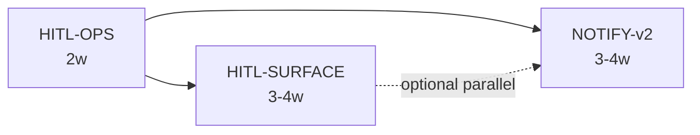

# W7 Standard-Case v2 — Technical Roadmap (Draft)

> **Audience**: PM / EM / Engineering leads — scope & sizing input only.  
> **Author role**: Tech Lead / Author  
> **Version**: v0.1-draft · 2026-06-16  
> **Sources**: `04_Workflows/briefs/W7-hitl-delivery-v2_input-for-pm.md`, `04_Workflows/reports/W6-standard-case-v2-closure-report.md`, `04_Workflows/testing/standard-case-hitl-resume-notify-matrix.md`, W6-T5/T6/T10/T11 ticket states  
> **Framing rule**: This document lists technical options and packages; **product choices remain with PM** (see brief §三).

---

## Context — What W6 Delivered (Technical Recap)

Wave 6 turned the agent standard-case experiment orchestrator (`scripts/run_agent_standard_case_experiment.py`) into a **checkpoint-driven HITL pipeline** with durable outbox state. **W6-T5** and **W6-T6** extracted Checkpoint A (intake) and Checkpoint B (delivery gate) into integration layers (`hitl/checkpoint_a_integration_v1.py`, `hitl/checkpoint_b_integration_v1.py`) with SSOT payloads, human decision plans, and outbox-only writes. **W6-T10** wired the orchestrator to those layers and added an optional **notification gateway** (`delivery/notification_gateway_v1.py`) that emits five workflow event types to local file + JSONL audit sinks — **best-effort, fail-open**, disabled by default. **W6-T11** added **`--resume-checkpoint`** with fail-close eligibility validation so approved A resumes at S7 and approved B resumes at S13, including duplicate-delivery and artifact-stale guards. The line is covered by **66+ targeted tests** (20 checkpoint integration + 23 gateway + 43 orchestrator/resume); reliability is **asymmetric by design**: resume fails closed, notifications fail open.

---

## Axes — Possible W7 Evolution Dimensions

These axes are **independent sizing levers**. PM decisions on brief Q1–Q3 map directly to which packages activate and how large each becomes.

| Axis | W6 baseline | W7 technical questions (no product pick) |
|------|-------------|------------------------------------------|
| **HITL operator surface** | CLI-only: `run_hitl_checkpoint_cli` + orchestrator `--resume-checkpoint` | Option A: CLI ergonomics only · Option B: local web console · Option C: multi-user dashboard (auth, RBAC) |
| **Queue & concurrency** | Single active checkpoint per case; manual one-by-one resume | Option A: keep single-case serial · Option B: multi-case pending index + batch approve · Option C: background resume worker (queue/scheduler) |
| **Notify reliability** | Local file stub; no retry/DLQ/webhook dispatch | Option A: stay best-effort · Option B: at-least-once + retry + DLQ · Option C: idempotent exactly-once + SLA instrumentation |
| **Delivery UX & preview** | CP-B blocks at gate; no bundle preview before human sign-off | Read-only artifact/manifest viewer; optional inline summary from W7-T3 `controlled_notify_experiment_v1` |
| **Observability & audit** | Raw outbox + JSONL; no unified pending view | Pending checkpoint index; audit search/export; optional metrics on HITL wait time and notify sink health |
| **Resume breadth** | Approved-only (`approve` / `approve_delivery`); revise/hold fail-close | Optional v2 paths for `revise_plan` / `request_changes` / `hold` (separate design spike; high coupling to product workflow) |

**Cross-cutting constraints carried from W6:**

- Outbox-only checkpoint writes (no `cases/index.json` mutation).
- Preview mode: no writes, no notifications.
- Integration layers remain SSOT for checkpoint payload/decision semantics.
- Experiment line only — not production main-chain delivery unless explicitly scoped.

---

## Proposal — Three Independently Deliverable Technical Packages

Each package is sized for roughly **2–4 engineering weeks** (one senior + partial support), assuming PM has answered the linked brief questions. Packages can ship **in sequence or partially in parallel**; dependencies are noted per package.

---

### Package 1 · **HITL-OPS** — Operator Ergonomics & Pending Visibility

**Suggested sizing**: ~2 weeks (low–medium complexity)

#### Goal

Reduce operator toil on the **existing CLI path** without committing to a web UI or external infrastructure. Make “what is waiting?” and “how do I resume?” answerable from structured commands instead of manual `outbox/` inspection.

#### Engineering content (in scope)

| Work item | Description |
|-----------|-------------|
| Pending index CLI | New command(s) on `run_hitl_checkpoint_cli` or thin companion script: scan `outbox/<case_ref>/` for `status=awaiting_human`, surface CP-A vs CP-B, `case_ref`, `task_type`, `expires_at`, checkpoint path |
| Resume convenience | `--resume-latest-approved` (or equivalent) on orchestrator: resolve newest approved checkpoint for given `--case-dir` / `--task-type` with same fail-close cross-checks as explicit path |
| Approve→resume wrapper | Optional single command that chains `--apply-decision` + `--resume-checkpoint` for approved-only happy path (subprocess or shared library call — no new state machine) |
| Docs & test gaps | Close W6-T11 AC-6: finalize `docs/agent-run-standard-case-orchestrator-v1.md` §9 resume; document `checkpoint_path` three-tier semantics; add orchestrator tests for matrix gaps G-1, G-4, G-7 (stale awaiting, missing file, resume+notify enabled) |
| Read-only audit helper | CLI filter over `outbox/notification_events.jsonl` + checkpoint event logs (grep replacement, structured JSON output) |

#### Out of scope for this package

- Web UI, HTTP server, authentication.
- Batch approve across cases.
- Webhook/retry/DLQ.
- Resume for `revise_plan` / `request_changes` / `hold`.

#### Risks

| Risk | Severity | Mitigation |
|------|----------|------------|
| `--resume-latest-approved` ambiguity when multiple approved checkpoints exist | Medium | Fail-close with explicit message listing candidates; require disambiguation flag |
| Outbox scan performance on large directories | Low | Limit scan to known checkpoint filename patterns; optional `--outbox-root` |
| Path semantics confusion (repo-relative vs absolute) | Medium | Reuse W6-T5/T6 three-tier fallback; document in operator runbook |

#### Dependencies on other teams

| Team / role | Need |
|-------------|------|
| **PM** | Confirm Package 1 is sufficient if brief Q1 = Option A (CLI-only) |
| **Scribe / Docs** | Review operator runbook cross-refs |
| **None (Infra)** | No external services |

---

### Package 2 · **HITL-SURFACE** — Human Approval Surface Layer

**Suggested sizing**: ~3–4 weeks (medium complexity; **high variance** on PM Q1)

#### Goal

Provide a **structured approval surface** beyond raw CLI, reusing W6 checkpoint JSON and existing CLI/HITL APIs as backend. This package **implements one surface path** once PM selects from brief Q1; engineering pre-work can keep options swappable behind a thin adapter.

#### Engineering content (in scope)

**Shared backend (all UI options):**

| Work item | Description |
|-----------|-------------|
| Read model API | File-backed (or in-process) read service over outbox checkpoints: list pending, fetch payload context (intake summary, output_guard snapshot, artifact paths) |
| Action adapter | Thin layer invoking existing `run_hitl_checkpoint_cli --apply-decision` and orchestrator `--resume-checkpoint` (subprocess or Python import); no duplicate decision logic |
| Bundle preview | Read-only renderer for sandbox manifest / delivery artifact listing (paths + checksums/size); no mutation |
| Audit panel | Read-only view of checkpoint + notification JSONL for a `case_ref` |

**Surface options (PM chooses one; engineering lists all — **no recommendation here**):**

| Option | Technical shape | Increment |
|--------|-----------------|------------|
| **A — CLI+ (extends Package 1)** | Rich terminal UI (e.g. interactive picker) on top of HITL-OPS | +0–1 week if Package 1 done |
| **B — Local Web Console** | Extend existing Local UI module or minimal local-only HTTP page; single-operator, no auth | +2–3 weeks frontend + adapter |
| **C — Multi-user Dashboard** | Standalone web app; session auth, role gates, audit attribution | +4+ weeks; likely separate wave |

**Optional (if PM Q2 ≥ Option B):**

| Work item | Description |
|-----------|-------------|
| Multi-case queue view | Pending list across all cases under an outbox root |
| Batch approve | Sequential apply-decision for selected checkpoints (still **no** parallel resume worker unless Package 3 queue scope added) |

#### Out of scope for this package

- Multi-tenant org isolation (see Non-goals).
- AI-assisted approval suggestions.
- Mobile-optimized UI.
- Replacing integration-layer decision semantics.

#### Risks

| Risk | Severity | Mitigation |
|------|----------|------------|
| Scope explosion if Option C selected while sized for Option B | **High** | Gate Option C behind separate estimate; implement adapter interface first |
| Subprocess race if two operators approve same checkpoint | Medium | Document single-operator assumption; optional optimistic lock on checkpoint mtime/status |
| Local UI coupling / merge conflicts | Medium | Adapter boundary; avoid duplicating W6 integration logic in UI layer |
| Security of local HTTP binding | Medium | Bind localhost only; no default exposure; document in runbook |

#### Dependencies on other teams

| Team / role | Need |
|-------------|------|
| **PM** | **Q1 UI form** (A/B/C); **Q2 queue/batch** (A/B/C) |
| **Design / Frontend** | Wireframes for Option B/C; component reuse decision for Local UI extension |
| **Security review** | Only if Option C or non-localhost binding |
| **Package 1 (HITL-OPS)** | Soft dependency — pending index CLI can seed read model |

---

### Package 3 · **NOTIFY-v2** — Event Reliability & Downstream Dispatch

**Suggested sizing**: ~3–4 weeks (medium–high complexity; **highest infra coupling**)

#### Goal

Evolve the W6 notification gateway from **local best-effort stub** toward **operator-configurable dispatch** with explicit reliability tiers (per brief Q3), while preserving **fail-open on main orchestrator flow**.

#### Engineering content (in scope)

| Work item | Description |
|-----------|-------------|
| Webhook adapter (live) | Wire `delivery/notification_webhook_adapter_v1.py` behind feature flag; real HTTP dispatch with timeout; dry-run default preserved |
| Reliability tier A (brief Q3-A) | Harden local sink: fsync option, disk-full detection surfaced in emit result; no retry |
| Reliability tier B (brief Q3-B) | At-least-once: persistent outbox queue (implementation options: **local spool directory** vs **Redis** vs **SQS** — PM/Infra pick); exponential backoff retry (max N); DLQ file or dead-letter topic; manual replay CLI |
| Reliability tier C (brief Q3-C) | Gateway-side dedupe on `idempotency_key`; emit audit record per attempt; metrics hooks for SLA dashboards (latency, success rate) — **no SLA promise in code until PM/legal sign-off** |
| Event completeness | Optional emit: `checkpoint.rejected`, `checkpoint.changes_requested` (today omitted in v1); align with matrix G-8 |
| W7-T3 bridge | Subscribe pattern: on `delivery.bundle_ready`, trigger `controlled_notify_experiment_v1` summary generation (content layer stays separate from envelope) |
| Production bundle hook | Emit `delivery.bundle_ready` when production `build_case_delivery_bundle` succeeds (feature-flagged; experiment line unchanged by default) |
| Resume-path notify tests | Close matrix G-7: assert notification behavior on `--resume-checkpoint` success/failure |

#### Out of scope for this package

- Generic multi-tenant notification platform or customer self-service callback registration.
- Email / Slack / Telegram channels (unless spun as separate adapter tickets).
- Downgrading orchestrator `ok` on notify failure (W6 invariant retained).
- Exactly-once delivery guarantee to external webhooks without PM/legal SLA approval.

#### Risks

| Risk | Severity | Mitigation |
|------|----------|------------|
| **Reliability tier B/C requires external queue** | **High** | Start with local spool + file-based DLQ for sandbox; Redis/SQS as opt-in adapter |
| Duplicate events on re-run/resume (known W6 gap) | High | Dedupe table or idempotency window in gateway; document consumer contract |
| JSONL concurrent append under multi-process | Medium | Stronger lock or move audit to queue consumer single-writer |
| Scope creep into “notification platform” | Medium | Fixed adapter list; internal downstream URLs only (per brief Non-goals) |
| Webhook secret handling | Medium | Env-based URL/HMAC keys via existing smoke-test patterns; no secrets in repo |

#### Dependencies on other teams

| Team / role | Need |
|-------------|------|
| **PM** | **Q3 SLA tier** (A/B/C); priority of channels (webhook first vs email) |
| **Infra** | Redis/SQS/network egress if tier B/C and not local spool |
| **Downstream consumers** | Idempotency contract on `event_id` / `idempotency_key` |
| **W7-T3 owner** | Handoff contract for bundle_ready → controlled notify |

---

## Suggested Sequencing (Technical, Not Product)

| Sequence | When it fits |
|----------|--------------|
| **P1 → P2 → P3** | PM prioritizes operator pain first; notify reliability can wait |
| **P1 → P3 ∥ P2** | Downstream integration blocked on webhooks; UI decision still pending |
| **P1 only** | Brief Q1=A, Q2=A, Q3=A — W7 stays CLI + best-effort notify |

**Total W7 envelope (all three packages)**: roughly **8–10 engineering weeks** sequential; **6–8 weeks** with P2/P3 parallel after P1.

---

## Non-goals / Out-of-scope (Technical Detail)

Aligned with `04_Workflows/briefs/W7-hitl-delivery-v2_input-for-pm.md` §四; expanded for engineering scoping.

| Non-goal | Technical meaning |
|----------|-------------------|
| **Multi-tenant / org isolation** | No tenant_id in checkpoint schema; no row-level security; no per-customer outbox partition; single shared outbox root per deployment |
| **Generic notification platform** | No arbitrary webhook registration UI; no templating engine; no channel routing rules engine; fixed internal adapter set only |
| **Customer-configurable callbacks** | No API for clients to register URLs; webhook targets from env/config only |
| **Mobile / push** | No PWA, push tokens, or mobile layouts |
| **Real-time multi-operator collaboration** | No distributed lock on checkpoint decisions; no OT/CRDT; race = last writer on JSON file |
| **AI-assisted approval** | No ML scoring service; no auto-approve model beyond existing `--auto-approve-*` flags |
| **Production delivery main chain** | No default change to `build_case_delivery_bundle` production path unless Package 3 prod hook explicitly approved |
| **Durable workflow engine** | No Celery/RQ/Temporal replacement of orchestrator; background worker (brief Q2-C) is a **separate wave** if chosen |
| **Resume for revise/hold/changes_requested** | W6 v1 fail-close retained unless new product tickets redefine S3–S6 re-entry |
| **Authentication platform** | No OAuth/SSO/IAM build unless brief Q1-C triggers separate security wave |
| **Exactly-once external SLA** | No 99.9% delivery commitment in W7 code or docs without tier-C governance approval |

---

## Open Technical Decisions (For PM / EM Workshop)

| ID | Brief ref | Engineering impact if unresolved |
|----|-----------|-----------------------------------|
| TD-1 | Q1 UI form | Package 2 estimate swings 0–4+ weeks |
| TD-2 | Q2 queue model | Batch + background worker not in Package 1; may require Package 2 extension or new Package 4 |
| TD-3 | Q3 notify SLA | Package 3 local-only vs Redis/SQS |
| TD-4 | Q4 delivery summary | Whether W7-T3 controlled notify is manual trigger vs event-driven (Package 3 bridge) |
| TD-5 | Local UI reuse | Option B may fork vs extend `app/local_ui.py` — affects Package 2 file boundaries |

---

## Reference Index

| Artifact | Path |
|----------|------|
| PM input brief | `04_Workflows/briefs/W7-hitl-delivery-v2_input-for-pm.md` |
| W6 closure report | `04_Workflows/reports/W6-standard-case-v2-closure-report.md` |
| HITL/resume/notify matrix | `04_Workflows/testing/standard-case-hitl-resume-notify-matrix.md` |
| Checkpoint A integration | `hitl/checkpoint_a_integration_v1.py` |
| Checkpoint B integration | `hitl/checkpoint_b_integration_v1.py` |
| Notification gateway | `delivery/notification_gateway_v1.py` |
| Orchestrator | `scripts/run_agent_standard_case_experiment.py` |
| W6 tickets | `04_Workflows/tickets/W6-T5-*`, `W6-T6-*`, `W6-T10-*`, `W6-T11-*` |

---

*Draft for PM/EM sizing — not a commitment or product roadmap. Update after brief Q1–Q3 decisions.*
