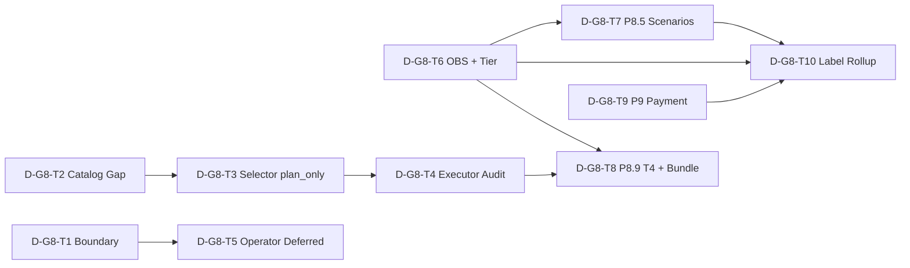

# Lane D — Full-Phase Plan · Commercial Delivery / Tooling / Payment

> **角色**：Lane D Planner · Group **G8**（商業化交付與工具執行）  
> **State SSOT**：`04_Workflows/tickets/W-MASTER-full-phase-plan_state.md` §G8 · §G9  
> **Playbook**：`docs/full-phase-master-planning-playbook.md`  
> **Wave Master 执行正文**：`04_Workflows/tickets/W-MASTER-wave-plan_state.md` §Wave 3–4（**只引用 · 不双份维护**）  
> **Phase% SSOT**：`docs/WAVE_PROGRESS_DASHBOARD.md` · **2026-06-26**（**本档不重算 · 不上调**）  
> **证据 tier SSOT**：`docs/p8_p89_evidence_index_v1.md`  
> **Path report 输入**（票级加权 · 06-26 保守重估）：`04_Workflows/_progress_recalc_p7_p85_p9.py` · Dashboard §Wave-next 敘事 · `WH-REV-2026-06-P7-P8_5-P9-alignment-checklist-v1`

---

## META

| 栏位 | 值 |
|------|-----|
| **group_id** | G8（含 Master CP 之 G8+G9 域） |
| **Covered Phases** | P8 · P8.5 · P8.6 · P8.7 · P8.8 · P8.9 · P9 |
| **Lane** | L7 · Business Flow / Delivery |
| **ticket_count** | 10（D-G8-T1 … D-G8-T10） |
| **planning_status** | `frame_ready` |
| **lifecycle_phase** | B（规划 · doc-only） |
| **closure_claimed** | **否** |
| **phase_percent_modified** | **否** |
| **last_updated** | 2026-06-26 |

---

## 已读清单（P0）

1. `04_Workflows/tickets/W-MASTER-full-phase-plan_state.md` §G8 · §G9 · DNR · Non-Claims  
2. `docs/full-phase-master-planning-playbook.md`  
3. P8.5/P9 path report 等价输入：`_progress_recalc_p7_p85_p9.py` · P8.5 wave-H/H+1/H+2 票组 · P9 narrow 票组 · Dashboard §Wave-next  
4. P8.6–8.9 path report 等价输入：`docs/WAVE_B_TOOLCHAIN_EXECUTION_PLAN.md` · WB-T1–T8 · `multi-phase-80-percent-execution-plan.md`  
5. `docs/p8_p89_evidence_index_v1.md`  
6. Toolchain SSOT：`docs/tool-catalog-and-selector-contract-v1.md` · `docs/tool-executor-and-sandbox-safety-contract-v1.md` · `docs/outbox-and-feedback-layer-contract-v1.md` · `docs/phase-8-operator-backlog-v1.md` · `docs/phase8_5-bridge-smoke-runbook-v1.md` · `docs/internal/P9_payment_sandbox_CI_runbook.md`

**状态依据**：Dashboard 06-26 保守重估 — P8 **45%** · P8.5 **10%** · P8.6 **65%** · P8.7 **60%** · P8.8 **58%** · P8.9 **40%** · P9 **20%**；contract 层（WB-T*） largely landed · runtime/prod/GA-remote 远。

---

## 边界总览（Lane D 必须守）

| 域 | 负责什么 | 禁止什么 |
|----|----------|----------|
| **P8 Operator** | 人工交付控制面：`list_operator_backlog_v1` · HTTP read-only · checkpoint/HITL 视图 | 不得 import 暗部 `core.tool_executor` · 不得把 selector 输出当 gate |
| **P8.6 Catalog SSOT** | 战车根 Tabular/NT JSON · 四轨 `governed_by` | 不得与 Phase 8.8 暗部 catalog 合并 JSON |
| **P8.7 Selector** | `plan_only: true` 推荐层 | 不得 prod blocking · 不得 delivery approve |
| **P8.8 Executor** | 四级 `execution_mode` · allowlist · side_effects audit | 不得写 `orchestration_bridge_outbox` |
| **P8.5 Bridge** | in-memory stub · advisory CI · Scenario1/2 | 不得宣称 prod browser · landing ≠ GA pass |
| **P8.9 Outbox/Feedback** | workflow event consumer · ack · dispatch registry | 80% 不要求 real HTTP webhook（T4 stretch） |
| **P9 Payment** | sandbox adapter · WC M2 e2e · advisory CI | 21/21 local ≠ prod provider/ledger |

**证据 tier（固定命名 · 不得自创别名）**

| Tier | 可说 | 不可说 |
|------|------|--------|
| **L-local** | 本机 unittest/CLI · N/N OK | GA pass · prod-ready |
| **CI-advisory** | yml landing · continue-on-error | merge gate · landing=远端绿 |
| **GA-remote** | 有 run_url + run_id 的 completed Actions run | 无 URL 标 validated |

---

## Do Not Re-Build（Lane D 摘要）

| ID | 已落地 | 本 Lane 允许 |
|----|--------|--------------|
| DNR-G8-01 | P8-T2 backlog · P8-API HTTP read-only | batch/resume FRAME · 单点 CLI 增量 |
| DNR-G8-02 | P8.5 L-local 14/14·7/7 · bridge-smoke.yml landing | GA-remote 证据票 · prod gap 索引 |
| DNR-G9-01 | WB-T1–T3 contracts · W3-TL 四件套 | runtime gap audit · 分轨索引 |
| DNR-G9-02 | P8.9 T1/T2/T3 · REG bundle · dispatch registry | T4 FRAME · bundle extend |
| DNR-G9-03 | P9 sandbox 21/21 · e2e PAID | 首跑 URL · prod gap index |
| DNR-G9-04 | Selector `plan_only` contract 文档 | 生产 registry 跟踪 · 不得改默认为 gate |

---

## Tickets（10 张）

---

### D-G8-T1 — P8 Operator vs P8.6–8.8 Toolchain Boundary SSOT

| 栏位 | 内容 |
|------|------|
| **Ticket ID** | D-G8-T1 |
| **Title** | P8 Operator 控制面与 P8.6–8.8 Toolchain 分轨边界 SSOT |
| **Goal** | 一份可审计文档明确 **P8 operator backlog/HTTP** 与 **catalog/selector/executor/outbox** 的职责切分，防止 operator 票侵入 toolchain 或暗部 executor。 |
| **Scope** | 新建 `docs/p8-operator-vs-toolchain-boundary-v1.md`：域对照表（operator read-model vs tool execution vs bridge vs payment）；数据流图 gate→notify→backlog vs selector→executor→tabular outbox；AllowedPaths 矩阵；cross-ref `phase-8-operator-backlog-v1.md` · WB-T1/T2/T3 · `PHASE8_6*` bridge spec；WORKFLOW_INDEX 一句索引。 |
| **Non-Goals** | 不改 `list_operator_backlog_v1.py` 行为；不合并 Tabular/Phase8.8 catalog；不实现 batch approve；不上调 Phase%。 |
| **Acceptance Criteria** | **AC-1** 文档含 ≥4 域对照行（P8 operator · P8.6–8.8 tabular · P8.5 bridge · P8.9 workflow notify）。**AC-2** 明示 selector 输出 **不得** 驱动 operator approve。**AC-3** 明示 operator HTTP **read-only** · 与 executor `execute` 副作用分离。**AC-4** Reviewer 对照 DNR-G8/G9 无「合并轨」叙事。**AC-5** non-claims：boundary doc ≠ runtime 新能力。 |
| **Dependencies** | 上游：P8-T2 · P8-API · WB-T1–T3（done/contract）。下游：D-G8-T3/T4/T5 · Wave `W3-P8-operator-batch-resume-frame-v1`。blocks_if_missing：无（doc-first）。 |
| **Observability** | verify: `rg "plan_only|read_only|governed_by|orchestration_bridge" docs/p8-operator-vs-toolchain-boundary-v1.md` · 对照 `tests.test_operator_backlog_v1` 模块名引用。artifacts: boundary doc diff。trace_fields: n/a（doc）。success: Reviewer `accepted`。failure: 文档写 operator 可 mutate checkpoint。 |
| **Risks / Edge Cases** | **RSK-D-T1-01** 读者混淆 P8.9 consumer 与 tabular consumer（M/M）→ 分表 + 引用 WB-T3 §2。**RSK-D-T1-02** HTTP API 被误当 write API（M/H）→ AC-3 加 mutation forbidden 段。 |
| **Output Artifact** | `docs/p8-operator-vs-toolchain-boundary-v1.md` · WORKFLOW_INDEX 索引行 · 可选 `D-G8-T1_state.md` |
| **B/C/D/O Landing Plan** | **B** FRAME + 域表 outline · **C** doc diff · **D** Reviewer 对照 operator backlog spec + WB-T1 §2 四轨 · **O** Progress append「boundary SSOT ready」 |
| **Parallelization Note** | **可并行** D-G8-T2/T6/T10（不同文件）；**应最先**开（下游票依赖边界）。`parallel_ok: true` · `ticket_class: doc/spec` · `evidence_tier: n/a` |

---

### D-G8-T2 — Four-Track Catalog SSOT & Dark Executor Gap Audit

| 栏位 | 内容 |
|------|------|
| **Ticket ID** | D-G8-T2 |
| **Title** | 四轨 Tool Catalog SSOT 与暗部 Executor Catalog 分轨 Gap 审计 |
| **Goal** | 量化 WB-T1 contract vs 运行时（含暗部 `core/tool_executor.py`）差距，冻结 **禁止 merge/rename** 规则与 dark venv sync deferred 条件。 |
| **Scope** | 新建 `docs/p86-p88-catalog-runtime-gap-audit-v1.md`：四轨表（Tabular/NT/Gov/Phase8.8）· 每轨 SSOT 路径 · selector 消费点 · enabled:false 现状；暗部 executor catalog 只读索引（不 import 施工）；`FP-G9-T4` 等价内容落地；cross-ref `TOOL_CATALOG_AUTHORITY.md` · `SPEC_tool_catalog_and_selector_v1.md`。 |
| **Non-Goals** | 不改 `tools/*.json` · 不 sync 暗部 venv · 不把 `llm.*` 写入 tabular JSON · 不启用 prod registry gate。 |
| **Acceptance Criteria** | **AC-1** 四轨各 ≥1 行 SSOT + 运行时消费模块。**AC-2** 列 dark sync **deferred** 解阻条件（批文/暗部票）。**AC-3** unittest 引用清单：`test_tool_catalog_and_selector_contract_v1` 等。**AC-4** 全局 tool_id 碰撞检查命令 documented。**AC-5** non-claims：audit ≠ catalog 已 prod 同步。 |
| **Dependencies** | 上游：WB-T1 · W3-TL-T1 · W9-T3 · W3-T1–T4 state。下游：D-G8-T3 · `FP-G9-T5-wc-pre-selector-executor-runtime-v1`。 |
| **Observability** | verify: `python -m unittest tests.test_tool_catalog_and_selector_contract_v1 -v` · `rg "governed_by|phase_8.8" docs/p86-p88-catalog-runtime-gap-audit-v1.md`。artifacts: gap audit doc。success: contract tests green + gap 表完整。failure: audit 宣称 dark=已对齐。 |
| **Risks / Edge Cases** | **RSK-D-T2-01** Implementer 在 tabular 路径 import 暗部 core（H/H）→ audit 标 FORBID + Rule-8。**RSK-D-T2-02** enabled:false 被读作「无工具」（M/M）→ 单列 registry-off 行。 |
| **Output Artifact** | `docs/p86-p88-catalog-runtime-gap-audit-v1.md` · WORKFLOW_INDEX cross-ref |
| **B/C/D/O Landing Plan** | **B** 轨表 + gap 列 outline · **C** doc · **D** 对照 WB-T1 §2 + DNR-02 · **O** Progress「catalog gap audit ready · dark sync deferred」 |
| **Parallelization Note** | 与 D-G8-T1/T6 **并行**；**串行**于 D-G8-T3（selector 票需 gap 清单）。`parallel_ok: true` · `doc/spec` |

---

### D-G8-T3 — Selector plan_only Runtime Track & Production Registry FRAME

| 栏位 | 内容 |
|------|------|
| **Ticket ID** | D-G8-T3 |
| **Title** | Selector plan_only 契约运行时跟踪与生产 Registry 诚实 FRAME |
| **Goal** | 确保所有 selector 调用路径 **显式** 标注 `plan_only: true`，并 FRAME 化「生产 registry 默认 off / non-tabular 未接」的解阻跟踪，**不**升格为 gate。 |
| **Scope** | 更新/新建跟踪 doc `docs/p87-selector-plan-only-track-v1.md`；盘点 `select_tabular_tools` · `select_non_tabular_tools` 调用方；registry env-off 状态机（design_ready→approved→opt-in）；可选最小 probe：`tests/test_selector_plan_only_enforcement_v1.py`（assert 输出含 `plan_only` · 无 gate 键）；cross-ref WB-T1 §4 · W10-T2 fail-closed。 |
| **Non-Goals** | 不开 prod selector gate · 不改 INT regression mandatory · 不 merge non-tabular 入 tabular 主链 · 不接 prod E2E 驱动。 |
| **Acceptance Criteria** | **AC-1** 跟踪 doc 列 ≥3 调用方 + 每处 `plan_only` 证据（代码行或测试）。**AC-2** non-tabular stub 标 `symbolic_only` · 未接主链。**AC-3** registry prod 默认 off 与 W10-T2 一致。**AC-4** 若有 probe unittest：green。**AC-5** non-claims：plan_only 跟踪 ≠ selector 已 prod blocking。 |
| **Dependencies** | 上游：D-G8-T2 · WB-T1 · W10-T2。下游：D-G8-T4 · Wave toolchain runtime 票。 |
| **Observability** | verify: `python -m unittest tests.test_tabular_tool_selector tests.test_non_tabular_tool_selector_v1 -v` · 可选新 probe 模块。trace_fields: `plan_only` · `planned_tools[]` · `ok`。success: 全 selector tests OK + doc 完整。failure: 任一调用方缺 plan_only。 |
| **Risks / Edge Cases** | **RSK-D-T3-01** MP-SMOKE 误读 selector 为 approve（M/H）→ doc 加 MP-SMOKE 边界段。**RSK-D-T3-02** WC-PRE 批文前开 registry（H/H）→ AC-3 绑 W10-T2 env-off。 |
| **Output Artifact** | `docs/p87-selector-plan-only-track-v1.md` · 可选 probe test · 子票 STATE |
| **B/C/D/O Landing Plan** | **B** 调用方清单 · **C** doc + 可选最小 test · **D** Reviewer 跑 selector unittest · **O** Progress |
| **Parallelization Note** | **串行** D-G8-T2 后；与 D-G8-T4 **可并行**（不同模块）。`parallel_ok: true`（post-T2）· `build` 或 `doc/spec` |

---

### D-G8-T4 — Executor execution_mode / dry_run / Audit Trail Landing

| 栏位 | 内容 |
|------|------|
| **Ticket ID** | D-G8-T4 |
| **Title** | Executor 四级 execution_mode · dry_run · side_effects 审计落地 |
| **Goal** | 将 WB-T2 四级模式与 `side_effects[]` 审计 **可观测化**（CLI inspect 或 audit 段），并跟踪 WC-PRE executor timeout 落地，防止 plan_only 路径误开 execute。 |
| **Scope** | 扩展或新建 `scripts/inspect_execution_mode_audit_v1.py`（read-only · 读 outbox/run records · 输出 mode 分布）；更新 `docs/tool-executor-and-sandbox-safety-contract-v1.md` 脚注「audit CLI」；allowlist 矩阵 spot-check 命令；WC-PRE timeout 跟踪段（引用既有票 · 不擅自改 timeout 值）。 |
| **Non-Goals** | 不改 `tabular_tool_executor.py` 核心逻辑 · 不扩 allowlist · 不实现 replay · 不触暗部 executor。 |
| **Acceptance Criteria** | **AC-1** audit CLI/help 列四级 mode 定义。**AC-2** demo_phase dry_run 跑法 **无** tabular outbox 新 run record（WB-T2 矩阵）。**AC-3** execute 路径 side_effects 含 `subprocess_spawn`（现有 test 引用）。**AC-4** WC-PRE timeout 项标 open/deferred + owner。**AC-5** unittest：`test_tool_executor_and_sandbox_contract_v1` green。 |
| **Dependencies** | 上游：WB-T2 · D-G8-T3 · W3-TL-T3。下游：D-G8-T8 · MP-SMOKE observability。 |
| **Observability** | verify: `python -m unittest tests.test_tool_executor_and_sandbox_contract_v1 tests.test_tabular_tool_executor -v` · audit CLI `--help` · 可选 `--case-ref demo_phase --dry-run`。artifacts: outbox inspect 输出样例。trace_fields: `execution_mode` · `side_effects` · `tool_id`。 |
| **Risks / Edge Cases** | **RSK-D-T4-01** experimental case 误 execute（M/H）→ allowlist 表重复 in audit doc。**RSK-D-T4-02** sandbox_end_to_end 对 demo_phase 误开（M/H）→ AC-2 负例。 |
| **Output Artifact** | audit CLI 或 doc 段 · contract 脚注 · 子票 STATE |
| **B/C/D/O Landing Plan** | **B** mode 审计 AC · **C** CLI/doc · **D** Reviewer 跑 WB-T2 verify  bundle · **O** Progress |
| **Parallelization Note** | 与 D-G8-T3 **并行**；与 D-G8-T6 **可并行**。`parallel_ok: true` · `build` |

---

### D-G8-T5 — P8 Operator Deferred Ops FRAME (batch / resume-latest / webhook)

| 栏位 | 内容 |
|------|------|
| **Ticket ID** | D-G8-T5 |
| **Title** | P8 Operator 延期能力 FRAME — batch approve · resume-latest · webhook 边界 |
| **Goal** | 为 P8 **>80% 仍 deferred** 的三项 operator 能力冻结 FRAME、PM 裁定点与 P8.9 notify 边界，**不**冒充已交付。 |
| **Scope** | 新建 `docs/p8-operator-deferred-ops-frame-v1.md`：`--batch-approve` · `--resume-latest-approved` · checkpoint preview · P8-T3 webhook 与 P8.9-T4 分轨；human/PM 裁定 checklist；cross-ref Wave `W3-P8-operator-batch-resume-frame-v1` · `phase-8-commercial-delivery-to-80-plan.md` §3。 |
| **Non-Goals** | **不**实现 batch/resume runtime · **不**开 live webhook · **不**改 operator HTTP 为 mutation API · **不**上调 P8 Phase%。 |
| **Acceptance Criteria** | **AC-1** 每项 deferred 能力有 Goal/Scope/AC/Dependencies 占位。**AC-2** webhook 叙事：P8-T3 vs P8.9-T4 vs P8.9-T3 local dispatch 三角关系清晰。**AC-3** PM 裁定项 listed（task_type 同质 batch 规则等）。**AC-4** ticket_class=`blocked/planning` · STATE 可标 blocked。**AC-5** non-claims 含「FRAME ≠ implemented」。 |
| **Dependencies** | 上游：D-G8-T1 · P8-T2 · P8.9-T3。下游：未来 P8 impl 票（非本 Lane）。blocks_if_missing：PM 裁定可标 pending。 |
| **Observability** | verify: doc review · `rg "deferred|batch|resume-latest|webhook" docs/p8-operator-deferred-ops-frame-v1.md`。无 runtime runner。success: FRAME Reviewer accepted。failure: AC 要求 batch 已可用。 |
| **Risks / Edge Cases** | **RSK-D-T5-01** batch approve 跨 task_type 安全风险（H/M）→ PM checklist 必填。**RSK-D-T5-02** resume-latest 绕过 HITL（H/H）→ 绑定 checkpoint schema 引用。 |
| **Output Artifact** | `docs/p8-operator-deferred-ops-frame-v1.md` · cross-ref Wave W3 operator frame |
| **B/C/D/O Landing Plan** | **B** 三角关系图 · **C** doc only · **D** Reviewer non-claim 检查 · **O** Progress「deferred FRAME ready · impl blocked on PM」 |
| **Parallelization Note** | 与 D-G8-T1 **串行**（边界先）；与 D-G8-T8 **并行** planning。`parallel_ok: true` · `blocked/planning` |

---

### D-G8-T6 — P8/P8.9 Delivery Observability & Evidence Tier Alignment

| 栏位 | 内容 |
|------|------|
| **Ticket ID** | D-G8-T6 |
| **Title** | P8/P8.9 交付链 Observability 与 Evidence Tier 对齐 |
| **Goal** | 消费并扩展 Wave `W3-P89-OBS` · `W3-P89-EVD` 成果，使 MP-SMOKE · P8.9 bundle · operator backlog · bridge **共用** tier 名称与 trace 字段，Reviewer 可无 run URL 判 over-claim。 |
| **Scope** | 确保 `docs/p8_p89_delivery_observability_contract_v1.md` 存在并与 `docs/p8_p89_evidence_index_v1.md` 双向 cross-ref；MP-SMOKE step1–7 + bundle 四文件 artifact 地图；operator backlog 键入 contract；更新 matrix 一行 trace 指向；**不改** Dashboard Phase%。 |
| **Non-Goals** | 不新增 metrics 栏位 · 不建 Grafana · 不把 bridge 纳入 mandatory MP-SMOKE · 不伪造 GA URL。 |
| **Acceptance Criteria** | **AC-1** OBS contract ≥6 trace_fields（case_ref · run_id · multi_phase_smoke.ok · events_summary.count · acks_summary · notifications_failed_ack_count）。**AC-2** evidence index §2 每条 EVD-* 在 OBS 有 artifact 指针或 explicit n/a。**AC-3** tier 表 L-local / CI-advisory / GA-remote 与 index §1 逐字一致。**AC-4** verify_commands 列 EVD-LL-P89-MP · EVD-LL-P89-BND · EVD-LL-P85-A/B。**AC-5** inspector §3.2 无反向叙事。 |
| **Dependencies** | 上游：`W3-P89-EVD-scenario1-bridge-evidence-index-v1`（index v1 landed）· MP-SMOKE · P8.9-REG。下游：D-G8-T7/T10 · G3 FP-G3-T2。 |
| **Observability** | verify: `python scripts/run_multi_phase_smoke_v1.py --case-ref demo_phase --format json` · `python scripts/run_p8_9_verification_bundle_v1.py --case-ref demo_phase --format json` · `rg "evidence_tier|GA-remote" docs/p8_p89*.md`。artifacts: `multi_phase_smoke_run.json` · `p8.9_verification_run.json`。 |
| **Risks / Edge Cases** | **RSK-D-T6-01** 自创 tier 别名（M/H）→ 强制引用 index §1。**RSK-D-T6-02** CI-advisory landing 写 GA pass（H/H）→ AC-3 对照 §3 误解表。 |
| **Output Artifact** | OBS contract doc（新建或补齐）· index cross-ref · WORKFLOW_INDEX |
| **B/C/D/O Landing Plan** | **B** 字段表 · **C** doc diff · **D** Reviewer 对照 index + inspector · **O** Progress |
| **Parallelization Note** | **应早开**（与 T1 并行）；阻塞 D-G8-T7/T10 的 honest labeling。`parallel_ok: true` · `doc/spec` · `evidence_tier: L-local`（verify 命令） |

---

### D-G8-T7 — P8.5 Browser/CU Scenario1–2 & Bridge Prod Gap Pack

| 栏位 | 内容 |
|------|------|
| **Ticket ID** | D-G8-T7 |
| **Title** | P8.5 Browser/CU — Scenario1 L-local · Scenario2 GA-remote · Bridge Prod Gap |
| **Goal** | 诚实打包 P8.5 双情境证据链与 stub vs prod browser 差距，解阻 Wave 4 GA ops 票而不 over-claim prod readiness。 |
| **Scope** | 更新/索引 `docs/internal/P85_Scenario2_GA_runbook.md` · `docs/phase8_5-bridge-smoke-runbook-v1.md` §Scenario1/2；新建 `docs/p85-bridge-prod-gap-index-v1.md`（in-memory stub · deps gate · prod browser deferred）；GA-remote 模板（`ga_run` YAML · 引 evidence index §2.3）；cross-ref Wave `W4-P85-scenario2-ga-evidence-v1` · `WH-P85-SMOKE-B-scenario2-ops-run-v1`（blocked）。 |
| **Non-Goals** | **不**跑 Scenario2 GA（human-only）· **不**改 bridge core 为 prod browser · **不**升格 required CI · **不** closure-scribe 关票（无 URL）。 |
| **Acceptance Criteria** | **AC-1** Scenario1 标 **L-local** 14/14·7/7 + **CI-advisory landing** · **GA-remote pending**。**AC-2** Scenario2 标 **blocked** · ops-run STATE 引用。**AC-3** prod gap 表 ≥5 行（stub · HTTP only · no real browser · no prod gate · closure blocked）。**AC-4** Progress 模板含 run_url 占位 `<PENDING>`。**AC-5** non-claims：Scenario1 local ≠ prod browser。 |
| **Dependencies** | 上游：D-G8-T6 · WH-P85-CI-LAND · evidence index。下游：`WH-P85-wave-H2-closure-scribe-v1`（blocked on GA）。human_only: Scenario2 dispatch + URL 回填。 |
| **Observability** | verify: `python -m unittest tests.test_minimal_orchestration_bridge tests.test_app_api_orchestration_bridge -v`（L-local · cwd 暗部）· `rg "scenario2|GA-remote|stub" docs/p85*.md`。trace_fields: `ga_run.run_url` · `scenario` · `evidence_tier`。failure: 无 URL 写 GA pass。 |
| **Risks / Edge Cases** | **RSK-D-T7-01** 本机 bash 探针填 ga_run（H/H）→ index §2.3 禁止。**RSK-D-T7-02** Scenario2 skip 误读为 happy pass（M/H）→ runbook 加 design-skip 段。 |
| **Output Artifact** | prod gap index · runbook cross-ref · GA 模板 · 可选 scribe Progress 占位 |
| **B/C/D/O Landing Plan** | **B** 情境表 + gap 列 · **C** doc · **D** Reviewer tier 对照 · **O** Scribe **仅** human 触发后填 URL |
| **Parallelization Note** | doc 部分与 T6/T10 **并行**；GA execute **串行** human。`parallel_ok: true`（doc）· `scribe/ops` + `blocked/planning`（GA）· `evidence_tier: L-local`（doc）/ `GA-remote`（human 后） |

---

### D-G8-T8 — P8.9 Outbox/Feedback Webhook T4 FRAME & Verification Bundle Extend

| 栏位 | 内容 |
|------|------|
| **Ticket ID** | D-G8-T8 |
| **Title** | P8.9 HTTP Webhook T4 FRAME · 反馈闭环 · Verification Bundle 回归扩展 |
| **Goal** | FRAME 化 post-80% 的 HTTP webhook（T4），并扩展 P8.9 verification bundle 覆盖 dispatch registry / failed ack 探针，保持 **local-first** 证据。 |
| **Scope** | `docs/p89-webhook-t4-frame-v1.md`（sandbox HTTP · dry_run 默认 · 与 T3 local handler 关系）；扩展 `run_p8_9_verification_bundle_v1.py` 测试矩阵（若 AC 允许最小增量）；更新 `docs/p8_9-verification-bundle-v1.md`；cross-ref Wave `W3-P89-verification-bundle-extend-v1` · P8.9-T2/T3 state。 |
| **Non-Goals** | **不**默认开 live external webhook · **不** DLQ/HMAC prod · **不**改 tabular outbox writer · T4 runtime **blocked** 直至 PM 裁定 post-80%。 |
| **Acceptance Criteria** | **AC-1** T4 FRAME 含 AC/Dependencies/non-claims（webhook ≠ 80% 必需）。**AC-2** bundle 回归：`python scripts/run_p8_9_verification_bundle_v1.py` exit 0 on demo_phase。**AC-3** consumer 显示 ack pending/failed 语义（引用 T2）。**AC-4** outbox namespace 与 WB-T3 §2 一致。**AC-5** evidence_tier L-local for bundle pass。 |
| **Dependencies** | 上游：P8.9-T1/T2/T3 · D-G8-T4/T6 · WB-T3。下游：P8-T3 webhook（deferred）· Wave W3 bundle extend。 |
| **Observability** | verify: `python -m unittest tests.test_p8_9_verification_bundle_v1 -v` · bundle CLI json · `python -m unittest tests.test_workflow_event_consumer_v1 -v`（若存在）。artifacts: `p8.9_verification_run.json`。trace_fields: `events_summary` · `acks_summary` · `dispatch_handler`。 |
| **Risks / Edge Cases** | **RSK-D-T8-01** webhook skeleton 标 prod-ready（H/H）→ T4 non-claims。**RSK-D-T8-02** bundle extend 破坏 demo_phase 基线（M/H）→ 先 skip-experiment 模式。 |
| **Output Artifact** | T4 FRAME doc · bundle doc 更新 · 可选 test 增量 · 子票 STATE |
| **B/C/D/O Landing Plan** | **B** T4 FRAME + bundle AC · **C** doc + 可选最小 test · **D** Reviewer 跑 bundle · **O** Progress |
| **Parallelization Note** | FRAME 与 D-G8-T5 **并行**；bundle extend **串行** P8.9-T3 accepted。`parallel_ok: true`（FRAME）· `build`（bundle 增量） |

---

### D-G8-T9 — P9 Payment Sandbox CI & Prod Ledger Readiness Index

| 栏位 | 内容 |
|------|------|
| **Ticket ID** | D-G8-T9 |
| **Title** | P9 支付 Sandbox CI 首跑 · WC M2 · Prod Provider/Ledger 诚实索引 |
| **Goal** | 集中 P9 **L-local 21/21** · **advisory CI landing** · **GA-remote pending** · prod provider/ledger gap，解阻 Wave 4 首跑 URL 票。 |
| **Scope** | 新建/补齐 `docs/p9-payment-readiness-index-v1.md`：sandbox adapter · `run_wc_m2_e2e_walkthrough` · `p9-payment-sandbox-smoke.yml` · `p9-wc-m2-fixture-execute.yml`；prod gap 表（real provider · ledger · order status prod · PCI scope deferred）；cross-ref `docs/internal/P9_payment_sandbox_CI_runbook.md` · Wave `W4-P9-run-url-backfill-v1` · `order_ledger/` 模块索引。 |
| **Non-Goals** | **不**接 prod payment provider · **不**改 branch protection · **不**跑 GitHub 首跑（human）· **不**宣称 21/21 = prod 金流。 |
| **Acceptance Criteria** | **AC-1** 三 tier 标注：local 21/21 · CI-advisory landing · GA-remote `<PENDING>`。**AC-2** runbook 步骤与 yml job 命令一致。**AC-3** prod gap ≥6 行。**AC-4** e2e PAID 标 sandbox + `GOV_PAYMENT_SANDBOX_ENABLED=1` scope。**AC-5** cross-ref payment_adapter · store · service（只读索引）。 |
| **Dependencies** | 上游：WD-P9-T1/T2 · WH-P9-M2-* · WH-P9-CI-*。下游：P10 payment hook · Wave W4 run URL。human_only: workflow_dispatch + URL。 |
| **Observability** | verify: `python -m unittest tests.test_order_ledger* -v`（若存在）· local walkthrough 引用 · `rg "advisory|sandbox|prod" docs/p9*.md`。trace_fields: `order_status` · `walkthrough_ok` · `ga_run.run_url`。 |
| **Risks / Edge Cases** | **RSK-D-T9-01** sandbox PAID 误读 prod（H/H）→ AC-4 non-claim。**RSK-D-T9-02** 首跑 placeholder 当完成（H/H）→ URL 必填或 pending。 |
| **Output Artifact** | `docs/p9-payment-readiness-index-v1.md` · WORKFLOW_INDEX · Progress 模板 |
| **B/C/D/O Landing Plan** | **B** gap 表 + tier 段 · **C** doc · **D** Reviewer 对照 WH-P9-CI STATE · **O** Scribe human 后填 URL |
| **Parallelization Note** | doc 与 T6/T10 **并行**；CI 首跑 **human 串行**。`parallel_ok: true` · `doc/spec` + `scribe/ops` |

---

### D-G8-T10 — Lane D Advisory / Local / GA-remote Honest Labeling Rollup

| 栏位 | 内容 |
|------|------|
| **Ticket ID** | D-G8-T10 |
| **Title** | Lane D 跨线诚实标记 rollup — local · advisory · GA-remote |
| **Goal** | 单一 rollup 文档汇总 P8/P8.5/P8.9/P9 所有 smoke/CI 路径的 **tier · ci_class · non-claims**，消减 Wave 3/4 分散索引误读。 |
| **Scope** | 新建 `docs/lane-d-evidence-and-advisory-rollup-v1.md`：合并引用 `p8_p89_evidence_index_v1.md` · `P7_ADVISORY_CI_INDEX.md`（P8 段不重复 P7 正文）· Wave `W3-P8-ADV` · `W4-P85-P9-EVIDENCE-SSOT-v1` 意图；WORKFLOW_INDEX「Lane D · Evidence rollup」段；inspector §3.2 对照表。 |
| **Non-Goals** | 不重复定义 tier（必须 link index §1）· 不升格 required CI · 不上调 Phase% · 不跑 GA。 |
| **Acceptance Criteria** | **AC-1** 覆盖 ≥8 条 smoke/CI 路径（MP-SMOKE · bundle · CI-SMOKE · bridge · P9 payment · WC M2 fixture · operator HTTP · toolchain health）。**AC-2** 每条含 tier + blocking 列。**AC-3** Global non-claims 复制 Master CP 表 + Lane D 专属 3 条。**AC-4** Reviewer 抽样 3 路径对照 inspector 无 over-claim。**AC-5** Dashboard 叙事 cross-ref 一句（无 % 变更）。 |
| **Dependencies** | 上游：D-G8-T6 · D-G8-T7 · D-G8-T9 · evidence index v1。下游：Full-Phase Master Review · Scribe closure。 |
| **Observability** | verify: `rg "L-local|CI-advisory|GA-remote|non-claims" docs/lane-d-evidence-and-advisory-rollup-v1.md` · 对照 bridge-smoke.yml continue-on-error。success: rollup 完整 + cross-ref 无断链。 |
| **Risks / Edge Cases** | **RSK-D-T10-01** 与 P7 index 双 SSOT 冲突（M/M）→ 分线表 P7 vs Lane D。**RSK-D-T10-02** rollup 替代 index 正文（M/H）→ 仅 rollup 指针。 |
| **Output Artifact** | rollup doc · WORKFLOW_INDEX 段 · Dashboard 叙事一句 |
| **B/C/D/O Landing Plan** | **B** 路径清单 · **C** doc · **D** inspector 对照 · **O** Progress「Lane D labeling rollup ready」 |
| **Parallelization Note** | **串行** T6/T7/T9 doc 骨架后 rollup 最稳；可与 T1 **并行**起草案。`parallel_ok: true`（late）· `doc/spec` |

---

## Parallelization Plan（Lane D）



| 并行带 | Tickets | 条件 |
|--------|---------|------|
| **带 A · 边界/doc** | T1 · T2 · T6 · T10（草案） | 无共享 code mutation |
| **带 B · Toolchain runtime** | T3 · T4 | T2 gap 清单就绪后 |
| **带 C · 延期 FRAME** | T5 · T8（T4 FRAME 段） | 不与 operator impl 并行 |
| **带 D · Human/scribe** | T7（GA）· T9（CI 首跑） | **human dispatch 后** |

**禁止并行（共享 mutation surface）**

| Surface | 规则 |
|---------|------|
| `delivery/notification_gateway_v1.py` | 单票 owner · 先 P8.9 再 P8 webhook |
| `tools/tabular_tool_catalog_v1.json` | 仅 D-G8-T2 audit · 改 JSON 另开 impl 票 |
| `.github/workflows/*` required 升格 | WC-PRE 批文前禁止 |
| Dashboard Phase% | Lane D **禁止**修改 |

---

## Wave Master 交叉引用（不重复正文）

| Lane D 票 | Wave / FP 等价票 |
|-----------|------------------|
| D-G8-T5 | `W3-P8-operator-batch-resume-frame-v1` |
| D-G8-T6 | `W3-P89-OBS-delivery-trace-contract-v1` · `W3-P89-EVD-scenario1-bridge-evidence-index-v1` |
| D-G8-T7 | `W4-P85-scenario2-ga-evidence-v1` · `W4-P85-bridge-prod-gap-index-v1` |
| D-G8-T8 | `W3-P89-verification-bundle-extend-v1` · `FP-G9-T2-p89-webhook-t4-frame-v1` |
| D-G8-T9 | `W4-P9-run-url-backfill-v1` · `W4-P9-payment-sandbox-ci-run-v1` |
| D-G8-T10 | `W3-P8-ADV-advisory-ci-ssot-index-v1` · `W4-P85-P9-EVIDENCE-SSOT-v1` |
| D-G8-T2 | `FP-G9-T1-toolchain-runtime-gap-audit-v1` · `FP-G9-T4-tabular-vs-phase88-tool-layer-index-v1` |
| D-G8-T3/T4 | `FP-G9-T5-wc-pre-selector-executor-runtime-v1` |

---

## Non-Claims（Lane D 全局）

| 禁止宣称 | 正确表述 |
|----------|----------|
| 本计划完成 = Phase 8–9 closure | doc-only 规划 · Phase% 不变 |
| L-local 14/14·7/7 = prod browser | in-memory stub · Scenario2 GA pending/blocked |
| bridge-smoke.yml landing = GA pass | CI-advisory landing · GA-remote 需 run_url |
| MP-SMOKE 七步绿 = P8 operator 全功能 | batch/resume/webhook **deferred** |
| selector plan_only 跟踪 = prod gate | registry 默认 off |
| P8.9 T3 dispatch = HTTP webhook prod | local handler · T4 FRAME only |
| P9 21/21 = prod 金流 | sandbox · prod provider gap |
| PLAN_READY = GA 已跑 | human blocked 票仍 pending |

---

## 最值得最先开工的 3 张票

| 优先级 | Ticket | 理由 |
|--------|--------|------|
| **1** | **D-G8-T1** — Operator vs Toolchain Boundary SSOT | 全 Lane 的**职责切分**基础；无此文易把 operator 与 selector/executor 混施工，违反 DNR 与 Rule-8。 |
| **2** | **D-G8-T6** — Delivery Observability & Evidence Tier Alignment | **诚实验证**的 SSOT 枢纽；统一 L-local / CI-advisory / GA-remote，下游 P8.5/P9/Reviewer 均依赖，且与已落地的 `p8_p89_evidence_index_v1.md` 直接衔接。 |
| **3** | **D-G8-T3** — Selector plan_only Runtime Track | **P8.7 核心契约**落地跟踪；blocking 风险在于 selector 被误用为 gate；与 catalog gap（T2）轻依赖，可在 T2 并行读完后立即开工 probe/doc。 |

> **次优先（human 解阻并行）**：**D-G8-T7**（P8.5 Scenario2 GA · blocked）与 **D-G8-T9**（P9 CI 首跑 URL · blocked）— doc 部分可立即写；**execute 须 human dispatch**，不可包装为 AI 已完成。

---

## STATE

```yaml
overall_status: frame_ready
planning_status: frame_ready
group_id: G8
lane: L7
tickets_defined: D-G8-T1..T10
ticket_count: 10
lifecycle_phase: B
closure_claimed: false
phase_percent_modified: false
reviewer_verdict: pending
next_action: "Full-Phase Master Review 抽样 ≥3 张 Lane D FRAME；优先派 Implementer 开 D-G8-T1 + D-G8-T6"
last_updated: 2026-06-26
```

---

*LANE-D-full-phase-plan · Lane D Planner · 2026-06-26 · doc-only · Phase% frozen at Dashboard 06-26*
