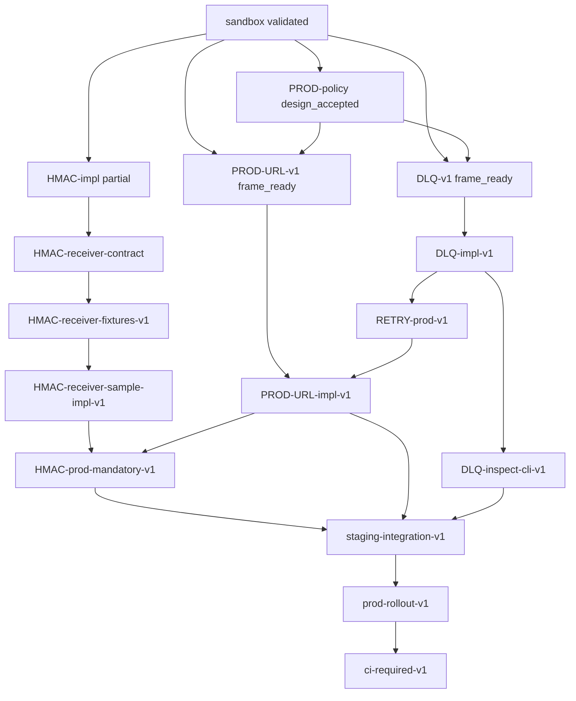

# WH-P7-PROD-roadmap-v1 — Ticket State

> handoff 摘要檔；P7 **prod 通知線**總 roadmap · **doc-only 設計票**。  
> 目的：彙總 prod 線所有相關票、依賴關係與建議實作 wave 順序；**本票不改 code / tests / workflows / docs / 其他票 / Progress**。

---

## FRAME

### handoff header

**P7 prod 線 roadmap 設計票**：sandbox 線已 `validated`（`WH-P7-sandbox-line-wrapup-v1`）；DLQ / PROD-URL / receiver contract 等設計票已 `frame_ready` 或 `design_accepted`。本票僅**彙總 prod 線 wave 規劃、票號索引與依賴 DAG**；不實作、不決定具體日期、不升格 CI。

---

### 1. Background

| 面向 | 現況 | 證據 |
|------|------|------|
| **Sandbox 線** | emit → dispatch → localhost webhook → opt-in retry → env-gated HMAC sender → advisory CI；**已封箱** | `WH-P7-sandbox-line-wrapup-v1` · `validated` |
| **Policy SSOT** | §4.6 prod-tier 骨架 · retry/HMAC **partial** · DLQ / prod URL **not_implemented_yet** | `WH-P7-NOTIF-PROD-policy-v1` · `design_accepted` |
| **Partial 審計** | retry + HMAC sender 合約 vs 現碼一致 | `WH-P7-NOTIF-contract-partials-validation-v1` · `validated` |
| **Receiver 合約** | §4.6.5.2 normative SSOT 已落盤；reference impl / fixtures **not_implemented_yet** | `WH-P7-NOTIF-HMAC-receiver-contract-v1` · `implementer_done_pending_review` |
| **DLQ 設計** | 路徑 / jsonl schema / inspect CLI 介面 / test 方向已定義 | `WH-P7-NOTIF-DLQ-v1` · `frame_ready` |
| **URL tier 設計** | tier 對照表 / allowlist grammar / staging-prod gating checklist 草案 | `WH-P7-NOTIF-PROD-URL-v1` · `frame_ready` |
| **Sandbox 線 follow-up（非 blocking）** | HMAC-impl C 收口 · receiver-contract C 收口 · doc-sync C 收口 | 各票 STATE |

**prod 線核心缺口**（sandbox 不能做、prod 必須補）：

- 失敗事件 **DLQ 落盤 + inspect**
- retry 從 sandbox-only **升格**至 staging/prod tier
- **HMAC receiver** fixtures + reference impl + contract tests
- staging/prod **URL tier + allowlist** 程式 gate
- staging **整合演練**（人工 env · 非 CI prod URL）
- prod **rollout guardrails**（required CI / branch protection / runbook · 尚書省批文後）

---

### 2. Goal

產出 **P7 prod 線 wave 規劃 SSOT**，供 Orchestrator 依序開票與派工：

1. 將 prod 實作主題拆成 **6 個 wave**（見 §3 主表）
2. 每 wave 列出**候選票號**、上游依賴、交付語意
3. 標示**已存在票** vs **待開票** vs **sandbox 線已交付 partial**
4. 繪製**依賴 DAG**（文字 + mermaid），供裁決並行/串行

---

### 3. Prod 線 Wave 規劃（主表）

| wave | 主題 | 票號候選 | 狀態 | 說明 |
|------|------|----------|------|------|
| **Wave-P7-0** | 設計 / 政策 / sandbox 封箱 | 見 §4 已存在票表 | 多數已交付或 `frame_ready` | prod 線起點索引；非實作 wave |
| **Wave-P7-1** | DLQ 基礎 | `WH-P7-NOTIF-DLQ-impl-v1` · `WH-P7-NOTIF-DLQ-inspect-cli-v1` | **待開** | 失敗落盤 `outbox/notification_dlq/events.jsonl` + env gate + fail-open；inspect list/stats CLI + fixture + unittest |
| **Wave-P7-2** | retry / DLQ 升 prod | `WH-P7-NOTIF-RETRY-prod-v1` | **待開** | 將 retry 從 sandbox-only 擴展至 staging/prod tier；retry 用盡寫 DLQ；tier-aware `endpoint_tier` 欄位 |
| **Wave-P7-3** | HMAC receiver | `WH-P7-NOTIF-HMAC-receiver-fixtures-v1` · `WH-P7-NOTIF-HMAC-receiver-sample-impl-v1` · `WH-P7-NOTIF-HMAC-prod-mandatory-v1` | **待開** | fixtures → reference receiver + contract tests → staging/prod 缺 HMAC **reject POST**（fail-closed at adapter） |
| **Wave-P7-4** | URL tier / allowlist | `WH-P7-NOTIF-PROD-URL-impl-v1` | **待開** | 讀取 `GOV_NOTIFICATION_WEBHOOK_TIER` + `URL_ALLOWLIST`；https gate；host/path match；sandbox regression 不退化 |
| **Wave-P7-5** | staging 整合 | `WH-P7-NOTIF-staging-integration-v1` | **待開** | 人工 env staging 拔線演練（mock 或內部 staging endpoint）；E2E：emit → dispatch → signed POST → receiver 驗簽 → DLQ 可觀測 |
| **Wave-P7-6** | prod rollout guardrails | `WH-P7-NOTIF-prod-rollout-v1` · `WH-P7-NOTIF-ci-required-v1`（候選） | **之後再起** | 尚書省 prod 批文 + Security sign-off；required CI / branch protection / runbook / rollback playbook |

#### Wave-P7-1 細節（DLQ 基礎）

| 票號 | 依賴 | 交付摘要 |
|------|------|----------|
| `WH-P7-NOTIF-DLQ-impl-v1` | `WH-P7-NOTIF-DLQ-v1` FRAME sign-off · `WH-P7-NOTIF-RETRY-SANDBOX-v1` | adapter 失敗路徑寫 DLQ jsonl；`GOV_NOTIFICATION_WEBHOOK_DLQ_ENABLED` default off；§4.6.4 擴寫；unittest T-1–T-4 |
| `WH-P7-NOTIF-DLQ-inspect-cli-v1` | DLQ-impl-v1（或並行讀 fixture jsonl） | inspect list/stats CLI；`--json` / filter 旗標；unittest T-5–T-7 |

#### Wave-P7-2 細節（retry 升格）

| 票號 | 依賴 | 交付摘要 |
|------|------|----------|
| `WH-P7-NOTIF-RETRY-prod-v1` | Wave-P7-1 DLQ-impl · `WH-P7-NOTIF-PROD-URL-v1` tier 表（policy） | staging/prod tier 下 `max_attempts≥1` policy mandatory；retry 用盡必寫 DLQ；sandbox default=0 不變 |

#### Wave-P7-3 細節（HMAC receiver）

| 票號 | 依賴 | 交付摘要 |
|------|------|----------|
| `WH-P7-NOTIF-HMAC-receiver-fixtures-v1` | `WH-P7-NOTIF-HMAC-receiver-contract-v1` · `WH-P7-NOTIF-HMAC-impl-v1` | `tests/fixtures/webhook_hmac/` 已簽名樣本 + headers sidecar + README |
| `WH-P7-NOTIF-HMAC-receiver-sample-impl-v1` | fixtures 票 | 最小 `verify_gov_webhook` reference + contract test（成功 / 失簽 / 過期 / replay / mismatch） |
| `WH-P7-NOTIF-HMAC-prod-mandatory-v1` | HMAC-impl · PROD-URL tier 表 · receiver fixtures | staging/prod tier 缺 HMAC headers 或 secret → **reject POST**（與 sandbox fail-open 分支） |

#### Wave-P7-4 細節（URL tier）

| 票號 | 依賴 | 交付摘要 |
|------|------|----------|
| `WH-P7-NOTIF-PROD-URL-impl-v1` | `WH-P7-NOTIF-PROD-URL-v1` B 輪 §4.6.6 定稿 · Wave-P7-1–3 能力就緒 | adapter 讀 `TIER` + allowlist；https gate；reject matrix unittest；§4.6.6 `impl_status` 更新 |

> **Orchestrator 裁決**：PROD-URL-impl 可與 Wave-P7-3 部分**並行**（tier gate 骨架先於 HMAC mandatory 完整接線），但 **staging 整合（Wave-P7-5）must 在 Wave-P7-3 + Wave-P7-4 均 impl_done 後**。

#### Wave-P7-5 / Wave-P7-6

- **staging 整合**：非 CI prod URL；Wave-H Governance 雙人批准；驗證 tier + HMAC + retry + DLQ 全鏈。
- **prod rollout**：尚書省 prod 批文；`p7-notification-smoke` 升格 required check 為**獨立 CI governance 票**；runbook + rollback 演練。

---

### 4. 已存在票索引（prod 線相關 · 2026-06-22）

| 票號 | overall_status | 線 | 角色 |
|------|----------------|-----|------|
| `WH-P7-sandbox-line-wrapup-v1` | `validated` | sandbox | 封箱索引 · prod handoff 入口 |
| `WH-P7-NOTIF-PROD-policy-v1` | `design_accepted` | prod policy | §4.6 骨架母本 |
| `WH-P7-NOTIF-RETRY-SANDBOX-v1` | `done` | sandbox | retry **partial**（sandbox localhost） |
| `WH-P7-NOTIF-HMAC-policy-v1` | `frame_ready` | design | HMAC policy 擴寫（§4.6.5 部分由 receiver-contract 承接） |
| `WH-P7-NOTIF-HMAC-impl-v1` | `impl_done` | sandbox | HMAC sender **partial** · C pending |
| `WH-P7-NOTIF-HMAC-receiver-contract-v1` | `implementer_done_pending_review` | prod design | §4.6.5.2 receiver SSOT · C pending |
| `WH-P7-NOTIF-contract-partials-validation-v1` | `validated` | audit | partial 合約 vs 現碼 |
| `WH-P7-NOTIF-contract-doc-sync-v1` | `implementer_done_pending_review` | doc | §4.6 env 表 / 票號索引 sync |
| `WH-P7-NOTIF-DLQ-v1` | `frame_ready` | prod design | DLQ FRAME · 待 C sign-off 後開 impl |
| `WH-P7-NOTIF-PROD-URL-v1` | `frame_ready` | prod design | URL tier FRAME · 待 B 擴寫 §4.6.6 |

**WD-P7-T*（sandbox 基線 · 已封箱）**：`WD-P7-T1` · `WD-P7-T2` · `WD-P7-T3` — orchestrator emit · webhook sandbox · 全鏈 smoke + advisory CI。

---

### 5. 依賴 DAG（建議實作順序）

**硬依賴（must 串行）**

```
sandbox validated
  → DLQ design (DLQ-v1) sign-off
  → DLQ-impl + inspect-cli          [Wave-P7-1]
  → RETRY-prod                       [Wave-P7-2]
  → HMAC receiver fixtures           [Wave-P7-3a]
  → HMAC receiver sample-impl        [Wave-P7-3b]
  → HMAC prod-mandatory + PROD-URL-impl  [Wave-P7-3c + Wave-P7-4 · 可部分並行]
  → staging-integration              [Wave-P7-5]
  → prod-rollout + CI required       [Wave-P7-6 · 尚書省批文]
```

**軟依賴（可並行 · 不阻開票）**

| 並行叢集 | 說明 |
|----------|------|
| `WH-P7-NOTIF-PROD-URL-v1` B 輪 doc · `WH-P7-NOTIF-DLQ-v1` C 審查 | 兩張設計票可並行 Reviewer |
| sandbox follow-up C 收口（HMAC-impl · receiver-contract · doc-sync） | 不 blocking prod impl 開票 |
| `WH-P7-NOTIF-HMAC-receiver-fixtures-v1` · `WH-P7-NOTIF-DLQ-inspect-cli-v1` | inspect-cli 可僅讀 fixture jsonl，與 DLQ-impl 弱耦合 |



---

### 6. 合約 §4.6 對照（prod 線目標狀態）

| policy_item | sandbox 現況 | prod 線目標（全 wave 完成後） |
|-------------|--------------|-------------------------------|
| `webhook_dlq_enabled` | **not_implemented_yet** | **implemented**（tier-gated · default off） |
| `webhook_retry_max_attempts` | **partial**（sandbox only） | **partial→implemented**（staging/prod mandatory ≥1） |
| `webhook_hmac` | **partial**（sender only） | **implemented**（sender + receiver contract test + prod mandatory） |
| `webhook_url_tier` | sandbox **implemented** · prod **not_implemented_yet** | **implemented**（三級 tier + allowlist） |
| `advisory_ci_blocking` | **implemented**（false） | Wave-P7-6 裁決是否升格 required |

---

### 7. Non-Goals

- ❌ **不實作**任何 Python / tests / CI / docs 正文（本票 doc-only roadmap）。
- ❌ **不修改**其他票檔 · `00_Agent_Work_Progress.md`。
- ❌ **不決定**具體日期、人力排程或尚書省 prod 批文時程。
- ❌ **不開啟**真實 prod/staging 對外 POST；staging 整合票亦僅規劃，本票不執行。
- ❌ **不升格** advisory CI 為 required check（留 Wave-P7-6）。
- ❌ **不合併** Phase 8.8 `orchestration_bridge_outbox`（§2.2 永久分軌）。
- ❌ **不宣稱** prod 通知已就緒 — sandbox partial **不得**誤繼承為 prod 完整交付。

---

### 8. Acceptance Criteria（本票 FRAME）

- **AC-1**：FRAME 含 Background / Goal / Wave 主表 / 已存在票索引 / 依賴 DAG / Non-goals。
- **AC-2**：至少 **6 個 wave**（Wave-P7-0 ～ Wave-P7-6），每 wave 至少 **1 張票 id**。
- **AC-3**：依賴關係與 `WH-P7-sandbox-line-wrapup-v1` D_REPORT · `WH-P7-NOTIF-PROD-URL-v1` §2.3 gating checklist **無矛盾**。
- **AC-4**：`STATE.overall_status` = `frame_ready`。
- **AC-5**：AllowedPaths 僅本票；BlockedPaths 涵蓋 code / tests / CI / 其他票 / Progress。

---

### 9. AllowedPaths / BlockedPaths

| Allowed | Blocked |
|---------|---------|
| `04_Workflows/tickets/WH-P7-PROD-roadmap-v1_state.md` | 其餘全 repo（含其他票檔 · docs · delivery · tests · workflows · Progress） |

---

### 10. Dependencies

- `WH-P7-sandbox-line-wrapup-v1`（`validated`）
- `WH-P7-NOTIF-PROD-policy-v1`（`design_accepted`）
- `WH-P7-NOTIF-DLQ-v1` · `WH-P7-NOTIF-PROD-URL-v1`（`frame_ready`）
- `WH-P7-NOTIF-HMAC-impl-v1` · `WH-P7-NOTIF-HMAC-receiver-contract-v1`
- `WH-P7-NOTIF-contract-partials-validation-v1`（`validated`）
- `docs/outbox-and-feedback-layer-contract-v1.md` §4.2–§4.6

---

## STATE

- **overall_status**: `design_accepted`
- **current_owner**: orchestrator
- **next_action**: 在現有 **local slot S1–S4 GO** 證據（run_id `20260623T165252Z` · `WH-P7-PROD-phase1-wrapup-v1`）基礎上，規劃真 Infra / 客戶 staging endpoint、Wave-P7-6 **`WH-P7-PROD-prod-rollout-governance-bootstrap-v1`** rollout bootstrap、governance / CI gate 設計；**不宣稱 prod flip 已執行**
- **last_updated**: 2026-06-24 · P7 DOCSYNC agent (phase-refresh)
- **wave**: Wave-H+1 · P7 prod line roadmap
- **status_by_role**:
  - **Orchestrator (A)**: done — FRAME 落盤
  - **Implementer (B)**: n/a — 本票 doc-only
  - **Reviewer (C)**: done — 2026-06-22 · **`accepted_with_gaps`**
  - **Scribe (D)**: done — 2026-06-22 · D_REPORT handoff（本輪 Reviewer 代填；Progress append 另輪）
- **notes**:
  - Wave-P7-1～4 impl **validated**（unittest only）· Wave-P7-5 首輪 **local slot S1–S4 GO**（run_id `20260623T165252Z` · 三設計票 **`validated`** · execute **`validated`** · bootstrap / receiver-impl **`done_with_gaps`**）
  - **仍缺（刻意不等同 prod-ready）**：真 Infra staging endpoint · 客戶 staging endpoint · 真 Wave-H **governance_dual** 批文 · 48h 穩定觀測 · Wave-P7-6 prod rollout / registry gate / required CI / Security sign-off
  - **Execution 入口**：prod-rollout-governance-bootstrap 待 FRAME 落盤
  - **為何不標 `validated`**：roadmap 層 intentionally open 直至 prod-rollout-governance-bootstrap 收口 · 避免 Phase% 過度樂觀

---

## B_REPORT

> Orchestrator · 2026-06-23 · roadmap SSOT refresh（無 runtime 交付）

### §1 性質

本票 **doc-only** · Wave-P7-0～6 規劃 SSOT；**不宣稱** prod 通知已就緒。

### §2 Wave 進度快照（2026-06-23）

| Wave | 狀態 | 備註 |
|------|------|------|
| Wave-P7-0 | 多數 **done_with_gaps** / **design_accepted** | policy/URL/RETRY/HMAC 設計 + sandbox wrap-up |
| Wave-P7-1 DLQ | **validated** | impl + inspect-cli |
| Wave-P7-2 RETRY-prod | impl **validated** · design **done_with_gaps** | unittest only |
| Wave-P7-3 HMAC | impl **validated** · mandatory design **done_with_gaps** | receiver fixtures 仍 future |
| Wave-P7-4 PROD-URL | impl **validated** · design **done_with_gaps** | prod registry future |
| Wave-P7-5 staging | **local slot GO · execute `validated`** | 首輪 local slot S1–S4 GO（run_id `20260623T165252Z` · wrapup 票）；三設計票 **`validated`** · execute **`validated`** · bootstrap / receiver-impl **`done_with_gaps`** · **仍缺**真 Infra / 客戶 staging endpoint · 真 governance_dual · 48h 觀測 |
| Wave-P7-6 rollout | **bootstrap 已開票 · FRAME pending** | `WH-P7-PROD-prod-rollout-governance-bootstrap-v1` · 尚書省批文 · registry gate · required CI · Security sign-off · **不宣稱 prod flip 已執行** |

### §3 刻意保留 open 的 policy 票（避免過度樂觀）

| 票 | 狀態 | 原因 |
|----|------|------|
| `WH-P7-NOTIF-PROD-policy-v1` | `design_accepted` | §4.6 骨架 only · impl 由衍伸票承接 |
| `WH-P7-PROD-roadmap-v1` | `design_accepted` | 本票 · roadmap 層 |
| （Orchestrator 裁決）第三張 policy 類 | 維持 open | Phase% 誠實度 |

### §4 已存在票索引 refresh（prod 線 · 2026-06-23）

| 票號 | overall_status | 備註 |
|------|----------------|------|
| `WH-P7-sandbox-line-wrapup-v1` | `validated` | prod 入口 |
| `WH-P7-NOTIF-PROD-policy-v1` | `design_accepted` | §4.6 母本 |
| `WH-P7-NOTIF-DLQ-impl-v1` · inspect-cli | `validated` | Wave-P7-1 |
| `WH-P7-NOTIF-RETRY-prod-v1` | `done_with_gaps` | design |
| `WH-P7-NOTIF-RETRY-prod-impl-v1` | `validated` | Wave-P7-2 |
| `WH-P7-NOTIF-HMAC-prod-mandatory-v1` | `done_with_gaps` | design |
| `WH-P7-NOTIF-HMAC-prod-impl-v1` | `validated` | Wave-P7-3 |
| `WH-P7-NOTIF-PROD-URL-v1` | `done_with_gaps` | design |
| `WH-P7-NOTIF-PROD-URL-impl-v1` | `validated` | Wave-P7-4 |
| `WH-P7-PROD-phase1-wrapup-v1` | `done_with_gaps` | phase-1 收口 |
| `WH-P7-PROD-staging-*`（3 票） | `validated` | Wave-P7-5 · execute run `20260623T165252Z` S1–S4 GO |
| `WH-P7-NOTIF-staging-integration-execute-v1` | `validated` | 首輪 local slot execute · go_no_go=true |
| `WH-P7-PROD-staging-env-bootstrap-v1` | `done_with_gaps` | S0 provision · local slot |
| `WH-P7-NOTIF-HMAC-receiver-fixtures-impl-v1` | `done_with_gaps` | S3 receiver 鏈 · local slot |

### §5 驗證

無 runtime（doc-only refresh）。

### §6 Execution 入口票索引（2026-06-24 refresh）

| 票 id | 狀態 | wave |
|-------|------|------|
| `WH-P7-PROD-staging-env-bootstrap-v1` | `done_with_gaps` | P7-5 · local slot provision |
| `WH-P7-NOTIF-HMAC-receiver-fixtures-impl-v1` | `done_with_gaps` | P7-3/5 · S3 receiver 鏈 |
| `WH-P7-NOTIF-staging-integration-execute-v1` | `validated` | P7-5 · run_id `20260623T165252Z` S1–S4 GO |
| `WH-P7-PROD-prod-rollout-governance-bootstrap-v1` | `design_accepted` | P7-6 · FRAME pending · **不宣稱 prod flip** |

---

## C_REPORT

- **review_date**: 2026-06-22
- **reviewer_role**: P7 prod 線 Reviewer (C)
- **verdict**: **`accepted_with_gaps`**
- **scope**: FRAME wave 主表 · 依賴 DAG · 與 `docs/outbox-and-feedback-layer-contract-v1.md` §4.2–§4.6（尤其 §4.6.6.4 enablement checklist）· `WH-P7-sandbox-line-wrapup-v1` D_REPORT · DLQ / PROD-URL / PROD-policy 設計票 cross-ref（本輪未重跑 unittest · 未改其他票）

**一句話總結**：本 roadmap 將 sandbox 已封箱能力與 prod 缺口拆成 6 個可派工 wave，與合約 §4.6.6.4 升格順序一致，可作 Orchestrator 開票 SSOT；缺口為 §4 票狀態略 stale、若干非 blocking 主題尚未索引為 wave。

### 審查摘要

| 檢查項 | 結果 |
|--------|------|
| 每 wave 主題清晰（DLQ / retry prod / HMAC receiver / URL impl / staging / prod rollout） | ✅ Wave-P7-0～6 主題互斥、與 sandbox「不能做什麼」對齊 |
| 每 wave ≥1 票 id 且與主題一致 | ✅ 主表 + 細節表均有候選票號 |
| 與 §4.6.6.4 enablement checklist 順序 | ✅ 無矛盾：DLQ(1) → retry prod(2) → HMAC receiver 叢集(3) → URL impl(4) → staging(5) → governance/CI(6)；§4.6.6.4 L712「DLQ → retry → receiver fixtures → PROD-URL-impl → staging → rollout」與 DAG 一致 |
| Wave-P7-6 含 CI required / rollout guardrails | ✅ `WH-P7-NOTIF-ci-required-v1` · `WH-P7-NOTIF-prod-rollout-v1` 已列；branch protection / runbook 語意見 Wave-P7-6 說明 |
| 與 sandbox handoff 無矛盾 | ✅ 未宣稱 prod 就緒；Wave-P7-0 索引 sandbox `validated` |
| Blocking | 無 |

### Wave 表逐項（Step 1）

| wave | 主題 | 票 id 一致性 | 備註 |
|------|------|--------------|------|
| **Wave-P7-0** | 設計 / 政策 / sandbox 封箱 | ✅ §4 已存在票表 | 非實作 wave；正確 |
| **Wave-P7-1** | DLQ 基礎 | ✅ DLQ-impl · inspect-cli | 依賴 DLQ-v1 sign-off（§Wave-P7-1 細節表） |
| **Wave-P7-2** | retry / DLQ 升 prod | ✅ RETRY-prod-v1 | 依賴 Wave-P7-1；與 §4.6.6.4「Retry 升格」一致 |
| **Wave-P7-3** | HMAC receiver + prod mandatory | ✅ fixtures · sample-impl · prod-mandatory | 叢集合理；staging 整合前 must 完成 |
| **Wave-P7-4** | URL tier / allowlist | ✅ PROD-URL-impl-v1 | 可與 Wave-P7-3 部分並行（FRAME L89 裁決合理） |
| **Wave-P7-5** | staging 整合 | ✅ staging-integration-v1 | 非 CI prod URL · 須 Wave-P7-3+4 impl_done |
| **Wave-P7-6** | prod rollout guardrails | ✅ prod-rollout · ci-required | 尚書省批文後；required CI 獨立 governance 票 |

### 對 prod 線的幫助（2–3 句）

本 roadmap 把 sandbox 封箱後的 prod 缺口（DLQ、staging/prod retry、HMAC receiver、URL tier、staging 演練、CI 升格）收成**單一 SSOT 與 DAG**，避免 Orchestrator 在已有多張 `frame_ready` / `design_accepted` 設計票間漏開 impl 票或順序倒置。Wave-P7-0 作索引、Wave-P7-1～6 作實作節奏，可直接對照合約 §4.6.0 `impl_status` 升格路徑。

### 建議未來 wave / 尚未納入 FRAME 主表的主題（非 blocking）

| 主題 | 建議 | 理由 |
|------|------|------|
| **Sandbox follow-up C 收口** | 並行軌（非獨立 wave） | `WH-P7-NOTIF-HMAC-impl-v1` · `WH-P7-NOTIF-HMAC-receiver-contract-v1` C pending；不阻 Wave-P7-1 開票，但 Wave-P7-3 fixtures 前宜完成 receiver-contract C |
| **HTTP `Idempotency-Key` header** | Wave-P7-FUTURE-sender-v2 或併入 HMAC 硬化 | sandbox wrap-up B_REPORT §2 列 `not_implemented_yet`；prod mandatory 前可選 |
| **DLQ replay / 自動重送** | 明確 out-of-scope（DLQ-v1 Non-Goals 已列） | 若日後需要，另開 `WH-P7-NOTIF-DLQ-replay-v1` |
| **Advisory CI 擴充** | Wave-P7-FUTURE-ci-hardening（可選） | 現 CI 預設無 retry/HMAC env；Wave-P7-6 ci-required 前可選「CI 含 retry/HMAC 子矩陣」 |
| **§4.6 doc-sync** | Scribe 小票 | `WH-P7-NOTIF-contract-doc-sync-v1` · `HMAC_SECRET` env 表 staleness |
| **408/429/timeout retry 專測** | sandbox 硬化（可選） | RETRY-SANDBOX C gaps；不阻 prod 線 |

### 輕微缺口（非 blocking）

- §4 已存在票表：`WH-P7-NOTIF-DLQ-v1` · `WH-P7-NOTIF-PROD-URL-v1` 實際已 B 輪 doc 落盤（`implementer_done_pending_review`），FRAME 仍寫 `frame_ready` — Orchestrator 更新索引即可。
- Wave-P7-1 寫「DLQ-v1 FRAME sign-off」；DLQ-v1 §4.6.4 已擴寫，待 C sign-off 後開 impl — 順序正確，僅狀態字串需對齊。
- §4.6.6.4 checklist 將「HMAC sender prod mandatory」列在 receiver fixtures **之前**；roadmap 將 sender mandatory 放在 Wave-P7-3 末 — 實作可並行，無邏輯衝突。

---

## D_REPORT

- **handoff_date**: 2026-06-22
- **from**: P7 **prod 線 roadmap**（`design_accepted` · Reviewer C）
- **to**: Orchestrator（開 impl 票 · 派工 Wave-P7-1）

**建議實作起點**：**Wave-P7-1（DLQ 基礎）** — 優先開 **`WH-P7-NOTIF-DLQ-impl-v1`**，可並行或緊接 **`WH-P7-NOTIF-DLQ-inspect-cli-v1`**（inspect-cli 可僅讀 fixture jsonl，與 impl 弱耦合）。

**建議執行順序**（引用 FRAME §5 DAG · 對齊 §4.6.6.4 L712）：

```
Wave-P7-1  DLQ-impl + inspect-cli
    ↓
Wave-P7-2  RETRY-prod-v1（retry 用盡 → DLQ）
    ↓
Wave-P7-3  HMAC-receiver-fixtures → sample-impl → HMAC-prod-mandatory
    ‖（部分並行）
Wave-P7-4  PROD-URL-impl-v1
    ↓
Wave-P7-5  staging-integration-v1（人工 env · Wave-H 雙人批准）
    ↓
Wave-P7-6  prod-rollout-v1 + ci-required-v1（尚書省 prod 批文 + Security）
```

**並行（不阻 Wave-P7-1 開工）**：

- DLQ-v1 · PROD-URL-v1 Reviewer C 收口（設計票 doc 已落盤）
- sandbox 線 HMAC-impl / receiver-contract C 收口
- PROD-URL-v1 若已 `design_accepted`，Wave-P7-4 開票素材就緒

**handoff 一句話**：prod 線從 **Wave-P7-1 DLQ 落盤 + inspect CLI** 開工，沿 DLQ → retry prod → HMAC receiver → URL tier → staging 演練 → rollout/CI 順序推進；勿跳過 §4.6.6.4 checklist 或將 sandbox partial 誤當 prod 完整交付。

**Progress**：本輪未 append `00_Agent_Work_Progress.md`（任務邊界禁止改 Progress）；Scribe 可另輪 append。

**Execution 入口票（2026-06-24 refresh · 對齊 §5 DAG Wave-P7-5/6）**

| 票 id | 狀態 | wave |
|-------|------|------|
| `WH-P7-PROD-staging-env-bootstrap-v1` | `done_with_gaps` | P7-5 · local slot |
| `WH-P7-NOTIF-HMAC-receiver-fixtures-impl-v1` | `done_with_gaps` | P7-3/5 |
| `WH-P7-NOTIF-staging-integration-execute-v1` | `validated` | P7-5 · run_id `20260623T165252Z` |
| `WH-P7-PROD-prod-rollout-governance-bootstrap-v1` | `design_accepted` | P7-6 · FRAME pending |

**Wave-P7-5 現況**：首輪 **local slot** S1–S4 已 GO（證據見 `WH-P7-PROD-phase1-wrapup-v1`）；**仍缺**真 Infra / 客戶 staging endpoint · 真 governance_dual · 48h 觀測。完成 prod-rollout-governance-bootstrap 後本 roadmap 票可升 **`done_with_gaps`**（design 收口 · 仍非 prod 啟用）。
