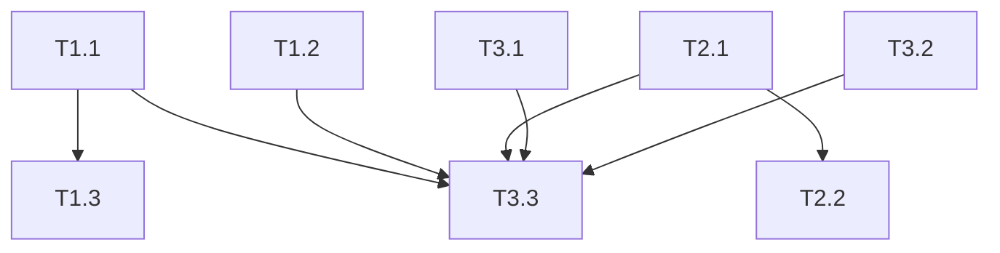

# 任務總覽 — D 槽修復與測試

> **更新**：2026-07-12（方案 B3：`INDEX`／`RULES` 檔名）  
> **規則**：見 [RULES.md](./RULES.md)  
> **導航**：見 [../README.md](../README.md)
---

## 規則說明

- 依賴關係必須形成無環的有向圖（DAG），不得出現循環依賴。

---

## 進度看板

| ID | 標題 | Phase | 優先 | 狀態 | 預估 | 任務檔 |
|----|------|:-----:|:----:|:----:|:----:|--------|
| **T1.1** | AI_HUB 配置編碼修復 | 1 | P1 | done | 15m | [T1.1](./Phase1-立即處理/T1.1_AI_HUB配置編碼修復.md) |
| **T1.2** | 端口與服務對照澄清 | 1 | P1 | done | 10m | [T1.2](./Phase1-立即處理/T1.2_端口與服務對照澄清.md) |
| **T1.3** | AI_HUB venv 與 crewai 相容性 | 1 | P2 | done | 30m | [T1.3](./Phase1-立即處理/T1.3_AI_HUB_venv與crewai相容性.md) — Python 3.12 venv；T13a/T13b 通過 |
| **T2.1** | Chat Completions 與 Provider | 2 | P1 | done | 30m | [T2.1](./Phase2-OmniRoute/T2.1_Chat-Completions路由與Provider.md) — /v1/models + /v1/chat/completions 已驗證；combo stream:true 正常；錯誤路徑 JSON 非 HTML |
| **T2.2** | 壓縮管線驗證 | 2 | P1 | done | 20m | [T2.2](./Phase2-OmniRoute/T2.2_壓縮管線驗證.md) — T22a~T22e 全數通過；壓縮安全邊界已驗證（CCR 需排除） |
| **T3.1** | 大唐 W1-001 文件更新 | 3 | P1 | done | 15m | [T3.1](./Phase3-整合與整理/T3.1_大唐W1-001文件更新.md) |
| **T3.2** | crew_demo 去重 | 3 | P1 | done | 10m | [T3.2](./Phase3-整合與整理/T3.2_crew_demo去重.md) |
| **T3.3** | 跨專案冒煙測試 | 3 | P1 | done | 20m | [T3.3](./Phase3-整合與整理/T3.3_跨專案冒煙測試.md) — T33a–g 全數通過；日誌 `_artifacts/smoke_20260708_final.log` |

**預估總工時**：約 2 小時（不含 Docker Desktop 安裝）

---

## 建議執行順序

```
Phase 1（可並行）
  T1.1 ──┬──→ T1.3
         ├──→ T3.3
  T1.2 ──┘
         │
  T2.1 ──┼──→ T2.2 ──→ T3.3
         │
  T3.1 ──┤（可與 Phase 1/2 並行）
  T3.2 ──┘
```

1. **第一批（並行）**：T1.1 + T1.2 + T3.1 + T3.2  
2. **Phase1 延伸**：T1.3（依賴 T1.1；venv／crewai）  
3. **第二批**：T2.1（OmniRoute 已在 :20128 運行）  
4. **第三批**：T2.2（需 T2.1 通過）  
5. **收尾**：T3.3（需 T1.1、T2.1 至少通過）
---

## 任務依賴圖



> 箭頭方向：`A --> B` 表示 B 依賴 A（須先完成 A）。T2.2 僅依賴 T2.1，不阻擋 T3.3。T1.3 不阻擋 T3.3。
---

## 問題 ID 對照

| 原報告 ID | 任務 | 複查備註 |
|-----------|------|----------|
| W3-001, W3-002, W3-003 | T1.1 | D 槽 JSON 曾有 BOM；2026-07-06 午間已移除，T11a–T11d 通過 |
| —（T1.1 延伸） | T1.3 | Python 3.12 venv；crewai／chromadb 相容；T13a/T13b 通過 |
| W3-009 | T1.2 | OmniRoute=20128；Open WebUI=3000（Docker） |
| W3-008 | T2.1, T2.2 | 非 HTML bug；需正確 model + provider |
| W1-001 | T3.1 | cfg/tang.py 已過時，改文件即可 |
| W3-006 | T3.2 | 兩目錄重複 |
| — | T3.3 | 整合驗收 |
---

## 統計

| 狀態 | 數量 |
|------|:----:|
| pending | 0 |
| in_progress | 0 |
| done | 8 |
| blocked | 0 |

---

## 快速連結

- [規則與使用說明](./RULES.md)
- [任務範本](./_templates/任務文件範本.md)
- [總調度最終報告](../_archive/Wave5-跨專案/W5_T2_最終總報告.md)
