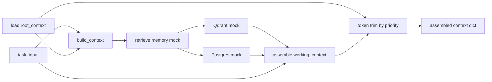

# Context / Memory 模型（D2）

> **版本**：v0.1（设计稿 + mock 实现）  
> **实现**：`context/context_builder.py`  
> **路由规则**：`context/memory_routing_rules.md`  
> **指标对齐**：`metrics/metric_definition.md` §3.3（`context_token_usage`, `memory_hit_rate`）  
> **契约对齐**：`agents/agent_contract.md` → `AgentInput.context` 子结构

---

## 1. 设计目标

把送入 LLM 的「上下文」从一团杂糅文本，拆成**三层、两种持久化、一条进出规则**，以便：

1. **可预算**：在固定 token 上限内，按优先级裁剪而不丢系统约束。  
2. **可路由**：明确什么进语义库、什么进结构化库、什么只留在会话内。  
3. **可观测**：与 D2 指标对接（构建前后 token、memory 命中）。  
4. **可演进**：v0.1 全 mock；接口形状与日后 Qdrant / Postgres 真连一致。

**为什么分层**：模型窗口有限，而信息来源多样（制度、任务、历史）。不分层会导致「制度文」与「过期对话」争抢窗口，或把应结构查询的事实误塞进 embedding。

---

## 2. 三层定义

### 2.1 `root_context`（根上下文）

| 属性 | 说明 |
|------|------|
| **寿命** | 跨任务、跨 session；变更频率低。 |
| **内容** | 系统规则摘要、入口导航（逻辑名，非磁盘路径）、全局 instruction、角色边界引用。 |
| **存储** | 版本化静态片段 + 配置索引（不整份塞进 embedding）。 |
| **进入 LLM** | 每次 `build_context` **优先保留**；仅允许「摘要级」压缩，禁止删除禁则类条目。 |

**为什么单独一层**：宪法 / 合約 / AGENTS 类内容对所有任务同等适用；与任务无关，不应因某次 RAG 未命中而被裁掉。

### 2.1.1 `subtree_context`（子树层 · P0.5 · v0.1 入口）

| 属性 | 说明 |
|------|------|
| **寿命** | 跨同作用域多 task；变更频率介于 root 与 working 之间（见 A-2）。 |
| **内容** | 子流程 `scope_label`、`entry_refs`、runbook 要点；禁止密钥原文与用户 query。 |
| **存储** | v0.1：`build_rooted_context` mock／`task_input` 覆写；非 `context_builder` 核心。 |
| **进入 LLM** | 组装顺序：root → **subtree[]** → working → memory；P0.5 由入口 `metadata.trim` 留痕（R-2 v0.1 heuristic）。 |

治理规格：`workflow_upgrade/01_context-entry/A2_subtree_context_spec.md`；H 线顶栏键见 `context_entry_contract.md` §2.3。

### 2.1.2 `navigation_map`（导航图 · P0.5 · v0.1 入口 · R-1）

| 属性 | 说明 |
|------|------|
| **寿命** | 随单次 `build_rooted_context` 组装；可经 `task_input.navigation_map` 部分覆写。 |
| **内容** | `active_path`（主路径）、`nodes`（`entry_refs` 索引）、`subtree_to_node`（子树关联）。 |
| **存储** | `metadata.navigation_map` 与 `result.navigation_map`；不自动写 nav 实例文件。 |
| **来源** | A-4 `40_navigation_map_template.md` §8 内嵌模板 + 当前 `subtree_context`；见 `core/context_entry.py` → `_auto_navigation_map_v01`。 |

**典型来源（逻辑名）**：

- `HARNESS_CONSTITUTION`（禁區**类型**引用，非实例路径）  
- `ENGINEERING_CONTRACT` / Cursor rules 摘要  
- `AGENTS.md` 起手与红线摘要  
- `Master_Map.json` → `runners` 索引（不贴全文）

---

### 2.2 `working_context`（工作上下文）

| 属性 | 说明 |
|------|------|
| **寿命** | 单次 `task_id` 或单次编排 run；任务结束可丢弃或选择性沉淀。 |
| **内容** | 当前 `goal` / `task_input`、本轮 tool 结果、最近 N 轮对话、handoff 快照、临时 scratch。 |
| **存储** | 进程内 / checkpoint JSON / 短 TTL 缓存；**默认不入**长期语义库。 |
| **进入 LLM** | 在 root 之后、按优先级填充剩余 token；**最先裁**历史轮次与冗长 tool 原文。 |

**为什么单独一层**：大量信息只对当前决策有用（例如某次 Playwright 返回的 DOM 片段）；写入 Qdrant 会污染检索、增加成本，且难以做精确失效。

**与 `AgentInput.context` 的映射**：

| `context` 子键 | 归属 |
|----------------|------|
| `artifacts` | working（引用 id；正文在 working 或 PG） |
| `constraints` | working + 可从 root 模板合并 |
| `prior_outputs` | working（handoff 链） |
| `metadata` | working（trace / handoff_index） |

---

### 2.3 `long_term_memory`（长期记忆）

拆为两个后端，**查询时合并、写入时分流**（见 `memory_routing_rules.md`）：

| 子层 | 引擎 | 擅长 | 不擅长 |
|------|------|------|--------|
| **语义记忆** | Qdrant（embedding） | 相似表述、文档段落、教训类自然语言 | 精确主键、聚合统计、强一致事务 |
| **结构化记忆** | Postgres | 工单状态、gate 分数、run 元数据、幂等键 | 模糊「意思相近」检索 |

**为什么双库**：向量检索解决「像不像」；关系库解决「是不是这条工单、状态是什么」。混在同一 embedding 空间会导致 ID 类事实检索不稳定。

**v0.1**：`context_builder` 使用 `_mock_retrieve_semantic` / `_mock_retrieve_structured`，返回固定形状 dict，字段名与目标 schema 一致。

---

## 3. 上下文组装流水线



1. **Load root** — 注入制度摘要与导航（静态 mock 或日后从 registry 读版本号）。  
2. **Retrieve memory** — 用 `task_input` 中的 `query` / `goal` 拉语义 top-k；用 `task_id` / `work_order_id` 拉结构化行。  
3. **Assemble working** — 合并任务正文、检索命中、约束、handoff。  
4. **Trim** — 在 `MAX_TOTAL_TOKEN_BUDGET` 内按优先级裁剪（见下节）。  
5. **Emit** — 返回分层 dict + `token_usage` + `trimming_log`（供 metrics / Langfuse）。

---

## 4. Token 预算（v0.1 假数值）

> 真实模型上限以部署配置为准；此处为**可测试、可文档化**的占位。

| 常量 | 值 | 说明 |
|------|-----|------|
| `MAX_TOTAL_TOKEN_BUDGET` | `128_000` | 单次调用总上下文预算（假定为 128k 窗口代理）。 |
| `ROOT_RESERVED_TOKENS` | `12_000` | root 软上限；硬保留 `ROOT_MIN_TOKENS`。 |
| `ROOT_MIN_TOKENS` | `4_000` | root 不可裁低于此（禁则摘要）。 |
| `MEMORY_MAX_TOKENS` | `40_000` | 长期记忆合计上限（语义 + 结构化序列化）。 |
| `WORKING_MAX_TOKENS` | `76_000` | 工作层上限（含 task_input；与上两项之和可超总预算，由裁剪器收敛）。 |

**估算方式（v0.1）**：`tokens ≈ len(text) // 4`（中英混合的粗算；日后换 tiktoken）。

**为什么用假数值**：在无真实 tokenizer 与线上流量前，先有**可执行的裁剪顺序**与单元测试断言，避免「感觉裁够了」。

---

## 5. 裁剪优先级（超预算时）

从高到低**保留**（从低到高**先裁**）：

| 优先级 | 区块 | 裁剪策略 |
|--------|------|----------|
| P0 | `root_context` | 仅压缩「说明性」段落；不低于 `ROOT_MIN_TOKENS` |
| P0.5 | `subtree_context[]` | v0.1：活跃 ≤2、`entry_refs` ≤3、按 `subtree_priority` 保留；digest 与 token 超预算见 `metadata.trim` |
| P1 | `working_context.task_input` / `goal` | 不删；可截断附带的超长 `attachments` |
| P2 | `working_context.constraints` | 保留全文；条数多时再合并为 bullet 摘要 |
| P3 | `long_term_memory.structured` | 先裁非关键列（如 `lessons` 长数组） |
| P4 | `long_term_memory.semantic` | 按 `score` 从低到高丢 chunk |
| P5 | `working_context.tool_results` | 先裁最旧条目 |
| P6 | `working_context.conversation_turns` | 先裁最早轮次 |
| P7 | `working_context.scratch` | 全部可丢 |

**为什么此顺序**：P0–P1 保证「能合法执行」；P4–P6 是可再查或可重试的信息；P7 纯缓存。

---

## 6. 进出上下文（生命周期）

### 6.1 进入（Inject）

| 来源 | 目标层 | 触发 |
|------|--------|------|
| 制度 / AGENTS 摘要 | root | 每次 `build_context` |
| 用户 / 编排 `goal` | working | 任务开始 |
| RAG / `query_brain` 命中 | long_term.semantic | `retrieve` 阶段 |
| 工单 / run 表 | long_term.structured | 有 `work_order_id` / `task_id` |
| Tool 输出 | working | 每步执行后 append |
| Handoff 包 | working.prior_outputs | `status=need_handoff` |

### 6.2 退出（Evict / Persist）

| 内容 | 退出方式 | 原因 |
|------|----------|------|
| working 全文 | 任务结束丢弃 | 体积大、时效短 |
| 成功结案摘要 | 结构化 PG + 可选语义 | 幂等键、可统计（对齐 `task_memory_entry_v1`） |
| 文档 chunk | 仅语义库（ingest 管道） | 供相似检索 |
| root 片段 | 不随任务退出 | 版本升级时整包替换 |

### 6.3 禁止

- 将 **`.env` / 密钥原文** 写入任一层（宪法 §7.3）。  
- 将 **完整 checkpoint 二进制** 塞进 prompt。  
- 用 **自然语言整段** 代替 `AgentInput.context` 结构（契约 §2）。

---

## 7. `build_context` 输出形状（v0.1）

```json
{
  "ok": true,
  "message": "context assembled",
  "result": {
    "root_context": { "version": "v0.1", "sections": [] },
    "working_context": { "task_input": {}, "conversation_turns": [], "tool_results": [] },
    "long_term_memory": { "semantic": { "hits": [] }, "structured": { "rows": [] } },
    "assembled_text": "..."
  },
  "metadata": {
    "token_usage": { "root": 0, "working": 0, "memory": 0, "total": 0 },
    "trimming_applied": [],
    "memory_hit_rate": 0.0
  }
}
```

`memory_hit_rate`：`(semantic_hits + structured_rows) / max(lookups, 1)`，无检索时为 `0.0`（与 metrics mock 一致）。

---

## 7.1 Deny rule tables（H 线 · R-3a · v0.1）

执行期最小 deny 规则自 `core/context_entry.py` 抽离至 `context/deny_rules.py`，为 deny engine v1 打底。

| 表 | 模块常量 | 每行键（schema） |
|----|----------|------------------|
| **ContentRuleTable** | `CONTENT_RULE_TABLE` | `id`, `phase`, `gates`, `fields`, `pattern`, `enabled`（可选，默认 `true`） |
| **ActionRuleTable** | `ACTION_RULE_TABLE` | `id`, `phase`, `gate`, `keys`, `enabled`（可选，默认 `true`） |

- **扫描 API**：`scan_content_deny_types(text, …)`、`scan_action_deny_types(task_input, …)`  
- **版本**：`RULE_TABLE_VERSION`（当前 `deny-rules-v0.1`）  
- **合同**：`context_entry_contract.md` §2.4；治理类型全集见 `30_ignore_deny_rules.md` §5  

v0.1 仅收录合同最小集三条内容规则 + 两条行为规则；`rag_hit_with_secrets` 仍为 post 闸派生标签（非 ContentRuleTable 行）。

---

## 8. 非目标（v0.1）

- 不连接真实 Qdrant / Postgres。  
- 不实现异步 ingest / 增量 embedding。  
- 不替代 `gov_core_system` 内 `retrieve_context` 节点（可日后改为调用本模块）。  
- 不自标 Phase 定稿号。

---

## 9. 演进路线

| 阶段 | 内容 |
|------|------|
| v0.1 | 本文 + mock builder + 路由规则 |
| v0.2 | tiktoken、真实 Qdrant collection 名从 `Master_Map` 解析 |
| v0.3 | 写回 `task_memory_entry_v1` 与 metrics collector 联动 |
| v1.0 | 与 LangGraph `retrieve_context` 节点统一入口 |
