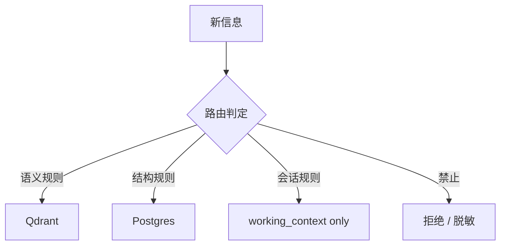

# Memory 路由规则（D2）

> **版本**：v0.1  
> **配套**：`context/context_model.md`、`context/context_builder.py`  
> **原则**：写入时分流、读取时合并；每条规则附 **为什么**。

---

## 1. 总览

长期记忆只有两个写入目的地：

| 目的地 | 技术 | 查询方式 |
|--------|------|----------|
| **语义记忆** | Qdrant（embedding） | 向量相似度 top-k |
| **结构化记忆** | Postgres（表 / JSONB） | 主键 / 过滤 / 聚合 |

**第三态：仅 `working_context`** — 不进入任一长期库，任务结束即失效（除非触发「沉淀规则」）。

---

## 2. 进入 Embedding（Qdrant）的内容

### 2.1 必须进入

| 类型 | 示例 | 为什么 |
|------|------|--------|
| **文档正文 chunk** | ingest 后的 Markdown / PDF 段落 | 用户问题表述多变，需语义相近召回 |
| **可复述教训** | `lessons[]` 中完整句子 | 未来任务「类似情境」靠表述相似匹配 |
| **请求/结果摘要** | `request_summary`, `result_summary`（≤300 字） | 支持「以前做过类似单」的模糊推荐（见 Phase7.5 §7.3） |
| **Runbook / 制度摘录** | 经审核的可移植段落 | 操作问答需引用规程原文片段 |
| **RAG 源文本** | `document_chunks` 集合内容 | 与现有 Data Agent ingest 路径一致 |

### 2.2 可以进入（可选）

| 类型 | 条件 | 为什么 |
|------|------|--------|
| **Tool 输出摘要** | 人工或规则生成 ≤500 字摘要 | 全文太长进向量性价比低；摘要可检索 |
| **对话轮次** | 用户显式「记住」或高 ROI 结案 | 避免自动把噪声对话写入向量空间 |

### 2.3 禁止进入

| 类型 | 为什么 |
|------|--------|
| **密钥、token、连接串** | 向量库泄露不可撤销；宪法 §7.3 |
| **纯 ID / UUID / 日期** | 无语义，检索噪声大；应用 PG |
| **结构化状态机当前态** | 「工单是否 pending」需精确查询，embedding 不稳定 |
| **超大 JSON / DOM 快照** | 稀释向量、成本高；保留 working 或 PG JSONB 归档 |
| **root_context 全文** | 制度应版本化管理，不应按 chunk 漂移 |

### 2.4 写入前处理（建议）

- 分块：目标 **512–1024 token** 一块，重叠 64–128 token（便于边界召回）。  
- 元数据：`source_type`, `task_id`, `work_order_id`, `created_at`, `schema_version`（过滤用，不参与 embed 正文）。  
- 幂等：`content_hash` 去重，避免重复 ingest。

---

## 3. 进入结构化 DB（Postgres）的内容

### 3.1 必须进入

| 类型 | 示例表/概念 | 为什么 |
|------|-------------|--------|
| **工单生命周期** | status, gate, ROI | 状态转移需 ACID / 唯一约束 |
| **任务运行记录** | `task_runs`, step_count, cost | 聚合 KPI、对账 |
| **幂等键** | `work_order_id`, `memory_id` | 防止重复沉淀（`task_memory_entry_v1`） |
| **Gate 分数快照** | `gate_scores_at_intake` vs `gate_scores_actual` | 校準统计需精确字段 |
| **Agent / pipeline 元数据** | `pipeline`, `trace_id`, `outcome` | 报表与 JOIN |
| **工具决策日志** | `tool_decision_log` 行 | 审计、非语义检索 |
| **Ingest 清单** | 文件 id、chunk 数、verify 结果 | 与 Qdrant 通过 id 关联，不做向量 |

### 3.2 可以进入

| 类型 | 为什么 |
|------|--------|
| **Tool 完整输出** | JSONB 归档，按 `task_id` 查；不进 prompt 全量 |
| **Handoff 契约快照** | 编排审计、可重放 |
| **metrics 行** | 与 D1–D5 对齐，供 BI |

### 3.3 禁止进入（明文）

| 类型 | 为什么 |
|------|--------|
| **`.env` 原文** | 应通过 vault / smoke runner，禁止落库明文 |
| **用户密码、Cookie 全量** | 合规与最小暴露 |

---

## 4. 仅存在于 `working_context` 的内容

### 4.1 必须仅会话内

| 类型 | 为什么 |
|------|--------|
| **当前轮 tool 原始 stdout** | 体积大、一次性；摘要后可沉淀 |
| **多轮对话中间态** | 未结案前可能含错误推理，写入长期会污染 |
| **临时 scratch / plan 草稿** | 仅辅助当前步 |
| **本次 handoff 前的完整 `prior_outputs`** | 链式传递；结案后再写摘要入 PG |
| **浏览器 DOM / 截图路径** | 大、易变；引用 id 即可 |

### 4.2 任务结束后的沉淀（退出 working → 长期）

触发条件（满足其一即可评估沉淀）：

| 条件 | 语义库 | 结构库 |
|------|--------|--------|
| 工单 `delivered` / `archived` | `request_summary` + `result_summary` | 整行 `task_memory_entry_v1` |
| `outcome=success` 且 `lessons` 非空 | 每条 lesson 一句一向量 | `lessons` 数组保留在 PG 行 |
| ingest verify 通过 | chunk 向量 | ingest 元数据行 |

**为什么事后沉淀**：避免把失败路径上的错误结论写入长期记忆。

---

## 5. 读取路由（`build_context` 阶段）

| 步骤 | 动作 | 为什么 |
|------|------|--------|
| 1 | 始终加载 `root_context` | 制度不依赖检索命中 |
| 2 | 若 `task_input.work_order_id` 存在 → PG mock/真查 | 精确上下文 |
| 3 | 若 `task_input.query` 或 `goal` 存在 → Qdrant mock/真查 | 模糊相关知识 |
| 4 | 合并进 `working_context`，再裁剪 | 统一出口、单一 token 账本 |

**lookup 计数**：用于 `memory_hit_rate`；mock 阶段命中数由 stub 返回的 `hits` / `rows` 决定。

---

## 6. 决策表（快速查）

| 内容 | Qdrant | Postgres | Working only |
|------|:------:|:--------:|:--------------:|
| 文档 chunk | ✓ | 元数据 | |
| 用户 goal 原文 | | | ✓ |
| goal 摘要（结案后） | ✓ | ✓ | |
| 工单 status | | ✓ | |
| gate 分数 | | ✓ | |
| API 密钥 | ✗ | ✗ | ✗ |
| Tool 原始输出 | | 可选 JSONB | ✓ |
| Tool 摘要 | ✓ | 可选 | |
| 对话历史（进行中） | | | ✓ |
| lessons 句子 | ✓ | ✓ | |
| AGENTS 全文 | | | root 索引 |
| trace_id | | ✓ | ✓ metadata |

✗ = 禁止  
空 = 默认不写  

---

## 7. 与 observability 的对接

| 字段 | 来源 |
|------|------|
| `context_token_usage` | `build_context` → `metadata.token_usage` |
| `memory_hit_rate` | `metadata.memory_hit_rate` |
| `error_type=context_overflow` | 裁剪后仍超预算且无法降到 `ROOT_MIN` 以下时 |

---

## 8. v0.1 范围

- 本文档为**制度**；`context_builder.py` 仅 mock 检索与路由形状。  
- 不实现 ingest 管道写库。  
- 冲突时以 `HARNESS_CONSTITUTION.md` §7 禁區类型为准。
