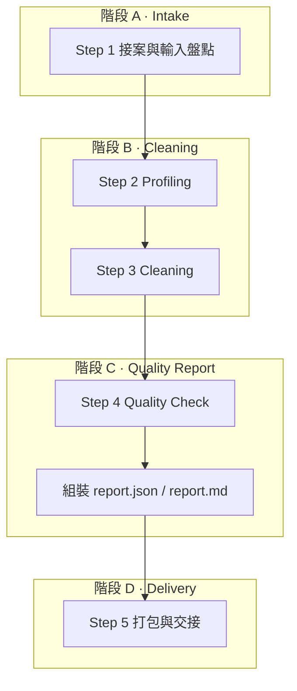

# C2-P2 · Tabular Cleaning 對內執行 Runbook

> **票號**：C2-P2 · Execution Plan / Runbook v0.1  
> **性質**：**INTERNAL USE ONLY** · **NOT A PROD PIPELINE** · **NON-SLA**  
> **承接**：`docs/PRODUCT_TABULAR_CLEANING.md`（C2-P1 Product Spec §5 high-level steps）  
> **Demo 錨點**：`docs/C2-D1_DEMO_WALKTHROUGH.md` · `cases/demo_phase/`  
> **技術權威**：`04_Workflows/WAVE6_CLEAN_PRODUCT_MATRIX_v0.1.md` · `04_Workflows/WAVE6_CLEAN_DELIVERABLE_TEMPLATES_v0.1.md`

---

## §0 文件性質與邊界聲明

| 聲明 | 說明 |
|------|------|
| **INTERNAL USE ONLY** | 本檔供內部執行者（資料分析師、Implementer、PM）依案操作；**非**對外 Product Spec，不取代 C2-P1。 |
| **NOT A PROD PIPELINE** | 描述的是**專案制、人工驅動、可重現腳本輔助**流程；**不存在**客戶自助上傳或無人值守 production CLEAN pipeline。 |
| **NON-SLA** | 交付時間與品質以專案約定為準；**非** 7×24 託管、**非**運維級 SLA、**不**保證零錯誤或全捕獲。 |
| **人工確認為必經** | 規則取捨、邊界案例、業務歧義須人工簽核；腳本與 demo 僅輔助，不可替代判斷。 |

> **再次提醒（階段 B／C 執行前必讀）**：即使 `report.json` 顯示 `qa_status=pass`，仍須人工複核異常列、去重策略與缺失填補是否符合客戶業務語意；**不得**因指標改善而自動對客戶交付。

---

## §1 概述與讀者

### 1.1 本 Runbook 做什麼

將 C2-P1 §5 的五步骨架（Intake → Profiling → Cleaning → Quality Check → Report）收斂為**四階段對內可執行流程**：

| Runbook 階段 | 對應 C2-P1 §5 | 一句話 |
|--------------|---------------|--------|
| **A · 接收資料（Intake）** | Step 1 | 盤點輸入、對齊主鍵與規則、決定是否降級 |
| **B · 清洗（Cleaning）** | Step 2 + Step 3 | Profiling → 規則套用 → 產出清洗檔 |
| **C · 品質戰報（Quality Report）** | Step 4 + Report 產出 | QC 對照基線、組裝 `report.json`／`report.md` |
| **D · 對客戶交付（Delivery）** | Step 5 交付面 | 打包、簽核、交接與留痕 |

### 1.2 讀者與角色

| 角色 | 職責 |
|------|------|
| **案件負責人（Lead）** | 統籌四階段、對客戶溝通、最終交付簽核 |
| **資料分析師（Analyst）** | Profiling、規則草案、QC 指標解讀 |
| **執行者（Implementer）** | 腳本／notebook 輔助清洗、產出機讀報告 |
| **Reviewer（內部）** | 對照 AC、誠實邊界、指標與 C2-P1 §3.1 一致性 |

### 1.3 標準交付包（複述 C2-P1 §3.1）

每案完成後應具備：

| 產物 | 檔名範例 | 說明 |
|------|----------|------|
| 清洗後資料檔 | `{case}_cleaned.csv` | 依約定格式；本案 demo 為 `Phase_cleaned.csv` |
| 結構化品質報告 | `report.json` | 含 `product_metrics` + Wave 6 `summary`／`stats`／`errors` |
| 可讀摘要 | `report.md` | 決策規則與前後指標對照 |
| 剖析統計（建議） | `cleaning_stats.json` | before/after profiling 明細 |
| Case 戰報（建議） | `docs/CASE_REPORTS/{TICKET}_*.md` | 人讀完整戰報 |
| 決策規則紀錄 | `report.json` → `cleaning_rules_applied` | 本次採用規則清單 |
| 簽核記錄 | `delivery_signoff.md`（建議） | 人工確認點與簽名人 |

---

## §2 權威索引

| 文件 | 用途 |
|------|------|
| `docs/PRODUCT_TABULAR_CLEANING.md` | 對外 Product Spec；輸入契約 §2、指標 §3.1、流程 §5 |
| `04_Workflows/WAVE6_CLEAN_PRODUCT_MATRIX_v0.1.md` | CLEAN-BASIC／ENRICH 能力矩陣 |
| `04_Workflows/WAVE6_CLEAN_DELIVERABLE_TEMPLATES_v0.1.md` | `report.json` 章節權威 |
| `docs/C2-D1_DEMO_WALKTHROUGH.md` | 可帶客戶看的 demo 導覽 |
| `docs/CASE_REPORTS/C2-D1_PHASE_CLEANING_REPORT.md` | Phase 案完整戰報 |
| `docs/CASE_REPORTS/C2-D1_QUALITY_REPORT_SAMPLE.md` | 品質戰報模板樣例 |
| `notebooks/csv_cleaning/clean_phase_demo.py` | C2-D1 可重跑 demo（**非 prod**） |
| `notebooks/csv_cleaning/run_tabular_cleaning_plan.py` | 本 runbook 步驟／檢查清單提示（**非 prod**） |
| `cases/index.json` · `scripts/lookup_case_history.py` | 歷史案例只讀索引（Wave 4A）；接案前查相似案與 `known_limits`（**推薦**，非 hard gate） |

---

## §3 端到端流程總覽

### 3.1 四階段 ↔ C2-P1 五步對照



### 3.2 文字版流程（含關鍵產物）

```text
[A Intake]
  客戶 CSV/Excel + 欄位說明 + 主鍵約定
    → intake_checklist.md（或工作筆記）
    → 人工簽核 #1：規則矩陣與降級聲明

[B Cleaning]
  Profiling → cleaning_stats.json（before）
    → 人工簽核 #2：閾值／去重／缺失策略
  套用規則 → {case}_cleaned.csv + cleaning_stats.json（after）

[C Quality Report]
  QC 對照基線 → report.json + report.md + case 戰報
    → 人工簽核 #3：qa_status、警告項、異常列處置

[D Delivery]
  交付包 + 簽核記錄 → 客戶／內部 ticket
    → 人工簽核 #4：Lead 交付確認
```

### 3.3 一鍵提示（僅列步驟，不執行清洗）

```bash
python notebooks/csv_cleaning/run_tabular_cleaning_plan.py
python notebooks/csv_cleaning/run_tabular_cleaning_plan.py --stage intake
python notebooks/csv_cleaning/run_tabular_cleaning_plan.py --stage all --case demo_phase
```

### 3.4 自動化模式（Automation overlay · v1）

> **權威**：`docs/tabular-cleaning-automation-manifest-v1.md` · **控制面**：`docs/tabular-cleaning-control-plane-v1.md`  
> **性質**：control plane + unified driver v1 已落地；**不**改變各 stage CLI semantics · **非** prod gate。

| 模式 | 說明 |
|------|------|
| **Manual（預設）** | 本 runbook §4–§7 四階段 + 人工簽核 #1–#4 |
| **Near-auto** | manifest R1–R6 + `run_case_e2e_validation.py`；人類 start/pause/stop + CP-A/B |
| **HITL 最小集** | CP-A（intake review）· CP-B（delivery review）；低風險 allowlist 可跳過 |

**運營查現況（read-only）** — 運營查詢 Tabular 案件現況，請用 `scripts/tabular_ops_summary.py`：

```bash
# 人類可讀表格（預設）
python scripts/tabular_ops_summary.py --case-id demo_phase
python scripts/tabular_ops_summary.py --client-ref sampleco

# 機器可讀 JSON
python scripts/tabular_ops_summary.py --case-id demo_phase --json
python scripts/tabular_ops_summary.py --all --json
```

輸出含：`automation_status` · 完成步驟數 · CP-A/B 狀態 · `output_guard_status` · `delivery_approval_status` / `delivery_ready` · `dlq_status` · `warning_guard_profile`（見 manifest §1.12）。

**控制面 CLI（v1）** — 人類 start / pause / resume / stop：

```bash
python scripts/manage_tabular_automation_state.py status \
  --case-dir cases/demo_phase --json
python scripts/manage_tabular_automation_state.py start \
  --case-dir cases/demo_phase --requested-by operator --json
python scripts/manage_tabular_automation_state.py pause \
  --case-dir cases/demo_phase --requested-by operator --json
python scripts/manage_tabular_automation_state.py resume \
  --case-dir cases/demo_phase --requested-by operator --json
python scripts/manage_tabular_automation_state.py stop \
  --case-dir cases/demo_phase --requested-by operator --json
```

一鍵 E2E（near-auto 錨點；**不**讀 control state）：

```bash
python scripts/run_case_e2e_validation.py --case-dir cases/demo_phase --json
```

**Tabular 主鏈最小 regression（control plane + driver + HITL + delivery approve）** — 任何對 state schema、driver、HITL、approve 的變更，均需跑：

```bash
python scripts/run_demo_phase_regression_smoke.py --json
```

詳見 `docs/tabular-demo_phase-regression-v1.md`。

**Tabular 主線 E2E 驗證（雙案 allowlist · control plane + HITL + delivery）** — Batch 2+ 回歸基準：

```bash
# 詳見 docs/tabular-mainline-e2e-verification-v1.md
python scripts/run_demo_phase_regression_smoke.py --json   # demo_phase 一鍵
# sampleco/2026-0001：依 checklist §4 逐步 CLI（CP-B HITL 路徑）
```

報告：`docs/tabular-mainline-e2e-verification-report-v1.md` · **`tabular_mainline_e2e_ready: true_with_known_limits`**（2026-06-27）。

> Tabular 主線已完成一次可重複的 E2E 驗證；後續變更應以此驗證流程作為回歸基準。  
> **最新進度更新**：`docs/tabular-mainline-progress-update-2026-07-22.md` · 模板 `docs/tabular-mainline-progress-template.md`

Unified driver（讀 `automation_state.json` · 寫 `reports/automation_run_log.json`）：

```bash
# 1. 人類 start
python scripts/manage_tabular_automation_state.py start \
  --case-dir cases/demo_phase --requested-by operator --json

# 2. 執行主鏈（allowlist · demo_phase 需 --force 因 review_needed）
python scripts/run_tabular_automation.py --case-id demo_phase --force --json

# 3. 可選：從指定 stage 起 / 止
python scripts/run_tabular_automation.py --case-id demo_phase \
  --start-from gate --stop-after bundle --force --json

# 4. pause 後 resume（須先 manage ... resume 或 start）
python scripts/run_tabular_automation.py --case-id demo_phase --resume --force --json

# 5. 規劃不執行
python scripts/run_tabular_automation.py --case-id demo_phase --dry-run --json
```

**HITL resume（CP-A/B 停鏈後）** — 詳見 `docs/tabular-hitl-resume-flow-v1.md`：

```bash
python scripts/run_hitl_checkpoint_cli.py approve-a --case-id demo_phase --json
python scripts/run_hitl_checkpoint_cli.py resume-after-checkpoint --case-id demo_phase --json
python scripts/run_hitl_checkpoint_cli.py approve-b --case-id demo_phase --json
python scripts/run_hitl_checkpoint_cli.py resume-after-checkpoint --case-id demo_phase --json
```

**Driver 步驟**：`intake` → `gate` → `checkpoint_a` → `clean` → `report` → `bundle` → `e2e` → `checkpoint_b`

**邊界**：

- 僅 **低風險 allowlist**（`demo_phase` · `sampleco/*`）；其餘需 `--force`（internal demo）

**Tabular 主線已支援 `demo_phase` + `sampleco/2026-0001` 兩個標準案**（profiles 見 `docs/tabular-cleaning-profiles-v1.md`）。
- 需 `automation_status=running`（`--dry-run` 除外）
- pause/stop 於 **步驟間** 安全停下；不 rollback 已完成產物
- CP-A/B **awaiting_human** 時停鏈（`automation_status=paused` · `pause_reason=awaiting_checkpoint_a|b`）；`run_hitl_checkpoint_cli.py approve-a|approve-b` 後 `resume-after-checkpoint` 接回主鏈（見 `docs/tabular-hitl-resume-flow-v1.md`）
- CP-B 完成後：driver 寫入 `delivery_approval.json` readiness（`maybe_update_delivery_readiness`）；Lead 用 `approve_tabular_delivery.py` 結構化 approve/reject
- **Retry / DLQ（v1）**：transient 錯誤（I/O · timeout · file lock）最多重試 3 次（backoff 1s→2s→4s）；用盡或非 transient hard fail → `cases/<case>/dlq/`。**DLQ 不會自動重跑或觸發 delivery**，僅收集問題供運營定期清理（見 manifest §1.9）
- **不**觸發 CI gate · Phase% · closure

**查 DLQ 與失敗狀態**：

```bash
python scripts/manage_tabular_automation_state.py status \
  --case-dir cases/demo_phase --json   # dlq_status · retry_count · last_error_at

cat cases/demo_phase/dlq/dlq.json      # 索引
ls cases/demo_phase/dlq/*.json           # 單筆 entry

cat cases/demo_phase/reports/automation_run_log.json
```

**運營處理 DLQ（v1 · collect-only）**：

1. **發現**：`automation_status=failed` 且 `dlq_status=queued`；或收到 internal notify `case.dlq_enqueued`（寫入 `internal_notify_log.json`）。
2. **定位**：讀 `cases/<case>/dlq/dlq.json` 索引 → 開啟對應 `<entry_id>.json` 看 `step_name` · `error` · `failure_class` · `cleaning_profile_id`。
3. **交叉確認**：`reports/automation_run_log.json` 最後一步之 `attempt` · `error_if_any` · `dlq_if_any` · `retry_attempts[]`。
4. **處置**（人工，**不**自動重跑）：
   - **Transient 用盡**：修復根因（磁碟／權限／鎖檔）→ `manage_tabular_automation_state.py start --restart` → 從失敗 step 手動重跑 driver。
   - **Schema / artifact 類**：修正 raw 或 intake → restart → 重跑。
   - **HITL / eligibility 類**：**不**走 DLQ；用 checkpoint / gate CLI。
5. **清理**：問題已解決或已人工處理後，呼叫 `tabular_automation_retry_dlq_lib.mark_dlq_handled(case_dir, entry_id)` 或手動改 entry `status=handled` 與索引列；可選將 `automation_state.dlq_status` 設為 `handled`。
6. **禁止**：DLQ entry **不會**觸發自動 re-run、delivery、或 outbox replay。

**Delivery approval CLI（CP-B 後 · tabular 主鏈）**：

```bash
python scripts/approve_tabular_delivery.py --case-id demo_phase --approve --by lead --json
python scripts/approve_tabular_delivery.py --case-id demo_phase --reject --by lead \\
  --reason "guard warning" --json
```

更新：`delivery_approval.json` · `delivery_signoff.md`（Signoff 表）· `cases/index.json`（已登記 case）· `automation_state.json` → `delivery` 鏡像。

**`delivery_ready=true` 條件**：CP-B approved + e2e pass + `output_guard.status=ok`；`rejected` 不可由 driver 自動改 approved。

---

## §4 階段 A · 接收資料（Intake）— 目的

確認本案落在 C2-P1 服務範圍內，盤點 §2.1 必備輸入，與客戶對齊主鍵、可缺失欄、去重策略與輸出格式；不足時標 **degraded scope** 而非硬做。

**Spec refs**：C2-P1 §2.1–§2.4、§4.2、§5 Step 1

---

## §5 階段 A · Inputs

| 輸入 | 檔名／格式範例 | 來源 |
|------|----------------|------|
| 原始資料檔 | `Phase.csv`、`orders_2026Q1.xlsx` | 客戶交付 |
| 欄位說明 | `schema_notes.md` 或郵件正文 | 客戶 |
| 主鍵約定 | 例如 `Phase`（本案）、`order_id` | 客戶確認 |
| 可缺失欄位清單 | 例如 `之前` 允許空 | 客戶確認 |
| 清洗目標 | 「去重 Phase」「統一百分比格式」 | 客戶 |
| 敏感欄位標註（建議） | PII 欄位列表 | 客戶 |

**C2-D1 demo 錨點**：`cases/demo_phase/Phase.csv`（7 列、4 欄）

---

## §6 階段 A · Outputs

| 產物 | 檔名範例 | 內容 |
|------|----------|------|
| Intake 摘要 | `intake_summary.md` 或 ticket 筆記 | 目標、規模、缺口、降級聲明 |
| 規則矩陣草案 | `cleaning_rules_draft.md` | 缺失／重複／異常／格式四類初步策略 |
| 作業 ID | `job_id` 字串 | 例如 `C2-D1-DEMO-PHASE` |

---

## §7 階段 A · 檢查清單與命令

### 7.1 必備輸入檢查（對照 C2-P1 §2.1）

- [ ] **（推薦）** 跑 gate 或清洗前，先查歷史案例索引：`python scripts/lookup_case_history.py --client-ref <slug>` 或 `--schema-headers <h1,h2,...>`（至少對新 `client_ref`／表頭組合執行一次）；查 `known_limits` 與 gate 備註，**不**取代後續 eligibility gate
- [ ] 原始檔可解析為二維表格（非掃描 PDF／純圖片）
- [ ] 單檔規模 ≤ 約 100 萬列／1 GB（超出 → 拒收或分批，見附錄 C）
- [ ] 欄位說明已收（名稱、型別、業務意義）
- [ ] 主鍵或 surrogate key 策略已約定
- [ ] 可缺失欄 vs 必填欄已區分
- [ ] 清洗目標優先序已記錄
- [ ] Excel 多 sheet 時已指明要處理的工作表

### 7.2 命令範例

```bash
# 歷史案例 lookup（推薦；只讀 cases/index.json）
python scripts/lookup_case_history.py --client-ref SAMPLECO
python scripts/lookup_case_history.py --list-all

# 列數與欄位快速檢視（CSV）
python -c "import csv,sys; r=list(csv.DictReader(open(sys.argv[1],encoding='utf-8-sig'))); print('rows',len(r),'cols',list(r[0].keys()) if r else [])" cases/demo_phase/Phase.csv

# Runbook 步驟提示
python notebooks/csv_cleaning/run_tabular_cleaning_plan.py --stage intake
```

### 7.3 人工確認點 #1 — Intake 簽核

| 項目 | 簽核人 | 簽什麼 |
|------|--------|--------|
| 輸入完整性與降級聲明 | **Lead** | 確認缺項是否影響交付範圍；若 degraded scope 已告知客戶 |
| 主鍵／去重／缺失策略草案 | **Lead + 客戶** | 書面或郵件確認（demo：主鍵 `Phase`，去重保留較高 `現在（建議）`） |
| SKU 選擇 | **Analyst** | 本案為 `CLEAN-BASIC`；若需 ENRICH 另開票（C2-P1 §4.3 ❌ 預設） |

---

## §8 階段 B · 清洗（Cleaning）— 目的

在已簽核規則下，先 **Profiling** 建立基線，再執行缺失／重複／異常／格式四類處理，產出清洗後檔案與規則版本紀錄。

**Spec refs**：C2-P1 §1.1 四類清洗、§3.1、§5 Step 2–3

> **NON-SLA 提醒**：腳本輸出僅為可重現輔助；邊界案例（如 105% 是否截斷）**必須**在 Profiling 後由人工決定，不得預設全自動。

---

## §9 階段 B · Inputs

| 輸入 | 說明 |
|------|------|
| 已簽核 `cleaning_rules_draft.md` | 階段 A 產出 |
| 原始資料檔 | 例如 `cases/demo_phase/Phase.csv` |
| `job_id` | 貫穿報告 |

---

## §10 階段 B · Outputs

| 產物 | 檔名範例 | 說明 |
|------|----------|------|
| Profiling 統計 | `cleaning_stats.json` | `before`／`after` 區塊 |
| 清洗後資料 | `Phase_cleaned.csv` | 5 列（demo） |
| 規則應用紀錄 | 併入後續 `report.json` → `cleaning_rules_applied` | 每條規則與描述 |

---

## §11 階段 B · 檢查清單與命令

### 11.1 Profiling（Step 2）

- [ ] 記錄 `total_rows`（intake 列數）
- [ ] 各欄 `missing_rate_by_field`（before）
- [ ] 重複候選（主鍵／組合鍵）
- [ ] 格式分佈（日期、百分比、空白、大小寫）
- [ ] 異常候選（範圍、枚舉、跨欄邏輯）
- [ ] 產出 `cleaning_stats.json` 或等價摘要

### 11.2 Cleaning（Step 3）

| 類型 | 檢查項 | Demo 參照 |
|------|--------|-----------|
| **缺失** | 關鍵欄缺失 → 刪列或拒絕；非關鍵 → 保留空值 | Phase 空白列刪除 |
| **重複** | 依已簽核策略去重 | `Phase 2`／`phase 2` 保留較高 `現在（建議）` |
| **異常** | 標記或隔離；是否截斷須事前約定 | 105% 保留並標記 |
| **格式** | trim、命名統一、百分比轉數值 | `%` 移除、Phase 大小寫 |

### 11.3 命令範例

```bash
# C2-D1 demo：可重現清洗（展示用，非 prod pipeline）
python notebooks/csv_cleaning/clean_phase_demo.py

# 預期結構化輸出
# {"ok": true, "input_rows": 7, "output_rows": 5, "report_json": "cases/demo_phase/report.json"}

# Runbook 步驟提示
python notebooks/csv_cleaning/run_tabular_cleaning_plan.py --stage cleaning
```

### 11.4 人工確認點 #2 — 規則與邊界簽核

| 項目 | 簽核人 | 簽什麼 |
|------|--------|--------|
| Profiling 摘要與閾值 | **Analyst → Lead** | 異常定義、日期格式、去重鍵 |
| 邊界案例處置 | **Lead + 客戶（視需要）** | 例如超範圍 105%：保留／截斷／NULL |
| 缺失填補矩陣 | **Lead** | 禁止未約定之自動猜測填補 |

---

## §12 階段 C · 品質戰報（Quality Report）— 目的

對照 Profiling 基線驗證指標改善是否合理，組裝符合 C2-P1 §3.1 與 Wave 6 骨架的 `report.json`／`report.md`，並撰寫 case 戰報供內部與客戶閱讀。

**Spec refs**：C2-P1 §3.1、§5 Step 4–5（報告產出部分）

---

## §13 階段 C · Inputs

| 輸入 | 說明 |
|------|------|
| `cleaning_stats.json` | before/after |
| `{case}_cleaned.csv` | 清洗結果 |
| `cleaning_rules_applied` | 規則清單 |
| Wave 6 模板 | 章節：`summary`、`stats`、`errors`、`next_steps` |

---

## §14 階段 C · Outputs

| 產物 | 檔名範例 | 必填區塊 |
|------|----------|----------|
| 結構化報告 | `cases/demo_phase/report.json` | `meta`、`summary`、`product_metrics`、`stats`、`errors` |
| 可讀摘要 | `cases/demo_phase/report.md` | 前後指標、警告項 |
| Case 戰報 | `docs/CASE_REPORTS/C2-D1_PHASE_CLEANING_REPORT.md` | 策略、局限、驗證方法 |
| 模板對照 | `docs/CASE_REPORTS/C2-D1_QUALITY_REPORT_SAMPLE.md` | 欄位樣式 |

**Demo 核心指標（須與 JSON 一致）**：

| 指標 | 值 |
|------|-----|
| `total_rows` | 7 |
| `accepted_rows` | 5 |
| `rejected_rows` | 1 |
| `duplicate_rows_found` | 2 |
| `duplicate_rows_removed` | 1 |
| `qa_status` | `pass_with_warnings` |

---

## §15 階段 C · 檢查清單

### 15.1 Quality Check（Step 4）

- [ ] `accepted_rows` + `rejected_rows` 與清洗邏輯一致
- [ ] `missing_rate_by_field` 前後對照合理（注意分母變化）
- [ ] `duplicate_rows_found`／`duplicate_rows_removed` 與去重策略一致
- [ ] `anomaly_count_by_rule` 與人工預期一致
- [ ] `format_fixes_applied` 已按規則分類
- [ ] `errors.error_categories` 與 `top_errors_sample` 已脫敏
- [ ] `summary.sku` = `CLEAN-BASIC`（本案）
- [ ] 可選：內部 Wave B eval 複查（C2-P1 §6 — **非**客戶必備）

### 15.2 報告組裝（Step 5 產出段）

- [ ] `product_metrics` 欄位名稱嚴格對齊 C2-P1 §3.1（見附錄 A）
- [ ] `meta.disclaimer` 含 non-SLA／manual review 語意
- [ ] `next_steps.for_customer` 列出需客戶決策項
- [ ] `cleaning_rules_applied` 可追溯

### 15.3 命令範例

```bash
# 重跑 demo 以刷新報告
python notebooks/csv_cleaning/clean_phase_demo.py

# 驗證 product_metrics 關鍵欄位
python -c "import json; d=json.load(open('cases/demo_phase/report.json')); m=d['product_metrics']; print(m['total_rows'],m['accepted_rows'],d['summary']['qa_status'])"

python notebooks/csv_cleaning/run_tabular_cleaning_plan.py --stage quality
```

### 15.4 人工確認點 #3 — QC 與報告簽核

| 項目 | 簽核人 | 簽什麼 |
|------|--------|--------|
| `qa_status` 與警告項 | **Reviewer 或 Lead** | `pass`／`pass_with_warnings`／`fail` 是否可交付 |
| 異常列處置 | **Analyst** | 例如 105% 是否需在交付說明中特別標註 |
| 指標與 case 戰報一致性 | **Reviewer** | §4.1 表格與 `report.json` 數值一致 |

---

## §16 階段 C · 誠實邊界（再述）

- `report.json` **不代表** production `w6://delivery/{job_id}/...` 交付。
- `chargeable_hint: false`（demo）— **不代表**可開票或 SLA 達標。
- 異常 flag 可僅在 JSON 內部（C2-D1 刻意不在 CSV 外顯 `_flags`）；真實案需與客戶約定 sidecar 欄位。

---

## §17 階段 D · 對客戶交付（Delivery）— 目的

將 §3.1 標準交付包與簽核記錄一併交予客戶或客戶指定聯絡人，並保留內部留痕供下次迭代。

**Spec refs**：C2-P1 §3.1–§3.2、§5 Step 5

---

## §18 階段 D · Inputs / Outputs

### Inputs

| 輸入 | 說明 |
|------|------|
| 階段 C 產出全套 | `*_cleaned.csv`、`report.json`、`report.md`、case 戰報 |
| QC 簽核記錄 | 階段 C #3 已完成 |

### Outputs

| 產物 | 檔名範例 | 說明 |
|------|----------|------|
| 交付包目錄 | `delivery/{job_id}/` | 清洗檔 + 報告 + 規則摘要 |
| 交付清單 | `delivery_manifest.md` | 檔案列表與 SHA 摘要（不含敏感全文） |
| 簽核記錄 | `delivery_signoff.md` | 簽名人、日期、已知限制聲明 |
| 可選：收集建議 | `next_collection_tips.md` | C2-P1 §3.2 |

**Demo 交付清單範例**：

```text
delivery/C2-D1-DEMO-PHASE/
  Phase_cleaned.csv
  report.json
  report.md
  delivery_signoff.md
  README_pointer.md  → docs/C2-D1_DEMO_WALKTHROUGH.md
```

---

## §19 階段 D · 檢查清單與人工確認點 #4

### 19.1 交付前檢查

- [ ] 交付包檔案完整且路徑相對、無本機絕對路徑洩漏
- [ ] PII 已依約定脫敏
- [ ] 客戶已知 **非 SLA**、**非全自動**、**不保證全捕獲**（對照 C2-P1 §1.3）
- [ ] 已知限制與人工確認點已寫入 `delivery_signoff.md` 或 case 戰報 §5
- [ ] 未暗示自助入口／一鍵 pipeline 已上線

### 19.2 人工確認點 #4 — 交付簽核

| 項目 | 簽核人 | 簽什麼 |
|------|--------|--------|
| 對外交付批准 | **Lead** | 確認可發送交付包給客戶 |
| 商業邊界聲明 | **Lead** | 確認未超出 C2-P1 §3.3／§4.3 承諾範圍 |
| 內部留痕 | **Scribe（視需要）** | ticket state／Progress 摘要 |

### 19.3 命令範例

```bash
python notebooks/csv_cleaning/run_tabular_cleaning_plan.py --stage delivery
```

---

## 附錄 A · C2-P1 §3.1 ↔ Wave 6 欄位對照

| C2-P1 `product_metrics` | Wave 6 對應 | 備註 |
|-------------------------|-------------|------|
| `total_rows` | `summary.total_rows` · `stats.row_counts.intake` | 原始 intake 列數 |
| `accepted_rows` | `summary.accepted_rows` · `stats.row_counts.ok` | 納入交付檔之列 |
| `rejected_rows` | `summary.rejected_rows` · `stats.row_counts.rejected` | 拒絕／隔離列 |
| `duplicate_rows_found` | 產品層；dedup 前計數 | Wave 6 無同名欄；對照 ENRICH `dedup_groups_found` 語意不同 |
| `duplicate_rows_removed` | 產品層 | 語意接近 ENRICH `dedup_removals`；BASIC demo 放 `product_metrics` |
| `missing_rate_by_field` | `stats.missing_value_stats` | 欄位級 before/after 率 |
| `anomaly_count_by_rule` | `errors.error_categories` | 規則代碼如 `percent_out_of_range_0_100` |
| `format_fixes_applied` | 產品層 | Wave 6 無同名欄；記於 `product_metrics` |

**Wave 6 `summary` 額外欄位（內部／計費參考）**：

| 欄位 | Demo 值 | 說明 |
|------|---------|------|
| `sku` | `CLEAN-BASIC` | 產品包 |
| `qa_status` | `pass_with_warnings` | 見 `WAVE6_CLEAN_DELIVERABLE_TEMPLATES` §1.2.4 |
| `accepted_units` | 5 | 計費單位語意 |
| `chargeable_hint` | `false` | demo 非最終 Chargeable |

---

## 附錄 B · C2-D1 Demo 範例（路徑與指標）

| 項目 | 路徑／值 |
|------|----------|
| 原始樣本 | `cases/demo_phase/Phase.csv` |
| 清洗產物 | `cases/demo_phase/Phase_cleaned.csv` |
| 報告 | `cases/demo_phase/report.json`、`report.md` |
| 剖析 | `cases/demo_phase/cleaning_stats.json` |
| 執行腳本 | `notebooks/csv_cleaning/clean_phase_demo.py` |
| 導覽 | `docs/C2-D1_DEMO_WALKTHROUGH.md` |
| Case 戰報 | `docs/CASE_REPORTS/C2-D1_PHASE_CLEANING_REPORT.md` |

**重跑驗證**：

```bash
python notebooks/csv_cleaning/clean_phase_demo.py
# 預期：ok=true, input_rows=7, output_rows=5
```

---

## 附錄 C · 常見降級／拒收情境

| 情境 | 建議動作 | Runbook 階段 |
|------|----------|--------------|
| 缺欄位說明或主鍵 | **degraded scope**：僅 feasibility 評估 + 缺口清單 | A |
| 單檔 > 1 GB 或 > 100 萬列 | 拒收或分批；另議 | A |
| 掃描 PDF／圖片表格 | **拒收**（C2-P1 §2.4、§4.3 OCR ❌） | A |
| 需 CLEAN-ENRICH 外部 API | **另開票**；本 runbook 預設 BASIC | A |
| 編碼無法辨識 | 請客戶轉 UTF-8 後重送 | A |
| Profiling 發現大量業務邏輯歧義 | 暫停清洗；召開人工規則會議 | B |
| `qa_status=fail` | 不修復不交付；`fix_and_rerun` 或書面豁免 | C |
| 客戶要求寫入 production DB | **不在 v1 範圍**（C2-P1 §2.3） | D |
| 客戶要求 SLA／7×24 | **禮貌拒絕或另議**；引用 §1.3 | D |

---

## 版本

| 項目 | 說明 |
|------|------|
| 版本 | v0.1-draft · 2026-06-07 · C2-P2 |
| 狀態 | 對內 runbook 初稿；待 Reviewer 依 AC 驗收 |
| 下一步 | C2-P3 定價分級；JSON Schema 落盤；異常 sidecar 外顯規則 |

---

*C2-P2 Tabular Cleaning Runbook · INTERNAL USE ONLY · NOT A PROD PIPELINE · NON-SLA*
