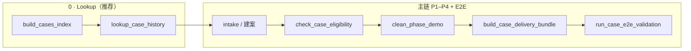

# MVP 对外 Demo 走查 v0.1

> **票号**：W-MVP-W4C-DEMO-WALKTHROUGH  
> **性质**：**INTERNAL / DEMO ONLY** · 串联 Wave 2–4 MVP 主链叙事 · **非** prod pipeline · **非** SLA  
> **代表案例**：`cases/demo_phase`（内部小样本锚点）· `cases/sampleco/2026-0001`（真实风格合成案 · 护栏对照）  
> **验收权威**：`docs/MVP_CASE_E2E_DoD_v0.1.md`（本档只做交叉引用，**不修改** DoD 通过标准）

---

## 0. 文档定位与边界

| 声明 | 说明 |
|------|------|
| **Demo 走查** | 供 PM / 销售 / Reviewer **从零冷启动**跟跑两条案例，理解主链、lookup、护栏黄灯与 MVP 诚实边界。 |
| **NOT PROD** | 不承诺 7×24 服务、多租户隔离、自助 UI 或无人值守 production pipeline。 |
| **无 RAG / 长记忆** | 历史案例检索为 Wave 4A **只读索引**（`cases/index.json` + lookup CLI）；不做向量库、不做策略自动推荐。 |
| **护栏为观测信号** | schema 探针与 output ratio guard 写入结构化 `notes` / `output_guard`；**默认不改变** E2E exit code（warning-only 侧车）。 |

### 本机 UI（可选 · W-MVP-W5）

可用 `python app/local_ui.py` 启动最小 Web 界面（默认 `http://127.0.0.1:8765/`），在浏览器内触发 lookup、建案+gate、E2E，并展示与 walkthrough 对齐的关键信号（`gate_status` · `schema.notes` / `schema.warnings` · `output_guard` 等）。**该 UI 仅为 local MVP demo 工作台，NOT PROD**——无登录、无 SLA、无多用户；业务规则仍由既有 `scripts/` CLI 裁决，UI 只做 subprocess 包装与 JSON 展示。

---

**相关文档**

| 文档 | 用途 |
|------|------|
| `docs/MVP_CASE_E2E_DoD_v0.1.md` | E2E 验收步骤与通过标准 |
| `docs/C2-P2_RUNBOOK.md` | 对内四阶段 runbook |
| `docs/C2-D1_DEMO_WALKTHROUGH.md` | C2-D1 Phase 表清洗产品向导览（单案 demo_phase 深度） |
| `cases/README.md` | case 目录约定 + lookup 用法 |
| `04_Workflows/tickets/W-MVP-W4A-MEMO-LOOKUP_state.md` | lookup 实现与 index 结构 |
| `04_Workflows/tickets/W-MVP-W4B-GUARD-SCHEMA_state.md` | schema header 探针规则 |
| Wave 4B ratio guard | `notebooks/csv_cleaning/output_guard.py` · `tests/test_output_guard.py` |

---

## 1. 场景概览

Demo 用 **两个已登记案例** 讲同一条主链上的两种信号形态：一条「预期黄灯、仍可控演示」，一条「gate 绿灯但语义有风险」。

### 1.1 `demo_phase` — 内部 demo 锚点

| 项 | 值 |
|----|-----|
| 路径 | `cases/demo_phase/` |
| `client_ref` | `internal-demo` |
| 规模 | **7 行** raw CSV（`raw/Phase.csv`） |
| Gate | `review_needed`（`rows<100` · `size<1024`） |
| Schema 探针 | `phase_like` + `phase_demo`；**无** `multi_row_export` |
| 清洗结果 | 7 → **5** 行 accepted；`qa_status=pass_with_warnings` |
| Output guard | `status=ok`（ratio ≈ 5/7 ≥ 0.5 阈值） |
| 定位 | C2-D1 遗留路径；**最适合**对外展示「缺失 / 重复 / 格式 / 范围异常」四类产品能力 |

### 1.2 `sampleco/2026-0001` — 真实风格合成案

| 项 | 值 |
|----|-----|
| 路径 | `cases/sampleco/2026-0001/` |
| `client_ref` | `sampleco` |
| 规模 | **115 行** milestone 导出（多行 / Sprint 模式） |
| Gate | `accepted`（scale / provenance 等维度低风险） |
| Schema 探针 | `phase_like` + **`multi_row_export`** + **`schema_ambiguous`** |
| 清洗结果 | 115 → **8** 行 accepted；`qa_status=pass_with_warnings` |
| Output guard | **`status=warning`**（ratio ≈ 8/115 ≈ 0.07，低于 0.5 阈值） |
| 定位 | **实验对照案**：表头与 Phase demo 相同，但语义是「每 Phase 多 milestone 行」；展示护栏如何亮黄灯 |



---

## 2. 标准主链（命令顺序）

**工作目录**：repo 根（与 `scripts/`、`cases/` 同级）。  
**Python**：3.10+。

主链步骤：

1. **Lookup**（推荐，非 hard gate）— 查历史案与 `known_limits`
2. **建案**（新案才需要）— `new_cleaning_case.py`
3. **Gate** — `check_case_eligibility.py`
4. **清洗** — `clean_phase_demo.py`
5. **Bundle** — `build_case_delivery_bundle.py`（附加 `output_guard`）
6. **E2E 验收** — `run_case_e2e_validation.py`（一键跑 3–5）

下面两条路径：**Path A** 适用于已存在的 `demo_phase` / `sampleco`；**Path B** 为从零建案示例（通常不用于 demo 走查）。

---

### Step 0 — 刷新索引 + Lookup（两案通用）

```bash
# 刷新 cases/index.json（登记 demo_phase + sampleco/2026-0001）
python scripts/build_cases_index.py

# 列出全部已登记 case
python scripts/lookup_case_history.py --list-all

# 按客户查（大小写不敏感）
python scripts/lookup_case_history.py --client-ref SAMPLECO

# 按表头子集查（Phase 表四列的超集匹配）
python scripts/lookup_case_history.py --schema-headers Phase,名稱
```

**预期关键信号**

| 命令 | 预期 |
|------|------|
| `build_cases_index.py` | `ok=true`，`cases_written=2` |
| `--list-all` | `matches` 含 `cases/demo_phase` 与 `cases/sampleco/2026-0001` |
| `--client-ref SAMPLECO` | 仅 1 条 match；`gate_status=accepted`，`known_limits=[]` |
| `--schema-headers Phase,名稱` | 两案均 match（同 Phase 表头） |

**Lookup 会发现什么**

| 案例 | `gate_status` | `known_limits` / 备注 |
|------|---------------|------------------------|
| `demo_phase` | `review_needed` | `legacy_demo_path` · `rows<100` · `size<1024` · `manual_review_required` |
| `sampleco` | `accepted` | 索引层 `known_limits` 为空；**实际风险**见 gate `schema.notes` 与 bundle `output_guard`（lookup 尚未写入 schema_notes，见 W4B deferred） |

> Lookup 是**只读历史索引**，不触发 gate / 清洗 / bundle，也不替代人工判断。详见 `cases/README.md` §查历史案例。

---

### Step 1 — 建案（**仅新案** · demo 走查通常跳过）

```bash
# 示例：从零建 sampleco 风格案（demo 走查直接用 cases/sampleco/2026-0001 即可）
python scripts/new_cleaning_case.py \
  --client-ref sampleco \
  --product-sku CLEAN-BASIC \
  --source-file cases/_experiment_samples/sampleco_milestone_export.csv \
  --run-gate
```

**适用**：`demo_phase` / `sampleco` **不适用**（已存在）。  
**预期**：创建 `cases/<client>/<YYYY-NNNN>/` + `intake.json`；`--run-gate` 时产出 `reports/eligibility_result.json`。

---

### Step 2 — Gate（P2）

#### Path A · `demo_phase`

```bash
python scripts/check_case_eligibility.py --case-dir cases/demo_phase --json
```

**预期关键信号**

- `eligibility` / `gate_status`：**`review_needed`**
- `reason_code`：`rows<100`（另有 `size<1024`）
- `dimensions.schema.status`：`accepted`
- `dimensions.schema.notes`：`["phase_like", "phase_demo"]`
- `dimensions.schema.warnings`：`[]`
- 进程 **exit code = 2**（review_needed 仍计 gate 步骤成功；见 DoD §4）

#### Path A · `sampleco/2026-0001`

```bash
python scripts/check_case_eligibility.py --case-dir cases/sampleco/2026-0001 --json
```

**预期关键信号**

- `eligibility`：**`accepted`**
- `dimensions.schema.notes`：`["phase_like", "multi_row_export", "schema_ambiguous"]`
- `dimensions.schema.warnings`：`["phase_like_headers_but_multi_row_or_sprint_pattern"]`
- 进程 exit code = 0

> Schema 探针 **warning-only**：sampleco 整体 gate 仍为 `accepted`，歧义暴露在 `dimensions.schema`，供 ratio guard 与人工 review 消费。

---

### Step 3 — 清洗（P3）

#### Path A · `demo_phase`（须 `--force`）

```bash
python notebooks/csv_cleaning/clean_phase_demo.py \
  --case-dir cases/demo_phase \
  --skip-eligibility \
  --force
```

**预期关键信号**

- exit **0**；`ok=true`
- `input_rows=7`，`output_rows=5`
- 产出 `cleaned/Phase_cleaned.csv`、`reports/report.json`、`reports/report.md`
- `summary.qa_status=pass_with_warnings`

#### Path A · `sampleco/2026-0001`（gate accepted，无需 `--force`）

```bash
python notebooks/csv_cleaning/clean_phase_demo.py \
  --case-dir cases/sampleco/2026-0001 \
  --skip-eligibility
```

**预期关键信号**

- exit **0**；`input_rows=115`，`output_rows=8`
- `product_metrics.duplicate_rows_removed=106`（dedup_by_phase 激进合并）
- `summary.qa_status=pass_with_warnings`；20 条 `RANGE-ANOMALY`

---

### Step 4 — Delivery Bundle（P4 · 含 output guard）

#### 两案通用

```bash
# demo_phase
python scripts/build_case_delivery_bundle.py --case-dir cases/demo_phase --json

# sampleco
python scripts/build_case_delivery_bundle.py --case-dir cases/sampleco/2026-0001 --json
```

**预期关键信号**

| 案例 | `output_guard.status` | `ratio` | 其它 |
|------|----------------------|---------|------|
| `demo_phase` | **`ok`** | ≈ 0.7143 (5/7) | 无 `schema_flags` |
| `sampleco` | **`warning`** | ≈ 0.0696 (8/115) | `schema_flags`: `multi_row_export`, `schema_ambiguous` |

Bundle 成功时 `ok=true`；**output guard warning 不失败 bundle**（观测侧车）。  
`reports/report.json` 内亦写入 `output_guard` 字段。

---

### Step 5 — 一键 E2E（推荐验收）

#### Path A · `demo_phase`

```bash
python scripts/run_case_e2e_validation.py --case-dir cases/demo_phase --json
```

**预期关键信号**

- `overall_ok` / 顶层 `ok`：**true**；进程 exit **0**
- `eligibility=review_needed`；`steps.cleaning.forced=true`
- `output_guard.status=ok`

> E2E 对 demo/internal 案默认 **`--force-review`**：gate 为 `review_needed` 时自动加 cleaning `--force`。真实客户案应优先 gate=`accepted` 再清洗（见 DoD §4）。

#### Path A · `sampleco/2026-0001`

```bash
python scripts/run_case_e2e_validation.py --case-dir cases/sampleco/2026-0001 --json
```

**预期关键信号**

- `ok=true`；exit **0**（E2E 仍通过）
- `eligibility=accepted`；`steps.cleaning.forced=false`
- **`output_guard.status=warning`**；`ratio` ≈ 0.0696

---

### 命令适用性速查

| 步骤 | `demo_phase` | `sampleco/2026-0001` | 新案 |
|------|:------------:|:--------------------:|:----:|
| `build_cases_index.py` | ✓ | ✓ | ✓ |
| `lookup_case_history.py` | ✓ | ✓ | ✓（建案前推荐） |
| `new_cleaning_case.py` | — | — | ✓ |
| `check_case_eligibility.py` | ✓ | ✓ | ✓ |
| `clean_phase_demo.py` | ✓ + **`--force`** | ✓ | ✓ |
| `build_case_delivery_bundle.py` | ✓ | ✓ | ✓ |
| `run_case_e2e_validation.py` | ✓ | ✓ | ✓ |

---

## 3. 护栏与信号（黄灯怎么读）

Wave 4B 在 **不改清洗算法** 的前提下，增加两层结构化观测：gate 上的 **schema 探针**，bundle 上的 **output ratio guard**。

### 3.1 Lookup 层（Wave 4A）

- **输入**：结构化 CLI 参数（`--client-ref` · `--product-sku` · `--schema-headers`）
- **输出**：`{ ok, matches[], notes[] }`；每条 match 含 `gate_status` · `known_limits[]`
- **demo_phase 价值**：接案前即见 `rows<100` · `manual_review_required`
- **sampleco 局限**：索引 `known_limits` 仍为空；结构歧义需看 Step 2 gate JSON 或 Step 4 `output_guard.schema_flags`

### 3.2 Schema guard（Wave 4B · GUARD-SCHEMA）

读取位置：`check_case_eligibility.py --json` → `dimensions.schema`

| 标签 | 含义 | demo_phase | sampleco |
|------|------|:----------:|:--------:|
| `phase_demo` | 已知内部 demo 锚点 | ✓ | — |
| `phase_like` | header 与 Phase demo 四列一致 | ✓ | ✓ |
| `multi_row_export` | Phase-like 但多行 / Sprint 导出模式 | — | ✓ |
| `schema_ambiguous` | 结构类似 Phase demo，语义可能不同 | — | ✓ |

**黄灯语义**：notes / warnings 存在 → **提醒人工复核**；sampleco **不**因此升格整体 `gate_status`（仍为 `accepted`）。

### 3.3 Output ratio guard（Wave 4B · GUARD-RATIO）

读取位置：`build_case_delivery_bundle.py --json` 或 `reports/report.json` → `output_guard`

| 字段 | 说明 |
|------|------|
| `ratio` | `output_rows / input_rows`（清洗 accepted 行 / raw 行） |
| `threshold` | 默认 **0.5**（MVP 常量） |
| `status` | `ok`（ratio ≥ threshold）或 **`warning`**（低于阈值） |
| `schema_flags` | 从 gate JSON 继承的 `multi_row_export` / `schema_ambiguous` |
| `notes` | 人类可读说明（含 ratio 算式与 review 建议） |

| 案例 | input | output | ratio | status |
|------|-------|--------|-------|--------|
| demo_phase | 7 | 5 | ≈ 0.71 | **ok** |
| sampleco | 115 | 8 | ≈ 0.07 | **warning** |

**黄灯语义**：`warning` → 「输出相对输入过少，建议人工 review」；**不阻断** bundle / E2E。

### 3.4 三层信号对照（走查用）

| 层级 | demo_phase | sampleco |
|------|------------|----------|
| Lookup `gate_status` | `review_needed` | `accepted` |
| Gate `schema.notes` | `phase_demo` · `phase_like` | + `multi_row_export` · `schema_ambiguous` |
| Report `qa_status` | `pass_with_warnings` | `pass_with_warnings` |
| Bundle `output_guard` | `ok` | **`warning`** + `schema_flags` |

---

## 4. sampleco「勉强可用」故事（诚实叙事）

### 4.1 事实摘要

- **输入**：115 行 milestone 导出 CSV；表头与 Phase demo 相同（`Phase` · `名稱` · `之前` · `現在（建議）`）。
- **Gate**：`accepted` — 来源、敏感度、规模等维度仍属 MVP「低风险单表」profile。
- **清洗**：dedup_by_phase（每 Phase 保留 `現在（建議）` 最大一行）+ 删缺失 Phase → **115 行压到 8 行** accepted。
- **QA**：`qa_status=pass_with_warnings`（20 条超范围百分值等）；**不是**「零问题交付」。
- **护栏（Wave 4B 后）**：
  - Gate：`schema.notes` 含 `multi_row_export` · `schema_ambiguous`
  - Bundle：`output_guard.status=warning`，ratio ≈ **8/115**，并带 `schema_flags`

### 4.2 为什么 gate 仍是 accepted？

MVP gate 按 **intake 维度**（规模 / 来源 / 敏感度 / 结构 / encoding）裁决；sampleco 在这些维度上合法。  
**表头相同 ≠ 业务语义相同**：多 milestone 行被 Phase demo 清洗规则当作「重复 Phase」大量合并 — 这是 **清洗语义风险**，不是 intake 拒绝理由。  
Schema 探针与 ratio guard 的作用，正是把这类风险从「静默通过」变成 **可见黄灯**。

### 4.3 推荐对外措辞（示例）

> 对 sampleco 这一类 **多行 milestone 导出表**，目前 CLEAN-BASIC Phase 清洗规则 **仅勉强可用**：技术上能跑通 intake → gate → cleaning → bundle → E2E，且会产出结构化报告与 `output_guard` 警告；但 **115 行 → 8 行** 的压缩比表明 dedup 策略与业务语义很可能不一致。  
> **结论**：结果可作为 **内部分析参考** 或护栏 demo；**不建议** 直接作为对外客户交付，除非经人工 signoff 明确接受去重语义与 QA 警告。

### 4.4 与 demo_phase 的演示分工

| 演示目的 | 推荐案例 |
|----------|----------|
| 展示四类产品清洗能力（缺失 / 重复 / 格式 / 范围） | **demo_phase** |
| 展示「gate 绿灯 + 护栏黄灯」诚实边界 | **sampleco** |
| 一键 E2E 全绿（含 forced review） | **demo_phase** |
| 讨论「何时不应交付」 | **sampleco** |

---

## 5. 会做什么 / 不会做什么

### 5.1 会做什么（MVP 范围）

- 接 **小规模、单表、低敏 internal CSV**（CLEAN-BASIC · Phase-like 表头为当前 demo 锚点）。
- 自动完成 **intake → gate → cleaning → bundle → e2e**，并输出结构化 `report.json` / `report.md` / `eligibility_result.json` / `delivery_signoff.md` 占位。
- **推荐**接案前先 **lookup** 历史案与 `known_limits`（Wave 4A）。
- 对疑似 **schema 不匹配**（CLEAN-BASIC header 探针）或 **output ratio 过低** 的 case，写入 **`review_needed` / `warning` 观测信号**（Wave 4B）；不 silent pass sampleco 类结构歧义。
- 对 `demo_phase` 等 internal 案，E2E 可在 `review_needed` 下 **forced continue** 以完成演示（DoD §5 已知例外）。
- 提供可重跑 CLI 与 unittest 证据链（见各票 B_REPORT）。

### 5.2 不会做什么（明确 NonScope）

- **不**自动为所有业务场景选择最优清洗策略（仅 Phase demo 规则集；sampleco 已证明语义错配风险）。
- **不**处理高敏 PII 生产流、**不**做多表 join / 强事务逻辑 / Excel 复杂模板。
- **不**提供 UI、**不**承诺 SLA、**不**提供生产级多租户隔离或客户自助上传入口。
- **不**构建 RAG / 向量库；lookup **不**解析自然语言 query。
- **不**因 `output_guard.warning` 或 schema notes 自动阻断 E2E（当前为观测侧车；升格策略需另票定义）。
- **不**代表 7×24 prod pipeline；**不**替代 `docs/C2-P2_RUNBOOK.md` 要求的人工 signoff。

---

## 6. Reviewer 冷启动验收建议

1. 从 §2 Step 0 开始，确认 lookup 两案可见且 `known_limits` 与 §1 一致。
2. 对 **demo_phase** 跑 §2 Step 5 E2E，确认 `review_needed` + `forced=true` + `output_guard.ok`。
3. 对 **sampleco** 跑 §2 Step 2 gate + Step 4 bundle，确认 schema notes 与 `output_guard.warning` + `schema_flags`。
4. 对照 `docs/MVP_CASE_E2E_DoD_v0.1.md` §4 验收表 — **不修改 DoD 正文**，仅确认本 walkthrough 叙事与 DoD 一致。
5. 若命令输出与本文 §3 对照表不符，在 **W-MVP-W4C-DEMO-ACCEPT** Reviewer 票记录 gap。

---

## 7. 变更记录

| 版本 | 日期 | 说明 |
|------|------|------|
| v0.1 | 2026-06-08 | Scribe 初稿：串联 demo_phase + sampleco；lookup / schema / ratio 护栏；会做什么 / 不会做什么 |
