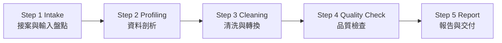

# 一般表格型資料清洗與品質報告 — Product Spec v1

> **Repo SSOT / landing**：`docs/TABULAR_MVP_SSOT.md` — 產品主線、主鏈入口、非目標邊界（本檔為對外 Product Spec）  
> **票號**：C2-P1 · Product Definition v1  
> **狀態**：初稿（對外說明用；非合約、非 SLA）  
> **能力基線**：Wave 6/7 CLEAN 產品線規格（`CLEAN-BASIC` 為主）+ Wave B 可觀測性工具（內部品質複查輔助）  
> **技術權威**：`04_Workflows/WAVE6_CLEAN_PRODUCT_MATRIX_v0.1.md` · `04_Workflows/WAVE6_CLEAN_DELIVERABLE_TEMPLATES_v0.1.md` · `docs/observability.md`  
> **後續詳化**：C2-P2（執行步驟、戰報模板、清洗規則對照表）

---

## 1. 服務介紹（用戶視角）

### 1.1 這是什麼

**一般表格型資料清洗與品質報告服務**協助團隊把「有結構但品質參差不齊」的表格資料（CSV、Excel 等）整理成**可分析、可交接**的乾淨檔案，並附上一份**清洗前後對照**的品質報告。

服務聚焦四類常見問題：

| 面向 | 客戶得到的價值 |
|------|----------------|
| **缺失（Missing）** | 標記或依約定規則處理空值、缺欄、關鍵主鍵不完整列 |
| **重複（Duplicate）** | 依指定主鍵或組合鍵找出重複列，去重或標記待人工確認 |
| **異常（Anomaly）** | 偵測超出合理範圍的數值、非法枚舉、邏輯矛盾（如結束日早於開始日） |
| **格式混亂（Format）** | 統一日期／時間戳、布林值、數字格式、欄位命名與編碼 |

最終交付：**清洗後資料檔** + **品質報告**（含清洗前後指標與採用的決策規則摘要），讓業務或分析團隊能直接接手，而不必從原始髒資料重新摸索。

### 1.2 適合誰

- 手上有**有一定欄位結構**的報表或匯出檔，需要整理後才能做分析或匯入系統的團隊
- 典型場景：**電商訂單匯出**、**問卷回覆表**、**營運日／週報**、**客戶名單**、**庫存盤點表**等單表或小量多表
- 希望取得**可審計的清洗紀錄**（做了什麼、改了多少、拒絕了哪些列），而非「黑箱處理後給一個檔案」的團隊
- 資料量落在**單檔百萬列以內、多表少量 join**的範圍；超大倉儲或即時串流不在本產品範圍

### 1.3 服務性質（重要聲明）

- 本規格描述**技術服務內容**；不含報價、合約條款、收款流程。
- 現階段為 **專案制／批次處理** 服務：依接案排程執行，**非 7×24 託管**，**非 SLA 保證**。
- 清洗流程含**人工確認點**（規則取捨、邊界案例、業務語意歧義）；**非全自動無人值守**。
- 我們**不承諾**一次清洗捕捉所有錯誤，也不保證清洗結果符合所有未明示的業務規則；交付的是**可重現的清洗產物與品質證據**，業務決策由客戶或後續工程票承接。

---

## 2. 客戶需提供的輸入（Input Requirements）

### 2.1 必備（Minimum）

| 輸入 | 說明 | 格式／備註 |
|------|------|-----------|
| **原始資料檔** | 待清洗的表格 | **CSV**（UTF-8 建議；RFC 4180 相容）或 **Excel**（`.xlsx` 為主；`.xls` 視個案） |
| **欄位說明** | 每欄名稱、資料型態、業務意義 | 文字說明或簡易 schema（欄位名、型別、是否必填） |
| **關鍵主鍵** | 用於去重或列追蹤 | 例如 `order_id`、`respondent_id`；若無天然主鍵需明示可否自動產生 surrogate key |
| **可缺失欄位** | 哪些欄允許空值、哪些不允許 | 未提供時僅做「標記缺失」，不自動猜測填補 |
| **清洗目標** | 本次要解決的優先問題 | 例如：「去除重複訂單」「統一日期格式」「標記異常金額」 |

### 2.2 建議提供（加速處理）

| 輸入 | 用途 |
|------|------|
| 資料收集方式說明 | 判斷系統性偏差（手動輸入 vs API 匯出 vs 多來源合併） |
| 已知問題清單 | 跳過試錯、對齊客戶預期（如「11 月有一批重複匯入」） |
| 參考樣本（10–50 列） | 驗證欄位語意與期望輸出格式 |
| 多表關聯說明 | 若含 2–3 張表的小 join：關聯鍵、預期 cardinality |
| 輸出格式偏好 | 維持 CSV、改 JSON Lines、或指定欄位順序 |
| 敏感欄位標註 | PII 欄位清單，供報告脫敏與處理邊界約定 |

### 2.3 客戶不需提供

- 生產資料庫寫入權限（本服務以**交付檔案**為主，不預設直寫客戶 DB）
- 完整數據倉儲或 ETL 平台帳號
- 未約定範圍內的商業策略目標（例如「幫我決定該砍哪個 SKU」）

### 2.4 前置假設

客戶資料至少滿足下列條件，否則服務降級為「可行性評估 + 缺口清單」：

1. 檔案可解析為**二維表格**（有穩定欄位列）；純圖片、掃描 PDF、無結構文字不在範圍
2. 單檔規模在**約 100 萬列／1 GB** 以內（更大需另議分批或拒收）
3. Excel 若含**多工作表**：客戶需指明要處理的工作表；不預設處理全部 hidden sheet 或巨集邏輯
4. 編碼為 UTF-8／UTF-8 BOM／常見中文 Windows 編碼之一；罕見編碼可能需客戶先轉檔

---

## 3. 服務輸出內容（Deliverables）

### 3.1 標準交付包（v1）

| 產物 | 內容摘要 |
|------|----------|
| **清洗後資料檔** | 依約定格式輸出；涵蓋缺失標記／填補、去重或重複標記、異常列處理、格式標準化 |
| **品質報告（結構化）** | `report.json` 或等價 JSON：清洗前後行數、缺失率、重複數、異常數、拒絕列數 |
| **品質報告（可讀摘要）** | `report.md` 或 PDF 摘要：決策規則說明、前後指標對照、典型問題樣本（脫敏） |
| **決策規則紀錄** | 本次採用的清洗規則清單（如日期格式、去重鍵、異常閾值）；便於複查與下次迭代 |
| **執行證據索引** | 處理版本、輸入檔指紋摘要、關鍵計數（**不含**客戶原始敏感內容全文） |

**清洗涵蓋類型（v1 標準）**：

| 類型 | 典型動作 |
|------|----------|
| 缺失 | 標記 `_missing_*`、依約定填預設值、或拒絕關鍵欄缺失列 |
| 重複 | 依主鍵去重（保留首筆／末筆／合併策略需事前約定）或輸出重複清單 |
| 異常 | 範圍檢查、枚舉檢查、跨欄邏輯檢查；異常列標記或隔離至 `rejected` 附檔 |
| 格式 | 日期／時間統一、trim 空白、數字千分位移除、欄位名 snake_case／約定命名 |

**品質報告核心指標（清洗前 → 清洗後）**：

| 指標 | 說明 |
|------|------|
| `total_rows` | 原始列數 |
| `accepted_rows` | 通過清洗、納入交付檔之列數 |
| `rejected_rows` | 拒絕或隔離之列數 |
| `duplicate_rows_found` | 偵測到之重複列數（去重前） |
| `duplicate_rows_removed` | 實際移除或合併之列數 |
| `missing_rate_by_field` | 各欄缺失率（前後對照） |
| `anomaly_count_by_rule` | 各異常規則觸發次數 |
| `format_fixes_applied` | 格式修正次數（依規則分類） |

### 3.2 可選加購（視輸入與授權）

| 產物 | 條件 |
|------|------|
| **下次收集建議** | 客戶需要流程改善時：欄位約束、匯出設定、防重複機制建議 |
| **小量多表 join** | 2–3 表、關聯鍵明確、列數在標準規模內 |
| **欄位標準化對照表** | 舊欄名 → 新欄名 mapping，供後續管線沿用 |
| **內部 eval 對照附錄** | 若清洗 job 有可匯出 metadata，可選用 Wave B `obs.eval.report` 做內部品質閘門複查（見 §6） |

### 3.3 明確不屬於 v1 交付

- 建置完整**數據倉儲**、即時 CDC、或長期排程 ETL
- **OCR** 掃描件、非結構 PDF、圖片內表格
- 複雜 **NLP／語意理解**（情感分析、實體抽取、自動分類）
- 外部 API **大量 enrich**（地址標準化、工商補全等）— 屬 `CLEAN-ENRICH` 進階線，非本 v1 預設
- 商業策略建議（定價、選品、裁員名單等）
- 對外 SLA、「零錯誤」或「全自動無人工」保證

---

## 4. 適用場景與限制（What We Do / What We Don't Do）

### 4.1 我們做什麼

| 場景 | 服務動作 |
|------|----------|
| **單表清洗** | Profiling → 規則套用 → 品質檢查 → 報告 |
| **小量多表** | 基本 join、欄位對齊、主鍵一致性檢查（2–3 表為宜） |
| **欄位標準化** | 命名、型別、日期／數字格式統一 |
| **品質可審計** | 前後指標、規則清單、典型樣本；可交接給下游分析或匯入 |
| **誠實邊界標註** | 無法自動判斷的業務邏輯列為「需人工確認」，不冒充已修復 |

### 4.2 我們不做什麼

| 限制 | 說明 |
|------|------|
| **非 7×24 代維運** | 不提供持續託管、on-call 或即時串流清洗 |
| **非 production SLA** | 交付時間與品質以專案約定為準，非運維級 SLA |
| **非全自動** | 規則確認、邊界案例、業務歧義需人工參與 |
| **不構建數據倉儲** | 不做 Kimball／星型模型、不負責企業級建模 |
| **不負責商業決策** | 清洗結果供參考，策略解讀由客戶自行決定 |
| **不保證全捕獲** | 未明示規則、隱性業務邏輯、資料源系統性欺詐無法一次抓盡 |
| **不處理商業流程** | 報價、合約、NDA、收款不在本規格範圍 |

### 4.3 能力邊界對照（誠實基線）

| 能力 | v1 服務 | 備註 |
|------|---------|------|
| CSV 清洗 + 基本校驗 | ✅ | 對齊 Wave 6 `CLEAN-BASIC` 規格意圖 |
| Excel（`.xlsx`）讀取與轉表格 | ✅（個案） | 多 sheet／公式欄需事前約定；非 Excel 全功能支援 |
| 缺失／重複／異常／格式四類處理 | ✅ | 規則需客戶確認或提供 schema |
| 品質報告（JSON + 可讀摘要） | ✅ | 結構參考 `WAVE6_CLEAN_DELIVERABLE_TEMPLATES` |
| 小量多表 join | ✅（有限） | 非星型倉儲建模 |
| 外部 API enrich | ❌ | 屬 `CLEAN-ENRICH`；另議 |
| OCR／PDF 表格 | ❌ | 不在 CLEAN intake 範圍 |
| 一鍵自動 pipeline（客戶自助上傳） | ❌ | C2-P2 後內部 runbook；產品化自助入口為後續票 |
| Wave B eval 工具接線 | ⚪ 內部輔助 | 可選用於 job metadata 品質複查，**非**客戶必備輸入 |

---

## 5. 粗略流程概覽（High-Level Execution Steps）

> **對外文件**：此處保留 v1 high-level 骨架，供客戶理解服務流程。  
> **對內執行細節**：留待 **C2-P2 Execution Plan**（含 CLI、檢查清單、戰報模板）。



> **執行分工**：各步驟目前以**人工驅動、可重現腳本輔助**為主；全自動自助入口為後續路線圖。

### Step 1 — Intake（接案與輸入盤點）

- 確認清洗目標、檔案格式、規模、敏感欄位。
- 檢查 §2.1 必備輸入；缺項則在交付包標 **degraded scope**。
- 與客戶對齊主鍵、可缺失欄、去重策略與輸出格式。

### Step 2 — Profiling（資料剖析）

- 統計列數、欄位型別推斷、缺失率、重複候選、格式分佈。
- 產出剖析摘要，供客戶確認規則前閾值（異常定義、日期格式等）。

### Step 3 — Cleaning（清洗與轉換）

- 依確認規則執行：缺失處理、去重、異常標記／隔離、格式標準化。
- 小量多表時執行約定 join 與欄位對齊。
- 保留規則版本與處理日誌（供報告引用）。

### Step 4 — Quality Check（品質檢查）

- 對照剖析基線：驗證指標是否改善、拒絕列是否合理。
- 可選：內部以 Wave B eval／stats 工具對 job metadata 做二次複查（非客戶必知步驟）。

### Step 5 — Report（報告與交付）

- 交付 §3.1 標準包：清洗檔 + 品質報告 + 規則紀錄。
- 可選：下次收集建議（§3.2）。
- 交接至 C2-P2 戰報模板或客戶內部 ticket。

---

## 6. 相關文件索引

| 文件 | 用途 | 讀者 |
|------|------|------|
| `04_Workflows/WAVE6_CLEAN_PRODUCT_MATRIX_v0.1.md` | CLEAN-BASIC／ENRICH 產品矩陣、輸入輸出契約 | 內部執行者、技術整合者 |
| `04_Workflows/WAVE6_CLEAN_DELIVERABLE_TEMPLATES_v0.1.md` | `report.json`／`report.md` 章節結構 | 內部執行者 |
| `04_Workflows/WAVE7_CLEAN_ORCH_TASK_MODEL_v0.1.md` | 清洗任務模型（內部編排參考） | 內部執行者 |
| `docs/PRODUCT_AI_WORKFLOW_DIAGNOSTIC.md` | C1 姊妹產品（AI workflow 健檢）；**不同產品線**，流程結構可對照 | PM、對外簡介 |
| `docs/WAVE_C_EXECUTION_PLAN.md` | C1 對內 runbook；C2 **不共用**執行步驟，僅作 Multi-Chat 票系參考 | 內部 |
| `docs/C2-P2_RUNBOOK.md` | **C2 對內執行步驟**（Intake → Cleaning → Quality Report → Delivery；人工確認點與檢查清單） | 內部執行者、資料分析師 |
| `docs/C2-D1_DEMO_WALKTHROUGH.md` | C2-D1 可帶客戶看的 demo 導覽（錨定 `cases/demo_phase/`） | PM、對外展示 |
| `docs/observability.md` | Wave B eval／trace 契約；可選用於清洗 job 內部品質複查 | 技術整合者 |
| `docs/SKILL_CATALOG_OVERVIEW.md` | Gov `tool_id`（`obs.eval.*` 等）；**C2 清洗主路徑不依賴此 catalog** | 內部 |

> **索引說明**：
> - **對外 Product Spec**（本檔）聚焦「客戶能得到什麼」與「需要提供什麼」
> - **對內 Execution Plan**（`docs/C2-P2_RUNBOOK.md`）聚焦「如何一步步執行」與「人工判讀點」
> - **Wave 6/7 CLEAN 規格**為清洗能力與交付物結構的技術權威（現為 DRAFT-v0.1）
> - **Wave B／C1** 與本產品為**鄰接能力**：eval export／report 等工具可在「清洗 job 有結構化 metadata」時輔助內部品質閘門複查，**不取代**表格清洗本體

---

## 7. 版本與後續

| 項目 | 說明 | 狀態 |
|------|------|------|
| **本檔版本** | Product Spec v1 · C2-P1 | 初稿 |
| **C2-P2** | 執行 runbook、戰報模板、清洗規則檢查清單 | **初稿**（`docs/C2-P2_RUNBOOK.md`；待 Reviewer 驗收） |
| **C2-P3（建議）** | 定價與交付邊界（最小／標準／含多表分級） | 待排程 |
| **範例案例庫（建議）** | 去識別化前後對照樣本（訂單／問卷／營運報表） | 待排程 |
| **自助入口／一鍵 pipeline** | 客戶上傳即跑 | **未**納入 v1 承諾 |

### 路線圖錨點

```
C2-P1 Product Spec（對外）
    │
    ▼
C2-P2 Execution Plan ← 對內執行細節（Intake → Profiling → Cleaning → QC → Report）
    │
    ├──► 清洗 runner／orchestrator 與本 spec 對照驗收
    ├──► 範例案例庫（de-identified）
    ├──► 定價票（C2-P3）
    └──► 可選：Wave B eval 與清洗 job metadata 標準對接
```

### 文件關係總覽

| 層級 | 文件 | 讀者 | 更新頻率 |
|------|------|------|---------|
| 對外產品 | `docs/PRODUCT_TABULAR_CLEANING.md` | 客戶、PM | 每版 Product Spec |
| 對內執行 | `docs/C2-P2_RUNBOOK.md` | Implementer、資料分析師 | 每案執行參考 |
| 技術權威 | Wave 6/7 CLEAN 規格 | 開發者、執行者 | Wave 交付時 |
| 鄰接產品 | `docs/PRODUCT_AI_WORKFLOW_DIAGNOSTIC.md` | 客戶、PM | C1 產品迭代 |
| 內部品質輔助 | `docs/observability.md` · `docs/SKILL_CATALOG_OVERVIEW.md` | 開發者 | Wave B 迭代 |

---

*文件版本：v1.0-draft · 2026-06-07 · C2-P1 Product Definition*
