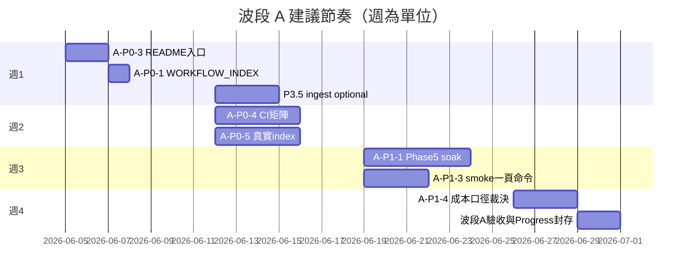

# 波段 A 執行計畫 — 高完成度 Phase 收尾（2–4 週）

> **角色**：總調度 Architect + PM + Repo Orchestrator  
> **掃描日**：2026-06-05  
> **最後更新**：2026-06-05（Wave A 小結 · P3 Done · P5 ≥85% 收口寫回）  
> **狀態依據**：`04_Workflows/00_Agent_Work_Progress.md`、`04_Workflows/project_status/master_status.md`、`workflow_v2/99_latest_status.md`、`00_master_plan.md`、`docs/observability.md`  
> **原則**：小步提交、每步可獨立驗證；不宣稱 production-ready 除非有 runner／命令證據。

---

## 0. 波段 A 狀態快照（2026-06-05 更新）

| Phase | 目標 | **當前狀態** | 證據摘要 |
|-------|------|--------------|----------|
| **P3 Trace** | 完成 | **Done** | `gov-trace-v2`：`observability/trace_schema.py` + `trace_schema_v2.json`；`logging_adapter`／`trace_middleware`；`docs/observability.md`；`python -m unittest tests.test_trace_schema tests.test_logging_adapter tests.test_trace_middleware` → **13/13 OK** |
| **P5 Dashboard/Alert** | ≥85% | **≥85%** | `observability/dashboard/dashboard_metrics_v1.json`；`alert_rules_phase3_phase5.yaml`；暗部 `monitoring_alerts.py` 三規則 + `config/alert_rules.example.yaml`；`run_alert_evaluation.py --notifier console` |
| P1 治理 | 完成 | ~92% | 待 README／WORKFLOW_INDEX |
| P2 知識/Index | ≥85% | ~72% | 待真實 index job |
| P6 測試/CI | ≥85% | ~76% | 待 wave-a-smoke CI |

**P3 延伸（非阻塞波段 A）**：Phase 3.5 — Langfuse 欄位對齊；Prometheus exporter；Grafana JSON；**PG live soak**（亦列 P5 placeholder）。

**P5 placeholder（下一階段小票）**：Prometheus 實 exporter · Grafana 匯入 · PG live soak（n≥100）。

---

## 1. 現況盤點（實掃 · 不假設）

### 1.1 專案結構（戰車根一層）

| 區塊 | 路徑 | 職責摘要 |
|------|------|----------|
| 環境／venv | `01_Environments/` | `gov_core_system` 暗部、docker、config |
| Agent 核心 | `02_Agents_Core/` | 路由、`task_routing.py`、`ops_cycle.py` |
| 知識庫 | `03_RAG_Database/`、`07_Knowledge/` | C2 核心庫、C3 logs、`metadata_index` |
| 工作流／治理 | `04_Workflows/` | 憲法、合約、Progress、runners、runbooks |
| 企業化補強 | `core/`、`context/`、`observability/`、`skills/`、`subagents/`、`tests/`（戰車根） |
| 暗部 API／監控 | `01_Environments/python_venvs/gov_core_system/` | FastAPI、monitoring、ingest、135+ 單測基線 |
| workflow_v2 | `workflow_v2/` | W3–W4 設計／試點／CI metrics（Wave 4 DONE-WITH-GAPS） |

### 1.2 能力存在性矩陣

| 能力域 | 是否存在 | 權威／入口 | 備註 |
|--------|----------|------------|------|
| **README / 架構文檔** | ✅ | `AGENTS.md`、`README_Refresher.md`、`00_master_plan.md`、`04_Workflows/_PORTABLE_CORE_INDEX.md`、`DEPARTMENT_MAP.md` | 戰車根**無**單一 `README.md`；索引分散 |
| **Observability / Trace** | ✅ **Done（契約層）** | 戰車根 `observability/trace_schema.py`、`logging_adapter.py`、`trace_middleware.py`；`docs/observability.md`；暗部 Langfuse／`observability_v2` | **gov-trace-v2** canonical + 單測 13/13；Langfuse／PG 全量對齊 → **P3.5** |
| **Dashboard / Metrics / Alerts** | ✅ **≥85%** | `observability/dashboard/dashboard_metrics_v1.json`、`alert_rules_phase3_phase5.yaml`；暗部 `/monitoring/*`、`monitoring_alerts.py`、`static/monitoring/dashboard.html` | 四面板 JSON + 三條 baseline 告警；**placeholder**：Prometheus/Grafana/PG live soak |
| **Tests / CI / Smoke** | ✅（partial） | 戰車根 **28** 個 `tests/test_*.py`；暗部 **95** 個；`.github/workflows/eval-gate-ci.yml`、`gov-gate-metrics.yml`；`04_Workflows/_smoke_test_keys.py` | **無**一條「全庫 unittest + 暗部 smoke」的 PR 必過 workflow |
| **RAG / Vector / Ingest** | ✅ | `core/data_pipeline.py`、`core/rag_backend.py`；Postgres + Qdrant `document_chunks`；`phase1_verify` | 單檔／目錄 ingest **已驗**；GraphRAG job 流程待定 |
| **Codebase / Repo Indexing** | ✅（minimal） | `04_Workflows/_indexing_and_audit.py`；`workflow_v2/20_pilot/W3-B/`；`Master_Map` → `_build_elite_index.py` | W4-B v1：**index_status 樣本 file_count=0**；全 repo 索引未擴面 |

### 1.3 各 Phase 完成度（你的目標 vs 倉庫證據）

| Phase（波段 A 口徑） | 你給的基線 | 倉庫裁決 | 主要證據 |
|---------------------|------------|----------|----------|
| **P1 治理層** | 90% → 100% | **~92%** — 定稿令已發，運營閉環未收口 | `HQ_PHASE1_FINALIZATION_ORDER.md`（2026-05-19 Done）；`WORKFLOW_INDEX` 仍標 runbook TODO（實檔已在 `runbooks/`） |
| **P2 知識層與 Indexing** | 70% → ≥85% | **~72%** — ingest/RAG smoke 強；repo index 弱 | Progress R1/R2/D3 Done；`W3-B_kb_contract.md`；`index_status_W2-1.json` 樣本化 |
| **P3 可觀測性與 Trace** | 85% → 100% | **Done** | `docs/observability.md`；gov-trace-v2；單測 13/13（2026-06-05 複驗） |
| **P5 儀表板與告警** | 72% → ≥85% | **≥85%** | `dashboard_metrics_v1.json` + `alert_rules_phase3_phase5.yaml` + evaluator 接線 |
| **P6 自動化測試與驗證** | 74% → ≥85% | **~76%** — 測試多、CI 窄 | 兩條 GH workflow；暗部 107+ 測試曾全綠，**未**納入 PR 門禁矩陣 |

> **命名提醒**：暗部 `output/phase5-8_roadmap.md` 的 **Phase 6 = 成本硬化（已 ACCEPT）**，與本計畫 **「P6 自動化測試」** 不同軸，下文 P6 均指測試／CI。

---

## 2. 缺口分析

### 2.1 橫切缺口（影響多 Phase）

1. ~~**Trace 契約未統一**~~ → **已收口**（gov-trace-v2 + `docs/observability.md`）。**殘留**：Langfuse 欄位對齊、PG live cohort 覆蓋 → **P3.5 / P5 soak 小票**。  
2. **雙資料源成本**：`daily_cost_summary` vs `task_runs` 未統一（Wave 1–2 延續）。  
3. **文檔索引與實況不一致**：`WORKFLOW_INDEX` TODO vs `runbooks/*.md` 已存在。  
4. **CI 覆蓋窄**：eval-gate（戰車根 P+）與 gov-gate-metrics（workflow_v2）**未**覆蓋暗部 monitoring／ingest smoke。  
5. **Repo codebase index 為試點級**：W4-B 僅 W2-1 case；非全庫可檢索。

### 2.2 各 Phase 缺口（收斂到可驗收項）

| Phase | 距離目標差什麼 | 建議「完成」定義 |
|-------|----------------|----------------|
| P1 | 入口 README 單頁；WORKFLOW_INDEX 對齊；OPS 一鍵 checklist 可重跑；handoff 模板 | 新 Agent 僅讀 3 檔可開工；`python _ops_cycle.py checklist --mode full` exit 0 |
| P2 | 真實 index job（file_count>0）；RAG runbook 與 Conditions 連結；可選全庫增量規格 | `index_status` 真跑 + `rag_query_agent` smoke 綠 + ingest 不破種子 INV |
| P3 | — | **Done**（契約 + 戰車根實作 + 文檔 + 單測） |
| P5 | live PG soak；Prometheus/Grafana exporter | soak exit 0；**不**阻塞波段 A「≥85%」判定 |
| P6 | PR workflow：戰車根 unittest 子集 + 暗部 monitoring 子集；smoke runbook 可執行清單 | CI 綠 + 本地三連跑文檔化 |

---

## 3. 任務拆解（P0 / P1 / P2）

### P0 — 本波段必做（阻塞「穩定可用」）

| ID | 任務 | Phase | 交付物 | 驗收命令／標準 |
|----|------|-------|--------|----------------|
| A-P0-1 | **WORKFLOW_INDEX ↔ runbooks 對齊** | P1 | 更新 `WORKFLOW_INDEX.md` 連結既有 runbook | 無 TODO 假陰性；連結可點 |
| ~~A-P0-2~~ | ~~monitoring ingest 收口~~ | P3.5 | **移出 P0** — P3 已 Done；改 **P3.5-INGEST-PG** 小票（可選） | 20 ask 後 PG 與 Langfuse 同量級 |
| A-P0-3 | **戰車根 README 入口頁** | P1 | `README.md`（僅索引，不重寫憲法） | 含 AGENTS／Refresher／W0／Master_Map 四鏈 |
| A-P0-4 | **波段 A CI 最小矩陣** | P6 | `.github/workflows/wave-a-smoke.yml`（或擴展现有 workflow） | PR：戰車根 `tests.test_context_entry` + `tests.test_eval_gate`；可選暗部 monitoring 子集 |
| A-P0-5 | **W2-1 真實 index 回填** | P2 | 重跑 index pipeline → `index_status_W2-1.json` file_count>0 | `wf_kb_index_sync.ps1` 後案卷 `kb_index_status=ready` |

### P1 — 拉到 ≥85% 或「完成」

| ID | 任務 | Phase | 交付物 | 驗收 |
|----|------|-------|--------|------|
| A-P1-1 | Phase 5 **PG live soak** + Prometheus/Grafana（placeholder 清零） | P5+ | soak 報告 | `phase5_live_pg_soak` / `run_alert_evaluation.py` |
| A-P1-2 | Dev SLO 文檔與 dashboard 對齊（Wave 4C） | P3/P5 | runbook 一節 + dashboard badge | p95／biz_ok 可從 API 或 PG 讀到 |
| A-P1-3 | Gov Core V1 + RAG smoke「一頁命令」 | P2/P6 | `GOV_CORE_SMOKE_TEST_RUNBOOK` 補「最短路径」 | ingest_verify + rag_query 連跑 exit 0 |
| A-P1-4 | 成本雙資料源裁決工單（文件先行） | P5/P3 | `docs/` 或 Progress 決策條目 | 儀表板單一口徑文檔化 |
| A-P1-5 | P1 治理「接戰自檢」腳本化 | P1 | `_ops_cycle.py checklist` 寫入波段 A 清單 | `checklist --mode full` 全綠 |

### P2 — 可並行、不阻塞波段出口

| ID | 任務 | Phase | 說明 |
|----|------|-------|------|
| A-P2-1 | GraphRAG job 流程定義 | P2 | Schema 已有，業務流待定 |
| A-P2-2 | Slack/PagerDuty notifier | P5 | 接在 mock 之後 |
| A-P2-3 | Repo index 擴面至第二 case | P2 | 複製 W4-B 模式 |
| A-P2-4 | K-2 remote rollout | — | 與波段 A 正交，單獨票 |

---

## 4. 建議檔案異動清單（按子線）

| 子線 | 預計異動（邏輯路徑） |
|------|----------------------|
| 治理與 README | `README.md`（新建）、`04_Workflows/WORKFLOW_INDEX.md`、`docs/WAVE_A_EXECUTION_PLAN.md` |
| Trace / Obs / Dashboard | `gov_core_system/core/monitoring_ingest.py`、`integration_hooks.py`、可選 `monitoring_service.py`；`static/monitoring/dashboard.html`（小改） |
| Test / CI | `.github/workflows/wave-a-smoke.yml`、可選 `04_Workflows/00_Agent_Work_Conditions.md`（smoke 條目） |
| Knowledge / Indexing | `workflow_v2/tools/wf_kb_index_*.ps1` 文檔、`20_pilot/W3-B/index_status_*.json`、可選 `_indexing_and_audit.py` 觸發說明 |

**禁區**：不碰 venv 樹、`.env` 原文、未授權 `runtime/checkpoints`、暗部破壞性腳本（憲法 §7 類型）。

---

## 5. 風險點

| 風險 | 影響 | 緩解 |
|------|------|------|
| Phase 編號歧義（成本 P6 vs 測試 P6） | PM／施工誤派工 | 票名加前綴 `A-P6-CI`；引用本檔 |
| ingest 修復牽動暗部 core | 越權／回歸 | 單票、暗部 venv unittest 子集必跑 |
| 無 DATABASE_URL 的 CI | 假綠／假紅 | CI 分 `unit`（無 PG）與 `integration`（optional secret） |
| 宣稱 production SLO | 治理反噬 | 僅 dev/staging 語言；對齊 master_status |
| 全庫 index 範圍膨脹 | 2–4 週失控 | P0 僅 W2-1 真回填；擴面放 P2 |

---

## 6. 四條子線（目標 · 交付物 · 檔案 · 驗收）

### 子線 1 — 治理與 README

- **目標**：P1 → **100%**（可交付的接戰／派工／索引閉環）  
- **交付物**：戰車根 `README.md`；`WORKFLOW_INDEX` 零假 TODO；波段 A 自檢清單  
- **相關檔案**：`AGENTS.md`、`README_Refresher.md`、`_PORTABLE_CORE_INDEX.md`、`TASK_ROUTING.md`、`OPS_CYCLE.md`、`HQ_PHASE1_FINALIZATION_ORDER.md`  
- **驗收標準**：新 session 依 README 三步找到 runbook + runner；`_ops_cycle.py checklist --mode full` 通過；不修改憲法正文

### 子線 2 — Trace / Observability / Dashboard

- **目標**：P3 **Done**；P5 **≥85%**（已達）  
- **已交付**：gov-trace-v2、`docs/observability.md`、`dashboard_metrics_v1.json`、`alert_rules_phase3_phase5.yaml`、evaluator 三規則  
- **相關檔案**：`observability/trace_schema.py`、`docs/observability.md`、`observability/dashboard/*`、暗部 `monitoring_alerts.py`  
- **驗收標準（已滿足）**：`unittest` trace 三檔 **13/13 OK**；告警 YAML + `run_alert_evaluation.py --notifier console`  
- **下一階段**：P3.5 Langfuse 對齊 · P5+ PG soak · Prometheus/Grafana

### 子線 3 — Test / CI / Validation

- **目標**：P6 → **≥85%**  
- **交付物**：`wave-a-smoke` CI；smoke runbook 最短路径；Progress 證據條目  
- **相關檔案**：`.github/workflows/*`、`tests/`（戰車根）、`gov_core_system/tests/test_monitoring_*`、`runbooks/GOV_CORE_SMOKE_TEST_RUNBOOK_v0.1.md`  
- **驗收標準**：PR CI 綠；本地可複製三命令（keys smoke + 戰車根 unittest 子集 + ingest_verify 可選）

### 子線 4 — Knowledge Layer / Indexing

- **目標**：P2 → **≥85%**  
- **交付物**：真實 `index_status`；RAG smoke 與 index 制度連結；ingest 基線不退化  
- **相關檔案**：`core/data_pipeline.py`、`core/rag_backend.py`、`W3-B_kb_contract.md`、`wf_kb_index_gate.ps1`、`_indexing_and_audit.py`、`03_RAG_Database/C2_核心知識庫/`  
- **驗收標準**：`index_status` file_count/chunk_count > 0；`rag_query_agent` hits≥1；`phase1_verify` ASSERT OK

---

## 7. 建議執行順序（2–4 週）

**依賴說明**：P3／P5 主軌已收口；波段 A **剩餘主軌**為 P1（README）+ P2（index）+ P6（CI）。PG soak 與 P3.5 可並行於週 3–4，**不**阻塞出口。

---

## 8. 本輪推薦先做的 3 個任務（P3/P5 收口後修訂）

| 順序 | 任務 | Chat |
|------|------|------|
| 1 | **A-P0-3 + A-P0-1** 治理入口 | 文檔 Chat（governance-guard → README + WORKFLOW_INDEX） |
| 2 | **A-P0-5** 真實 repo index | Knowledge Chat（W3-B pipeline + `wf_kb_index_sync`） |
| 3 | **A-P0-4** 波段 A CI 矩陣 | CI Chat（wave-a-smoke workflow + 含 `tests.test_trace_*`） |

~~原 A-P0-2（ingest）~~ → 降為 **P3.5-INGEST-PG**（可選，不擋波段 A）。

---

## Wave A 小結

> **摘要日**：2026-06-05 · 依 `04_Workflows/00_Agent_Work_Progress.md`、`_workflow_upgrade/90_run_queue.md`、`00_master_plan.md` §4.8 對帳。

### 已收尾

- **`WAVE-CORE-P0-PHASE1-ROLLOUT-DECISION`**（**done**）：尚書省 Option A 已落盤；Phase 1 scope gate = **local shadow only**（本地 workstation K1/K2 parity）；remote prod rollout 已拆為 P1 工單 **`K2-phase1-remote-rollout`**（todo），**不**纳入 Phase 1 出门、**不阻塞** Phase 2 canary 进场。
- **P3 Trace**（**Done**）：gov-trace-v2 契約層收口（`observability/trace_schema.py`、`docs/observability.md`；單測 13/13）。
- **P5 Dashboard／Alert**（**≥85%**）：四面板 JSON + 三條 baseline 告警 + evaluator 接線；Prometheus／Grafana／PG live soak 列 placeholder，不阻塞本波段判定。
- **K2-phase1-remote-rollout-runbook**（**done**）：遠端 rollout 藍圖 runbook 已落盤（Blueprint only；實作见 `K2-phase1-remote-rollout`）。
- **Telegram listener 復活**（**done**）：`WAVE-CORE-P0-TELEGRAM-LISTENER-REVIVE` 已收口。listener 已啟動（`Start-TelegramListener.ps1`）；`.telegram_listener.lock` pid 與實際 `_telegram_listener.py --mode loop` 一致；最新 err log（`listener_20260605_110242.err.log`）無 `RemoteDisconnected`；`Master_Map.json -> war_status.telegram_listener` 已更新；2026-06-05 客戶端 `/ping` → `pong · 2026-06-05T03:12:45+00:00`（E2E 通路正常）。後續由 watchdog 或日常維運處理。
- **ask selector / RAG selector CI compatibility**（**done**）：已以 repo 內 shim 移除對 `gov_core_system` 舊路徑的硬依賴，`tests.test_ask_selector_and_answer` 與 `tests.test_context_subagent_routing` 可於 CI 直接執行，無 `ModuleNotFoundError` / `FileNotFoundError`（戰報：`WAVE-B-P1-ASK-RAG-SELECTOR-CI-FIX`）。

### 仍待完成

- **eval-gate CI · Shadow spool script smoke**（**PENDING-IMPL · blocked**）：程式與本機／容器 smoke 已過（`line_endings=lf ok`）；**缺** GitHub Actions run URL。  
  完成判準：`.github/workflows/eval-gate-ci.yml` 至少成功跑過一次 **Shadow spool script smoke (LF / Two-Pool)**，且 run URL 已記入 Progress。  
  **阻塞**：戰車根工作區無 `.git`／`origin`；`gh` 未安裝／未登入。須於具 remote 的 clone 執行 push + PR（或 Actions 手動觸發）後回填 `WAVE-CORE-P1-CI-SHELL-COMPAT` 戰報。

**營運觀測（非本節「待完成」）**：**`K2-phase1-prod-shadow`** 維持 **in_progress**（T+0 done、本地 7 日觀測中）；不因上述 P0 裁決改标 done。

### Wave B 建議入口

- **治理收口線**：戰車根 `README.md` 入口頁（A-P0-3）、`WORKFLOW_INDEX` ↔ runbooks 對齊（A-P0-1）、`.github/workflows/wave-a-smoke.yml` 波段 A CI 最小矩陣（A-P0-4）；收口後新 session 可僅讀 README + AGENTS + runbook 開工。
- **能力擴張線**：Phase 4 多 agent 協作（Cursor subagents 編排深化），或 K-2 接單／canary 前置能力（`K2-phase1-remote-rollout` 施工、`K2-rollout-governance` 7 日觀測达标后 Phase 2 canary 草案送审）。

---

*文件版本：v0.3 · 2026-06-05 · Wave A 小結 / P3 Done / P5 ≥85% 寫回*
