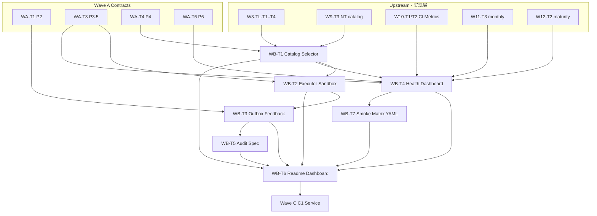

# Wave B Toolchain Execution Plan — Bottom Layer Contract & Index Alignment

> **成文日期**：2026-06-11  
> **票号**：WB-T6 · `wave-b-bottom-layer-readme-and-phase-progress-alignment-v1`  
> **角色**：Orchestrator 执行计划（doc-only）  
> **分轨**：本档 **Toolchain Wave B（WB-T*）**；与 `docs/WAVE_B_EXECUTION_PLAN.md`（Observability · `WAVE-B-P*`）**禁止混用**

---

## 0. 命名空间对照（AC-6）

| 名称 | 票号前缀 | 主轴 | 权威入口 |
|------|----------|------|----------|
| **Observability Wave B** | `WAVE-B-P*` | Phase 2/3 知识索引 · eval/trace · wf_status | `docs/WAVE_B_EXECUTION_PLAN.md` |
| **Toolchain Wave B** | `WB-T*` | Phase 8.5–8.9 底層 contract · outbox · toolchain health | **本档** · `docs/wave-b-toolchain-readme-v1.md` |
| **Tabular Tool Layer** | `W3-TL-*` | Tabular MVP catalog/selector/executor/outbox **实现** | `docs/tabular-tool-catalog-v1.md` 等 |

**Phase% SSOT**：`docs/WAVE_PROGRESS_DASHBOARD.md`（本档与 readme **仅引用**，不自订完成度数字）。

---

## 1. 状态快照（2026-06-11）

**一句话**：**Wave B · Toolchain: done · accepted_with_gaps_deferred_to_WC-PRE** — WB-T1–T8 均已 Reviewer 关票（108/108 OK）；WC-PRE-01～05 impl/doc gap 已于 2026-06-12 验收；**T6** readme + Dashboard 索引；**T8** closure handoff 完成。

| Phase（Toolchain 口径） | 基线 → 本轮目标 | 主要票 | 证据 |
|-------------------------|-----------------|--------|------|
| **P8.5** 底層 Runbook 索引 | 55% → **72%**（WB-T6 · 2026-06-11）· **现 83%** | WB-T5 · **WB-T6** | 本档 · `wave-b-toolchain-readme-v1.md` · WORKFLOW_INDEX §1.26 · **Phase% 现值见 Dashboard 06-23** |
| **P8.6** Tool Catalog SSOT | 65% → **85%** | WB-T1 | `docs/tool-catalog-and-selector-contract-v1.md` |
| **P8.7** Selector 推荐契约 | 60% → **85%** | WB-T1 | 同上 §4 |
| **P8.8** Executor / Sandbox | 58% → **82%** | WB-T2 | `docs/tool-executor-and-sandbox-safety-contract-v1.md` |
| **P8.9** Outbox / Feedback | 40% → **80%** | WB-T3 | `docs/outbox-and-feedback-layer-contract-v1.md` |
| **P5** Dashboard / 离线健康度 | 70% → **85%** | WB-T4 | `docs/toolchain-health-dashboard-v1.md` |
| **P6** 测试观测面 extension | 84% → **88%** | WB-T7 · WB-T4 · WA-T6 | `routing/toolchain_smoke_matrix_v1.yaml` · Phase 6 附录 A |

> **Hygiene 註（2026-06-12 · WC-PRE-01～05）**：本快照已与 §2 票表及 WB-T8 closure 对齐；WC-PRE-01～05 Reviewer 已关票。WC-PRE-06/07 为治理/CI 提案（需批文）；**不得**假设 `OG-TOOLCHAIN-HEALTH` PR required 或 mandatory smoke CI 已开启。

---

## 2. 票表（WB-T1–T8）

| 顺序 | 票号 | Phase | 状态 | 交付摘要 |
|------|------|-------|------|----------|
| 1 | **WB-T1** `tool-catalog-and-selector-contract-v1` | P8.6 · P8.7 | **done** · accepted_with_gaps | 四轨 catalog + selector dict SSOT · contract unittest |
| 2 | **WB-T2** `tool-executor-and-sandbox-safety-contract-v1` | P8.8 | **done** · accepted_with_gaps | 四级 `execution_mode` · allowlist 矩阵 · sandbox 边界 |
| 3 | **WB-T3** `outbox-and-feedback-layer-contract-v1` | P8.9 | **done** · accepted_with_gaps | 六命名空间 · `outbox_layer_v1.json` · feedback 语义 |
| 4 | **WB-T4** `agent-lines-ci-and-metrics-dashboard-v1` | P5 · P6 | **done** · accepted_with_gaps | `run_toolchain_health_dashboard.py` · optional gate |
| 5 | **WB-T5** `audit-quickview-and-case-history-spec-v1` | P5 audit · P8.9 join | **done** · accepted_with_gaps | `docs/audit-quickview-and-case-history-spec-v1.md` · read-only investigation spec |
| 6 | **WB-T6** `wave-b-bottom-layer-readme-and-phase-progress-alignment-v1` | P8.5 · 跨 P5/P6/P8 | **done** · accepted_with_gaps | 本档 · readme · Dashboard · tickets 索引 · Wave C 依赖表 |
| 7 | **WB-T7** `phase6-toolchain-smoke-matrix-extension-v1` | P6 | **done** · accepted | `routing/toolchain_smoke_matrix_v1.yaml` · P6 附录 A · optional smoke matrix |
| 8 | **WB-T8** `toolchain-wave-b-review-and-progress-closure-v1` | closure | **done** · accepted_with_gaps | Toolchain Wave B review-and-progress closure handoff · 批量验收 T1–T7 · Wave C 边界 · P0/P1/P2 补动作 |

**Implementer 派工顺序（建议）**：T1 → T2 → T3 → T4（可 T1/T4 部分并行）→ T5（audit spec）→ T7（smoke matrix YAML）→ **T6**（doc 收口 · 依赖 T1–T7 B_REPORT）→ **T8**（review-and-progress closure · 依赖 T1–T7 C_REPORT）。

**票 state 路径**：见 `04_Workflows/tickets/README.md` §Wave B Toolchain · §Wave C PRE（WC-PRE-01 hygiene 已完成）。

---

## 3. 依赖图



**硬依赖**：T2 依赖 T1（`tool_id`）；T3 依赖 T1+T2（`execution_mode` / outbox 矩阵）；T4 依赖 T1+W10–W12；T6 依赖 T1–T4 至少 FRAME/B_REPORT。

**分轨禁令**：`orchestration_bridge_outbox`（Phase 8.8 暗部）与战車根 `outbox/` 六空间 **永久分轨**（WB-T3 §1）。

---

## 4. 验证命令汇总（AC-1）

```bash
# WB-T1 — Catalog + Selector contract
python -m unittest tests.test_tool_catalog_and_selector_contract_v1 -v
python -m unittest tests.test_tabular_tool_catalog tests.test_tabular_tool_selector tests.test_non_tabular_tool_selector_v1 -v

# WB-T2 — Executor + Sandbox contract
python -m unittest tests.test_tool_executor_and_sandbox_contract_v1 -v
python -m unittest tests.test_tabular_tool_executor tests.test_agent_standard_case_experiment tests.test_sandbox_delivery_bundle_v1 -v

# WB-T3 — Outbox + Feedback contract
python -m unittest tests.test_outbox_and_feedback_layer_contract_v1 -v
python -m tools.inspect_tabular_outbox --case-ref demo_phase --json --outbox-root tests/fixtures/outbox

# WB-T4 — Toolchain health dashboard
python -m unittest tests.test_toolchain_health_dashboard_v1 -v
python scripts/run_toolchain_health_dashboard.py --format json --dry-run

# WB-T5 — Audit quickview spec
python -m unittest tests.test_audit_quickview_and_case_history_spec_v1 tests.test_agent_audit_quickview_v1 -v
python scripts/run_agent_audit_quickview.py --case-ref demo_phase --format json

# WB-T7 — P6 toolchain smoke matrix
python -m unittest tests.test_phase6_toolchain_smoke_matrix_v1 -v

# Wave A 上位契约（交叉验证）
python -m unittest tests.test_phase2_knowledge_indexing_contract_v1 -v
python -m unittest tests.test_phase3_5_governance_contract_v1 -v
python -m unittest tests.test_phase4_multi_agent_contract_v1 -v
python -m unittest tests.test_phase6_int_regression_gate_contract_v1 -v

# Tabular MVP 主链守护（可选 · 不阻塞 Toolchain doc 票）
python scripts/run_mvp_mainline_regression.py -v
```

---

## 5. Wave B → Wave C 稳定能力索引

> **口径**：「可假设」= contract 已交付且 unittest 绿且 **Reviewer 关票**（2026-06-11 · WB-T8 closure）；「已交付」= `accepted` / `accepted_with_gaps`；「FRAME」= 仅边界冻结，**不得**当 prod 能力。

| 能力 | 状态 | C1 / Wave C 可引用 | 禁止假设 |
|------|------|-------------------|----------|
| 四轨 `tool_id` + `governed_by` 边界 | **已交付**（WB-T1） | `docs/tool-catalog-and-selector-contract-v1.md` §2–§3 | Tabular JSON 含 `obs.*` / `llm.*` |
| Selector `plan_only` dict 形状 | **已交付**（WB-T1 · **WC-PRE-02**） | 显式 `plan_only: True` 键（32/32 OK） | Selector 已接 blocking INT gate |
| 四级 `execution_mode` + allowlist | **已交付**（WB-T2 · **WC-PRE-03**） | subprocess `timeout=600s`（23/23 OK） | 默认 prod execute 全开 |
| 战車根 `outbox/` 六命名空间 | **已交付**（WB-T3） | `schema_id` · feedback · `join_with_case_history` | 与 orchestration_bridge 合并 replay |
| Toolchain health 离线摘要 | **已交付**（WB-T4） | `toolchain_health_v1` · optional gate | PR required check / SLA 承诺 |
| Audit quickview + case history join spec | **已交付**（WB-T5 · **WC-PRE-04**） | CLI `--view investigation`（20/20 OK） | 全文搜索 / PG 查询 / human-readable text formatter |
| Wave B 收口 readme + Phase% | **已交付**（WB-T6） | 本 readme 快速入口 | Dashboard 以外自订 Phase% |
| P6 toolchain smoke matrix YAML | **已交付**（WB-T7 · **WC-PRE-05**） | `run_toolchain_smoke_matrix.py` 本地 runner（19/19 OK） | PR mandatory smoke runner（WC-PRE-07 · 需批文） |

**Wave C 入口对照（唯读）**：`docs/WAVE_C_EXECUTION_PLAN.md` — Observability 工具链（`obs.*` / `kb.*`）与 Toolchain contract **分轨**；C1 Step 1 须分别盘点两轴输入。

---

## 6. Observability 索引（逻辑名 · 无硬编码路径）

| 类型 | 逻辑名 / 模式 | 消费票 |
|------|---------------|--------|
| **metrics** | `outbox/agent_metrics/metrics_summary.json` | WB-T4 · W10-T2 |
| **metrics** | `artifacts/toolchain/toolchain_health.latest.json` | WB-T4 |
| **traces** | `case_ref` + `task_type` + `selector_rule_id`（outbox metadata） | WB-T1 §4.3 · WB-T3 |
| **fixtures** | `demo_phase` · `sampleco/2026-0001` · `additional_demo` · `sandbox_client` | W7–W12 · readme §fixtures |

**maturity 范例（唯读引用 · 不改 `Phase.csv` 内容）**：`cases/demo_phase/raw/Phase.csv` 为 Tabular 案型输入样例，**不是**企业 Phase 完成度 SSOT（见 WA-T1 P2 contract §1）。

---

## 7. 风险与边界

| 风险 | 缓解 |
|------|------|
| 两个「Wave B」命名混淆 | 本档 `TOOLCHAIN` 后缀 · §0 对照表 · Dashboard 分栏 |
| Phase% 双处不一致 | Dashboard = SSOT；readme/本档只引用 |
| 过度承诺 Wave C | §5「可假设」vs「禁止假设」分栏 |
| 与 W12-T4 架构回顾重复 | T6 仅补 Wave B 层；不重写 Wave 1–12 全文 |
| Progress 覆盖 | T6 仅提供 D_REPORT append 模板；Implementer 不写 Progress 正文 |

---

## 8. Scribe Progress 模板（AC-10）

```text
WB-T6（Toolchain Wave B 收口）：交付 WAVE_B_TOOLCHAIN_EXECUTION_PLAN.md、wave-b-toolchain-readme-v1.md；
Dashboard 更新 Toolchain 分栏与 Phase 完成度（P8.5 **83%**（06-23 SSOT；WB-T6 历史目标 72%）· P8.6–8.9 · P5/P6 达本轮区间）；
WORKFLOW_INDEX §1.26 · tickets/README Wave B 索引。验证：doc 存在性 + 上位 contract 交叉引用；无 Python 行为变更。
```

---

*WAVE-B-TOOLCHAIN-EXECUTION-PLAN · WB-T6 · 2026-06-11 · Orchestrator track*
