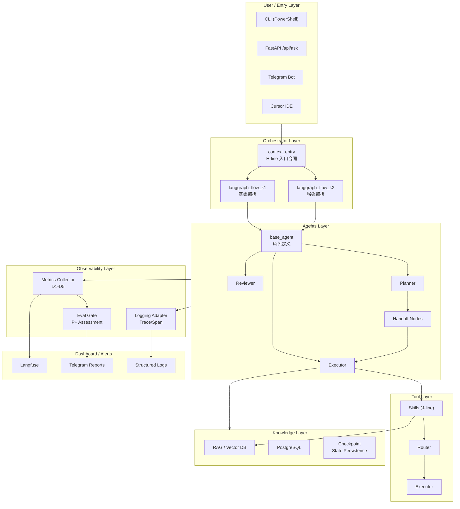
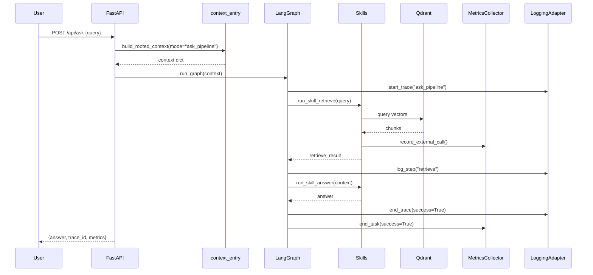
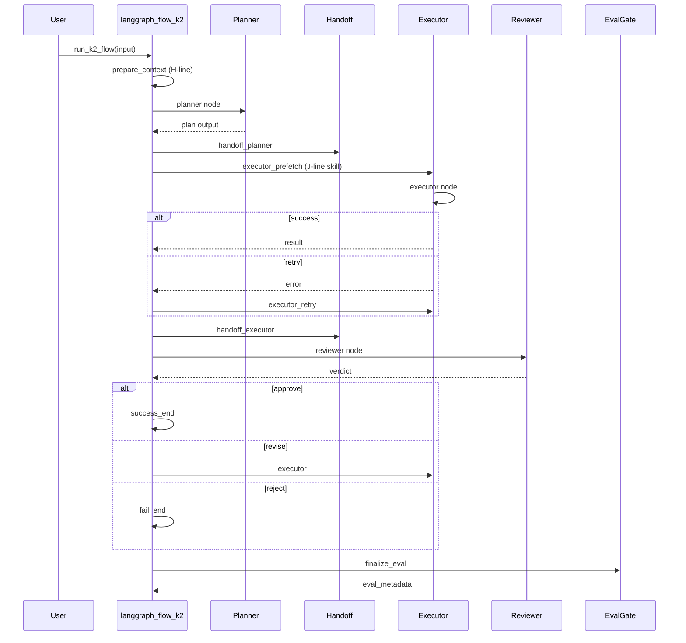
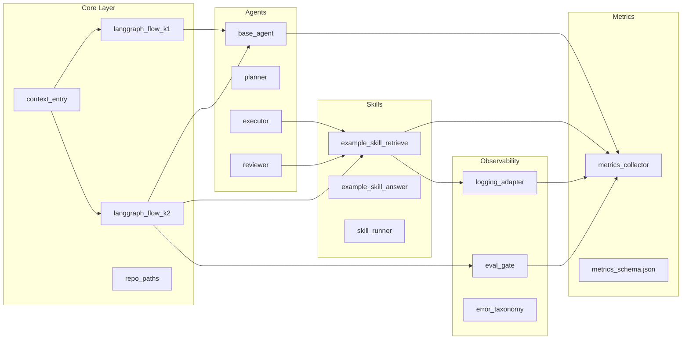

# 系统架构文档

> **版本**: Phase 1 Architecture Baseline  
> **更新**: 2026-06-05  
> **关联**: `00_master_plan.md` (企业化补强总蓝图)

---

## 1. 架构总览



---

## 2. 分层详解

### 2.1 User / Entry Layer（用户入口层）

| 入口 | 实现 | 用途 |
|------|------|------|
| **CLI** | PowerShell Scripts | 工厂主线、战路启动、体检 |
| **FastAPI** | `app_api.py` | `/api/ask` 端点、dev-only ibridge |
| **Telegram** | `Start-TelegramListener.ps1` | 远程命令、战报推送 |
| **Cursor** | `docs/orchestration/` | 多 Agent 协作 IDE |

**关键文件**:
- `04_Workflows/Enter-Main.ps1` - 主舱进入
- `04_Workflows/Enter-Agency.ps1` - 副舱进入
- `04_Workflows/Launch-Warpath.ps1` - 一键战路

### 2.2 Orchestrator Layer（编排层）

#### 2.2.1 H-line: Context Entry（上下文入口）

```python
# core/context_entry.py
build_rooted_context(task_input, *, mode="ask_pipeline")
```

- **禁止绕过**: 所有 ask-like、LangGraph 首节点、对外 API 必须调用
- **模式**: `ask_pipeline`, `k2_pipeline`, `monitoring`
- **输出**: `root_context`, `working_context`, `long_term_memory`

#### 2.2.2 K-1: 基础编排图

```
START → ingest → verify → retrieve → decide → answer → human_confirm? → finish
```

- **节点**: ingest_node, verify_node, retrieve_node, decide_node, answer_node
- **状态**: `K1State` (TypedDict)
- **文件**: `core/langgraph_flow_k1.py`

#### 2.2.3 K-2: 增强编排图

```
START → prepare_context → planner → [route] → handoff_planner
      → executor_prefetch → executor → [route] → handoff_executor | executor_retry
      → reviewer → [route] → success_end | executor | fail_end
      → finalize_eval → END
```

- **增强点**: 显式 handoff 节点、executor 错误/重试分支、J-line skills、P+ eval_gate
- **文件**: `core/langgraph_flow_k2.py`

### 2.3 Agents Layer（Agent 层）

#### 2.3.1 角色定义

```python
# agents/base_agent.py
ROLE_PLANNER = "planner"
ROLE_EXECUTOR = "executor"
ROLE_REVIEWER = "reviewer"
```

| 角色 | 职责 | 输出 |
|------|------|------|
| **Planner** | 任务分解、策略制定 | `steps`, `strategy` |
| **Executor** | 执行检索/工具调用 | `result`, `tool_calls` |
| **Reviewer** | 结果审核、质量把关 | `verdict`, `feedback` |

#### 2.3.2 Handoff 机制

- **计数**: `handoff_count` 在 MetricsCollector 中记录
- **节点**: `handoff_planner`, `handoff_executor`
- **触发**: `route_by_status()` 根据状态路由

### 2.4 Tool Layer（工具层）

#### 2.4.1 J-line Skills

```python
# skills/example_skill_retrieve.py
run_skill_retrieve(query, *, task_id, trace_ctx, config)
```

- **Metrics-aware**: 自动记录 `external_call_count`, `token_delta`
- **自动挂钩**: retry、trace、span 通过 `skill_runner` 嵌入
- **模式**: `retrieve`, `answer`, `custom`

#### 2.4.2 Router & Executor

| 组件 | 路径 | 功能 |
|------|------|------|
| **Router** | `subagents/context_routing.py` | 子 Agent 路由（monitoring/ask/...） |
| **Runner** | `core/skill_runner.py` | Skill 统一执行器 |

### 2.5 Knowledge Layer（知识层）

| 组件 | 技术 | 用途 |
|------|------|------|
| **Vector DB** | Qdrant / ChromaDB | 文档嵌入检索 |
| **Data Vault** | PostgreSQL | 结构化数据、jobs/events 账本 |
| **Checkpoint** | SQLite / Postgres | LangGraph 状态持久化 |

**关键配置**:
- `01_Environments/python_venvs/gov_core_system/.env.example`
- `runtime/checkpoints/` - 运行时检查点（⚠️ 高禁区）

### 2.6 Observability Layer（可观测层）

#### 2.6.1 Metrics Collector（D1-D5）

```python
# metrics/metrics_collector.py
get_collector().start_task(task_id, agent_name)
get_collector().log_step(task_id, step_name, ...)
get_collector().end_task(task_id, success=True)
```

**D1-D5 维度映射**:

| 维度 | 指标字段 | 收集方式 |
|------|----------|----------|
| D1 Stability | `retry_count`, `success_rate` | `record_retry_count()` |
| D2 Context | `context_token_usage`, `memory_hit_rate` | `record_memory_hit_rate()` |
| D3 Collaboration | `handoff_count` | `record_handoff()` |
| D4 Observability | `step_count`, `trace_completeness` | `log_step()` |
| D5 Governance | `error_type`, `external_call_count` | `log_error()`, `record_external_call()` |

#### 2.6.2 Logging Adapter（Trace/Span）

```python
# observability/logging_adapter.py
with agent_run_trace("ask_pipeline") as ctx:
    log_event("retrieve_start", {...})
    log_metric("latency_ms", 150.0)
    log_error("llm_error", "timeout", increment_retry=True)
```

**结构化日志字段**:
- `trace_id`: UUID 链路 ID
- `task_id`: 任务标识
- `agent_name`: Agent 名称
- `span_id`: 步骤标识
- `trace_schema_version`: "agent-metrics-v1"

#### 2.6.3 Eval Gate（P+ 评估）

```python
# observability/eval_gate.py
evaluate_task_record(record) -> {
    "needs_review": bool,
    "flags": ["high_retry", "context_heavy", ...],
    "score": float
}
```

**评估规则**:
- `high_retry`: retry_count > 2
- `context_heavy`: context_token_usage > 8000
- `many_handoffs`: handoff_count > 3
- `infra_risk`: 涉及外部 API 失败
- `observability_gap`: trace_completeness_score < 0.8

### 2.7 Dashboard / Alerts（仪表板/告警）

| 目的地 | 集成 | 内容 |
|--------|------|------|
| **Langfuse** | Langfuse Cloud / Self-host | Trace 可视化、成本分析 |
| **Telegram** | Bot API | 战报、弹药余裕、省下金额 |
| **Logs** | Structured JSONL | 下游 SIEM / ELK 集成 |

**Telegram 战报示例**:
```
Wave-01 完成: 5.101 / A=10 B=55 C=4 D=31 / Groq 7-7
今日弹药余裕: 87%
本次精炼花费: $0, 省下 [42] 元
```

---

## 3. 数据流

### 3.1 Ask Pipeline 数据流



### 3.2 K-2 Pipeline 数据流



---

## 4. 模块依赖图



---

## 5. 关键接口

### 5.1 Context Entry Contract

```python
# core/context_entry_contract.md (引用)
def build_rooted_context(
    task_input: dict,
    *,
    mode: Literal["ask_pipeline", "k2_pipeline", "monitoring"],
    trace_id: str | None = None,
    metadata: dict | None = None,
) -> dict:
    """
    Returns: {
        "ok": bool,
        "context": {
            "root_context": {...},
            "working_context": {...},
            "long_term_memory": {...},
        },
        "trace_id": str,
        "mode": str,
    }
    """
```

### 5.2 Ask Response Envelope

```python
{
    "ok": bool,
    "answer": str | None,
    "error": str | None,
    "trace_id": str,
    "metrics": {
        "latency_ms": float,
        "token_usage": {...},
        "steps": [...],
    },
    "eval_metadata": {  # P+ 可选
        "needs_review": bool,
        "flags": [...],
    }
}
```

---

## 6. 部署拓扑

```
┌─────────────────────────────────────────────────────────────┐
│                        开发环境 (Dev)                         │
│  ┌─────────────┐  ┌─────────────┐  ┌─────────────┐           │
│  │  Cursor IDE  │  │  FastAPI    │  │  Telegram   │           │
│  │  (orchestrate)│  │  (dev only) │  │  (dev bot)  │           │
│  └─────────────┘  └─────────────┘  └─────────────┘           │
│         │                │                │                  │
│         └────────────────┴────────────────┘                  │
│                          │                                    │
│                   ┌─────────────┐                              │
│                   │  gov_main   │ ← Python 3.10 + 轻量依赖      │
│                   │  (venv)     │                              │
│                   └─────────────┘                              │
└─────────────────────────────────────────────────────────────┘
                              │
                              ▼
┌─────────────────────────────────────────────────────────────┐
│                     核心运行时 (Core)                        │
│  ┌─────────────┐  ┌─────────────┐  ┌─────────────┐           │
│  │gov_core_system│ │  Qdrant     │  │ PostgreSQL  │           │
│  │ (LangGraph) │  │  (Vectors)  │  │  (Data)     │           │
│  └─────────────┘  └─────────────┘  └─────────────┘           │
│         │                                                      │
│         ▼                                                      │
│  ┌─────────────┐                                                │
│  │ gov_agency  │ ← CrewAI + ChromaDB (重依赖隔离)                │
│  │  (venv)     │                                                │
│  └─────────────┘                                                │
└─────────────────────────────────────────────────────────────┘
                              │
                              ▼
┌─────────────────────────────────────────────────────────────┐
│                     外部服务 (External)                        │
│  ┌──────────┐ ┌──────────┐ ┌──────────┐ ┌──────────┐        │
│  │  OpenAI  │ │  Groq    │ │ Langfuse │ │Telegram  │        │
│  │  API     │ │  API     │ │  Cloud   │ │  API     │        │
│  └──────────┘ └──────────┘ └──────────┘ └──────────┘        │
└─────────────────────────────────────────────────────────────┘
```

---

## 7. 扩展点

| 扩展 | 接入点 | 文档 |
|------|--------|------|
| 新 Skill | `skills/` + `skill_runner` | `skills/skills_contract.md` |
| 新 Agent | `agents/base_agent.py` 子类 | `agents/README.md` |
| 新 Graph | `core/langgraph_flow_*.py` | `00_master_plan.md` §4 |
| 新观测器 | `observability/logging_adapter.py` | `metrics/metric_definition.md` |
| 新工具 | `tools/` + `subagents/` | `docs/orchestration/README.md` |

---

## 8. 相关文档

- [`00_master_plan.md`](../00_master_plan.md) - 企业化补强总蓝图
- [`AGENTS.md`](../AGENTS.md) - 副官接战守则
- [`docs/governance.md`](./governance.md) - 治理规范
- [`docs/orchestration/README.md`](./orchestration/README.md) - 多 Agent 调度
