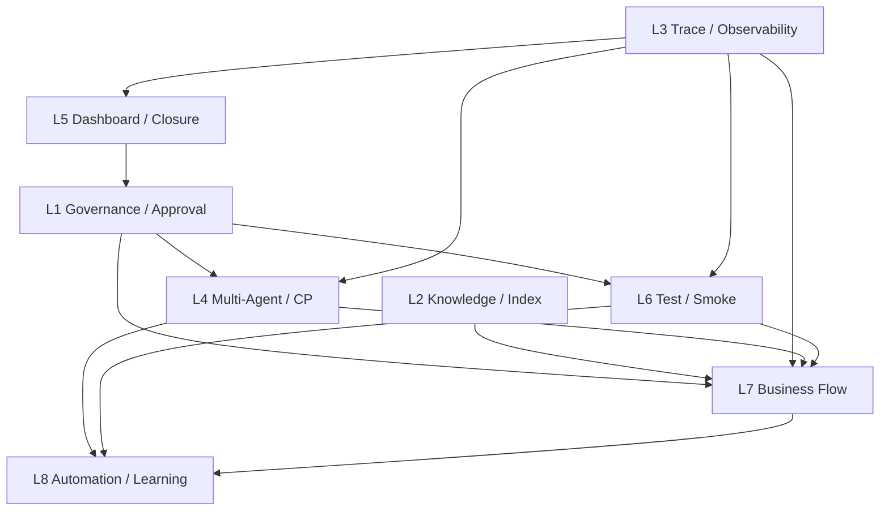

# Full-Phase Lane Map v1 — Phase 1 → Phase 10.5 · 8-Lane Control Plane

> **Authority ticket**: `W-MASTER-full-phase-plan_state.md`  
> **Phase% SSOT**: `docs/WAVE_PROGRESS_DASHBOARD.md`（**2026-06-26** · **本檔不重算**）  
> **後段战术线（P7+）**: `04_Workflows/tickets/W-MASTER-wave-plan_state.md` · `W-ORCH-wave-next-control-plane-v1`  
> **本檔角色**: 全 Phase 橫向 lane 索引 · lane chat 開工前必讀 · **doc-only**

---

## 1. 命名空間（勿混淆）

| 名稱 | 含義 | 索引 |
|------|------|------|
| **8-Lane Full-Phase CP** | 本檔 + `W-MASTER-full-phase-plan` · Phase 1–10.5 總盤面 | 本檔 |
| **Wave Master W1–W5** | P7+ 後段 **planned tickets** · Master CP schema/commands | `W-MASTER-wave-plan_state.md` |
| **Wave-next 战术 CP** | P7/P8.5/P9 並行 lane · GA/advisory 收口 | `W-ORCH-wave-next-control-plane-v1_state.md` |
| **Tabular MVP Wave 1–12** | Agent Lines · routing · tool layer | `docs/WAVE_PROGRESS_DASHBOARD.md` §總覽表 |
| **Toolchain Wave B** | P8.6–8.9 contract · WB-T* | `docs/WAVE_B_TOOLCHAIN_EXECUTION_PLAN.md` |
| **Observability Wave B** | P2/P3 eval/trace · WAVE-B-P* | `docs/WAVE_B_EXECUTION_PLAN.md` |

**對齊原則**：本檔 **不重寫** `W-MASTER-wave-plan` Wave 1–5 正文；lane chat 涉 P7+ 時 **must** 交叉讀 Wave Master + Wave-next。

---

## 2. Phase% 快照（引用 SSOT · 凍結）

> 來源：`docs/WAVE_PROGRESS_DASHBOARD.md` §Phase 完成度表 · **2026-06-26**

| Phase | **当前 %** | 主 Lane | 缺口姿態 |
|-------|-----------|---------|----------|
| P1 治理層 | **90%** | L1 | 补最后缺口 |
| P2 知識層 / Index | **65%** | L2 | **中度缺口** |
| P3 可觀測性 / Trace | **82%** | L3 | 补最后缺口 |
| P4 多智能體協作 | **75%** | L4 | **中度缺口** |
| P5 Dashboard / 离线健康度 | **70%** | L5 | **中度缺口** |
| P6 测试 / 回归 gate | **72%** | L6 | **中度缺口** |
| P7 自動客戶溝通 | **30%** | L7 | **大缺口** |
| P7.5 Intake Gate | **45%** | L7 | **大缺口** |
| P8 商業化交付 | **45%** | L7 | **大缺口** |
| P8.5 Browser / CU | **10%** | L7 | **大缺口** |
| P8.6 Tool Catalog SSOT | **65%** | L7 | **中度缺口** |
| P8.7 Selector 推荐契约 | **60%** | L7 | **中度缺口** |
| P8.8 Executor / Sandbox | **58%** | L7 | **中度缺口** |
| P8.9 Outbox / Feedback | **40%** | L7 | **大缺口** |
| P9 訂單 / 金流閉環 | **20%** | L7 | **大缺口** |
| P10 95% 全自動化閉環 | **35%** | L8 | **大缺口** |
| P10.5 學習 / Skill 蒸餾 | **30%** | L8 | **大缺口** |

---

## 3. Lane 摘要表（8-Lane）

| Lane | 名稱 | Covered Phases | 缺口等级 | 典型 Lane Chat |
|------|------|----------------|----------|----------------|
| **L1** | Governance / Approval | P1 · P3.5 · 跨 Phase 批文 | **补最后缺口** | Governance doc / WC-PRE 设计 |
| **L2** | Knowledge / Index | P2 · RAG ingest 索引 | **中度缺口** | index job · contract 补跑 |
| **L3** | Trace / Observability | P3 · P3.5 · upstream trace | **补最后缺口** | trace SSOT · evidence tier |
| **L4** | Multi-Agent / Control Plane | P4 · W-MASTER · W-ORCH · Multi-Chat | **中度缺口** | CP schema · orchestrator wiring |
| **L5** | Dashboard / Progress / Closure | P5 · audit · metrics HTTP | **中度缺口** | health dashboard · closure scribe |
| **L6** | Test / Smoke / Regression | P6 · MP/MC-SMOKE · Agent Lines CI | **中度缺口** | smoke matrix · advisory CI 索引 |
| **L7** | Business Flow / Delivery | P7–P9 · P8.6–8.9 | **大缺口为主** | intake · notify · payment · bridge |
| **L8** | Automation / Learning Loop | P10 · P10.5 | **大缺口** | S15 notify · skill distill |

---

## 4. Cross-Lane Dependency DAG（邏輯 · 非施工順序）



**硬依賴（lane chat 須知）**

| 上游 | 下游 | 依賴內容 | 缺失時 |
|------|------|----------|--------|
| L1 | L4/L6/L7 | 合約/禁區/批文 · advisory≠required | defer CI 升格 · stop_work |
| L2 | L7 | index/RAG 就緒 · P2 contract | 不重做 ingest 基線 |
| L3 | L7 | `p75-intake-gate-control-plane-trace-v1` · evidence tier | 禁止 ad-hoc trace 欄位 |
| L4 | L7/L8 | Multi-Chat B/C/D/O · dispatch · W-MASTER schema | 不雙份 CP 模板 |
| L6 | L7 | MP-SMOKE · CI-SMOKE · matrix G-1–G-5 spec | 不宣稱 GA=local pass |
| L7 | L8 | gate→notify→outbox→payment 主鏈 | P10 不得跳過 L7 human block |

---

## 5. Do Not Re-Build Registry（摘要）

> 完整表見 `W-MASTER-full-phase-plan_state.md` §Do Not Re-Build Registry

| ID | 已落地能力 | 禁止重做 | 允許 |
|----|-----------|----------|------|
| **DNR-01** | W1–W4 Tabular MVP 主鏈（6/6 regression） | 重寫 routing engine / mainline | doc cross-ref · 單點 bugfix 票 |
| **DNR-02** | W3-TL 四件套 + W4 glue/eval | 合併 Tabular/Phase8.8 tool layer | 分軌索引 |
| **DNR-03** | P75-G2/G3/G4 + P75-REG E2E | 重開 gate layer | UI/SLO/alert 缺口票 |
| **DNR-04** | MP-SMOKE/MC-SMOKE/CI-SMOKE CLI | 新 orchestrator 取代七步 | `--enable-dispatch` 等增量 |
| **DNR-05** | W6-T5/T6 checkpoint 整合層 | inline checkpoint 重寫 | W6-T10 cleanup 票 |
| **DNR-06** | W10-T2 registry fail-closed（env off） | prod gate 默認開 | strict opt-in 文檔 |
| **DNR-07** | Master CP schema/commands（W5-T1/T2） | Wave 1 雙份維護 | Wave 1 只消費 |
| **DNR-08** | P8.5 bridge L-local 14/14·7/7 | prod browser / required CI | GA-remote 證據票 |
| **DNR-09** | P9 sandbox 21/21 + e2e PAID | prod provider/ledger | 首跑 URL 回填票 |
| **DNR-10** | Governance 憲法/合約/AGENTS | 規則檔重定義禁區表 | 索引/append |

---

## 6. Lane 詳細卡（每 Lane 八項）

### L1 — Governance / Approval

| 項 | 內容 |
|----|------|
| **Covered Phases** | P1 (90%) · P3.5 cost/model governance · WC-PRE-06/07 · 跨 Phase 批文 |
| **Existing SSOT** | `docs/governance-constitution-v1.md` · `ENGINEERING_CONTRACT.md` · `.cursor/rules/engineering-contract.mdc` · `docs/phase3-5-cost-model-governance-contract-v1.md` · `AGENTS.md` |
| **Already-landed** | W1-T1B 治理收斂 · WA-T3 P3.5 contract · eval-gate CI contract · Multi-Chat 角色憲法 · WC-IMPL-L1 advisory snapshot |
| **Critical gaps only** | WC-PRE-06/07 **尚書省批文**前 L2 mandatory CI · W4-GUARD G2–G4 schema/ratio 升格 · governance_dual 真批文（P7 Round-2） |
| **Human-only** | WC-PRE-06/07 approval · governance_dual 批文 · Phase% / master_status 里程碑裁決 |
| **Infra-only** | — |
| **Security-only** | P7 外部 POST 审查 sign-off |
| **Anti-duplication** | 不重寫憲法 §7 禁區表 · 不在 lane 内新建 `.cursor/rules` 定稿 · Wave 5 = Master CP SSOT |
| **Ready-to-build** | doc/SSOT/索引票 · WC-PRE design-only · L1 advisory 延續；**blocked** required CI 升格 |
| **B/C/D/O** | B=FRAME/contract · C=doc/config · D=Reviewer 對照 playbook §5.3 · O=Scribe Progress append |

**缺口姿態**：**补最后缺口**（P1 90% · 剩批文/升格邊界）

---

### L2 — Knowledge / Index

| 项 | 内容 |
|----|------|
| **Covered Phases** | P2 (65%) · Gov Core RAG ingest · WA-T1 knowledge indexing contract |
| **Existing SSOT** | `docs/phase2-knowledge-indexing-contract-v1.md` · `04_Workflows/runbooks/RAG_SMOKE_TEST_RUNBOOK_v0.1.md` · `00_Agent_Work_Progress.md` D2/D3 證據 |
| **Already-landed** | Phase1 ingest_verify · AGENTS.md ingest · document_chunks 检索 smoke · WA-T1 contract unittest |
| **Critical gaps only** | **本轮无新 index job**（Dashboard 06-26）· 端到端问答/GraphRAG · 监控评测 · index job 自动化排程 |
| **Human-only** | prod 索引策略裁決 |
| **Infra-only** | PG/Qdrant soak 扩容（若新 index 批次） |
| **Security-only** | — |
| **Anti-duplication** | 不重跑 Phase1 seed INV 破坏 · 不接管暗部 ingest core |
| **Ready-to-build** | contract 补 doc · 单票 index job hook · RAG eval 索引；**非**全库 re-ingest |
| **B/C/D/O** | B=contract/frame · C=脚本/测试 · D=unittest + smoke · O=Progress 末尾 |

**缺口姿態**：**中度缺口**（基线 OK · 缺 Phase2 规模化 index）

---

### L3 — Trace / Observability

| 项 | 内容 |
|----|------|
| **Covered Phases** | P3 (82%) · P3.5 · upstream P7.5 trace · evidence tiers |
| **Existing SSOT** | `docs/observability.md` · `docs/p75-intake-gate-control-plane-trace-v1.md` · `docs/p8_p89_evidence_index_v1.md` · `docs/P7_ADVISORY_CI_INDEX.md` · gov-trace-v2 |
| **Already-landed** | trace v2 13/13 · WA-T3 P3.5 governance contract · W5-T3 evidence observer（planned）· MP-SMOKE trace 链 |
| **Critical gaps only** | Langfuse/PG 对齐 **deferred** · P8/P8.9 delivery observability contract（W3-P89-OBS 待建）· G-1–G-5 **runtime**（属 L6/L7 交界） |
| **Human-only** | GA-remote run URL 回填 |
| **Infra-only** | staging trace backend slot |
| **Security-only** | — |
| **Anti-duplication** | 禁止 ad-hoc trace 欄位（must 增 §Canonical schema）· 不重写 path report |
| **Ready-to-build** | doc-only trace/evidence · observer CLI · cross-ref 票 |
| **B/C/D/O** | B=trace contract · C=doc/CLI · D=verify_commands + tier 对照 · O=evidence rollup |

**缺口姿態**：**补最后缺口**（runtime trace OK · deferred 对齐/GA 证据）

---

### L4 — Multi-Agent / Control Plane

| 项 | 内容 |
|----|------|
| **Covered Phases** | P4 (75%) · Multi-Chat · W-MASTER · W-ORCH · dispatch cards |
| **Existing SSOT** | `docs/phase4-multi-agent-collaboration-contract-v1.md` · `.cursor/rules/multi_chat_roles.mdc` · `W-MASTER-wave-plan_state.md` · `docs/wave-master-ticketing-playbook.md` · `.cursor/commands/` |
| **Already-landed** | W5-T0 三 docs · WA-T4 contract · W5-T1 commands MVP · W5-T2 schema · WC-T1-INTEGRATION dispatch · B-F2 multi-chat roles |
| **Critical gaps only** | W5-T5 lane index（defer 末轮）· W6-T10 orchestrator cleanup · notify transport 执行票（Master Plan 外）· W-ORCH 与 W-MASTER 双 CP 叙事对齐 |
| **Human-only** | Orchestrator 关票 · PLAN_READY 升格 |
| **Infra-only** | — |
| **Security-only** | — |
| **Anti-duplication** | Wave 1 不维护 CP 主版本 · 不接管他人 core · 不重写 W-MASTER Wave 1–5 正文 |
| **Ready-to-build** | schema/commands/index 票 · orchestrator cleanup · CP doc 对齐 |
| **B/C/D/O** | 全阶段 · Master 票 O 阶段 · 子票标准 B→C→D→O |

**缺口姿態**：**中度缺口**（骨架在 · cleanup + index + transport defer）

---

### L5 — Dashboard / Progress / Closure

| 项 | 内容 |
|----|------|
| **Covered Phases** | P5 (70%) · audit · metrics · Progress · closure scribe |
| **Existing SSOT** | `docs/WAVE_PROGRESS_DASHBOARD.md` · `04_Workflows/00_Agent_Work_Progress.md` · `docs/audit-quickview-and-case-history-spec-v1.md` · `scripts/metrics_http_endpoint_v1.py` |
| **Already-landed** | WB-T4 toolchain health dashboard · WB-T5 audit spec · MP-METRICS HTTP GET /metrics · W10-T2 agent lines metrics · `_ops_cycle.py` |
| **Critical gaps only** | Grafana/PG soak **placeholder** · P8.5 closure-scribe **blocked**（无 GA URL）· fleet 聚合运维视图 |
| **Human-only** | `master_status.md` 里程碑（Governance 独占） |
| **Infra-only** | Grafana/PG 实例（若 soak 升格） |
| **Security-only** | — |
| **Anti-duplication** | 不重算 Phase% · 不改 Progress 历史段 · Dashboard 仍为 Phase% 唯一 SSOT |
| **Ready-to-build** | Progress append 模板 · closure rollup doc · metrics 索引 |
| **B/C/D/O** | Scribe 重 O · Reviewer 验 Progress 末尾 |

**缺口姿態**：**中度缺口**（离线 OK · prod soak/closure 卡 human）

---

### L6 — Test / Smoke / Regression

| 项 | 内容 |
|----|------|
| **Covered Phases** | P6 (72%) · INT gate · toolchain smoke matrix · Agent Lines CI |
| **Existing SSOT** | `docs/phase6-int-regression-gate-contract-v1.md` · `routing/toolchain_smoke_matrix_v1.yaml` · `04_Workflows/testing/standard-case-hitl-resume-notify-matrix.md` · `04_Workflows/review_checklists/wave-next-code-inspector-v1.md` |
| **Already-landed** | WB-T7 smoke matrix · MP/MC-SMOKE · CI-SMOKE local · eval-gate-ci.yml dry-run · run_agent_lines_ci_suite · W1-T3B mainline 6/6 |
| **Critical gaps only** | required CI **未落地**（WC-PRE-07 blocked）· G-1–G-5 resume-loop **runtime**（W2 票）· nightly run-all-allowed deferred · P7/P85/P9 advisory **GA-remote pending** |
| **Human-only** | workflow_dispatch · branch protection 升格批文 |
| **Infra-only** | CI runner 首跑环境 |
| **Security-only** | — |
| **Anti-duplication** | 不新写第二套 seven-step smoke · advisory≠merge gate · local≠GA-remote |
| **Ready-to-build** | matrix spec · advisory index · unittest 增量 · runbook |
| **B/C/D/O** | C=测试/CI yml · D=inspector checklist · 无 evidence 不得 O |

**缺口姿態**：**中度缺口**（local sanity 齐 · required/GA/runtime matrix 缺）

---

### L7 — Business Flow / Delivery

| 项 | 内容 |
|----|------|
| **Covered Phases** | P7 (30%) · P7.5 (45%) · P8 (45%) · P8.5 (10%) · P8.6–8.9 · P9 (20%) |
| **Existing SSOT** | `W-MASTER-wave-plan` Wave 1–4 · `W-ORCH-wave-next` · `docs/p75-intake-gate-control-plane-trace-v1.md` · `docs/p8_p89_evidence_index_v1.md` · Toolchain WB-T1–T3 |
| **Already-landed** | P75 gate layer+policy+notify+REG · P8 backlog HTTP · P8.9 consumer/dispatch/registry · P7 Round-1 local GO · P85 L-local 14/14·7/7 · P9 sandbox 21/21 · bridge-smoke.yml landing |
| **Critical gaps only** | P7 Round-2 **五顶 blocked** · P85 Scenario2 GA · P9 run URL · prod provider/ledger · batch/webhook T4 · UI/SLO/alert |
| **Human-only** | governance_dual · GA dispatch · CI 首跑 · closure sign-off |
| **Infra-only** | staging slot/endpoint · allowlist · receiver 部署 |
| **Security-only** | 外部 POST 审查 |
| **Anti-duplication** | 见 W-MASTER Wave 1–4 planned tickets · 不重做 P75-G2/G3/G4 · bridge≠prod |
| **Ready-to-build** | 解阻 spec · evidence/runbook · MVP doc · **blocked** staging execute |
| **B/C/D/O** | 标准子票 · human blocked 须 honest STATE |

**缺口姿態**：**大缺口为主**（后段主战场 · 多 human block）

---

### L8 — Automation / Learning Loop

| 项 | 内容 |
|----|------|
| **Covered Phases** | P10 (35%) · P10.5 (30%) |
| **Existing SSOT** | `docs/ninety-five-percent-automation-blueprint-v2.md` · `W-MASTER-wave-plan` Wave 5 · WC-T6 distill skeleton · W5-T1 registry |
| **Already-landed** | 15 步实验线 ~86.7% · W7-T4 blueprint v2 · `distill_control_plane_skills_lite` skeleton · W10 registry |
| **Critical gaps only** | S15 notify gateway · intake API prod · prod 闭环 · prod 蒸馏闭环 · WC-T6/T7 v2 全量 mapping |
| **Human-only** | 95%→100% 升格裁決 |
| **Infra-only** | prod notify/intake endpoint |
| **Security-only** | prod 流量 flip |
| **Anti-duplication** | 不跳过 L7 human block 宣稱 P10 done · 不重写 15 步 orchestrator |
| **Ready-to-build** | design/doc · skeleton 延伸 · **blocked** prod runtime |
| **B/C/D/O** | Wave 5 planned · runtime 票须 L7 解阻后 |

**缺口姿態**：**大缺口**（设计在 · runtime 远）

---

## 7. Phase% Freeze Rule（lane chat 必守）

1. **唯一 SSOT**：`docs/WAVE_PROGRESS_DASHBOARD.md` §Phase 完成度表（2026-06-26）。
2. **lane chat / ticket / Progress 叙述** 可更新叙事，**不得**自行修改 Phase% 数字。
3. **上调 Phase%** 仅尚書省 / 授权 Governance **append** Progress + Dashboard 同步刷新（本计划不触发）。
4. **06-23→06-26 差异**以 Dashboard 脚注为准；`W-MASTER-wave-plan` §Current Baseline 若与 Dashboard 冲突，**以 Dashboard 为准**。

---

## 8. Closure Non-Claims Rule

| 禁止宣稱 | 正确表述 |
|----------|----------|
| L-local unittest = GA-remote / prod-ready | 标注 `evidence_tier: L-local` |
| CI yml landing = GA pass | landing + **pending GA-remote** |
| advisory CI 绿 = merge gate | `continue-on-error` · non-required |
| MP-SMOKE 七步绿 = P7 staging 完成 | Round-2 still **blocked** |
| bridge 14/14 = prod browser | in-memory stub · Scenario2 blocked |
| P9 21/21 = prod 金流 | sandbox · prod provider gap |
| PLAN_READY = P10 runtime 已排期 | deferred · 见 W-MASTER §Known gaps |
| 本 lane map 完成 = Phase% 上调 | doc-only · Phase% freeze |

权威：`docs/p8_p89_evidence_index_v1.md` · `wave-next-code-inspector-v1.md` §3.2–3.3

---

## 9. Reviewer Protocol（lane 级）

1. **只读施工** — 不改 yml required · 不跑 prod/staging 真执行 · 不调 Phase%。
2. **SSOT 位阶** — 子票 STATE ＞ `W-MASTER-full-phase-plan` ＞ chat 口述。
3. **Evidence tier** — 无 run URL 不得 GA-remote verdict；对照 `p8_p89_evidence_index_v1.md`。
4. **Cross-lane** — 动 L3 trace 字段须查 `p75-intake-gate-control-plane-trace-v1.md`；动 L6 须查 matrix + inspector。
5. **Verdict 模板** — `accepted` / `accepted_with_gaps` / `needs_changes` / `blocked`；over-claim → reject。
6. **Master Review** — 全 lane 规划变更走 `docs/wave-master-ticketing-playbook.md` §5.3 + `WAVE_MASTER_PLAN_REVIEW_2026-06-26.md`。

---

## 10. Progress Append Protocol

1. **仅末尾 append** — `04_Workflows/00_Agent_Work_Progress.md`（憲法 §6.2）。
2. **每条须含** — ticket_id · lane_id · 命令摘要 · 关键 `ok`/计数 · evidence_tier · blocked/next。
3. **GA/CI 首跑** — 必须 `run_url` + `run_id` 占位符已回填或标 `pending`。
4. **Ops cycle 可选** — `_ops_cycle.py validate-report` → `append-report`（`AGENTS.md` §9）。
5. **禁止** — 覆盖 master_status（Governance 独占）· 重排 Progress 历史 · 口述 closure 无 append。

---

## 11. Lane Chat 开读顺序

```
1. AGENTS.md · engineering-contract.mdc
2. docs/full-phase-lane-map-v1.md（本檔）+ W-MASTER-full-phase-plan_state.md
3. docs/WAVE_PROGRESS_DASHBOARD.md — 己 Lane Phase 列 only
4. （L7+）W-MASTER-wave-plan + W-ORCH-wave-next + wave-next-playbook
5. （L3/L6/L7）p75 trace · p8_p89 evidence index · matrix · inspector
6. 04_Workflows/tickets/README.md
```

---

## 12. 索引

| 类型 | 路径 |
|------|------|
| Full-Phase Master state | `04_Workflows/tickets/W-MASTER-full-phase-plan_state.md` |
| Wave Master（P7+ planned） | `04_Workflows/tickets/W-MASTER-wave-plan_state.md` |
| Wave-next 战术 | `04_Workflows/tickets/W-ORCH-wave-next-control-plane-v1_state.md` |
| Full-Phase playbook | `docs/full-phase-master-planning-playbook.md` |
| Wave Master playbook | `docs/wave-master-ticketing-playbook.md` |
| Commands | `.cursor/commands/README.md` |
| WORKFLOW_INDEX | `04_Workflows/WORKFLOW_INDEX.md` §1.5 · §1.26 |

---

*full-phase-lane-map-v1 · 2026-06-26 · Full-Phase Master Orchestrator · doc-only · Phase% frozen at Dashboard 06-26*
