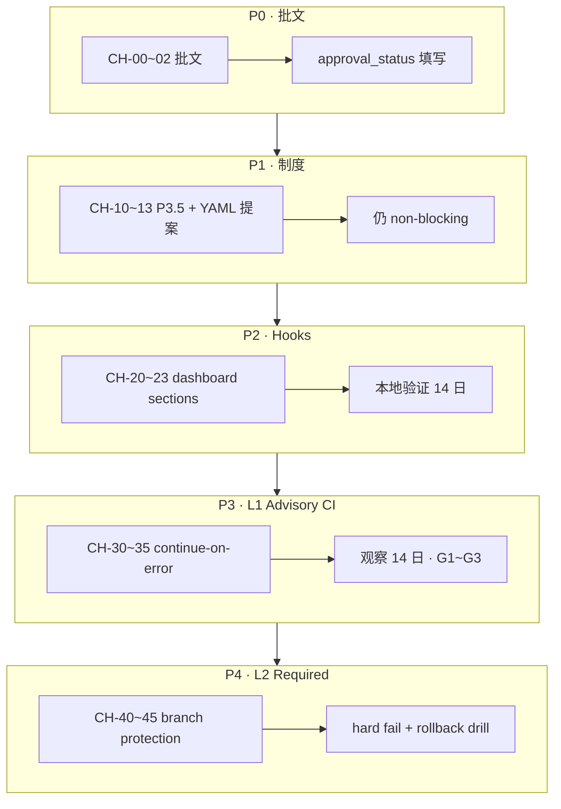

# WC-PRE-06 / WC-PRE-07 Toolchain Health & Smoke CI Rollout Plan

> **用途**：尚書省批文后「可开票照抄」的变更清单 + 风险说明。  
> **来源 SSOT**：`docs/toolchain-observability-governance-upgrade-v1.md`（WC-PRE-06）· `routing/toolchain_smoke_matrix_v1.yaml`（WB-T7）· `docs/phase6-int-regression-gate-contract-v1.md`（WA-T6）· `docs/phase3-5-cost-model-governance-contract-v1.md`（WA-T3）  
> **成文日期**：2026-06-13  
> **当前状态**：**未获批文 · 未改 CI required · 未写入 P3.5 表**

---

## 1. 背景（As-Is 关键点）

### 1.1 三层 Gate 现状（勿混用）

| 轴 | SSOT | 当前行为 | PR merge 影响 |
|----|------|----------|---------------|
| **PR mandatory trio** | P3.5 §2.1 | `eval-gate-ci.yml`（eval unit + eval_ci_check）+ `core-agent-smoke.yml`（PR tier） | **阻塞 merge**（required check） |
| **INT regression gate** | `04_Workflows/_wave7_regression_gate.py` · P6 contract §2–§4 | Tier-A（14 模块）本地 **mandatory**（改 envelope/manifest/QA/orch/runner 前必跑） | **不阻塞** PR（未接入 CI） |
| **Toolchain health / smoke** | WB-T4 dashboard · WB-T7 YAML · WC-PRE-05 runner | 全部 `gate_class=optional` · `blocks_mainline=false`（`TS-MVP-MAINLINE` 例外见下） | **不阻塞** PR |

**关键结论（P6 contract AC-6）**：`core-agent-smoke` 绿 + `eval-gate` 绿 **≠** INT Tier-A 绿 **≠** toolchain health 绿。

### 1.2 Toolchain Health（WB-T4 · 现况 L0）

| 项 | 现况 |
|----|------|
| 实现 | `scripts/run_toolchain_health_dashboard.py` · schema `toolchain_health_v1` |
| 文档 | `docs/toolchain-health-dashboard-v1.md` |
| Gate | `gate_class=optional` · `blocks_mainline=false` · 默认 `--dry-run` |
| P3.5 表 | **尚无** `OG-TOOLCHAIN-HEALTH` 正式行（WB-T4 deferred → WC-PRE-06 提案） |
| CI | **未**接入 `eval-gate-ci.yml` / `core-agent-smoke.yml` |
| 聚合区块 | 五核心（agent_ci · metrics · monthly · fixture_maturity · catalog_health）+ 可选 wf_status |
| 缺口 | `audit_health` · `smoke_matrix_health` hooks 未接入 dashboard（WC-PRE-06 §5） |

### 1.3 Smoke Matrix（WB-T7 + WC-PRE-05 · 现况 local only）

| 项 | 现况 |
|----|------|
| YAML SSOT | `routing/toolchain_smoke_matrix_v1.yaml`（14 entries · `matrix_revision: 2026-06-11`） |
| 本地 runner | `scripts/run_toolchain_smoke_matrix.py`（WC-PRE-05 · **accepted_with_gaps** · 19/19 unittest OK） |
| 矩阵 tier | `local_recommended`（10）· `optional_ci`（2）· `release_only`（1 · `TS-MVP-MAINLINE`） |
| 矩阵 gate_class | **全部** `optional`（含 `TS-MVP-MAINLINE`：release checklist mandatory，**不进** PR CI） |
| CI | **无** workflow step 消费 runner；P6 附录 A 明确禁止擅自升格 PR mandatory trio |
| 与 eval-gate 重叠 | `TS-ROUTING-EVAL-*` 已在 `eval-gate-ci.yml` PR job 内执行，但 P3.5 分类仍为 **optional** |

### 1.4 INT Gate（WA-T6 · 与 WC-PRE-06/07 边界）

| 项 | 现况 |
|----|------|
| Runner | `04_Workflows/_wave7_regression_gate.py` → `core/wave7_regression_gate.py` |
| P3.5 gate_id | `OG-WAVE7-REGRESSION-A` · **optional** · `blocks_mainline=N` |
| CI | **NonScope**（WA-T6 / WAVE7 runbook §7：伪代码 only，不强制新增 production workflow） |
| 与 smoke matrix 关系 | **分表**（P6 附录 A.1）：INT Tier-A/B ≠ toolchain smoke entries |

### 1.5 WC-PRE-06 / 07 票况（2026-06-12 战报）

| 票号 | 状态 | 交付物 |
|------|------|--------|
| **WC-PRE-06** | `design_ready · pending_approval` | `docs/toolchain-observability-governance-upgrade-v1.md`（L0→L1→L2 路径 · `OG-TOOLCHAIN-HEALTH` 提案 · rollback playbook · `approval_status` 批文栏） |
| **WC-PRE-07** | `draft` · rollout §7 D5=YES | `04_Workflows/tickets/WC-PRE-07_state.md` 已入庫；`docs/toolchain-smoke-mandatory-ci-runner-v1.md` 待 Scribe（CH-01） |

### 1.6 已交付前置能力（WC-PRE-01～05 · 可依赖）

- Selector 显式 `plan_only`（WC-PRE-02）
- Executor subprocess `timeout=600s`（WC-PRE-03）
- Audit investigation view CLI（WC-PRE-04 · accepted_with_gaps）
- Smoke matrix 本地 runner（WC-PRE-05）
- 本地 gaps quickview（WC-C1-01 · optional · non-gating）

---

## 2. 目标（To-Be 治理状态）

### 2.1 总体目标

在 **不破坏** P3.5 mandatory trio、**不混淆** INT Tier-A 语义、**不将** `aggregated_health_score` 升格为 SLA 的前提下，分阶段实现：

1. **可观测**：toolchain health + smoke matrix 在 PR/本地均有结构化产出（artifact / JSON）。
2. **可治理**：P3.5 表有正式 `OG-TOOLCHAIN-HEALTH` 行；smoke matrix CI 行为与 YAML `tier` / `gate_class` 对齐。
3. **可回滚**：L2 / mandatory smoke 均有 documented rollback；降级权限明确。

### 2.2 约束（Hard Constraints）

| # | 约束 |
|---|------|
| C1 | **禁止跳级**：toolchain health L0 → L1 → L2；smoke CI optional advisory → selective mandatory |
| C2 | L2 toolchain health 仍保持 `blocks_mainline=false`（阻 PR，不等同 MVP mainline regression） |
| C3 | **不得**将 INT Tier-A 或 `TS-MVP-MAINLINE` 默认塞进 PR mandatory path（除非另开 INT-CI 专票 + 批文） |
| C4 | **不得**把 `aggregated_health_score` / matrix `estimated_seconds` 写成 SLA / SLO |
| C5 | Observability（`obs.*` / `WAVE-B-P*`）与 Toolchain（`WB-T*`）**永久分轨** |
| C6 | 任何改 `.github/workflows/*` required check 或 branch protection **须尚書省批文** |

### 2.3 可观测性目标

| 级别 | Toolchain Health（WC-PRE-06） | Smoke Matrix CI（WC-PRE-07） |
|------|------------------------------|------------------------------|
| **L0 / Phase 0**（现况） | 本地 CLI → `artifacts/toolchain/*.json` | 本地 runner dry-run / execute |
| **L1 / Phase 1** | PR job dry-run · artifact upload · `continue-on-error: true` | PR job 跑 `tier=optional_ci` 或 dashboard smoke ids · advisory |
| **L2 / Phase 2** | PR **required** check · hard assert（`ok` + `sections_populated`） | PR job 跑选定 smoke ids · **required**（仍 optional class 或升格 mandatory 须 P3.5 修订票） |

### 2.4 Override 权限（RACI）

| 动作 | 裁決方 | 留痕位置 |
|------|--------|----------|
| WC-PRE-06/07 批文（开启 L1/L2 或 smoke CI） | **尚書省 / 治理委员会** | 本稿 §8 等价栏 · `approval_status` in design doc |
| L2 → L1 紧急降级（保留 advisory step） | 工程 on-call **可先执行** | 24h 内尚書省备案 · Progress 末尾 |
| L2/L1 → L0（移除 PR step） | **须尚書省或治理委员会** 书面/口头批文 | Progress · `approval_status` |
| 恢复 L2 | 重新满足 §2.2 升格门槛 + **新批文** | 新 implementation 票 |
| P3.5 表增 `OG-TOOLCHAIN-HEALTH` / 改 gate class | 治理委员会 + **独立修订票** `WA-T3-AMEND-OG-TOOLCHAIN` | P3.5 contract · ticket state |
| Branch protection 增删 required check | Repo admin + 尚書省 | GHA settings 截图 · 战报 |

---

## 3. 变更清单（可开票照抄）

> **复杂度**：1 = 小（单文件/doc）· 2 = 中（多文件/CI step）· 3 = 大（跨 workflow + branch protection + 契约修订）

### Phase 0 — 批文与制度（阻塞项 · 无代码）

| # | 标题 | 影响范围 | 负责人角色 | 复杂度 |
|---|------|----------|------------|--------|
| **CH-00** | 尚書省审阅 WC-PRE-06 设计稿并填写 `approval_status` | `docs/toolchain-observability-governance-upgrade-v1.md` §8 | Governance / 尚書省 | 1 |
| **CH-01** | 补全 WC-PRE-07 独立设计稿 + ticket state 入庫 | 新建 `docs/toolchain-smoke-mandatory-ci-runner-v1.md` · `04_Workflows/tickets/WC-PRE-07-*_state.md` | Governance / Scribe | 2 |
| **CH-02** | 明确 WC-PRE-06/07 批文范围（L1 only / L1+L2 / smoke optional / smoke mandatory 子集） | 本 rollout plan · Progress | Orchestrator | 1 |

### Phase 1 — 治理登记（doc + P3.5 · 仍 non-blocking）

| # | 标题 | 影响范围 | 负责人角色 | 复杂度 |
|---|------|----------|------------|--------|
| **CH-10** | P3.5 增 `OG-TOOLCHAIN-HEALTH` 正式行（L0/L1 class=optional） | `docs/phase3-5-cost-model-governance-contract-v1.md` §2.3 · ticket `WA-T3-AMEND-OG-TOOLCHAIN` | Governance | 2 |
| **CH-11** | P3.5 增 smoke matrix CI gate 行（建议 `OG-TOOLCHAIN-SMOKE-CI` · optional） | 同上 · WC-PRE-07 设计稿 | Governance | 2 |
| **CH-12** | 更新 P6 附录 A：新增 `TS-TOOLCHAIN-DASHBOARD-PR` / `TS-TOOLCHAIN-SMOKE-CI-OPTIONAL` 提案行 | `routing/toolchain_smoke_matrix_v1.yaml` · `docs/phase6-int-regression-gate-contract-v1.md` 附录 A | Implementer + Reviewer | 2 |
| **CH-13** | WORKFLOW_INDEX / WAVE_PROGRESS_DASHBOARD 索引升格状态 | `04_Workflows/WORKFLOW_INDEX.md` · `docs/WAVE_PROGRESS_DASHBOARD.md` | Scribe | 1 |

### Phase 2 — Dashboard hooks（WC-PRE-06 §5 · 本地能力 · 仍 non-blocking）

| # | 标题 | 影响范围 | 负责人角色 | 复杂度 |
|---|------|----------|------------|--------|
| **CH-20** | Dashboard 接入 `smoke_matrix_health` section（HOOK-SMOKE-SUMMARY） | `scripts/run_toolchain_health_dashboard.py` · tests | Implementer | 2 |
| **CH-21** | Dashboard 接入 `audit_health` section（HOOK-AUDIT-GAPS / TIMELINE） | 同上 · `scripts/run_agent_audit_quickview.py` 投影 | Implementer | 2 |
| **CH-22** | `toolchain_health_v1.1` schema 提案（L2 metadata：`gate_class` 可切换 · semver bump doc） | `docs/toolchain-health-dashboard-v1.md` · contract tests | Governance + Implementer | 2 |
| **CH-23** | WC-IMPL-HOOKS 验收：hooks 契约 unittest + quickview 嵌入对齐 | `tests/test_toolchain_health_dashboard_v1.py` · `tests/test_toolchain_local_gaps_quickview_v1.py` | Reviewer | 2 |

### Phase 3 — CI L1 Advisory（WC-PRE-06 L1 + WC-PRE-07 Phase 1）

| # | 标题 | 影响范围 | 负责人角色 | 复杂度 |
|---|------|----------|------------|--------|
| **CH-30** | `eval-gate-ci.yml` 增 toolchain health dry-run step（`continue-on-error: true`） | `.github/workflows/eval-gate-ci.yml` · job `eval-gate` | Platform / Implementer | 2 |
| **CH-31** | 上传 `toolchain_health_v1` JSON 为 PR artifact | 同上 · `artifacts/toolchain/` | Platform | 1 |
| **CH-32** | `eval-gate-ci.yml` 增 smoke matrix runner step（`--tier optional_ci --dry-run` 或 execute advisory） | `.github/workflows/eval-gate-ci.yml` · `scripts/run_toolchain_smoke_matrix.py` | Platform | 2 |
| **CH-33** | Smoke CI 结构化 summary JSON（`smoke_ci_summary.json` 类比 core-agent-smoke） | `scripts/run_toolchain_smoke_matrix.py` 或 thin wrapper | Implementer | 2 |
| **CH-34** | Contract tests：CI step 命令与 YAML `optional_ci` entries 对齐 | `tests/test_phase6_toolchain_smoke_matrix_v1.py` · 新 CI smoke test | Reviewer | 2 |
| **CH-35** | 14 日 L1 观察期 ops 週報模板（失败率 · artifact 存在率 · outbox 空档分类） | `04_Workflows/OPS_CYCLE.md` 或 runbook 附录 | Scribe | 1 |

**CH-30/32 建议命令（L1 · 非 final）**

```bash
# Toolchain health advisory
python scripts/run_toolchain_health_dashboard.py --format json --dry-run --no-write

# Smoke matrix advisory（仅 optional_ci tier · 或限定 smoke_id 列表）
python scripts/run_toolchain_smoke_matrix.py --tier optional_ci --format json
# 或：python scripts/run_toolchain_smoke_matrix.py --smoke-id TS-TOOLCHAIN-DASHBOARD-UNIT --format json
```

### 3.6 · WC-IMPL-L1 governance snapshot advisory（已落地 · 2026-06-13）

> **票**：`04_Workflows/tickets/WC-IMPL-L1_state.md` · **实现**：`scripts/generate_toolchain_governance_snapshot.py`  
> **语义**：L1 最弱约束 — 结构化 PR 可见度；**不**改 job pass/fail、`continue-on-error: true` 不变。

#### Snapshot schema 扩展（`toolchain_governance_snapshot_v1`）

| 字段 | 类型 | 说明 |
|------|------|------|
| `advisory_level` | `none` \| `warn` \| `critical` | 聚合级别：任一 critical → critical；否则任一 warn → warn |
| `advisory_findings[]` | array | 每条含 `code` · `severity` · `message` · `remedial_action` |
| `advisory_summary` | string | 人类可读摘要 |

#### MissingSignalRules v1（施工冻结 · 与 ticket FRAME 一致）

| code | severity | 触发条件 | remedial_action（摘要） |
|------|----------|----------|-------------------------|
| `MS-MATRIX-LOAD` | critical | `smoke_matrix.loaded_ok != true` | 检查 matrix YAML；本地 `--list --format json` |
| `MS-MATRIX-EMPTY` | critical | `coverage.smoke_entries_total == 0` | 确认 matrix `entries` 非空 |
| `MS-HEALTH-ASSEMBLY` | critical | `toolchain_health_embed.ok != true` | 本地 health dashboard `--dry-run --no-write` |
| `MS-HEALTH-SECTIONS` | critical | `toolchain_health_embed.sections_populated < 3` | 补齐 outbox 数据源 |
| `MS-CI-SMOKE-MISSING` | critical | 当前 `ci_context` 下 `_CI_OBSERVED_SMOKES` 中 smoke 为 `not_observed` 且无 external JSON | 确认 hosting workflow / `smoke_ci_summary.json` |
| `MS-CI-SMOKE-FAILED` | critical | 当前 `ci_context` 关联 smoke `last_result == failed` | 读 `error_summary` / artifact |
| `MS-OPTIONAL-CI-GAP` | warn | 全部 `tier=optional_ci` 为 `not_observed` | 预期 WC-PRE-07 smoke CI 未上；本地 `--tier optional_ci --dry-run` |
| `MS-HEALTH-DEGRADED` | warn | `degraded_sections` 非空 | infra_gap vs regression 分类 |
| `MS-SNAPSHOT-ARTIFACT` | warn | `--write` 但 `output_paths.json` 缺失 | 检查 `output/toolchain/` 权限 |

#### CI 行为

- `eval-gate-ci.yml` / `core-agent-smoke.yml` 既有 snapshot step：`--print-ci-summary` 输出 L0 trailer + **L1 advisory block**。
- 对 `severity=critical` finding 打印 GitHub `::warning title=<code>::<message>`。
- **`--write` 产出** `output/toolchain/governance_snapshot.{json,md}` + **`governance_advisory.log`**（L1 CI log 镜像）。
- **`--non-blocking` 下 exit 0 不变**；step `continue-on-error: true` 不变。

#### 验证

```bash
python -m unittest tests.test_toolchain_governance_snapshot_v1 -v
python scripts/generate_toolchain_governance_snapshot.py --ci-context eval-gate-pr --write --non-blocking --print-ci-summary
```

### Phase 4 — CI L2 Required（WC-PRE-06 L2 + WC-PRE-07 Phase 2 · 须 L1 门槛 + 新批文）

> **2026-06-13**：`WC-IMPL-L2` FRAME 已冻结（`frame_frozen_pending_governance`）；设计稿 `docs/governance/WC_TOOLCHAIN_GOVERNANCE_L2_design_draft.md`。**本节 CH-40～45 未授权施工**——须 `approval_status.L2=approved` + G1–G8 + rollback 演练。

| # | 标题 | 影响范围 | 负责人角色 | 复杂度 |
|---|------|----------|------------|--------|
| **CH-40** | Branch protection 增 required check（toolchain health job name TBD） | GitHub repo settings · 战报留痕 | Platform + 尚書省 | 2 |
| **CH-41** | Toolchain health step 改为 hard fail（assert `ok` + `sections_populated >= 4` + `catalog_health.ok`） | `.github/workflows/eval-gate-ci.yml` 或独立 workflow | Platform | 3 |
| **CH-42** | Smoke matrix selective mandatory（建议最小集：`TS-TOOLCHAIN-DASHBOARD-UNIT` + `TS-W3TL-UNIT`；**不含** `TS-MVP-MAINLINE` / `TS-AGENT-LINES-CI` 全长） | workflow + YAML 新增 `tier: pr_mandatory` 或 `gate_class` 子集字段 | Platform + Governance | 3 |
| **CH-43** | P3.5 修订：选定 smoke entries 升格 `mandatory`（若 CH-42 要求 merge blocker） | P3.5 §2.1 或 §2.3 修订票 | Governance | 2 |
| **CH-44** | Rollback playbook 演练 1 次并写 Progress | §7 步骤 · `04_Workflows/00_Agent_Work_Progress.md` | Orchestrator + on-call | 2 |
| **CH-45** | 90 日 governance 复审日历 + `approval_status` expiry | design doc §8 · OPS_CYCLE | Scribe | 1 |

### Phase 5 — 显式 Non-Goals（单独票 · 避免 scope creep）

| # | 标题 | 说明 | 负责人角色 | 复杂度 |
|---|------|------|------------|--------|
| **CH-50** | INT Tier-A 接入 PR CI | **不在 WC-PRE-06/07**；须 `WA-T6-CI` 或等价票 + dark venv bootstrap | 另票 | 3 |
| **CH-51** | Prometheus / Grafana / 实时告警 | WC-PRE-06 NonScope | — | — |
| **CH-52** | Dashboard 驱动 selector / delivery gate / INT Tier-A | 永久禁止（design doc §6.2） | — | — |

### 建议开票映射

| implementation 票 | 包含 CH |
|-------------------|---------|
| `WA-T3-AMEND-OG-TOOLCHAIN` | CH-10, CH-11 |
| `WC-IMPL-HOOKS` | CH-20, CH-21, CH-22, CH-23 |
| `WC-IMPL-L1` | CH-30～CH-35（依赖 `approval_status.L1=approved`） |
| `WC-IMPL-L2` | CH-40～CH-45（依赖 L1 21 日门槛 + `approval_status.L2=approved`） |
| `WC-IMPL-SMOKE-CI-L1` | CH-32～CH-34（可并入 WC-IMPL-L1 或独立） |
| `WC-IMPL-SMOKE-CI-L2` | CH-42, CH-43（可并入 WC-IMPL-L2 或独立） |

---

## 4. 风险与 Rollout 方案

### 4.1 主要风险

| 风险 | 影响 | 缓解 |
|------|------|------|
| **Outbox 空档导致 L2 全 PR 红** | 合并阻塞 · 开发者投诉 | L2 hard assert 排除「全 missing」误判为 fail；或 L1 观察期分类 `infra_gap` vs `regression` |
| **与 mandatory trio 混淆** | 误加第四 required check 无批文 | CH-00 批文明确；P3.5 修订票独立；Progress 留痕 |
| **Smoke 全长矩阵进 CI** | Job 超时（`TS-AGENT-LINES-CI` ~120s+）· flaky | L1/L2 仅跑 `optional_ci` 或白名单 smoke_id；不跑 `release_only` |
| **INT vs Toolchain 语义混用** | 以为 smoke 绿 = Wave 7 装配 OK | 文档 + PR 模板明确三分表；禁止在 smoke summary 写「INT passed」 |
| **`aggregated_health_score` 被当 SLA** | 治理债务 · 错误 escalation | 禁止 customer-facing SLA 文案；L2 默认 hard assert 不含 score（design doc §2.4） |
| **WC-PRE-07 设计缺失** | 开票范围漂移 | **先 CH-01** 再动 workflow |
| **Dark venv 依赖** | CI 无法跑部分 smoke（若未来扩 scope） | 当前 PR path 仅战车根 unittest/dry-run；INT 接入另票 CH-50 |

### 4.2 分阶段启用



| 阶段 | 启用条件 | 验证命令 / 证据 |
|------|----------|-----------------|
| **P0** | 尚書省启动 WC-PRE-06/07 治理票 | `approval_status.*=approved` |
| **P1** | P0 完成 | `python -m unittest tests.test_phase3_5_governance_contract_v1 -v` |
| **P2** | P1 + WC-IMPL-HOOKS merged | `python -m unittest tests.test_toolchain_health_dashboard_v1 -v` |
| **P3 · L1** | P2 + L0→L1 门槛 G1–G5（design doc §2.2） | GHA 14 日 advisory 日志 · artifact 抽樣 |
| **P4 · L2** | P3 21 日 + L1→L2 门槛 G1–G6 + rollback 演练 | branch protection 截图 · 试跑 PR |

### 4.3 回滚方案

#### L2 → L1（toolchain health required → advisory）

| 步 | 动作 | 验证 |
|----|------|------|
| 1 | Branch protection **取消** toolchain health required check | Settings / `gh api` 输出 |
| 2 | Workflow step 改 `continue-on-error: true` 或 revert CH-41 | 试跑 PR 绿 |
| 3 | `approval_status.L2=rolled_back` · Progress 末尾 append | 战报 |
| 4 | 本地确认 dashboard CLI 仍可用 | `python scripts/run_toolchain_health_dashboard.py --format json --dry-run --no-write` |

#### L2/L1 → L0（移除 PR step）

| 步 | 动作 |
|----|------|
| 5 | Revert CH-30/32 workflow steps |
| 6 | `approval_status.L1=rolled_back` |
| 7 | 通知 Wave C 消费方：toolchain health / smoke CI **非** PR 信号 |

#### Smoke CI mandatory → optional

| 步 | 动作 |
|----|------|
| 1 | Workflow smoke step 改 dry-run 或 `continue-on-error: true` |
| 2 | 若已升格 P3.5 mandatory：开修订票改回 optional |
| 3 | Progress 记录根因（timeout / flaky / outbox） |

**恢复 L2**：须重新满足 design doc §2.2 G1–G6 + **新批文** + rollback 根因已修复。

### 4.4 与 INT Gate 的 rollout 边界

| 问题 | 决策 |
|------|------|
| WC-PRE-07 是否跑 INT Tier-A？ | **否** — smoke matrix 不含 Wave 7 14 模块 |
| WC-PRE-06 L2 是否替代 INT？ | **否** — health 读 outbox/catalog，不验证 envelope→manifest 装配链 |
| 未来 INT 进 CI？ | 单开 **CH-50** · 须 gov_core venv bootstrap · 与 WC-PRE-06/07 并行但独立批文 |

---

## 5. 验证清单（Rollout DoD）

```bash
# 基线（任何阶段不得破坏）
python -m unittest tests.test_phase3_5_governance_contract_v1 -v
python -m unittest tests.test_phase6_int_regression_gate_contract_v1 -v
python -m unittest tests.test_phase6_toolchain_smoke_matrix_v1 -v
python -m unittest tests.test_toolchain_health_dashboard_v1 -v
python -m unittest tests.test_run_toolchain_smoke_matrix_v1 -v

# 本地 toolchain health
python scripts/run_toolchain_health_dashboard.py --format json --dry-run --no-write

# 本地 smoke matrix
python scripts/run_toolchain_smoke_matrix.py --list --format json
python scripts/run_toolchain_smoke_matrix.py --tier local_recommended --dry-run --format json

# INT（装配变更时 · 非 WC-PRE-06/07 交付范围）
python 04_Workflows/_wave7_regression_gate.py --tier A
```

---

## 6. 交叉引用索引

| 路径 | 用途 |
|------|------|
| `docs/toolchain-observability-governance-upgrade-v1.md` | WC-PRE-06 完整设计 · L0/L1/L2 · rollback · approval_status |
| `docs/toolchain-health-dashboard-v1.md` | WB-T4 实现 SSOT |
| `routing/toolchain_smoke_matrix_v1.yaml` | Smoke matrix SSOT |
| `scripts/run_toolchain_smoke_matrix.py` | WC-PRE-05 本地 runner |
| `docs/phase6-int-regression-gate-contract-v1.md` | INT gate · 附录 A smoke matrix |
| `docs/phase3-5-cost-model-governance-contract-v1.md` | Gate 分类 SSOT |
| `.github/workflows/eval-gate-ci.yml` | PR eval mandatory · 建议 L1/L2 挂载点 |
| `.github/workflows/core-agent-smoke.yml` | PR smoke mandatory |
| `04_Workflows/tickets/README.md` §Wave C PRE | 票况索引 |
| `04_Workflows/00_Agent_Work_Progress.md` | 2026-06-12 WC-PRE-01～07 战报 |

---

## 7. 尚書省决策记录（2026-06-13 · 工程 PM 草案）

> **状态**：以下 5 项已采用**推荐默认**形成决策草案；尚書省可在 `approval_status` 栏覆写。实施票（CH-01 / WC-IMPL-L1 等）须引用本节编号。**本节不授权**改 branch protection 或 CI pass/fail 逻辑。

### D1 · L1 目标范围

| 选项 | 内容 | 决策 |
|------|------|------|
| A | 仅 toolchain health advisory（CH-30/31） | — |
| **B** | **health advisory + smoke matrix `optional_ci` advisory 一并上**（CH-30～CH-35） | **✅ 采用** |

**实施约束**：两 step 均 `continue-on-error: true`；不得升格 branch protection required check。

### D2 · L2 `aggregated_health_score` 阈值

| 问题 | 决策 |
|------|------|
| L2 是否将 `aggregated_health_score >= 60` 作为 **hard assert**？ | **NO** |

**L2 hard assert 最小集**（对齐 design doc §2.4）：`ok == true` · `sections_populated >= 4` · `sections.catalog_health.ok == true`。Score 仅 artifact / 人工 triage，**非** SLA。

### D3 · Smoke CI L2 白名单

| 问题 | 决策 |
|------|------|
| L2 最小 mandatory smoke 集是否为 `TS-TOOLCHAIN-DASHBOARD-UNIT` + `TS-W3TL-UNIT`？ | **YES** |
| L2 是否纳入 `TS-ROUTING-EVAL-UNIT` / `TS-ROUTING-EVAL-DRYRUN`？ | **NO**（已在 `eval-gate-ci.yml` PR job 执行；避免重复跑与超时） |

**L1 范围**：仍跑 `--tier optional_ci`（含 routing eval entries）作 advisory；L2 required 子集按上表白名单，须 CH-42 + P3.5 修订票（CH-43）若升格 `mandatory`。

### D4 · Workflow 挂载点

| 选项 | 内容 | 决策 |
|------|------|------|
| A | 新建独立 `.github/workflows/toolchain-gate-ci.yml` | — |
| **B** | **扩展 `.github/workflows/eval-gate-ci.yml` → job `eval-gate`**（health step 在 eval checks 之后、artifact upload 之前） | **✅ 采用** |

**备注**：L0 snapshot（`generate_toolchain_governance_snapshot.py`）已锚定同一 workflow；L2 升格 required check 时 job name 由 `WC-IMPL-L2` 定义，**不**默认新增第四 workflow。

### D5 · WC-PRE-07 设计稿与 ticket state

| 问题 | 决策 |
|------|------|
| 是否授权按 CH-01 补全 `docs/toolchain-smoke-mandatory-ci-runner-v1.md` + `04_Workflows/tickets/WC-PRE-07_state.md`？ | **YES** |

**边界**：本决策仅授权 **doc + ticket state**；PR required / branch protection 变更仍须 `approval_status.L1` / `L2` 批文 + 独立 implementation 票（`WC-IMPL-SMOKE-CI-L1` / `L2`）。

### 决策 → 开票映射（速查）

| 决策 | 下游票 / CH |
|------|-------------|
| D1 + D4 | `WC-IMPL-L1` · CH-30～CH-35 |
| D2 | `WC-IMPL-L2` · CH-41（assert 不含 score）· design doc `score_threshold_L2` = 不采用 |
| D3 | `WC-IMPL-SMOKE-CI-L2` · CH-42～CH-43 |
| D5 | CH-01 · `WC-PRE-07` state + smoke CI design spec |

---

*WC-PRE-06/07 Rollout Plan · doc-only · 2026-06-13 · 未改 CI required · 未改 P3.5 正文*

---

## 9. Wave 5 施工票 cross-ref（2026-06-26 · doc-only · 不改 §7 D1–D5 正文）

> **Planner**：Wave 5 Chat 5 · **W5-WC-PRE-06** · **W5-WC-PRE-07**  
> **目的**：將 Lane B 治理設計與 Master CP SSOT 對齊；**不**授權 CI 施工 · **不**填 `approval_status=approved`

| Wave 5 票 | 對應 WC-PRE | 新增/對齊產物 | 與 §7 決策關係 |
|-----------|-------------|---------------|----------------|
| **W5-WC-PRE-06-governance-spec-v1** | WC-PRE-06 | `WC_PRE_06_approval_template.md` · `wc_pre_06_governance_policy_v1.json` · spec §12 | 引用 D2（score 不 hard assert）· 不修改 D1–D5 表 |
| **W5-WC-PRE-07-approval-workflow-v1** | WC-PRE-07 | `toolchain-smoke-mandatory-ci-runner-v1.md` · `WC_PRE_07_approval_template.md` · `wc_pre_07_approval_workflow_policy_v1.json` | 引用 D3 白名單 · D5=YES 設計稿 · 不修改 D1–D5 表 |

**誠實邊界**：Wave 5 交付 **`design_ready` + 批文 template**；implementation 仍走 §3 CH-* 與 `WC-IMPL-*` 票 · 須 human `wc_pre_approval_id` 後方可動 workflow。

---

## 8. Phase 2 可施工清单（Lane B · 2026-06-13）

> **原则**：L1 = advisory / non-blocking；L2 selective mandatory **未实装**；**不得**宣称 branch protection 已升格。

| 票号 | 状态 | 可并行 | 摘要 |
|------|------|--------|------|
| **WC-IMPL-L1** | **done** | — | snapshot `advisory_*` + MissingSignalRules v1 + artifact/log |
| **WC-IMPL-SMOKE-CI-L1** | frame_ready · blocked_on_approval | 与 WC-IMPL-HOOKS | optional_ci smoke step · CH-32～34 |
| **WC-IMPL-L2** | frame_frozen_pending_governance | 与 HOOKS（启用前须 merged） | hard assert 草案 · **不**改 branch protection |

**L2 制度 SSOT**：`docs/governance/WC_TOOLCHAIN_GOVERNANCE_L2_design_draft.md` · `04_Workflows/tickets/WC-IMPL-L2_state.md`

**blocked_on_approval**：`approval_status.L1`（SMOKE-CI-L1）· `approval_status.L2` + G1–G8 + rollback 演练（L2 实施）
