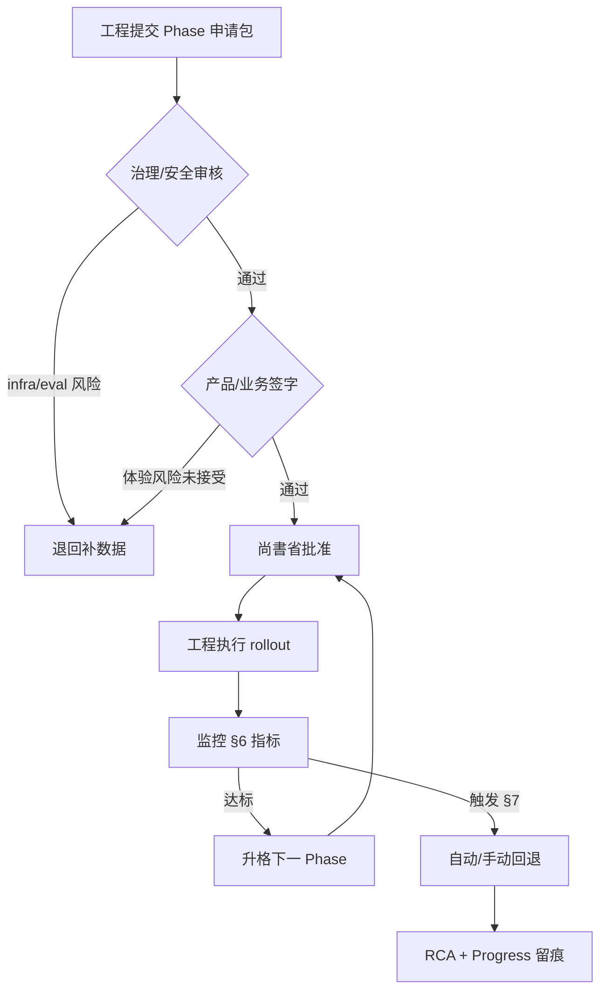

# K-2 部署治理与 rollout 方案

> **战役**：K-2 合流治理 · Chat C（部署级治理策略）  
> **性质**：治理 playbook；**不**含代码变更、**不**指定启用日期。  
> **当前状态（Phase 0）**：ask 为生产唯一回答路径；K-2 仅在 dev/test / shadow 运行。  
> **依赖**：`docs/k2_merge_strategy.md`（合流规则）、`docs/k2_behavior_profile.md`（行为基线）、`observability/eval_ci_check.py`（P+ 指标）

---

## 1. 目的与范围

本文件定义：**在什么条件下、由谁批准、以何种方式** 让 K-2 参与生产流量（shadow / canary / tenant 分流 / 全量切换）。

| 在范围内 | 不在范围内 |
|----------|------------|
| 角色与审批权责 | 具体 env 键、路由实现、feature flag 代码 |
| 分阶段 rollout 定义 | 指定某日出 prod shadow |
| 指标、阈值与回退条件 | 修改 `/api/ask` 或 merge adapter 逻辑 |
| 与 P+ eval_gate / eval_ci_check 的对齐 | 替代 `eval_pipeline.md` 完整 verdict 规则 |

**单点切换原则**（继承 Chat B）：未来任何 prod 流量变更，仅经 `merge_ask_and_k2`（或治理批准的 K-2-only 变体）与 `ASK_MERGE_INTERFACE` 配置，不在 ask 图内散落分支。

---

## 2. 角色与责任

### 2.1 决策权矩阵

| 决策 | 提议方 | 必须审核 | 最终批准 |
|------|--------|----------|----------|
| **打开 prod shadow**（复制流量，用户响应仍 100% ask） | 工程（K/I 线） | 治理／安全（P+ eval、infra 风险） | **尚書省** |
| **打开 partial rollout / canary**（≥1% 真实回答来自 K-2） | 工程 + 产品 | 产品／业务（体验与 SLA）、治理／安全 | **尚書省** |
| **扩大 canary 比例或 tenant 白名单** | 工程 | 产品（用户反馈）、治理（指标未恶化） | **尚書省** |
| **完全切换到 K-2 为主路径** | 工程 + 产品 | 全三方 + 运维 on-call | **尚書省**（书面 sign-off） |
| **紧急回退至 ask-only** | 工程 on-call | 事后 24h 内向尚書省与产品报备 | **工程 on-call**（可先斩后奏） |

### 2.2 分角色职责

| 角色 | 职责 |
|------|------|
| **工程团队（K / I / P+）** | 实现 shadow hook、canary 分流、监控与告警；维护 `tests/test_k2_ask_shadow`、`tests/test_k2_merge_adapter`；产出 rollout 前后 eval 导出与 `eval_ci_check` 报告；执行回退 runbook。 |
| **产品／业务** | 确认 canary 用户范围、体验回归标准（答案质量、延迟 SLA）；收集内部／试点 tenant 反馈；对「K-2 主答案 vs ask 回退」产品语义签字。 |
| **治理／安全** | 审核 eval 标签分布、`infra_risk` / `observability_gap` 容忍度；确认 shadow 不泄露 `k2_eval_metadata` 至外部 slim envelope（生产契约）；DarkOps / 禁区（憲法 §7）合规。 |
| **尚書省（HQ Governance）** | 各 Phase 进门／出门裁断；更新 `00_master_plan.md` §4 与 `_workflow_upgrade/90_run_queue.md` 状态；Phase ≥2 时授权 `ASK_MERGE_INTERFACE` 参数变更。 |

### 2.3 审批留痕

每次 Phase 升格或回退 **必须**：

1. 在 `04_Workflows/00_Agent_Work_Progress.md` **末尾**追加战报（命令、指标快照、批准人）。  
2. 更新 `00_master_plan.md` 对应 Phase 状态一行。  
3. 若触及生产配置：Progress 注明 override 依据（合約 Rule 12 / 憲法 §5.2）。

---

## 3. Rollout 模式定义

| 模式 | 用户可见行为 | K-2 参与方式 | 典型用途 |
|------|--------------|--------------|----------|
| **Shadow** | 100% ask 回答 | 异步复制同请求跑 K-2 + `merge_ask_and_k2`（`primary_source=ask`）；结果写内部日志／eval 导出 | Phase 1；行为对比、P+ 基线 |
| **Canary** | 按比例或 cohort 部分请求由 K-2 提供主答案 | `merge_ask_and_k2` 或治理批准的 `primary_source=k2` 变体 | Phase 2–3 |
| **Feature flag / tenant** | 特定 tenant、internal user、或 `task_input` 标记走 K-2 | 配置层分流至 adapter，非图内 if-else | Phase 2 起步、Phase 3 扩展 |
| **Full switch** | 默认路径为 K-2（ask 为 fallback） | 反向 merge 或路由缺省变更 | Phase 4；需单独工单 |

**生产主权（Phase 0–2 默认）**：继承 `k2_merge_strategy.md` §1.2 — 双 ok 时 **ask 为主答案**；K-2 `infra_risk` → 内容仍 ask 但 **`ok=False` + CI fail**。

---

## 4. 分阶段 rollout

### 4.1 阶段总览

| Phase | 名称 | 流量特征 | 进门条件（摘要） | 出门／升格条件（摘要） |
|-------|------|----------|------------------|------------------------|
| **0** | Baseline | prod = ask-only；K-2 = dev/test | *当前* | Chat B merge adapter + 策略文档 done；shadow 测试全绿 |
| **1** | Prod shadow | prod 复制流量；用户无感 | 尚書省批准 + §5 前置清单 | §6 指标连续 N 天达标 + 无 `unacceptable` shadow 回归 |
| **2** | Internal canary | 5–10% **内部**用户真实 K-2 回答 | Phase 1 出门 + 产品签字内部 cohort | 7 天 Canary 指标达标 + 无 P0 反馈 |
| **3** | Controlled expansion | 10–30% 或试点 tenant；可 feature flag | Phase 2 出门 + 治理复核 | 指标稳定 ≥14 天；产品同意扩面 |
| **4** | Primary switch | K-2 默认主路径（可选） | Phase 3 + 全量 eval 审计 + 运维 runbook | 独立里程碑；非本 playbook 默认目标 |

**N 天建议**：Phase 1 最少 **7 个自然日**（含 ≥1 个完整工作周）；Phase 2 canary 最少 **7 天** 再考虑 Phase 3。具体 N 由尚書省在批文中可下调（须留痕），不得跳过 Phase 1 直接 canary。

### 4.2 Phase 1 — Prod shadow（详述）

**工程动作**：

- 在生产入口 **并行** invoke ask（用户路径）与 K-2 shadow（fire-and-forget 或队列），**不得**增加用户-facing 延迟超过治理批准预算（建议 p99 +≤50ms 仅排队，K-2 本身 async）。  
- 合流结果仅写入内部：`eval_export/v1` JSONL、`k2_merge` 块（`dev_only` 标记直至治理批准 slim 策略）。  
- 每日跑 shadow 回归子集 + `compare_shadow_profiles` 汇总。

**禁止**：在未批准前将 `k2_eval_metadata` 暴露给外部 API 默认响应。

### 4.3 Phase 2 — Internal canary（详述）

**默认参数（可调）**：

| 参数 | 建议初值 | 说明 |
|------|----------|------|
| Canary 比例 | **5%** → 验证后 **10%** | 仅 `internal` / `staff` tenant 或 allowlist |
| 主答案来源 | 仍默认 ask；canary cohort 内 `primary_source=k2` 须 merge 策略 S1–S7 覆盖 | 见 `k2_merge_strategy.md` |
| 自动回退 | 开启 | §7 |

**产品动作**：定义内部 cohort、acceptable 答案差异标准（mock 环境 `answer_similarity ≥ 0.25` 仅作 dev 基线；live 另定）。

### 4.4 Phase 3 — Controlled expansion

- 按 tenant／场景 flag 扩展；**禁止**一次性 >30% 全域流量。  
- 每扩 10% 需重新跑 `eval_ci_check` 与 shadow 对比报告。  
- Selector 桥接（greeting skip-RAG）、answer LLM 对齐未完成时，**不得**对 C 端用户扩面。

### 4.5 Phase 4 — Full switch（可选远期）

- 需单独工单：反向 fallback（ask 为灾备）、SLA、计费与 observability 双轨归一化。  
- 本 Chat **不**预设 Phase 4 时间表。

---

## 5. Phase 1 进门前置清单（必要非充分）

在尚書省批准 Phase 1 前，工程与治理 **联合确认**：

| # | 检查项 | 验证方式 |
|---|--------|----------|
| P1 | `tests/test_k2_merge_adapter` + `tests/test_k2_ask_shadow` 全绿 | unittest |
| P2 | `docs/k2_merge_strategy.md` 与 adapter `STRATEGY_VERSION` 一致 | 文档对账 |
| P3 | Shadow 场景 `classification.unacceptable=[]`（生产代表集） | shadow 报告 |
| P4 | `P+-eval-ci-wire` 或等价：prod shadow 导出路径可跑 `eval_ci_check` | CLI smoke · **wired 2026-05-24**（`shadow_ibridge_records.latest.jsonl` + nightly 0.60 + `infra_risk`） |
| P5 | 回退 runbook（§7）已评审；on-call 知晓 | Progress 留痕 |
| P6 | 未触憲法 §7 禁区（env 原文、DarkOps 未授权变更） | 治理签字 |

Chat B 文档 §4 列出的 selector 桥接、answer LLM 对齐 — **Phase 2 canary 前** 必须关闭或明确 accepted risk。

---

## 6. 指标与阈值

> 以下为 **建议范围**；升格时以尚書省批文为准。指标来源：`evaluate_task_record` → `eval_ci_check` → `eval_export/v1`。

### 6.1 工具默认值（代码基准）

| 参数 | 代码默认 | Rollout 用途 |
|------|----------|--------------|
| `--limit` | 100 | 最近 N 条 shadow/canary 记录 |
| `--max-needs-review-ratio` | 0.5 | CI 硬上限；rollout 建议更严（见下） |
| `--min-samples` | 1 | **Prod 决策用 ≥30** |
| `--fail-on-tags` | *(空)* | Prod **必须**含 `infra_risk` |

### 6.2 分 Phase 建议阈值

| 指标 | Phase 1 shadow | Phase 2 canary | Phase 3 扩面 | 说明 |
|------|----------------|----------------|--------------|------|
| **样本量 N** | ≥100 条/日 或 ≥500/周 | ≥50 canary 请求/日 | 同比扩面 | N&lt;30 不得做 Phase 升格决策 |
| **needs_review 比例** | ≤**60%**（观察） | ≤**45%** | ≤**40%** | 高于 `eval_stats_report` 健康 staging 建议 45–60% 需解释 |
| **infra_risk 比例** | **0%**（任一触发调查） | **0%** | **0%** | 对齐 `--fail-on-tags infra_risk`；merge S3 |
| **observability_gap 比例** | ≤**20%** | ≤**15%** | ≤**10%** | D4 trace 完整度 |
| **high_retry 比例** | ≤**25%** | ≤**20%** | ≤**15%** | D1 |
| **many_handoffs 比例** | ≤**15%** | ≤**10%** | ≤**8%** | K-2 图 handoff 特性；按 K-2 分母 |
| **ask 主路径 ok 率** | ≥**99%**（不变） | ≥**99%** | ≥**99%** | Canary 不得降低 ask 侧 SLA |
| **shadow merge_safe 率** | ≥**95%** | ≥**98%** | ≥**99%** | `k2_behavior_profile` §2 |
| **unacceptable 分类** | **0 件/周** | **0 件/周** | **0 件/周** | ok/status/error_type 硬回归 |

### 6.3 Phase 升格门控（与／或）

**Phase 0 → 1**：§5 前置清单全满足 + 尚書省批准。

**Phase 1 → 2**（须同时）：

- 连续 **7 天** shadow：`infra_risk` 计数 = 0；`unacceptable` = 0。  
- 7 日滚动 `needs_review` ≤ 60%，且较首日下降或持平。  
- `merge_safe` ≥ 95%。  
- 产品 + 治理书面无异议。

**Phase 2 → 3**（须同时）：

- Canary 7 日：`needs_review` ≤ 45%；`infra_risk` = 0。  
- 内部用户反馈无 P0（错误答案、不可接受延迟）。  
- Selector／answer 对齐工单 closed 或 risk accepted 留痕。

**Phase 3 → 4**：单独立项；不在本 playbook 自动升格。

### 6.4 建议验收命令（治理／CI）

```bash
# Shadow / canary 导出目录（路径由运维按 Master_Map 配置，此处为逻辑名）
python -m observability.eval_ci_check <eval_export_path> \
  --limit 100 \
  --min-samples 30 \
  --max-needs-review-ratio 0.45 \
  --fail-on-tags infra_risk

python -m unittest tests.test_k2_merge_adapter tests.test_k2_ask_shadow -v
```

---

## 7. 回退条件

### 7.1 自动回退（Canary / Partial rollout）

满足 **任一** 即触发 **自动切回 ask-only**（工程 on-call 可立即执行，无需等待批准）：

| 触发器 | 条件 |
|--------|------|
| **R1** | 任一 canary 用户-facing 响应经 merge 打出 `k2_merge.gate_result=fail` 且 `ci_fail=true` |
| **R2** | 滚动 1h 内 `infra_risk` 标签 ≥ **1** 且该请求为 K-2 主答案 |
| **R3** | Canary  cohort `ok=false` 率较 ask-only 基线上升 **≥2 个百分点**（绝对值） |
| **R4** | `eval_ci_check` 在 canary 导出上失败（`ok: false`）且 `--fail-on-tags infra_risk` 命中 |
| **R5** | p99 延迟较 shadow 基线恶化 **>20%**（工程定义测量点） |

自动回退后：**保留 shadow**（若已启用）直至 root cause 关闭。

### 7.2 手动回退

| 触发器 | 决策人 |
|--------|--------|
| needs_review 比例连续 3 日超 Phase 当前上限 | 治理建议 → 尚書省 |
| 产品 P0/P1 体验投诉 | 产品 + 尚書省 |
| Shadow `unacceptable` 任一新增 | 工程立即停 Phase 升格 → 尚書省 |
| 安全／合规事件 | 治理 → 尚書省 |

### 7.3 回退动作清单

1. Feature flag / canary 比例 → **0**（ask-only）。  
2. 确认 `/api/ask` 无 K-2 主路径残留配置。  
3. 保留 shadow 日志 7 天供 RCA。  
4. Progress 末尾战报 + `00_master_plan` Phase 状态回退。  
5. 24h 内复盘：是否调整 §6 阈值。

---

## 8. 审批流程（流程图）



**申请包最低内容**：当前 Phase、目标 Phase、过去 7 日指标表、`eval_ci_check` JSON、shadow 报告摘要、已知 risk（selector/answer 对齐）、回退联系人。

---

## 9. 与现有文档的关系

| 文档 | 关系 |
|------|------|
| `docs/k2_merge_strategy.md` | 合流场景 S1–S7；本文件引用其生产主权规则 |
| `docs/k2_behavior_profile.md` | Shadow 字段、merge_safe、classification |
| `observability/eval_gate_rules.md` | 标签定义 |
| `observability/eval_ci_check.py` | 量化门控实现 |
| `00_master_plan.md` §4.8 | 总蓝图索引 |
| `.cursor/rules/engineering-contract.mdc` REF-9.7 | Agent 执行层指针 |
| `docs/drafts/HQ-GOV-K2-P2-CANARY-DRAFT.md` | Phase 2 canary 批文草案（**草案 · 暂不生效**；正文不入本文件，避免与正式批文混淆） |

---

## 10. 验证（本 Chat）

本 Chat **仅文档**，验证方式为 peer review + 队列对账：

- 路径：`docs/k2_deployment_governance.md`（本文件）  
- 索引：`00_master_plan.md` §4.8、`_workflow_upgrade/90_run_queue.md` `K2-rollout-governance`  
- Phase 2 canary 批文草案：见 `docs/drafts/HQ-GOV-K2-P2-CANARY-DRAFT.md`（草案 · 暂不生效）

---

## 11. Phase 3.5 contract 索引（WA-T3）

> **SSOT**：`docs/phase3-5-cost-model-governance-contract-v1.md` — gate 分类（mandatory / optional / shadow-only）及 `blocks_mainline` 语义。

| 本文件章节 | contract 引用 |
|------------|---------------|
| §3 Rollout 模式 · §4 Phase 0–4 矩阵 | contract §5（**不包含** Phase 2 prod canary 授权） |
| §4.2 Phase 1 prod shadow | contract `SG-K2-SHADOW-EXPORT` · `SG-EVAL-SHADOW-NIGHTLY` |
| §6 指标与 `eval_ci_check` | contract §4 nightly（0.60 + `infra_risk`）vs §3 PR（0.72） |
| §7 回退 | contract §7 rollback 指针 |

**Wave B/C 假设**：读 contract §2.1 知 PR mandatory trio；**不得** 因读本票误开 blocking canary 或改 eval 门槛。
