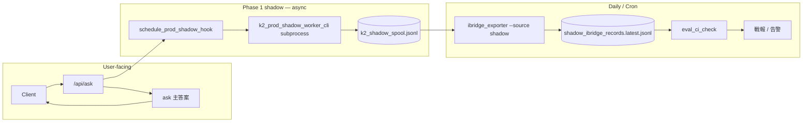

# K-2 Phase 1 遠端 Rollout Runbook（Blueprint）

> **Blueprint only — 僅為示意 runbook，不代表已在任何環境實施。**
>
> **性質**：部署藍圖與操作清單；**不代表已在任何遠端主機實施**。  
> **範圍**：將戰車根本地 prod-like 演練（env 四鍵 + `/api/ask` hook + spool + export + `eval_ci_check`）抽象為可套用到 **systemd / Kubernetes / 傳統啟動腳本** 的骨架。  
> **本票不做**：SSH、雲端 API、實際路徑填寫、帳號、金鑰、叢集名稱；遠端施工須另票 + 尚書省批文。  
> **治理權威**：`docs/k2_deployment_governance.md`（Phase 進門／出門、指標、回退）；合流規則見 `docs/k2_merge_strategy.md`。

---

## 0. 狀態與免責

| 項目 | 說明 |
|------|------|
| **文件狀態** | Blueprint only — peer review 通過前不得視為已 rollout |
| **本地對照** | T+0 已於戰車根 + `gov_core_system` venv 演練（見 `04_Workflows/00_Agent_Work_Progress.md` 2026-05-26 條目） |
| **遠端** | 本文件 **不** 授權自動改遠端；僅供運維手冊起草 |
| **用戶可見行為** | Phase 1 shadow：**100% ask 主答案**；K-2 僅 fire-and-forget 寫內部 spool |

---

## 1. 端到端資料流（抽象）



**不變契約**（與本地演練一致）：

- `/api/ask` 成功回應 **不得** 含 `k2_merge`、`k2_eval_metadata`（僅內部 spool／export）。
- Shadow 由 `GOV_K2_PROD_SHADOW=1` 閘門；預設 **off**（程式預設見 `k2_prod_shadow_hook.prod_shadow_enabled`）。
- Worker 路徑：`run_k2_flow` → `merge_ask_and_k2(primary_source=ask)` → append `schema=k2_prod_shadow/v1` 行。

---

## 2. 環境變數（部署層）

### 2.1 Phase 1 四鍵（必須同時生效於 API 進程）

邏輯名與本地樣板 `observability/deploy/k2_phase1_prod_shadow.env` 對齊；**勿** 將含密鑰的 overlay 提交進 repo。

| 鍵 | 值（邏輯） | 用途 |
|----|------------|------|
| `GOV_DEPLOY_ENV` | `production` | 標記 prod 部署層；配合 export 閘門 |
| `IBRIDGE_EXPORT_ALLOW_PRODUCTION` | `1` | 允許 prod 環境執行 shadow export（測試／演練用） |
| `IBRIDGE_EXPORT_ENABLED` | `1` | 啟用 ibridge 導出管線 |
| `GOV_K2_PROD_SHADOW` | `1` | 啟用 `/api/ask` 成功路徑上的 async shadow hook |

### 2.2 建議輔助鍵（依平台注入，非四鍵之一）

| 鍵 | 說明 |
|----|------|
| `TANG_GOV_ROOT` | 戰車根；hook subprocess 與 worker 解析 repo 佈局 |
| `PYTHONPATH` | 含戰車根、`02_Agents_Core`、`04_Workflows`（hook 可自動拼接，遠端仍建議顯式設定） |
| `K2_SHADOW_SPOOL_FILENAME` | 預設 `k2_shadow_spool.jsonl` |
| `IBRIDGE_EXPORT_ROOT` | 覆寫 artifact 目錄（預設 `<REPO_ROOT>/artifacts/eval`） |

**禁止**：在 runbook 正文或 blueprint 中寫入 `.env` 原文、API token、DB 連線字串。

---

## 3. 通用 Rollout Checklist

以下由本地 T+0 與 7 日演練節奏抽象；遠端執行時將 `<…>` 換為運維台帳中的實例值（**不** 寫入本 repo）。

### Phase A — 進門（對照 `k2_deployment_governance.md` §5）

| # | 檢查項 | 驗證（邏輯命令） |
|---|--------|------------------|
| A1 | `tests/test_k2_merge_adapter` + `tests/test_k2_ask_shadow` 全綠 | `python -m unittest tests.test_k2_merge_adapter tests.test_k2_ask_shadow -v` |
| A2 | `tests/test_k2_prod_shadow_worker` + API hook 測試全綠 | 含 `gov_core_system` 側 `test_app_api_k2_prod_shadow` |
| A3 | 尚書省 Phase 1 批文 + §5 P1–P6 | Progress 留痕 |
| A4 | 回退 runbook §7 與 on-call 已知 | 本文件 §8 |
| A5 | 遠端 artifact 目錄可寫、磁碟配額 | 平台檢查（非 repo） |

### Phase B — 部署四鍵 + API 服務

| # | 動作 | 通過標準 |
|---|------|----------|
| B1 | 將 §2.1 四鍵注入 **API 進程**（systemd `EnvironmentFile` / K8s ConfigMap+Secret / 啟動腳本 `export`） | 進程環境可見四鍵（稽核腳本，不印 secret） |
| B2 | 設定 `TANG_GOV_ROOT`、工作目錄為戰車根；使用授權 venv 啟動 `app_api` | Health 端點可達 |
| B3 | **滾動重載** 或重啟 API（單實例建議先停後啟，避免雙監聽） | 僅一個 listener；無第二 Telegram 監聽（憲法紅線） |
| B4 | 確認 `GOV_K2_PROD_SHADOW` 預設關閉的程式路徑未被其他 config 覆蓋為意外 `1` | 灰度前可故意 `0` 做乾跑 |

### Phase C — T+0 煙測（啟用四鍵後）

| # | 動作 | 通過標準 |
|---|------|----------|
| C1 | `export_allowed()` | `ok=True`, `allowed=True`, `deploy_env=production` |
| C2 | `POST /api/ask`（代表性 query，含時間戳） | HTTP 200；body **無** `k2_merge` / `k2_eval_metadata` |
| C3 | 檢查 spool | `<ARTIFACT_DIR>/k2_shadow_spool.jsonl` 新增一行；`schema=k2_prod_shadow/v1` |
| C4 | Shadow export（**無** `--force`，輸入=真 spool） | `ibridge_exporter --source shadow --profile shadow` → `written≥1`, exit 0 |
| C5 | `eval_ci_check`（Phase 1 nightly 同參） | 見 §5；`ok=true` 或已記錄之已知偏差 |
| C6 | Progress + `00_master_plan.md` §4.8 | Phase 0→1 啟用戰報 |

### Phase D — 穩態（7 自然日起算）

| # | 節奏 | 動作 |
|---|------|------|
| D1 | **持續** | 生產 `/api/ask` 流量 → spool 累積；user-facing 仍 ask-only |
| D2 | **每日** | spool → `shadow_ibridge_records.latest.jsonl` → `eval_ci_check`（§5） |
| D3 | **每日戰報** | `written`、`ok`、`needs_review_ratio`、`tag_triggered`、spool 行數、`infra_risk` / `unacceptable` 計數 |
| D4 | **第 7 日** | 對照 `k2_deployment_governance.md` §6.3 Phase 1→2；**不** 自動升格 canary |

### Phase E — 回退觸發（摘要）

| 觸發 | 動作 |
|------|------|
| `eval_ci_check` 失敗且 `fail_on_tags=infra_risk` 命中 | 調查末行 spool；必要時 `GOV_K2_PROD_SHADOW=0` + API 重載 |
| user-facing 出現 K-2 欄位 | **立即** 關 shadow + 事故戰報 |
| 治理 §7 自動回退條件（canary 階段） | Phase 1 僅保留 shadow；見治理全文 |

---

## 4. 部署樣板（Blueprint）

> 以下區塊 **均為骨架**：`REPLACE_*`、`<…>` 須由運維台帳填寫；**不得** 將填寫後含實例路徑的檔案提交回本 repo。

### 4.1 systemd

**Unit** — `k2-phase1-api.service`（API 進程；名稱可調）

```ini
[Unit]
Description=Gov Core API (K-2 Phase 1 shadow capable)
After=network-online.target
Wants=network-online.target

[Service]
Type=simple
# REPLACE: 實際使用者、工作目錄、venv python、app 模組
User=REPLACE_SERVICE_USER
WorkingDirectory=REPLACE_TANG_GOV_ROOT
EnvironmentFile=-REPLACE_DEPLOY_OVERLAY_ENV
# 四鍵亦可全放在 EnvironmentFile；勿與應用 secret 混檔提交 git
ExecStart=REPLACE_VENV_PYTHON -m uvicorn app_api:app --host REPLACE_BIND_HOST --port REPLACE_BIND_PORT
Restart=on-failure
RestartSec=5
# Shadow subprocess 需要戰車根與 PYTHONPATH（若未在 overlay 中設定）
Environment=TANG_GOV_ROOT=REPLACE_TANG_GOV_ROOT

[Install]
WantedBy=multi-user.target
```

**Overlay env 片段** — `k2-phase1-prod-shadow.env`（部署層 only）

```bash
# K-2 Phase 1 prod shadow — deployment layer (no secrets)
GOV_DEPLOY_ENV=production
IBRIDGE_EXPORT_ALLOW_PRODUCTION=1
IBRIDGE_EXPORT_ENABLED=1
GOV_K2_PROD_SHADOW=1
# 可選：
# K2_SHADOW_SPOOL_FILENAME=k2_shadow_spool.jsonl
# IBRIDGE_EXPORT_ROOT=REPLACE_ARTIFACT_DIR
```

**重載／回退 placeholder**

```bash
# 啟用 / 重載（運維執行，路徑 REPLACE）
# sudo systemctl daemon-reload
# sudo systemctl enable --now k2-phase1-api.service
# sudo systemctl reload k2-phase1-api.service   # 若應用支援；否則 restart

# 回退 shadow（保留 spool）
# 編輯 overlay：GOV_K2_PROD_SHADOW=0
# sudo systemctl restart k2-phase1-api.service
```

**每日 export + CI** — 建議獨立 timer + oneshot service（與 API 解耦）

```ini
# k2-phase1-shadow-export.service
[Unit]
Description=K-2 Phase 1 nightly shadow export and eval_ci_check

[Service]
Type=oneshot
User=REPLACE_SERVICE_USER
WorkingDirectory=REPLACE_TANG_GOV_ROOT
EnvironmentFile=-REPLACE_DEPLOY_OVERLAY_ENV
ExecStart=REPLACE_SHELL_WRAPPER shadow_export_and_ci.sh
```

```ini
# k2-phase1-shadow-export.timer
[Unit]
Description=Daily K-2 shadow eval (UTC 06:00 — 對齊 eval-gate-ci nightly)

[Timer]
OnCalendar=*-*-* 06:00:00 UTC
Persistent=true

[Install]
WantedBy=timers.target
```

---

### 4.2 Kubernetes

**ConfigMap** — 非敏感四鍵 + 路徑邏輯名

```yaml
apiVersion: v1
kind: ConfigMap
metadata:
  name: k2-phase1-shadow-config
  labels:
    app: gov-core-api
    phase: k2-shadow-1
data:
  GOV_DEPLOY_ENV: "production"
  IBRIDGE_EXPORT_ENABLED: "1"
  IBRIDGE_EXPORT_ALLOW_PRODUCTION: "1"
  GOV_K2_PROD_SHADOW: "1"
  TANG_GOV_ROOT: "/app"   # REPLACE: 容器內戰車根掛載點
  K2_SHADOW_SPOOL_FILENAME: "k2_shadow_spool.jsonl"
  IBRIDGE_EXPORT_ROOT: "/var/gov/artifacts/eval"   # REPLACE
```

**Secret** — 僅放應用既有 secret（**非** 四鍵）；四鍵不得需要 Secret，但若運維政策要求「敏感開關」可選：

```yaml
apiVersion: v1
kind: Secret
metadata:
  name: gov-core-api-secrets
type: Opaque
stringData:
  # REPLACE: 既有 .env 鍵名；本 Phase 1 blueprint 不要求 K-2 專用 secret
  EXAMPLE_API_KEY: "REPLACE_FROM_VAULT"
```

**Deployment** — API（單容器示意；sidecar 可選）

```yaml
apiVersion: apps/v1
kind: Deployment
metadata:
  name: gov-core-api
spec:
  replicas: REPLACE_REPLICA_COUNT   # Phase 1 建議 1 或明確 sticky 策略，避免 spool 分散
  selector:
    matchLabels:
      app: gov-core-api
  template:
    metadata:
      labels:
        app: gov-core-api
    spec:
      containers:
        - name: api
          image: REPLACE_IMAGE:REPLACE_TAG
          workingDir: /app
          command: ["REPLACE_VENV_PYTHON", "-m", "uvicorn", "app_api:app", "--host", "0.0.0.0", "--port", "8000"]
          envFrom:
            - configMapRef:
                name: k2-phase1-shadow-config
            - secretRef:
                name: gov-core-api-secrets
          volumeMounts:
            - name: eval-artifacts
              mountPath: /var/gov/artifacts/eval
          readinessProbe:
            httpGet:
              path: REPLACE_HEALTH_PATH
              port: 8000
            initialDelaySeconds: REPLACE_SECONDS
          livenessProbe:
            httpGet:
              path: REPLACE_HEALTH_PATH
              port: 8000
      volumes:
        - name: eval-artifacts
          persistentVolumeClaim:
            claimName: REPLACE_PVC_EVAL_ARTIFACTS
```

**CronJob** — 每日 export + `eval_ci_check`

```yaml
apiVersion: batch/v1
kind: CronJob
metadata:
  name: k2-phase1-shadow-export
spec:
  schedule: "0 6 * * *"   # UTC；對齊 eval-gate-ci eval-shadow-nightly
  concurrencyPolicy: Forbid
  jobTemplate:
    spec:
      template:
        spec:
          restartPolicy: OnFailure
          containers:
            - name: export-ci
              image: REPLACE_IMAGE:REPLACE_TAG
              workingDir: /app
              envFrom:
                - configMapRef:
                    name: k2-phase1-shadow-config
              command: ["/bin/sh", "-c"]
              args:
                - |
                  set -e
                  SPOOL="${IBRIDGE_EXPORT_ROOT}/k2_shadow_spool.jsonl"
                  OUT="${IBRIDGE_EXPORT_ROOT}/shadow_ibridge_records.latest.jsonl"
                  python -m observability.ibridge_exporter --source shadow --profile shadow \
                    "$SPOOL" -o "$OUT"
                  python -m observability.eval_ci_check "$OUT" \
                    --limit 100 --max-needs-review-ratio 0.60 \
                    --fail-on-tags infra_risk --min-samples 1
              volumeMounts:
                - name: eval-artifacts
                  mountPath: /var/gov/artifacts/eval
          volumes:
            - name: eval-artifacts
              persistentVolumeClaim:
                claimName: REPLACE_PVC_EVAL_ARTIFACTS
```

**Rollout 注意**：多副本時 spool 寫入需 **共用儲存** 或改為集中式 spool 設計；否則僅單副本啟用 `GOV_K2_PROD_SHADOW=1`。

---

### 4.3 傳統啟動腳本（pseudocode）

檔名建議：`start_k2_phase1_shadow.sh`（部署倉或運維 playbook 目錄，**非** 戰車根預設路徑）

```bash
#!/usr/bin/env bash
# BLUEPRINT ONLY — K-2 Phase 1 prod shadow remote start wrapper
set -euo pipefail

# --- REPLACE 區塊（運維台帳）---
REPO_ROOT="REPLACE_TANG_GOV_ROOT"
VENV_PYTHON="REPLACE_VENV_PYTHON"
OVERLAY_ENV="REPLACE_PATH_TO_k2_phase1_prod_shadow.env"
BIND_HOST="REPLACE_BIND_HOST"
BIND_PORT="REPLACE_BIND_PORT"
ARTIFACT_DIR="REPLACE_ARTIFACT_EVAL_DIR"
# -------------------------------

cd "$REPO_ROOT"
export TANG_GOV_ROOT="$REPO_ROOT"
export PYTHONPATH="${REPO_ROOT}:${REPO_ROOT}/02_Agents_Core:${REPO_ROOT}/04_Workflows:${PYTHONPATH:-}"

if [[ -f "$OVERLAY_ENV" ]]; then
  set -a
  # shellcheck source=/dev/null
  source "$OVERLAY_ENV"
  set +a
else
  echo "FATAL: missing overlay env" >&2
  exit 1
fi

# 四鍵斷言（不印值以外 secret）
for key in GOV_DEPLOY_ENV IBRIDGE_EXPORT_ALLOW_PRODUCTION IBRIDGE_EXPORT_ENABLED GOV_K2_PROD_SHADOW; do
  if [[ -z "${!key:-}" ]]; then
    echo "FATAL: $key unset" >&2
    exit 1
  fi
done

export IBRIDGE_EXPORT_ROOT="${IBRIDGE_EXPORT_ROOT:-$ARTIFACT_DIR}"
mkdir -p "$IBRIDGE_EXPORT_ROOT"

# 可選：啟動前 unittest 閘門（CI 或手動維護視窗）
# "$VENV_PYTHON" -m unittest tests.test_k2_merge_adapter tests.test_k2_ask_shadow -v

exec "$VENV_PYTHON" -m uvicorn app_api:app --host "$BIND_HOST" --port "$BIND_PORT"
```

**伴侶腳本** — `shadow_export_and_ci.sh`（給 cron / systemd oneshot）

```bash
#!/usr/bin/env bash
# BLUEPRINT ONLY — daily spool → export → eval_ci_check
set -euo pipefail

REPO_ROOT="REPLACE_TANG_GOV_ROOT"
VENV_PYTHON="REPLACE_VENV_PYTHON"
OVERLAY_ENV="REPLACE_PATH_TO_k2_phase1_prod_shadow.env"

cd "$REPO_ROOT"
export TANG_GOV_ROOT="$REPO_ROOT"
set -a; source "$OVERLAY_ENV"; set +a

SPOOL="${IBRIDGE_EXPORT_ROOT:-REPLACE_ARTIFACT_EVAL_DIR}/k2_shadow_spool.jsonl"
OUT="${IBRIDGE_EXPORT_ROOT:-REPLACE_ARTIFACT_EVAL_DIR}/shadow_ibridge_records.latest.jsonl"

"$VENV_PYTHON" -c "from observability.ibridge_exporter import export_allowed; r=export_allowed(); assert r.get('ok') and r.get('allowed'), r"

"$VENV_PYTHON" -m observability.ibridge_exporter --source shadow --profile shadow \
  "$SPOOL" -o "$OUT"

"$VENV_PYTHON" -m observability.eval_ci_check "$OUT" \
  --limit 100 \
  --max-needs-review-ratio 0.60 \
  --fail-on-tags infra_risk \
  --min-samples 1
```

**T+0 煙測腳本（pseudocode）** — `smoke_k2_phase1_t0.sh`

```bash
#!/usr/bin/env bash
# POST /api/ask → 檢查 spool 增長 → export → eval_ci_check
API_URL="REPLACE_HTTP_BASE/api/ask"
# curl -fsS -X POST "$API_URL" -H 'Content-Type: application/json' \
#   -d '{"query":"K-2 Phase1 T+0 shadow smoke REPLACE_TIMESTAMP","top_k":3}'
# 檢查 spool 末行 schema、export written、eval_ci_check exit 0
```

---

## 5. 驗收命令參考（邏輯路徑）

與本地演練及 `.github/workflows/eval-gate-ci.yml` `eval-shadow-nightly` 對齊。

```bash
# 前置：戰車根 + 授權 venv + §2.1 四鍵已載入 API 進程環境

# 1) Export 閘門
python -c "from observability.ibridge_exporter import export_allowed; print(export_allowed())"

# 2) Shadow export（輸入 = 真 spool；Phase 1 日常勿 --force）
python -m observability.ibridge_exporter --source shadow --profile shadow \
  <ARTIFACT_DIR>/k2_shadow_spool.jsonl \
  -o <ARTIFACT_DIR>/shadow_ibridge_records.latest.jsonl

# 3) CI 門控（Phase 1 nightly 參數）
python -m observability.eval_ci_check <ARTIFACT_DIR>/shadow_ibridge_records.latest.jsonl \
  --limit 100 \
  --max-needs-review-ratio 0.60 \
  --fail-on-tags infra_risk \
  --min-samples 1

# 4) 單元測試（進門 §5 P1）
python -m unittest tests.test_k2_merge_adapter tests.test_k2_ask_shadow -v
```

**結構化結果**：以 CLI exit code 與 `eval_ci_check` 輸出之 `ok`、`needs_review_ratio`、`tag_triggered` 為準；不得僅以自然語言宣稱通過。

---

## 6. 與本地樣板對照

| 本地產物 | 遠端 blueprint 對應 |
|----------|---------------------|
| `observability/deploy/k2_phase1_prod_shadow.env` | systemd `EnvironmentFile` / K8s ConfigMap / 啟動腳本 `source` |
| `gov_core_system` + `uvicorn app_api:app` | Deployment / unit `ExecStart` |
| `artifacts/eval/k2_shadow_spool.jsonl` | PVC / 主機 volume `IBRIDGE_EXPORT_ROOT` |
| `eval-gate-ci.yml` nightly | systemd timer / K8s CronJob |
| Progress 每日戰報 | 運維工單或 `04_Workflows/00_Agent_Work_Progress.md` 末尾（Governance 授權時） |

---

## 7. 實施工單建議（遠端票）

遠端施工票最低需含：

1. 目標平台（systemd / K8s / 裸機腳本）與 **REPLACE** 台帳  
2. 四鍵注入方式與回退責任人  
3. Artifact 儲存與備份保留（建議 spool ≥7 日）  
4. T+0 煙測窗口與 §5 命令輸出存檔  
5. 7 日觀測排程與 `k2_deployment_governance.md` §6 指標責任方  
6. 明確 **不** 開啟 Phase 2 canary

---

## 8. 回退（遠端）

1. `GOV_K2_PROD_SHADOW=0`（保留其餘 export 鍵或全關 — 依運維政策）  
2. 重載 API（systemd `restart` / `kubectl rollout restart` / 腳本停止）  
3. 確認 `/api/ask` 回應無 K-2 外洩欄位  
4. 保留 spool / export 檔 7 日供 RCA  
5. Progress 末尾戰報 + 治理 §7 必要時報尚書省  

---

## 9. 相關文件

| 文件 | 關係 |
|------|------|
| `docs/k2_deployment_governance.md` | Phase 定義、指標、回退、審批 |
| `docs/k2_merge_strategy.md` | 合流 S1–S7；shadow `primary_source=ask` |
| `docs/k2_behavior_profile.md` | `merge_safe`、`classification` |
| `observability/eval_export.md` | export / nightly 參數說明 |
| `observability/deploy/k2_phase1_prod_shadow.env` | 本地四鍵樣板（勿提交 secret） |
| `00_master_plan.md` §4.8 | 總藍圖索引 |

---

## 10. 本文件驗證

| 項 | 狀態 |
|----|------|
| 內容性質 | 文檔 blueprint；**零遠端實施** |
| 建議驗收 | 工程 + 治理 peer review；對照本地 T+0 戰報逐步核對 §3 checklist |
| 程式變更 | 無（本 Chat 不修改 hook／worker） |
