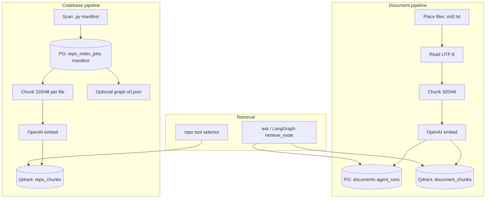

# Knowledge Layer — Phase 2 單一主方案

> **版本**：v0.1（Phase 2 收尾）  
> **更新**：2026-06-05  
> **角色**：Knowledge Layer Engineer / Data Pipeline Engineer 接戰入口  
> **原則**：沿用暗部既有實作；**不**新增第二套向量庫或 ingest 框架。

---

## 1. 現況盤點（Repo 掃描結論）

| 能力 | 狀態 | 權威實作／位置 |
|------|------|----------------|
| **PostgreSQL** | ✅ 已用 | `Departments/05_Data_Vault/db/001_phase1_schema.sql`（`documents`、`agent_runs`、`graphrag_jobs` 等）；`011_repo_index_schema.sql`（`repo_index_jobs`、`repo_index_manifest`） |
| **Qdrant** | ✅ 已用 | 兩個生產 collection：`document_chunks`（文件 RAG）、`repo_chunks`（程式碼語意檢索） |
| **Embeddings** | ✅ 已用 | OpenAI `text-embedding-3-small`（env：`OPENAI_EMBED_MODEL`）；`core/openai_traced.traced_embeddings_create` |
| **文件 ingest** | ✅ 已驗 | `core/data_pipeline.ingest_batch` ← `data_pipeline_agent.py`；種子腳本 `phase1_ingest_minimal.py` |
| **程式碼 index** | ✅ 已實作 | `core/repo_index_job` → `core/repo_chunks_embed` → `core/repo_retrieve` |
| **Metadata（關聯）** | ✅ PG 為準 | `documents` 表 + Qdrant payload 交叉驗證（R2 smoke） |
| **Document loaders** | ⚠️ 內建、窄 | 單檔 UTF-8 讀取；副檔名 `.md` / `.txt` / `.markdown`；目錄僅**一層**非遞迴 batch |
| **Retrieval（ask 主路）** | ✅ | `core/retrieve_core.perform_retrieve_query` → `document_chunks` |
| **Retrieval（repo 工具）** | ✅ | `repo_chunks_smoke_retrieve_and_verify`；Tool catalog `repo_retrieve_v1` |
| **Code graph** | ✅ 側車 | `core/code_graph.py`（manifest → `graph.v0.json` artifact）；**不**取代 Qdrant 檢索 |
| **GraphRAG job** | 🟡 Skeleton | `core/graphrag_backend.py`（`graphrag_grag1`）；統計／placeholder，**非**主檢索路徑 |

### 1.1 重疊方案與裁決

| 方案 | 定位 | Phase 2 裁決 |
|------|------|----------------|
| **PG + Qdrant 雙寫（document_chunks）** | 文件 RAG、ask pipeline、ingest_verify | **主方案 — 文件知識** |
| **PG manifest + Qdrant（repo_chunks）** | 程式庫 indexing、IMP-AI-READY 前置（W3-B） | **主方案 — 程式碼知識** |
| **graphrag_grag1 / graphrag_jobs** | 實驗性圖任務列 | **保留表結構**；不擴為第二 ingest；待專票升級 |
| **agentmemory（PG+AGE）** | 獨立 Docker 服務 schema | **非 Gov Core 主知識層**；勿與 `document_chunks` 混用 |
| **CrewAI/LangChain Knowledge（venv site-packages）** | 第三方套件 | **禁止**作為主艙依賴（憲法／AGENTS 紅線） |
| **worktrees 內舊副本** | 歷史整合樹 | **只讀參考**；以 `gov_core_system` 暗部為準 |

**結論**：主存儲為 **PostgreSQL（元數據／作業狀態）+ Qdrant（向量）**；依內容類型分 **兩條 pipeline**，共用 embedding 模型與 chunk 參數，**不**合併 collection。

---

## 2. 單一主方案架構



### 2.1 共用參數（已凍結於程式）

| 項 | 值 | 模組 |
|----|-----|------|
| Chunk target | 320 chars | `core/data_pipeline` |
| Chunk overlap | 48 chars | 同上 |
| Embed dim | 1536 | `text-embedding-3-small` |
| Document collection | `document_chunks` | `data_pipeline`, `rag_backend` |
| Code collection | `repo_chunks` | `repo_index_job`, `repo_chunks_embed` |

### 2.2 環境依賴（邏輯名）

執行前在暗部 venv 透過 `.env` 載入（**勿**在文檔貼金鑰）：

- `DATABASE_URL` — PostgreSQL
- `QDRANT_URL` — 預設 `http://127.0.0.1:6333`
- `OPENAI_API_KEY` — embeddings / RAG answer
- `OPENAI_EMBED_MODEL` — 預設 `text-embedding-3-small`

驗證：`python 04_Workflows/_smoke_test_keys.py`（僅 `[OK]`/`[FAILED]`）。

---

## 3. 統一 Metadata Schema（v0.1）

Agent flow、Tool Layer、案卷 KB 欄位應使用**同一套邏輯名**。實際儲存為「canonical 欄位 → PG 列／Qdrant payload」映射。

### 3.1 Canonical 欄位（必填語意）

| 欄位 | 型別 | 說明 |
|------|------|------|
| `doc_id` | UUID string | 文件：`documents.id`；程式碼：邏輯上 `(job_id, repo_rel_path)`，向量點用 deterministic UUID |
| `doc_type` | enum | `document` \| `code` \| `corpus`（建議寫入 `documents.meta` / payload） |
| `source` | string | 人類可讀來源：檔名、`repo_rel_path`、或 `doc_key` |
| `project` | string | 專案／戰區邏輯名（如 `gov_core`、`workflow_v2`）；可放 `meta.project` |
| `version` | int | 文件 ingest 遞增；程式碼用 `manifest_version` 字串輔助 |
| `chunk_id` | string | Qdrant point id（UUID5）；輔助欄 `chunk_index`（0-based） |
| `created_at` | ISO-8601 UTC | PG `documents.created_at` 或 manifest `indexed_at` |
| `updated_at` | ISO-8601 UTC | PG `documents.updated_at` 或 job `updated_at` |
| `tags` | string[] | 檢索過濾／治理標籤；建議 `documents.meta.tags` 與 payload 同步 |

### 3.2 `document_chunks` payload（現行 · 已落地）

```json
{
  "document_id": "<uuid>",
  "doc_key": "ingest_batch/<hash>/<stem>",
  "chunk_index": 0,
  "text": "<chunk text>",
  "version": 1,
  "content_sha256": "<sha256 of full file>",
  "agent_run_id": "<uuid>"
}
```

**建議擴展（下一增量，非阻塞 Phase 2）**：在 `documents.meta` 與 payload 增加 `doc_type`、`project`、`tags`、`source_path_rel`（repo 相對路徑）。

### 3.3 `repo_chunks` payload（現行 · 已落地）

```json
{
  "repo_rel_path": "core/data_pipeline.py",
  "path": "core/data_pipeline.py",
  "job_id": "<repo_index_v1 uuid>",
  "job_type": "repo_index_v1",
  "chunk_index": 0,
  "text": "<chunk text>",
  "content_sha256": "<file sha256>",
  "language": "python",
  "manifest_version": "v0.1"
}
```

### 3.4 PostgreSQL 關聯摘要

| 表 | 用途 |
|----|------|
| `documents` | 文件級元數據、`doc_key`、`version`、`content_sha256`、`ingest_status`、`meta` |
| `agent_runs` | 每次 ingest 執行記錄；`meta.document_id`、`meta.chunks` |
| `graphrag_jobs` | ingest／graphrag 作業列（文件 pipeline 會寫入 `job_type=ingest`） |
| `repo_index_jobs` | 程式碼 index 作業狀態 |
| `repo_index_manifest` | 每檔 `repo_rel_path` + `content_sha256` |

---

## 4. 文件上架流程（Document pipeline）

適用：Markdown／純文字知識庫、runbook、AGENTS 類制度檔。

| 步驟 | 動作 | 實作 |
|------|------|------|
| 1. 放檔 | 將 `.md`/`.txt` 放入目錄（單檔或一層目錄） | 例：戰車根 `AGENTS.md` 或 `02_Data/smoke_corpus/` |
| 2. Parsing | UTF-8 讀全文 | `Path.read_text`；無 PDF/HTML loader |
| 3. Chunking | 320／48 滑窗 | `data_pipeline._chunk_text` |
| 4. Embedding | OpenAI batch embed | `traced_embeddings_create` |
| 5. Index | PG 事務 + Qdrant upsert | `ingest_batch` |
| 6. Retrieval | 語意搜尋 + PG 交叉驗證 | `document_chunks_smoke_retrieve_and_verify` / `rag_answer` |

**結構化閉環（治理）**：`orchestrator_agent.py ingest_verify` = health → ingest → verify（種子 INV1–INV4 不變）。

---

## 5. 程式碼 Index 流程（Codebase pipeline）

適用：IMP-AI-READY 前 repo index（制度見 `workflow_v2/20_pilot/W3-B_kb_contract.md`）。

| 步驟 | 動作 | 實作 |
|------|------|------|
| 1. Scope | 宣告 subtree／repo root | 案卷 `kb_index_*` 或 CLI `--subtree` |
| 2. Scan | 遍歷 `.py`（跳過 venv 等） | `run_repo_index_job` |
| 3. Manifest | 寫 PG + `manifest.v0.json` | `repo_index_manifest` |
| 4. Graph（可選） | 依賴圖 artifact | `repo_index_agent.py graph --job-id` |
| 5. Chunk + Embed | 每檔 chunk → `repo_chunks` | `repo_chunks_embed_job` |
| 6. Retrieval | 語意搜尋 | `repo_chunks_smoke_retrieve_and_verify` |

**注意**：`repo_chunks` **不**寫入 `documents` 表；與 `document_chunks` 嚴格分離。

---

## 6. 可執行入口（最小命令）

工作目錄：**暗部 venv 根** `01_Environments/python_venvs/gov_core_system`（先 `.env` 載入或 `data_pipeline_agent` 自動載入）。

### 6.1 文件 ingest + verify

```powershell
cd 01_Environments\python_venvs\gov_core_system

# 單檔
.\Scripts\python.exe Departments\04_Infrastructure\agents\data_pipeline_agent.py ..\..\..\AGENTS.md

# 目錄 batch（一層、≥2 個支援檔才算 ok）
.\Scripts\python.exe Departments\04_Infrastructure\agents\data_pipeline_agent.py ..\..\..\02_Data\smoke_corpus

# 治理一鍵：health → ingest → verify
.\Scripts\python.exe Departments\04_Infrastructure\agents\orchestrator_agent.py ingest_verify ..\..\..\02_Data\smoke_corpus
```

HTTP：`POST /api/ingest-verify`（`app_api.py` → `run_ingest_verify_flow`）。

### 6.2 程式碼 index → embed → retrieve

```powershell
cd 01_Environments\python_venvs\gov_core_system

# 1) 建立並執行 repo_index_v1（記下 job_id）
.\Scripts\python.exe Departments\04_Infrastructure\agents\repo_index_agent.py run --repo-root ..\..\..\ --subtree core

# 2) 可選：code graph artifact
.\Scripts\python.exe Departments\04_Infrastructure\agents\repo_index_agent.py graph --job-id <JOB_UUID> --from-db

# 3) embed → repo_chunks
.\Scripts\python.exe Departments\04_Infrastructure\agents\rag_query_agent.py repo-embed --job-id <JOB_UUID>

# 4) 檢索 smoke
.\Scripts\python.exe Departments\04_Infrastructure\agents\rag_query_agent.py repo --top-k 5 "data_pipeline ingest"
```

Tool Layer 編排：`core/repo_tool_dispatch.py`（catalog：`shared/schemas/repo_tool_catalog_v1.json`）。

### 6.3 文件 RAG 檢索 / 問答

```powershell
.\Scripts\python.exe Departments\04_Infrastructure\agents\rag_query_agent.py --top-k 5 "AGENTS.md"
.\Scripts\python.exe Departments\04_Infrastructure\agents\rag_query_agent.py answer "AGENTS.md 在講什麼？"
```

Ask 主路：`core/retrieve_core.perform_retrieve_query` → LangGraph `retrieve_node` / `skill_retrieve_for_ask`。

---

## 7. Agent Flow 接線指引

| 場景 | 應呼叫 | 回傳契約 |
|------|--------|----------|
| 用戶問答（生產） | `build_rooted_context` → retrieve → answer | `dict` 含 `ok`、`hits`/`sources` |
| 文件檢索工具 | `document_chunks_smoke_retrieve_and_verify` | R1/R2 交叉驗證欄位 |
| 程式碼檢索工具 | `repo_chunks_smoke_retrieve_and_verify` 或 `repo_tool_dispatch` | `hits[].repo_rel_path` |
| 上架新任務前 | `ingest_batch` 或 `ingest_verify` | `ok`、`document_id`、`chunks` |
| IMP 案卷 AI-READY | 先 `repo_index_v1` + 案卷 `kb_index_*` | 見 `W3-B_index_pipeline_runbook.md` |

**禁止**：

- 在 agent 內手拼 `root_context` 繞過 `context_entry`（見 `AGENTS.md` H 線）。
- 新建 Chroma/FAISS/第二 Qdrant collection 作「臨時知識庫」。
- 用 `graphrag_grag1` 結果直接驅動 ask selector（未達 runbook 門檻前）。

---

## 8. 淘汰與保留建議

| 項目 | 建議 |
|------|------|
| 第二套向量 DB | **不引入** |
| `graphrag_grag1` 作主答案源 | **淘汰於生產路徑**；保留 job 表供未來專票 |
| `phase1_ingest_minimal.py` 直接改業務邏輯 | **僅種子**；新 ingest 走 `data_pipeline.ingest_batch` |
| agentmemory 圖譜 | **隔離**；若需整合另開票對接，不併入 `document_chunks` |
| 全庫實時增量 index | **Phase 2 不做**（W3-B out-of-scope）；離線 job + `stale` 制度 |

---

## 9. 驗收方式

| 檢查 | 命令／判準 |
|------|------------|
| 三鑰 | `python 04_Workflows/_smoke_test_keys.py` → 全 `[OK]` |
| 文件 ingest | `data_pipeline_agent` 單檔 → `ok: true`，`collection: document_chunks` |
| 種子不變式 | `verify_batch` 終端 `ASSERT: OK (INV1–INV4 satisfied for phase1 seed)` |
| RAG R1/R2 | `rag_query_agent.py` top-k → `cross_check_ok: true` |
| Repo index | `repo_index_agent` → `files_indexed > 0`；`repo-embed` → `points_upserted > 0` |
| Repo retrieve | `rag_query_agent.py repo` → `ok: true` 且 `hits` 非空 |
| 單測（暗部） | `python -m unittest tests.test_repo_retrieve tests.test_repo_tool_selector`（venv 內） |

戰報欄位：依 `04_Workflows/OPS_CYCLE.md` 組 JSON，附 `ok` 與 `RUNTIME_METRIC` 行。

---

## 10. 相關文檔索引

| 文檔 | 內容 |
|------|------|
| `04_Workflows/runbooks/RAG_SMOKE_TEST_RUNBOOK_v0.1.md` | 文件 RAG smoke |
| `04_Workflows/runbooks/GOV_CORE_SMOKE_TEST_RUNBOOK_v0.1.md` | Gov Core 總 smoke |
| `workflow_v2/20_pilot/W3-B_kb_contract.md` | index-before-AI-READY |
| `workflow_v2/20_pilot/W3-B/W3-B_index_pipeline_runbook.md` | 案卷 KB 回填 |
| `04_Workflows/SPEC_repo_tool_catalog_v1.md` | Repo 工具 catalog |
| `04_Workflows/00_Agent_Work_Progress.md` | D1/D2/D3、R1/R2 實測證據 |
| `docs/architecture.md` | 系統分層總覽 |

---

## 11. Phase 2 收尾狀態

| 項 | 狀態 |
|----|------|
| 主方案文檔（本檔） | ✅ |
| 雙 pipeline 邊界 | ✅ 已釐清 |
| Metadata schema v0.1 | ✅ 已定義（含現行 payload 映射） |
| 可執行入口 | ✅ 沿用既有 CLI；§6 為權威速查 |
| `doc_type`/`project`/`tags` 寫入 ingest | 🟡 建議欄位；**待專票**改 `data_pipeline`（避免本輪擴 scope） |
