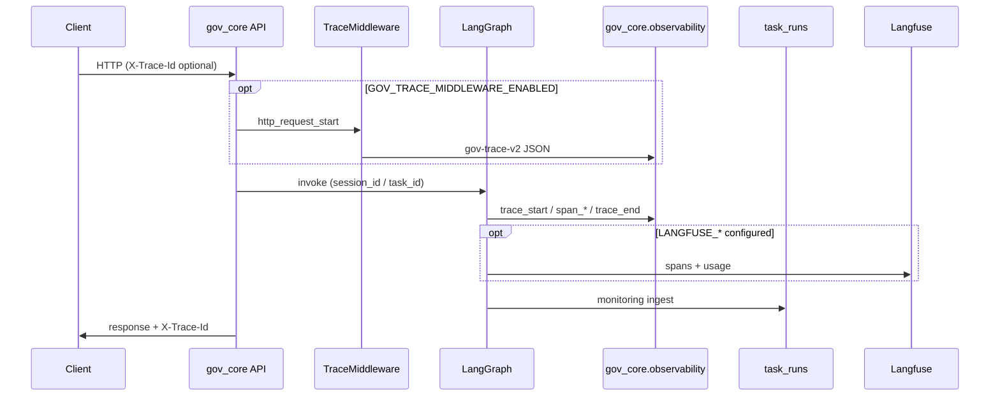

# Observability baseline (Phase 3 + Phase 5)

> **Tier**: dev/staging v1 · investigation alerts · not production SLA  
> **Authority**: trace events `gov-trace-v2` · agent tasks `agent-metrics-v1` · PG `task_runs` · Langfuse optional

---

## 1. Stack overview

| Layer | Location | Role |
|-------|----------|------|
| **Trace events** | `observability/trace_schema.py`, `logging_adapter.py` | Structured JSON logs (`gov_core.observability`) |
| **HTTP middleware** | `observability/trace_middleware.py` | Optional FastAPI wrapper (`GOV_TRACE_MIDDLEWARE_ENABLED=1`) |
| **Agent metrics** | `metrics/metrics_collector.py`, `metrics_schema.json` | Per-task D1–D5 aggregates |
| **Langfuse** | `gov_core_system/core/observability.py` | Optional LLM/workflow traces (env keys) |
| **Correlation** | `gov_core_system/core/trace_context.py` | `task_id` / `session_id` / `workflow_id` |
| **PG monitoring** | `task_runs`, `daily_cost_summary`, `alert_events` | Dashboard + alert evaluator |
| **Dashboard contract** | `observability/dashboard/dashboard_metrics_v1.json` | Panel definitions (no heavy UI) |
| **Alerts** | `gov_core_system/core/monitoring_alerts.py` | YAML or `budget_rules` |

No OpenTelemetry in-repo today; logs + PG + optional Langfuse are the supported path.

---

## 2. Trace flow



### Agent / graph path (chariot root)

1. `agent_run_trace(agent_name, session_id=..., workflow_name=...)` or `start_trace` / `end_trace`.
2. Steps: `start_span` → work → `end_span` (sets `latency_ms`, token deltas).
3. Each boundary emits **gov-trace-v2** via `build_trace_event()`.
4. Task rollup stays on **agent-metrics-v1** via `MetricsCollector.end_task()`.

### HTTP path (dark API)

1. Set `GOV_TRACE_MIDDLEWARE_ENABLED=1`.
2. Middleware logs `http_request_start` / `http_request_end` with path as `workflow_name`, method as `tool_name`.
3. Propagate IDs: `X-Trace-Id`, `X-Task-Id`, `X-Session-Id`, `X-User-Id` (optional).

---

## 3. Trace / log schema (gov-trace-v2)

JSON Schema: `observability/trace_schema_v2.json`

| Field | Type | Notes |
|-------|------|-------|
| `trace_schema_version` | const `gov-trace-v2` | |
| `event` | string | e.g. `trace_start`, `span_end`, `http_request_end` |
| `timestamp` | ISO 8601 UTC | |
| `session_id` | string? | Case/thread grouping |
| `task_id` | string | Required on normal events |
| `trace_id` | string | Correlation id |
| `span_id` | string? | Per step |
| `agent_name` | string? | Logical agent |
| `workflow_name` | string? | Graph mode or HTTP path |
| `tool_name` | string? | Tool id or HTTP method |
| `latency_ms` | number? | Step or request duration |
| `status` | enum | `success` \| `failed` \| `running` \| `unknown` |
| `error_type` | string? | Aligns with metrics enum when set |
| `token_input` | int? | Prompt tokens |
| `token_output` | int? | Completion tokens |
| `token_cost` | float? | USD estimate if billing absent |
| `user_id` | string? | When provided (never log secrets) |

Also emitted: `agent_metrics_version` (`agent-metrics-v1`) on the same line for dual-schema consumers.

**PII**: follow `core/security_compliance.sanitize_for_log` in dark paths; do not log `.env` or keys.

---

## 4. Metric definitions

### 4.1 Agent task record (agent-metrics-v1)

See `metrics/metric_definition.md` and `metrics/metrics_schema.json`.

| Dimension | KPI examples |
|-----------|----------------|
| D1 | `success_rate`, `retry_count`, `step_count` |
| D2 | `context_token_usage`, `memory_hit_rate` |
| D3 | `handoff_count` |
| D4 | `trace_completeness.score` |
| D5 | `error_type`, `external_call_count` |

### 4.2 PG / dashboard (Phase 5)

| Metric | Source | Dashboard panel id |
|--------|--------|-------------------|
| Token cost / day | `GET /monitoring/cost-trend` | `token_cost_per_day` |
| Request count | `GET /monitoring/overview` → `kpis.task_count` | `request_count` |
| Error rate | overview / error-trend | `error_rate` |
| Agent success | `GET /monitoring/dashboard-summary` | `major_agent_success_rate` |

Panel manifest: `observability/dashboard/dashboard_metrics_v1.json`.

### 4.3 Prometheus hints (future)

Same file lists suggested names: `gov_request_total`, `gov_token_cost_usd_total`, `gov_request_duration_ms`, etc.

---

## 5. Alert strategy (dev/staging v1)

**Evaluator**: `evaluate_alert_rules()` in `gov_core_system/core/monitoring_alerts.py`  
**YAML fallback**: `config/alert_rules.example.yaml` or `observability/dashboard/alert_rules_phase3_phase5.yaml`

| # | Rule | Condition | Default critical |
|---|------|-----------|------------------|
| 1 | `token_cost_15m` | SUM(`total_cost_usd`) in 15m **above** threshold | $0.05 |
| 2 | `error_rate_15m` | failed runs / total in 15m **above** threshold | 12% |
| 3 | `tool_failure_rate_15m` | `error_type='tool_error'` share **above** threshold | 25% |

All alerts are **investigation-only** (not production SLA). Cooldown via `GOV_CORE_ALERT_COOLDOWN_MINUTES`. Notifier default: `mock` (`GOV_CORE_ALERT_NOTIFIER`).

**Trigger**:

```powershell
cd 01_Environments/python_venvs/gov_core_system
python Departments/05_Data_Vault/run_alert_evaluation.py --notifier console
```

Or `POST /monitoring/alerts/evaluate`.

---

## 6. Environment flags

| Variable | Default | Effect |
|----------|---------|--------|
| `GOV_TRACE_MIDDLEWARE_ENABLED` | off | HTTP gov-trace-v2 middleware |
| `GOV_CORE_OBSERVABILITY_V2` | off | Dark `observability_v2` metadata on API |
| `LANGFUSE_PUBLIC_KEY` / `LANGFUSE_SECRET_KEY` | unset | Langfuse no-op |
| `GOV_CORE_MONITORING_INGEST_ENABLED` | off | PG ingest + scheduled alerts |
| `GOV_CORE_ALERT_NOTIFIER` | `mock` | Alert delivery mode |

---

## 7. Verification

**Chariot root (no PG):**

```powershell
python -m unittest tests.test_trace_schema tests.test_logging_adapter tests.test_trace_middleware -v
```

**Dark — alert logic only (no PG):**

```powershell
cd 01_Environments/python_venvs/gov_core_system
python -m unittest tests.test_monitoring_alerts tests.test_monitoring_alerts_phase35 -v
```

**Dark (optional PG):**

```powershell
cd 01_Environments/python_venvs/gov_core_system
python -m pytest tests/test_monitoring_api.py -q -k alert
python Departments/05_Data_Vault/monitoring_alert_smoke.py
```

---

## 9. CI observability artifacts (W1-T3 · eval-gate-ci)

> **Ticket**: W1-T3 · **Scope**: PR/push `eval-gate` job + nightly shadow job  
> **Non-goals**: Grafana/Slack; Langfuse unified API; prod selector wiring; eval gate threshold changes

Nightly/PR runs produce a **one-page governance bundle** so reviewers can triage without hunting scattered logs.

### 9.1 Producer (CI job)

| Job | Workflow | Trigger |
|-----|----------|---------|
| `eval-gate` | `.github/workflows/eval-gate-ci.yml` | `push`, `pull_request`, `workflow_dispatch` |
| `eval-shadow-nightly` | same | `schedule` (UTC 06:00), `workflow_dispatch` + `run_shadow_nightly` |

**Fixed fixture paths (PR job — investigation-only ratios)**:

| Input | Path |
|-------|------|
| eval export | `tests/fixtures/eval/eval_export_sample.jsonl` |
| trace JSONL | `tests/fixtures/trace/sample_traces.jsonl` |
| index status | `workflow_v2/20_pilot/W3-B/index_status_W2-1.json` |
| ibridge (kb sidecar) | `tests/fixtures/eval/ibridge_records.jsonl` |
| case index map | `tests/fixtures/eval/case_index_map_W2-1.json` |

Nightly uses shadow export when present; falls back to the eval fixture above.

### 9.2 Artifact index

| Artifact | Path | Producer CLI | Top-level `ok` |
|----------|------|--------------|----------------|
| Eval gate report | `artifacts/eval/eval_report.latest.{json,md}` | `python -m observability.eval_report` | `gate.ok` in JSON |
| WF status summary | `artifacts/wf/wf_status_summary.latest.{json,md}` | `python -m observability.wf_status_summary` | `ok` |
| Eval/trace correlate | `artifacts/eval/eval_trace_correlate.latest.json` | `python -m observability.eval_trace_correlate --format json` | `ok` |
| Flagged triage appendix | `artifacts/eval/eval_trace_correlate.latest.triage.md` | `… --format triage-md` | *(markdown; parse JSON sibling)* |
| kb_index sidecar sample | `artifacts/eval/eval_export_kb_index_sidecar.latest.jsonl` | `GOV_EVAL_EXPORT_KB_INDEX_STATUS=1 python -m observability.eval_exporter` | per-line `kb_index_status` or `n/a` bucket |

**CI upload names**: `eval-gate-observability-pr` (PR), `eval-gate-observability-nightly` (schedule).

### 9.3 `wf_status_summary.latest.json` schema (stable keys)

```json
{
  "ok": true,
  "message": "wf status summary assembled",
  "gate": {
    "ok": true,
    "sample_count": 3,
    "needs_review_count": 2,
    "needs_review_ratio": 0.6667,
    "tag_counts": {},
    "top_tags": []
  },
  "index_cases": [
    {
      "case_id": "W2-1",
      "kb_index_status": "ready",
      "job_id": "…",
      "file_count": 0,
      "chunk_count": 0,
      "last_updated": "…"
    }
  ],
  "trace_join_stats": {
    "row_count": 2,
    "trace_found_count": 1,
    "hit_rate": 0.5,
    "status": "ok"
  },
  "generated_at": "2026-06-07T12:00:00Z",
  "inputs": { "eval_export": "…", "trace_jsonl": "…", "index_status": ["…"] }
}
```

**Daily read order**: `gate.needs_review_ratio` → `index_cases[].kb_index_status` → `trace_join_stats.hit_rate`.

### 9.4 `eval_trace_correlate.latest.json` schema (flagged rows)

```json
{
  "ok": true,
  "message": "correlated 2 eval row(s); trace_found=1",
  "row_count": 2,
  "trace_found_count": 1,
  "rows": [
    {
      "eval_line_index": 1,
      "gate_result": "needs_review",
      "tags": ["infra_risk"],
      "trace_found": true,
      "join_key": "trace_id",
      "triage": {
        "why_flagged": "error_type=timeout",
        "kb_index_status": "ready",
        "trace_ref": { "trace_found": true }
      }
    }
  ]
}
```

`triage-md` mirrors `rows[]` for human review; **investigation-only** on small fixtures (needs_review ratio unstable).

### 9.5 Local reproduce (same as CI)

```powershell
# Gate report
python -m observability.eval_report tests/fixtures/eval/eval_export_sample.jsonl --out-dir artifacts/eval

# One-page WF summary
python -m observability.wf_status_summary `
  --eval tests/fixtures/eval/eval_export_sample.jsonl `
  --index-status workflow_v2/20_pilot/W3-B/index_status_W2-1.json `
  --trace-jsonl tests/fixtures/trace/sample_traces.jsonl `
  --out-dir artifacts/wf

# Flagged triage appendix
python -m observability.eval_trace_correlate `
  --eval tests/fixtures/eval/eval_export_sample.jsonl `
  --trace tests/fixtures/trace/sample_traces.jsonl `
  --format triage-md `
  -o artifacts/eval/eval_trace_correlate.latest.triage.md

# kb_index sidecar (default OFF in prod export; ON in CI check)
$env:GOV_EVAL_EXPORT_KB_INDEX_STATUS = "1"
python -m observability.eval_exporter tests/fixtures/eval/ibridge_records.jsonl `
  -o artifacts/eval/eval_export_kb_index_sidecar.latest.jsonl `
  --case-index-map tests/fixtures/eval/case_index_map_W2-1.json

python -m unittest tests.test_wf_status_summary tests.test_eval_trace_correlate -v
```

### 9.6 Ingest soak cross-ref (W1-T2)

PG/Langfuse ingest verification stays in `artifacts/monitoring/pg_ingest_soak.latest.json` (manual/live soak, **not** uploaded by eval-gate-ci). W1-T3 CI bundle answers **eval gate + trace join + index**; ingest 三源 gap 見 W1-T2 soak artifact（`artifacts/monitoring/pg_ingest_soak.latest.json`）；§4.2.1 文檔可另票入庫。

---

---

## 10. Wave A — P5 live soak ticket（手動，非 PR gate）

> **票號**：`WAVE-A-P5-LIVE-SOAK` · 細則：`gov_core_system/Departments/05_Data_Vault/WAVE_A_P5_LIVE_SOAK_TICKET.md`  
> **目的**：用最小流量驗證 PG `task_runs`、monitoring API 與三條 baseline 告警**可被評估**（觸發 critical 為可選）。

### 10.1 有 PG（推薦關票路徑）

前置：`DATABASE_URL` 已設；在 **gov_core_system venv 根** 執行。

```powershell
cd 01_Environments/python_venvs/gov_core_system

# 一票：合成 seed + monitoring API 非零 + evaluate
python Departments/05_Data_Vault/wave_a_p5_min_soak.py `
  --apply-migrations --seed --evaluate `
  --output output/wave_a_p5_min_soak_report.json

# 可選：要求至少一條 baseline 規則真的 fire（seed 後通常會）
python Departments/05_Data_Vault/wave_a_p5_min_soak.py `
  --apply-migrations --seed --evaluate --require-alert-fire

# 僅灌樣本
python Departments/05_Data_Vault/seed_task_runs_smoke.py --apply-migrations

# 僅跑 evaluator（console notifier）
python Departments/05_Data_Vault/run_alert_evaluation.py --apply-migrations --notifier console
```

**可選真實 ask**（需 API `http://127.0.0.1:8000` 已啟動 + ingest 路徑可用）：

```powershell
python Departments/05_Data_Vault/wave_a_p5_min_soak.py `
  --apply-migrations --probe --base-url http://127.0.0.1:8000 --evaluate

# 或沿用完整 probe
python Departments/05_Data_Vault/phase5_live_pg_soak.py --probe --base-url http://127.0.0.1:8000
```

**通過標準（reviewer）**：

- `wave_a_p5_min_soak_report.json` → `"ok": true`
- `steps.monitoring_api.routes.overview.task_count` > 0
- `steps.alert_evaluate.baseline_missing` = `[]`（含 `token_cost_15m`、`error_rate_15m`、`tool_failure_rate_15m`）

### 10.2 無 PG（本地離線）

無法寫入 `task_runs` 或跑 live soak；僅驗契約與 evaluator 邏輯：

```powershell
cd 01_Environments/python_venvs/gov_core_system
python -m unittest tests.test_monitoring_alerts_phase35 tests.test_monitoring_alerts -v

cd <戰車根>
python -m unittest tests.test_trace_schema tests.test_logging_adapter -v
```

`run_alert_evaluation.py` 在無 `DATABASE_URL` 時 exit 1（預期）；YAML fallback 行為見 `phase5_alerting_v1.md`。

### 10.3 合成樣本語意（seed）

`seed_task_runs_smoke.py` 預設寫入 7 列（近 15m 時間窗）：

- 4× `total_cost_usd=0.015` → 15m sum ≈ **0.06**（高於 `token_cost_15m` critical 0.05）
- 2× `error_type=tool_error` → tool failure rate **2/7**
- 1× `llm_error` → 拉高 `error_rate_15m`

`trace_id` 前綴 `wave-a-p5-seed-*`，可與 Langfuse 真實 trace 並存。

---

## 11. Related docs
- `observability/eval_pipeline.md` — eval / shadow export  
- `gov_core_system/output/phase5_alerting_v1.md` — notifier matrix  
- `metrics/metric_definition.md` — D1–D5 field reference  
- `AGENTS.md` — Monitoring Graph L0 (separate from this baseline)
- `docs/observability.md` §9 — W1-T3 CI observability artifacts
