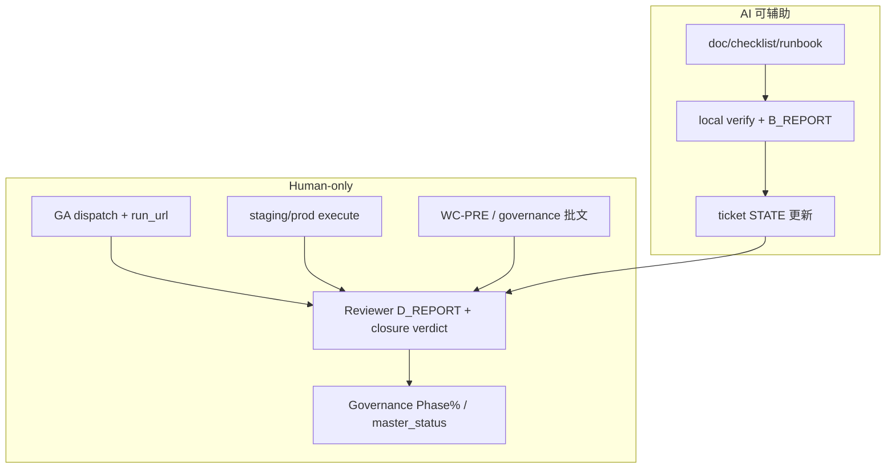

# Phase Closure Governance Playbook v1 — Human-Only Finish Line

> **角色**：Groundwork Finisher B · Phase 收口治理  
> **性质**：**doc-only** · 定义 Phase closure 的**人类裁決边界**与**多维证据** · **不**执行收口动作  
> **Phase% SSOT**：`docs/WAVE_PROGRESS_DASHBOARD.md`（2026-06-26 · **本 playbook 不重算**）  
> **Master 盘**：`04_Workflows/tickets/W-MASTER-full-phase-plan_state.md`  
> **现状**：GA-remote **全线 pending** · WC-PRE-06/07 **批文 pending** · **不得**由 AI 宣告 Phase 闭环

---

## 1. 本 Playbook 解决什么问题

Full-Phase 施工可能在 **L-local** 与 **CI-advisory landing** 层面积累大量「绿」信号，但 **GA-remote**、**staging execute**、**required CI**、**prod 路径**仍缺人类物证。本 playbook 回答：

1. **谁**能宣告 Phase / Wave / 全线「收口」？  
2. **收口完成**需要哪些**多维 evidence**（而非单一 test 绿）？  
3. **AI** 在收尾中**只能**做什么、**绝不能**做什么？

**Companion 文档**：

- GA 远端物证 → `docs/ga-remote-closure-checklist-v1.md`  
- Required CI 批文 → `docs/required-ci-and-wc-pre-checklist-v1.md`  
- Lane 编排 → `docs/full-phase-master-planning-playbook.md`

---

## 2. 收口裁決权（Governance 独占）

| 动作 | 授权方 | 写入位置 | AI |
|------|--------|----------|-----|
| **Phase% 数字变更** | 尚書省 / Governance（Dashboard 维护） | `docs/WAVE_PROGRESS_DASHBOARD.md` | **禁止** |
| **master_status 里程碑** | Governance 独占（宪章 §6.3） | `04_Workflows/project_status/master_status.md` | **禁止** |
| **branch protection / required CI** | 尚書省 +（L2）治理委员会 | GitHub settings + Progress | **禁止** |
| **WC-PRE-06/07 批文** | 尚書省 / 委员会 | approval template + policy JSON | **禁止代签** |
| **governance_dual / prod rollout** | 尚書省 + Security | Progress · 批文 ID | **禁止** |
| **GA workflow_dispatch** | Ops / Platform human | run_url · ticket B_REPORT | **禁止** |
| **Reviewer closure verdict** | Reviewer human | ticket C_REPORT / D_REPORT | AI 可 **draft** · 人 **sign** |
| **Progress 战报 append** | Scribe（O 阶段） | `00_Agent_Work_Progress.md` **末尾** | 可协助格式化 |
| **doc/spec/runbook** | Implementer + Reviewer | `docs/*` · ticket STATE | **允许**（标注 pending） |

**核心原则**：AI **不得**将「计划就绪 / design_ready / local green」升级为「Phase 已收口 / prod-ready / governance 已启用」。

---

## 3. AI 与人类责任矩阵

### 3.1 AI **可以做**（收尾辅助）

| 类别 | 示例 |
|------|------|
| **Spec / doc** | checklist · runbook · approval template · evidence index |
| **Ticket FRAME** | `blocked/planning` · observability 命令 · `non_claims` |
| **Local 验证** | unittest · L-local smoke · B_REPORT verification |
| **Cross-ref** | Dashboard 叙事索引 · lane map · DNR 表 |
| **格式化** | Progress YAML 模板 · ops_cycle validate-report **dry-run** |
| **Reviewer 辅助** | 对照 inspector · 标 over-claim 风险 · **建议** verdict |

### 3.2 AI **不能做**（human-only）

| 类别 | 示例 |
|------|------|
| **远端执行** | GitHub Actions dispatch · staging POST · prod flip |
| **治理裁決** | Phase% · master_status · closure 宣告 · `approved` 批文 |
| **安全/infra** | Security sign-off · endpoint provision · allowlist 生产变更 |
| **CI 管理** | workflow required 升格 · branch protection · secret 配置 |
| **物证伪造** | 预填 `run_url` · 假 `wc_pre_approval_id` · simulated 批文当真 |
| **越权收口** | 无 GA URL 标 GA-remote · 无批文标 required CI live |

### 3.3 Multi-Chat 角色（收尾阶段）

| 角色 | 收口职责 | 禁止 |
|------|----------|------|
| **Orchestrator** | 跟踪 blocked 项 · 开 human checklist 票 · **不**判 closure | 改 Phase% |
| **Implementer** | doc/local build · B_REPORT | dispatch GA · 改 yml required |
| **Reviewer** | AC + tier + over-claim · D_REPORT | 代签 governance |
| **Scribe** | Progress append · ops_cycle · STATE 同步 | 覆盖 Progress 历史 · master_status |

引用：`.cursor/rules/multi_chat_roles.mdc` · `docs/phase4-multi-agent-collaboration-contract-v1.md`

---

## 4. Phase 收口完成的证据模型（多维 · 非单一 test 绿）

> **纪律**：任一维度 **单独** 绿 **不足以** 宣告 Phase 收口。须 Governance 按 Phase 裁決**权重**。

### 4.1 六维证据（E1–E6）

| 维度 | 代号 | 含义 | 典型物证 | 现况缺口（2026-06-26 快照） |
|------|------|------|----------|------------------------------|
| **Trace / local regression** | E1 | L-local unittest · smoke · contract tests | N/N OK · JSON artifacts | 多 Phase **已有**基线 |
| **Smoke / release sanity** | E2 | MP/MC/CI-SMOKE · INT gate local | `run_ci_smoke_check_v1.py` exit 0 | P6 **72%** · required CI 未落地 |
| **GA-remote** | E3 | completed Actions run + URL | `ga_run` YAML · EVD-GR-* | **全线 pending/blocked** |
| **Prod / staging metrics** | E4 | 48h 观测 · DLQ · ack 率 · soak | Grafana/PG · staging window | P7 Round-2 **blocked** · P5 soak placeholder |
| **Audit logs / governance** | E5 | 批文 ID · audit quickview · sign-off | governance_dual · WC-PRE approval | **pending** |
| **Human signoff** | E6 | Reviewer + Governance 书面裁決 | C_REPORT · 尚书省 closure | **pending** |

### 4.2 维度组合示例（**非**自动公式 · 供 Governance 裁決）

| 目标叙事 | 最低组合 | 常见不足 |
|----------|----------|----------|
| 「implementation validated（dev）」 | E1 (+ E2 local) | 无 E3 仍 **不可** 称 GA validated |
| 「advisory CI 就位」 | CI-advisory landing + doc index | **无** E3 · **无** required |
| 「Wave P7/P85/P9 叙事诚实刷新」 | E1 + index + **explicit** E3 pending | 不可省略 blocked 脚注 |
| 「P8.5 wave-H+2 closure」 | E1 + **E3 EVD-GR-P85-S2** + E6 | Scenario2 **blocked** |
| 「P7 staging Round-2」 | E5 governance_dual + infra + **E4** 48h | 五顶 **未齐** |
| 「WC toolchain L2 live」 | E5 WC-PRE 双签 + E3 CI runs + branch protection 截图 | **approval pending** |
| 「Phase X ≥80% 上调」 | Governance 专用门坎 + **全维** Review | **lane 不得自调** |

引用：`docs/p8_p89_evidence_index_v1.md` §5 · `docs/WAVE_PROGRESS_DASHBOARD.md` Wave-next 叙事

### 4.3 禁止的「单一 test 绿 → 收口」捷径

| 误解 | 正确表述 |
|------|----------|
| MP-SMOKE 七步 OK | L-local 接線 sanity · **≠** P7 staging · **≠** Phase 收口 |
| bridge 14/14·7/7 | L-local · **≠** GA-remote · **≠** prod browser |
| yml merge to main | CI-advisory landing · **≠** GA pass · **≠** required CI |
| design_ready WC-PRE | 批文 **pending** · **≠** CI 已升格 |
| ticket `done` / AI B_REPORT | 须 Reviewer D_REPORT + 人类 signoff 维 E6 |
| Dashboard 叙事刷新 | **≠** Phase% 上调（除非 Governance 授权） |

---

## 5. Phase / Wave 收口流程（人类主導）



### 5.1 建议顺序（G7–G9 跨线 · 2026-06-26 阻塞现实）

1. **清 over-claim** — Reviewer 对照 `wave-next-code-inspector-v1.md` §3.2  
2. **GA-remote 首跑** — 按 `ga-remote-closure-checklist-v1.md`（P85 S2 · P9 payment 优先）  
3. **P7 五顶解阻** — governance_dual → infra → security → allowlist → receiver  
4. **P7 Round-2 execute** — 人类 env · 48h 观测  
5. **WC-PRE 批文** — L1 观察 → 可选 L2（独立於 Wave-G GA）  
6. **Full-Phase Master Review** — `W-MASTER-full-phase-plan` C_REPORT verdict  
7. **Governance Phase% / master_status** — **仅**在 E1–E6 裁決后  

### 5.2 「Phase 收口」宣告条件（全线 · 高栏）

**全部** 须 Governance 书面确认（AI **不可**自行判定满足）：

| # | 条件 |
|---|------|
| C1 | **无** open P0 over-claim（inspector + alignment checklist） |
| C2 | GA-remote **关键 EVD** 已回填 run_url（至少 P85 S2 + P9 payment · 按尚书省裁決范围） |
| C3 | P7 Round-2 **或** explicit defer 留痕（不可 silent skip） |
| C4 | WC-PRE-06/07 **或** explicit「required CI defer」批文 |
| C5 | Dashboard Phase% 变更 **仅**由 Governance 执行 · 附 evidence 摘要 |
| C6 | master_status 新增区块 **仅** Governance · 引用 Progress + run_url |
| C7 | AI 会话 Work Report 标注 **human closure pending** |

**Explicit defer 合法格式**：Progress 末尾 · 尚书省口头/书面 · `blocks_closure_until: <date or condition>`

### 5.3 Batch 1 治理裁決（2026-06-27 · 尚書省）

> **裁決 SSOT**：`04_Workflows/00_Agent_Work_Progress.md` 末尾「2026-06-27 Governance Decisions — Batch 1」  
> **性质**：人类治理裁決记录 · **不代表** Ops 已 dispatch · **不代表** run_url 已回填

| 裁決项 | 状态 | 说明 |
|--------|------|------|
| **GOV-PHASE-CLOSURE-FULL** | **NO** | Phase full-line closure **尚未宣告** · GA-remote / WC-PRE / required CI 均未执行完毕 |
| **groundwork_governance_support** | ready | 仅表示人类后续操作有依据 · **≠** Phase 收口 · **≠** Phase% 上调 |
| **GA-remote 授权** | observation-only · **pending dispatch** | P85-S2 · P9 sandbox · P7 advisory 三条已授权 single-run · 执行仍 human Ops |
| **WC-PRE-06/07 L1** | **defer** | 初步裁定 defer · `approval_status.*` 仍 pending · 见 Batch 1 YAML `defer_items` |
| **P7 Round-2** | **blocked** | Batch-1 未裁定 · 五顶 + execute 留待 Batch 2+ |

**Phase full-line closure 禁止宣称**（Batch 1 硬约束）：

- 不得写「Phase 已收口」「full closure」「全线 GO」或等价叙事。
- 不得将 Batch-1 GA-remote **授权** 写成 **执行完成** 或 **merge gate 就绪**。
- Dashboard Phase% **不变**（Governance 独占 · Batch-1 YES ≠ Phase% 上调）。

**后续 Progress / tickets 阻塞项格式（GOV-PHASE-DEFER-FMT · 强制）**：

凡标注 defer / blocked / pending closure 的条目，**须**采用 explicit defer 结构，**不得**仅用自然语言「待后续」：

```yaml
defer_items:
  - id: <GOV-* or ticket_id>
    blocks_closure_until: "<date | condition | evidence bar>"
    reason: "<one-line why defer>"
```

- Scribe append Progress 时对照 Batch 1 YAML 模板（`defer_items` · `hard_no` · `non_claims`）。
- Reviewer 验收时：缺 `blocks_closure_until` 或 `reason` → 标 over-claim / incomplete defer 风险。
- Ticket STATE 同步 defer 时引用同一 `id` · 不发明第二套键名。

---

## 6. 各 Phase 收口脚注（2026-06-26 · 不重算 %）

| Phase | 可诚实说的 | 不可说 / 待 human |
|-------|------------|-------------------|
| **P7 30%** | Round-1 local GO · sandbox 子线 · advisory index | Round-2 · prod · required CI |
| **P8.5 10%** | L-local 14/14·7/7 · CI landing | Scenario2 GA · closure-scribe · prod browser |
| **P9 20%** | local 21/21 · sandbox e2e | 首跑 URL · prod provider/ledger |
| **P8.9 40%** | T1–T3 local · REG bundle | HTTP webhook T4 · INT provider |
| **P6 72%** | INT contract · local smoke | WC-PRE-07 mandatory · GA-remote |
| **P1 90%** | 治理 doc 层 | WC-PRE 批文 · G2–G4 guard |

完整表：`docs/WAVE_PROGRESS_DASHBOARD.md` §Phase 完成度表

---

## 7. 记录与审计

### 7.1 Progress append（Scribe · 收口相关）

每条须含：

```markdown
- ticket_id · group_id · evidence_tier
- 命令摘要 / run_url / wc_pre_approval_id（或 explicit pending）
- non-claims（1 行）
- blocked / next
- human_signoff: pending | <role> YYYY-MM-DD
```

### 7.2 ops_cycle（可选）

```bash
python 04_Workflows/_ops_cycle.py validate-report --json <战报.json>
python 04_Workflows/_ops_cycle.py append-report --json <战报.json>  # 可先 --dry-run
```

### 7.3 master_status 区块模板（**仅 Governance 填写**）

```markdown
## YYYY-MM-DD · <Phase/Wave> closure snapshot

- **裁決**：尚書省 / Governance
- **Phase% 变更**：<from> → <to> 或「不变」
- **证据**：E1–E6 摘要 · run_url 列表 · wc_pre_approval_id
- **defer**：<项> 或 无
- **Detail**：Progress 条目链接 · Dashboard 列
```

---

## 8. Groundwork Reviewer 对齐（2026-06-26）

| Reviewer 发现 | 本 playbook 回应 |
|---------------|----------------|
| GA-remote 全线 pending | §4 E3 · companion GA checklist |
| WC-PRE-06/07 批文未出 | §3.2 · required-ci checklist §4 |
| AI 不应自称完成 | §2–§3 责任矩阵 · §5.2 C7 |
| 收口需多维 evidence | §4 六维模型 · §4.3 禁止捷径 |

---

## 9. 相关索引

| 类型 | 路径 |
|------|------|
| Full-Phase playbook | `docs/full-phase-master-planning-playbook.md` |
| Full-Phase state | `04_Workflows/tickets/W-MASTER-full-phase-plan_state.md` |
| GA-remote checklist | `docs/ga-remote-closure-checklist-v1.md` |
| Required CI checklist | `docs/required-ci-and-wc-pre-checklist-v1.md` |
| Evidence tier | `docs/evidence-tier-contract-v1.md` |
| Dashboard | `docs/WAVE_PROGRESS_DASHBOARD.md` |
| Progress | `04_Workflows/00_Agent_Work_Progress.md` |
| master_status | `04_Workflows/project_status/master_status.md` |
| Inspector | `04_Workflows/review_checklists/wave-next-code-inspector-v1.md` |

---

*phase-closure-governance-playbook-v1 · 2026-06-27 · Groundwork Finisher B + Governance Scribe Batch 1 · doc-only · GOV-PHASE-CLOSURE-FULL = NO*
