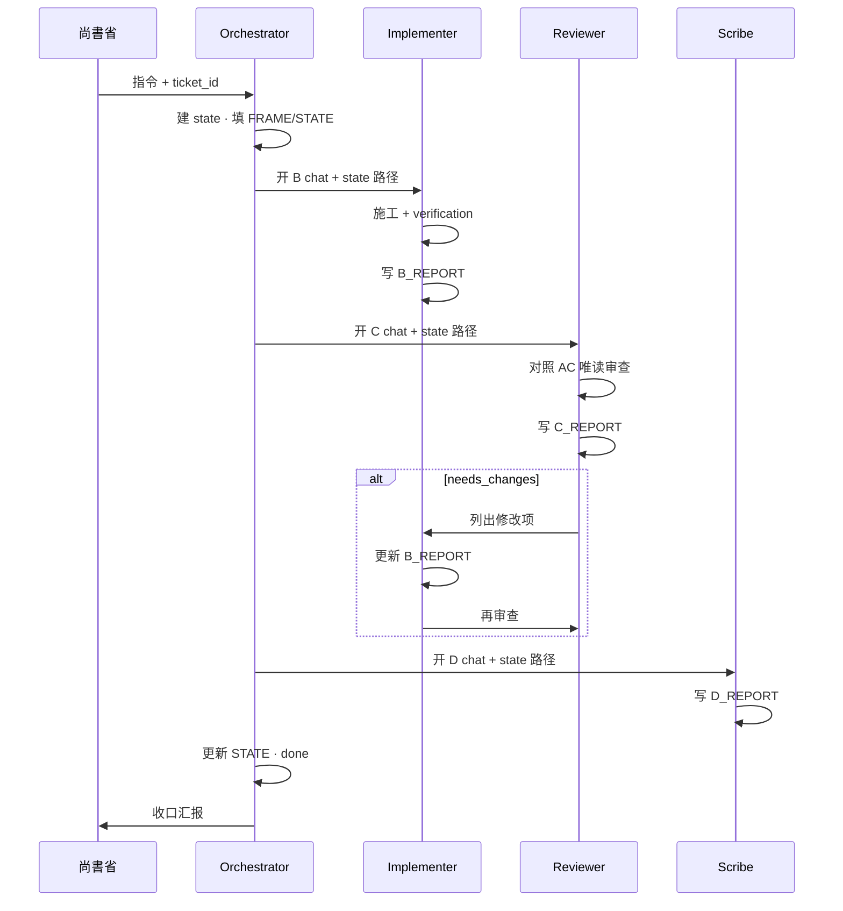

# Phase 4 Multi-Agent Collaboration Contract v1

> **版本**：v1.0 · Phase 4 SSOT  
> **日期**：2026-06-10  
> **性质**：Multi-Chat 协作的 **contract 级** 依赖假设、routing 与关口约定；操作细节留在 W5-T0 三份 docs。  
> **权威位阶**：尚書省指令 ＞ `HARNESS_CONSTITUTION.md` ＞ `ENGINEERING_CONTRACT.md` ＞ **本 contract** ＞ `.cursor/rules/multi_chat_roles.mdc`（机器层 FORBID/MUST）＞ W5-T0 spec/runbook/replay ＞ 票 `brief.md`／`notes.md`。  
> **冲突处理**：本 contract 与 `multi_chat_roles.mdc` 字面冲突时，以 **machine rule 优先**（`.cursor/rules/multi_chat_roles.mdc` 各角色 FORBID/MUST）；本 contract 补充 routing、流程假设与 STATE 写入冻结，不覆盖 AGENTS／憲法／合約正文。

---

## §1 适用范围

### 1.1 何时启用

| 场景 | 是否适用本 contract |
|------|---------------------|
| Orchestrator 启动 **Multi-Chat** 平行对话（O/B/C/D 分 chat） | **是** — 必须遵守 FRAME/STATE/B/C/D 区块与 §3 流程 |
| 单 chat 合并执行 O+B+C+D | **部分** — 可合并执行，但 **AC 与 C_REPORT 不可省略**（见 §8） |
| Cursor Subagents v0.1 单票派工（`DISPATCH_GUIDE.md`） | **引用 §4 routing** — 流程仍以 DISPATCH_GUIDE 为准 |
| runtime `subagents/*` 派工 | **否** — 本 contract 不定义 runtime 派工 |

### 1.2 文档层级（Wave B/C 引用顺序）

```
contract（本档） → multi_chat_roles.mdc（机器层） → spec → handoff runbook → replay guide
     ↑ SSOT 假设+routing+关口          ↑ FORBID/MUST 细则      ↑ W5-T0 操作层母本
```

| 层级 | 路径 | 用途 |
|------|------|------|
| **Contract** | `docs/phase4-multi-agent-collaboration-contract-v1.md` | 依赖假设、routing、STATE 冻结、验收入口 |
| **Machine rules** | `.cursor/rules/multi_chat_roles.mdc` | 各角色 FORBID/MUST、allowed/blocked paths |
| **Spec** | `docs/multi-agent-collaboration-spec-v1.md` | 角色目的、DoD、输入输出细节 |
| **Runbook** | `docs/multi-agent-handoff-runbook-v1.md` | 票生命周期、拆合票、常见错误 |
| **Replay** | `docs/multi-agent-replay-guide-v1.md` | 事后 replay、postmortem 深度 |

### 1.3 不覆盖范围

- 不修改、不取代 `AGENTS.md`、`ENGINEERING_CONTRACT.md`、`HARNESS_CONSTITUTION.md` 正文。
- 不新增 agent 类型（Planner / Executor / Judge 保持 **reserved**，由 Orchestrator / Implementer 兼任）。
- 不实现 Multi-Chat 与 runtime subagents 合并派工。

---

## §2 四角色 Contract 表

> 下列为 **contract 级** 摘要；细则与路径类型见 `multi_chat_roles.mdc` 各 `§<role>`。**冲突时 machine rule 优先。**

### 2.1 Orchestrator (O)

| 维度 | Contract 约定 |
|------|---------------|
| **may_do** | 排票顺序与依赖；冻结 `AllowedPaths`／`BlockedPaths`；建/更新 `<ticket_id>_state.md` 的 **FRAME、STATE**；指定各 chat 角色与模型；解 scope 冲突；读 B/C/D_REPORT 后更新 STATE；对尚書省收口 |
| **must_not** | 撰写功能程式或大 refactor；**绕过 Reviewer 直接标票 done 或可交付**；修改 B/C/D_REPORT 内容；自行扩展票 scope；改 `ENGINEERING_CONTRACT.md`／憲法正文 |
| **inputs** | 尚書省指令；依赖票 state；`multi_chat_roles.mdc`；本 contract §3–§5 |
| **outputs** | 冻结后的 FRAME；STATE（`overall_status`、`current_owner`、`next_action`、`status_by_role`）；关票时 `overall_status: done`（**仅在 C_REPORT 为 accepted / accepted_with_gaps 且 D_REPORT 已填后**） |
| **done_when** | STATE 反映全角色完成；`status_by_role` 中 implementer/reviewer/scribe 均为 `done`；C_REPORT 非 `needs_changes`／`rejected`；已决定下一票或归档 |

### 2.2 Implementer (B-*)

| 维度 | Contract 约定 |
|------|---------------|
| **may_do** | 在 FRAME.AllowedPaths 内实作；执行 runner／命令；写 **B_REPORT**（含 `verification` 命令与 exit code）；遵守四流派与 12-rule |
| **must_not** | 改 **FRAME、STATE、C_REPORT、D_REPORT**；改 governance 母本（憲法／合約／AGENTS／`.cursor/rules`）除非票 scope 明示；越权改他人 `core`；自行标 done |
| **inputs** | state 的 FRAME + STATE；instruction 模板；`ENGINEERING_CONTRACT.md`；AllowedPaths 内源文件 |
| **outputs** | AllowedPaths 内代码/文档/测试 diff；**B_REPORT**（`changed_files`、`verification`、`behavior_notes`、`deferred_items`） |
| **done_when** | B_REPORT 已写入 state；`verification` 含可重跑命令与关键结果；scope 内 AC 自测通过或标阻塞 |

### 2.3 Reviewer (C)

| 维度 | Contract 约定 |
|------|---------------|
| **may_do** | **唯读**审查 diff 与 B_REPORT；对照 FRAME.AcceptanceCriteria 与合約 12-rule；写 **C_REPORT**（`conclusion`、`blocking_issues`、`checks_summary`） |
| **must_not** | 写/改任何功能 code 或 docs 实体；改 FRAME/STATE/B/D_REPORT；替 Implementer 收尾；自行宣告里程碑或写 `master_status.md` |
| **inputs** | FRAME、STATE、B_REPORT；变更文件 spot-check；`ENGINEERING_CONTRACT.md` |
| **outputs** | **C_REPORT** — `conclusion`: `accepted` \| `accepted_with_gaps` \| `needs_changes` \| `rejected` |
| **done_when** | C_REPORT 已写入 state；每项 AC 在 `checks_summary` 有对应判定；blocking 项已列明 |

### 2.4 Scribe (D)

| 维度 | Contract 约定 |
|------|---------------|
| **may_do** | 写 **D_REPORT**；依核定结论更新 `docs/*.md` 交叉引用；**末尾追加** `00_Agent_Work_Progress.md`；组装战报 JSON 草稿供 `_ops_cycle.py validate-report` |
| **must_not** | 改 code/tests/config；改 FRAME/STATE/B/C_REPORT；代替 Reviewer 做 acceptance；重排 Progress 历史段落 |
| **inputs** | FRAME、STATE、B_REPORT、C_REPORT；WORKFLOW_INDEX／Dashboard 索引惯例 |
| **outputs** | **D_REPORT**（`docs_updates`、`progress_entry`、`followup_suggestions`）；Progress 末尾条目（Orchestrator 确认后） |
| **done_when** | D_REPORT 已写入 state；本 contract 与 W5-T0 docs 交叉引用已对齐（Scribe 收尾时必须 **bidirectional cross-ref**） |

### 2.5 角色对照速查

| 角色 | 可写 state 区块 | 关口性质 |
|------|----------------|----------|
| Orchestrator | FRAME, STATE | 开/关票 |
| Implementer | B_REPORT | 施工 |
| Reviewer | C_REPORT | **不可绕过** 验收关口 |
| Scribe | D_REPORT | 文档/Progress 收口 |

---

## §3 标准工作流（O → B → C → D）

### 3.1 主序列（所有 Multi-Chat 票的默认假设）

```text
[O] 开票：复制 ticket_state.template → 填 FRAME + 初始化 STATE
  ↓
[B] Implementer：读 FRAME/STATE → 施工 → 写 B_REPORT（含 verification）
  ↓
[C] Reviewer：读 FRAME/STATE/B_REPORT → 唯读验收 → 写 C_REPORT
  ↓  needs_changes → 回到 B（不删历史 REPORT，追加/更新）
[D] Scribe：读 B/C → 写 D_REPORT + docs/Progress 建议
  ↓
[O] 关票：读 REPORT → 更新 STATE → overall_status: done
```

**Loop back**：`C_REPORT.conclusion = needs_changes` → Implementer 重跑 B → 再进 C；`rejected` → Orchestrator 介入（可能重开 FRAME）。

### 3.2 流程 (a) — 单票四角色顺序



### 3.3 流程 (b) — Orchestrator 并行开 B/C 两 chat + Scribe 收口

适用：Implementer 与 Reviewer **不同模块**可并行预读，或 B 完成后 C 立即并行启动；**C 仍必须在 B_REPORT 就绪后写入 C_REPORT**。

```text
                    ┌─── B chat（Implementer）─── 写 B_REPORT ───┐
O 开 FRAME/STATE ──┤                                              ├──► C chat（Reviewer）── C_REPORT
                    └─── （可选）B-2 子模块并行 ─────────────────┘           │
                                                                              ▼
                                                                    D chat（Scribe）── D_REPORT
                                                                              │
                                                                    O 关票 ───┘
```

**Contract 约束**：

- 并行 **不** 允许 Reviewer 在 B_REPORT 为空时写 `accepted`。
- 并行 **不** 允许 Orchestrator 在 C_REPORT 完成前标 `overall_status: done`。
- Scribe **始终** 在 C 核定后执行 D（`accepted` 或 `accepted_with_gaps`）。

---

## §4 Routing 决策树

本 § 对齐 `AGENTS.md` §Cursor Subagents v0.1 派工三原则（**不修改其原文**）；Multi-Chat 开票前 Orchestrator 须走同一逻辑判断是否需 `governance-guard` 预审。

### 4.1 决策树

```text
收到任务 proposal
    │
    ├─ 单档/单模块 + 路径在 allowed_paths + 不涉及制度档/憲法§7禁区？
    │       YES → 【直派 Implementer】（可选 repo-researcher → B → C → D → O）
    │       NO  ↓
    │
    ├─ 触及 AGENTS.md / ENGINEERING_CONTRACT.md / .cursor/rules /
    │   暗部 core / 跨多档多域 / selector L0–L2 升格 / runbook 未明示边界？
    │       YES → 【必经 governance-guard】→ allow 才派 worker；stop_work 则停工
    │       NO  ↓
    │
    └─ 单票捆绑：多制度档 + 实作 + 暗部 adapter（TEST-SUB-003 语义）？
            YES → 【stop_work · allowed_worker=none】— 不得派 Implementer/Reviewer
            NO  → 按 Multi-Chat §3 开 FRAME，走 O→B→C→D
```

### 4.2 三种路径对照

| 路径 | 触发条件 | 下一步 | 参考 |
|------|----------|--------|------|
| **直派 Implementer** | 单档/单模块；guard allowed_paths 内；无制度变更 | B → C → D → O | TEST-SUB-001 |
| **必经 governance-guard** | 触制度档、`.cursor/rules`、暗部 core、跨域、selector 升格 | guard `allow` → B；否则调整 scope | TEST-SUB-002 |
| **stop_work** | 单票捆绑多制度 + 实作 + 暗部；guard `allowed_worker=none` | **停工** — 拆票或请尚書省裁决 | TEST-SUB-003 |

### 4.3 Multi-Chat 与 Subagents 映射

| Multi-Chat | DISPATCH_GUIDE | 本 contract 关口 |
|------------|----------------|------------------|
| Orchestrator | coordinator | 冻结 FRAME；不可绕过 C |
| Implementer | implementation-worker | B_REPORT + verification |
| Reviewer | checker-reviewer | C_REPORT 为 done 前置条件 |
| Scribe | （无一一 subagent） | D_REPORT；cross-ref contract |

---

## §5 Handoff 与 STATE 字段

### 5.1 区块写入权限（冻结 · 对齐 `ticket_state.template.md`）

| 区块 | 唯一写入者 | 全角色可读 | Contract 冻结规则 |
|------|------------|------------|-------------------|
| **FRAME** | Orchestrator | 是 | B/C/D **must_not** 修改；开票前冻结 AllowedPaths/BlockedPaths/AC |
| **STATE** | Orchestrator | 是 | B/C/D **must_not** 修改；交棒后 O 更新 `current_owner` |
| **B_REPORT** | Implementer | 是 | `verification` **应** 含命令、exit code、关键 ok/fail 语义 |
| **C_REPORT** | Reviewer | 是 | `conclusion` 为 O 关票前置；**不可绕过** |
| **D_REPORT** | Scribe | 是 | 在 C 核定后写入；含 Progress 建议 |

### 5.2 STATE 字段语义

| 字段 | 维护者 | 说明 |
|------|--------|------|
| `overall_status` | O | `draft` → `in_progress` → `review` → `scribe` → `done` \| `blocked` |
| `current_owner` | O | `orchestrator` \| `implementer` \| `reviewer` \| `scribe` |
| `next_action` | O | 下一棒一句话 |
| `status_by_role.*` | O | 各角色 `pending` \| `in_progress` \| `done` \| `n/a` |

### 5.3 B_REPORT verification 与 traces

- **应** 记录：runner 命令、exit code、结构化 `ok` 字段或 unittest 计数。
- **对齐** Progress append 与 `_ops_cycle.py` 战报字段；**不** 新建 trace schema。
- 可选引用 `run_id` 或 CI run URL（若有）；非 AC 硬要求。

### 5.4 Handoff 最小包

各角色新 chat 启动时 **必须** 提供：

1. 角色 instruction 模板（`_templates/*_instruction.template.md`）
2. **同一** `04_Workflows/tickets/<ticket_id>_state.md` 路径
3. 本 contract §2 对应角色 `must_not` 提醒（尤其 B 不改 FRAME、O 不绕过 C）

---

## §6 与 Engineering Contract 映射

| 合約流派 / Rule | Multi-Chat 落点 | 负责角色 |
|-----------------|-----------------|----------|
| **Context-Driven**（CD-3.1） | 起手已读清单 + 角色/可碰/禁区 | B 起手；O 开票 |
| **Source-Driven**（SD-3.2） | 列档→读→改；路径对齐 Master_Map | B |
| **Incremental**（IN-3.3） | 最小增量；skeleton 分栏 | B 回报；C 检查 |
| **Debugging**（DB-3.4） | 命令+输出为完成依据 | B `verification`；C 对照 Rule 11 |
| **Rule 3** 最小触及 | AllowedPaths 外不改 | C 审查；O 冻结 scope |
| **Rule 8** 边界尊重 | 不改他人 core | B must_not；C 检查 |
| **Rule 11** 验证后宣称 | 无证据不 done | C 关口；O 不得在 C 前关票 |
| **Work Report 附录 A** | B/D 结构化七节 | B behavior_notes；D progress_entry |

**Gate（GATE-3.5.1）**：四流派最低覆盖 + C_REPORT `accepted*` 后，O 方可标 Wave 级 done。

---

## §7 验收与 Replay 入口

### 7.1 Contract 结构验收（automated）

```bash
python -m unittest tests.test_phase4_multi_agent_contract_v1 -v
```

预期：全部断言通过（≥10 项：四角色节、O 不可绕过 C、B 不可改 FRAME、§1–§8 存在、W5-T0 §0 指针等）。

### 7.2 人工 Replay 样板 — W4-T2

1. 打开 `04_Workflows/tickets/W4-T2-routing-eval-runner_state.md`
2. 对照本 contract **§3.1** 主序列，确认：
   - FRAME 含 Goal/AllowedPaths/AC
   - B_REPORT → C_REPORT（`accepted_with_gaps`）→ D_REPORT 顺序完整
   - STATE `overall_status: done` 在 REPORT 齐全后
3. 深度 replay 步骤见 `docs/multi-agent-replay-guide-v1.md` §4

### 7.3 相关索引

| 用途 | 路径 |
|------|------|
| Replay 指南 | `docs/multi-agent-replay-guide-v1.md` |
| Handoff 细则 | `docs/multi-agent-handoff-runbook-v1.md` |
| 票机制 | `04_Workflows/tickets/README.md` |
| Phase 4 完成度 | `docs/WAVE_PROGRESS_DASHBOARD.md` · `docs/WAVE_A_EXECUTION_PLAN.md` |
| 可选协作度量 | W11-T3 monthly agent-lines report（非本 contract AC） |

---

## §8 禁止事项

| ID | 禁止行为 | 后果 / 处理 |
|----|----------|-------------|
| **P4-BAN-1** | Orchestrator 绕过 Reviewer 标票 `done` | 票无效；须补 C_REPORT |
| **P4-BAN-2** | Implementer 修改 FRAME/STATE | 越权；Reviewer 应 `needs_changes` |
| **P4-BAN-3** | 单 chat 合并 O/B/C/D 但省略 C_REPORT | 违反 contract；视同 P4-BAN-1 |
| **P4-BAN-4** | Implementer 改 governance 母本（无票授权） | 走 TEST-SUB-003 `stop_work` 路径 |
| **P4-BAN-5** | 仅更新 contract 或仅更新 `multi_chat_roles.mdc` 一侧 | Reviewer 拒收；Scribe 须双向 cross-ref |
| **P4-BAN-6** | 新增 Planner/Executor/Judge 为正式角色 | 违反 Non-Goals；保持 reserved |
| **P4-BAN-7** | 以 W5-T0 spec 覆盖本 contract routing/关口 | 无效；层级见 §1.2 |

---

## 引用索引

| 主题 | 路径 |
|------|------|
| 本 contract | `docs/phase4-multi-agent-collaboration-contract-v1.md` |
| Machine rules | `.cursor/rules/multi_chat_roles.mdc` |
| W5-T0 spec | `docs/multi-agent-collaboration-spec-v1.md` |
| Handoff | `docs/multi-agent-handoff-runbook-v1.md` |
| Replay | `docs/multi-agent-replay-guide-v1.md` |
| 合約 | `04_Workflows/ENGINEERING_CONTRACT.md` |
| Subagents 派工 | `.cursor/agents/DISPATCH_GUIDE.md` · `AGENTS.md` §Cursor Subagents v0.1 |
| State 模板 | `04_Workflows/tickets/_templates/ticket_state.template.md` |

---

*PHASE4-MULTI-AGENT-COLLABORATION-CONTRACT-v1 · 2026-06-10 · WA-T4*
