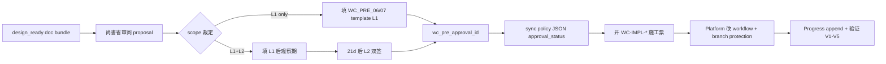

# Required CI & WC-PRE-06/07 Checklist v1 — Human Approval Playbook

> **角色**：Groundwork Finisher B · Governance / Required CI  
> **性质**：**doc-only** · 批文与 wiring checklist · **不**改 `.github/workflows/*` · **不**改 branch protection  
> **现状（2026-06-26）**：WC-PRE-06/07 **`design_ready` · `approval_status.*` = pending** · **required CI 升格未授权**

---

## 0. 边界与 Non-Claims

| 声明 | 状态 |
|------|------|
| 本档 = required CI **已上线** | **否** |
| WC-PRE-06/07 design_ready = 已 human 批准 | **否** |
| advisory CI landing = 可升格 merge gate | **否** — 须独立批文 + implementation 票 |
| toolchain smoke L2 = P10 prod 闭环 | **否** |
| AI 可填 `approval_status: approved` | **禁止** |

**三分表（P6 contract AC-6 · 必记）**：

```text
eval-gate + core-agent-smoke 绿  ≠  INT Tier-A 绿  ≠  toolchain smoke 绿  ≠  Wave-G advisory GA 绿
```

### 0.1 Batch 1 裁定 · WC-PRE L1 defer · Sandbox / advisory 非 prod gate（2026-06-27）

> **裁決 SSOT**：Progress 末尾「2026-06-27 Governance Decisions — Batch 1」· `defer_items`

| 项 | Batch 1 状态 | 说明 |
|----|--------------|------|
| **WC-PRE-06 L1**（GOV-WCPRE06-L1） | **defer** · **尚未签批文** | `approval_status.L1_pr_optional` 仍 pending · 须 health/flake/coverage ≥14 日可重跑证据后再裁 |
| **WC-PRE-07 L1**（GOV-WCPRE07-L1） | **defer** · **尚未签批文** | `approval_status.L1_optional_ci_advisory` 仍 pending · 须 smoke 行为与 CI 漂移观察完成后再裁 optional_ci |
| **required CI 升格** | **blocked** | Batch-1 **未**授权 L2 · **未**授权 branch protection 变更 |
| **GOV-CI-P7-G8** · **GOV-CI-P9-SANDBOX** | **hard_no** | 见 Batch 1 YAML · 不得升格为 prod merge gate |

**Sandbox / advisory CI 叙事 guardrail（强制）**：

- **不得**将 sandbox smoke（P9 payment）· advisory GA（P7 · P8.5 bridge）· release sanity local 脚本 **当作** prod merge gate 或 prod-ready 证据。
- **不得**将 WC-PRE design_ready 写成 `approval_status: approved` 或「PR required 已开」。
- Batch-1 GA-remote **授权**（observation-only）**≠** required CI live · **≠** WC-PRE L1 批文已签。

defer 格式须含 `blocks_closure_until` + `reason`（见 `phase-closure-governance-playbook-v1.md` §5.3 · GOV-PHASE-DEFER-FMT）。

---

## 1. CI 分层现状（As-Is）

### 1.1 已是 PR mandatory（**勿重复升格**）

| Workflow | gate_id / 类 | merge 影响 | 备注 |
|----------|--------------|------------|------|
| `.github/workflows/eval-gate-ci.yml` | P3.5 mandatory trio | **blocks merge** | eval unit + eval_ci_check |
| `.github/workflows/core-agent-smoke.yml` | P3.5 mandatory trio | **blocks merge** | PR tier smoke |

**AI 禁止**：在 checklist 或 Progress 中将上述两项写成「待升格 required CI」。

### 1.2 Advisory · non-gate（Wave-G · GA-remote pending）

| Workflow | Phase | Job 特征 | 升格候选 |
|----------|-------|----------|----------|
| `p7-notification-smoke.yml` | P7 | `continue-on-error: true` | **G8** 模板 · Wave-P7-6 独立票 |
| `bridge-smoke.yml` | P8.5 | advisory · scenario input | **不建议** 升格 required（stub · optional 侧线） |
| `p9-payment-sandbox-smoke.yml` | P9 | sandbox-only | **不建议** 默认 merge gate（sandbox ≠ prod） |
| `p9-wc-m2-fixture-execute.yml` | P9 | advisory fixture | **不建议** 默认 merge gate |
| `agent-lines-ci.yml` | P6/W10 | 见票 STATE | 另评估 · 非 WC-PRE-07 默认范围 |

### 1.3 Local-only · 未接 CI

| 能力 | SSOT | 现况 |
|------|------|------|
| Toolchain smoke matrix | `routing/toolchain_smoke_matrix_v1.yaml` · WC-PRE-05 runner | **local only** · WC-PRE-07 设计稿 ready |
| Toolchain health dashboard | WB-T4 · WC-PRE-06 提案 | **local optional** · L1/L2 待批文 |
| INT Tier-A regression | `_wave7_regression_gate.py` | **local mandatory** · **不进** PR CI（CH-50 另票） |
| MP/MC/CI-SMOKE scripts | `run_ci_smoke_check_v1.py` 等 | **L-local** · 无 GitHub required 绑定 |

---

## 2. 可考虑升格为 Required 的候选（**须逐案批文**）

> **原则**：C1 禁止跳级 · C6 任何 branch protection 变更须尚書省批文（`WC_PRE_06_07_rollout_plan.md` §2.2）

### 2.1 WC-PRE-06 · Toolchain Health Gate

| 级别 | 行为 | blocks merge | 批文模板 |
|------|------|--------------|----------|
| **L0**（现况） | 本地 CLI · optional | 否 | baseline ack |
| **L1** | PR job dry-run · artifact · `continue-on-error: true` | 否 | `docs/governance/WC_PRE_06_approval_template.md` §4.1 |
| **L2** | PR **required** · hard assert（非 score SLA） | **是** | 同模板 §4.2 · **双签** |

**设计 SSOT**：`docs/toolchain-observability-governance-upgrade-v1.md`  
**Policy JSON**：`docs/governance/wc_pre_06_governance_policy_v1.json`（`approval_status.*` **pending**）  
**Implementation 票**：`WC-IMPL-L1` / `WC-IMPL-L2`（**blocked_on_approval**）

**L2 硬约束（不可 override 无留痕）**：

- `aggregated_health_score` **不得**作 hard assert（rollout D2 = NO）
- `blocks_mainline=false` 语义保持（阻 PR ≠ MVP mainline regression 替代）
- P3.5 增 `OG-TOOLCHAIN-HEALTH` 行须 **CH-10** 独立修订票

### 2.2 WC-PRE-07 · Mandatory Smoke Matrix CI

| 级别 | 行为 | blocks merge | 批文模板 |
|------|------|--------------|----------|
| **L0**（现况） | 无 CI step | 否 | — |
| **L1** | `--tier optional_ci` advisory step on `eval-gate-ci.yml` | 否 | `docs/governance/WC_PRE_07_approval_template.md` §4 |
| **L2** | 白名单 hard fail：`TS-TOOLCHAIN-DASHBOARD-UNIT` · `TS-W3TL-UNIT` | **是** | 同模板 §5 · **双签** |

**设计 SSOT**：`docs/toolchain-smoke-mandatory-ci-runner-v1.md`  
**Policy JSON**：`docs/governance/wc_pre_07_approval_workflow_policy_v1.json`  
**Implementation 票**：`WC-IMPL-SMOKE-CI-L1` / `WC-IMPL-SMOKE-CI-L2`

**L2 白名单外（明确不含）**：

- `TS-ROUTING-EVAL-*`（已在 eval-gate · 避免重复/超时）
- `TS-MVP-MAINLINE`（release_only）
- `TS-AGENT-LINES-CI` 全长

### 2.3 Phase 线独立 required CI 候选（非 WC-PRE-06/07）

| 候选 | SSOT | 升格门槛 | 批文路径 |
|------|------|----------|----------|
| **P7 `p7-notification-smoke` → required** | bootstrap **G8** · `WH-P7-PROD-prod-rollout-governance-bootstrap-v1` | prod rollout 批文 + Wave-P7-6 CI governance 票 | 尚书省 prod 路径 · **独立于** WC-PRE-07 |
| **W4-GUARD G2–G4 schema/ratio** | `W4-GUARD-*` | WC-PRE 或 PM 批文后 | `FP-G1-T3` FRAME |
| **INT Tier-A → PR CI** | CH-50 | **不在** WC-PRE-06/07 scope | `WA-T6-CI` 等价票 |

**AI 禁止**：将 Wave-G advisory workflow 与 WC-PRE-07 L2 白名单 **混为一张批文**。

---

## 3. 升格先决条件（升格前必须满足）

### 3.1 通用先决（WC-PRE-06 **与** WC-PRE-07 共用）

| # | 维度 | 门槛 | 证据形式 |
|---|------|------|----------|
| P1 | **Coverage** | 目标 smoke/health 路径本地 **14 日**可重跑 | CLI JSON · unittest N/N |
| P2 | **Flakiness** | L1 观察期失败率 **< 5%**（L2 前 **21 日**） | CI log 统计 · ops 周报 |
| P3 | **Monitoring** | artifact 存在率 · outbox 7 日滚动 **≥ 95%** | `artifacts/toolchain/*` · health JSON |
| P4 | **Documentation** | design SSOT Reviewer `design_ready` · rollout plan 已读 | ticket STATE D_REPORT |
| P5 | **Rollback plan** | design doc §7 · **L2 前演练 1 次** | Progress append 留痕 |
| P6 | **Implementation FRAME** | `WC-IMPL-*` 冻结 · NonScope 无 workflow 越权 | ticket STATE |
| P7 | **Human signoff** | `wc_pre_approval_id` 分配 · template 签核 | §4 流程 |

### 3.2 WC-PRE-06 专用（L1 / L2）

引用 `WC_PRE_06_approval_template.md` §4 · rollout G1–G6：

- L1：G1–G5 + `approval_status.L1_pr_optional = approved`
- L2：L1 连续 21 日 + G1–G6 + rollback drill + `approval_status.L2_pr_required = approved` + **治理委员会双签**

### 3.3 WC-PRE-07 专用（L1 / L2）

引用 `WC_PRE_07_approval_template.md` §4–§5：

- L1：`approval_status.L1_optional_ci_advisory = approved` · 确认 `continue-on-error: true`
- L2：L1 21 日 + flake 门槛 + 白名单仅两 ID + P3.5 修订票 CH-43 排程 + **双签**

### 3.4 升格后验证（implementation 完成后 · human 验收）

| # | 检查 |
|---|------|
| V1 | branch protection 截图 / settings export（**不含** token） |
| V2 | 故意失败 PR 探针 · 确认 required check 真阻塞 |
| V3 | rollback 探针 · L2→L1 或 L1→L0 按 playbook 执行 |
| V4 | Progress append · Dashboard **叙事**更新（Phase% 仍 Governance 独占） |
| V5 | Reviewer 确认 **无** over-claim（advisory 历史 run ≠ 升格前即 required） |

---

## 4. WC-PRE-06/07 批文流程（提案 → 审核 → 签署 → 应用 → 记录）



### 4.1 阶段明细

| 阶段 | 负责 | 产出 | AI 可否代劳 |
|------|------|------|-------------|
| **提案** | Governance / Wave 5 | `toolchain-observability-governance-upgrade-v1.md` · smoke mandatory design · policy JSON `design_only` | 仅 doc · **不**填 approved |
| **审核** | 尚書省 / 治理委员会 | 范围：L1 only / L1+L2 / smoke 子集 · 确认 non-claims | **human-only** |
| **签署** | 尚書省（L1）· +委员会（L2） | 填 template §5 · 分配 `wc_pre_approval_id` | **human-only** |
| **应用** | Platform + Implementer | `WC-IMPL-L1/L2` · `WC-IMPL-SMOKE-CI-L1/L2` · CH-30–45 | 须批文后 · AI 不自行改 yml |
| **记录** | Scribe | Progress 末尾 YAML · sync `approval_status` in policy JSON · ticket Dependencies | Scribe 可协助格式化 · **不**代签 |

### 4.2 签署写哪里

| 产物 | 路径 |
|------|------|
| WC-PRE-06 签核表 | `docs/governance/WC_PRE_06_approval_template.md` §5 |
| WC-PRE-07 签核表 | `docs/governance/WC_PRE_07_approval_template.md` §6 |
| Policy 同步 | `wc_pre_06_governance_policy_v1.json` · `wc_pre_07_approval_workflow_policy_v1.json` |
| Design doc §8 / §6 | `approval_status` 表格 |
| Progress | `04_Workflows/00_Agent_Work_Progress.md` **末尾 append** |
| Rollout 追踪 | `docs/governance/WC_PRE_06_07_rollout_plan.md` · CH-00–02 |

### 4.3 Progress 最小 YAML（签署后 · Scribe）

**WC-PRE-06 示例**：

```yaml
wc_pre_approval_id: WC-PRE-06-APPROVAL-YYYYMMDD-NNN
ticket: WC-PRE-06
scope: L1  # or L2
approver: <human name / role>
approval_date: YYYY-MM-DD
approval_status.L1_pr_optional: approved  # human filled only
approval_status.L2_pr_required: pending
implementation_ticket: WC-IMPL-L1
non_claim: 批文仅授权 CI 设计路径；不等同 prod selector 已启用
```

**WC-PRE-07 示例**：

```yaml
wc_pre_approval_id: WC-PRE-07-APPROVAL-YYYYMMDD-NNN
ticket: WC-PRE-07
scope: L1
mandatory_ci_scope: optional_ci_advisory  # L2 时填 smoke_id 列表
implementation_ticket: WC-IMPL-SMOKE-CI-L1
non_claim: mandatory smoke CI 批文 ≠ P10 prod-ready
```

### 4.4 Rollback 人类流程

| 触发 | 谁可先执行 | 留痕 |
|------|------------|------|
| L2 flake 超标 | 工程 on-call → L1 advisory | 24h 内尚書省备案 · Progress |
| 移除 PR step（→ L0） | **须**尚書省或委员会批文 | `approval_status` rolled_back · 新 implementation 票 |
| 恢复 L2 | 重新满足 §3 + **新** `wc_pre_approval_id` | rollout §7 playbook |

---

## 5. Wiring Checklist（批文后 · Implementation 人类/Platform）

> **本節供 `WC-IMPL-*` 施工前 copy** · 仍 **不** 在本轮执行

### 5.1 WC-IMPL-L1（Toolchain health advisory）

- [ ] CH-30：`eval-gate-ci.yml` 增 health dry-run · `continue-on-error: true`
- [ ] CH-31：upload `toolchain_health_v1` artifact
- [ ] CH-35：14 日观察期周报模板启用
- [ ] **未**改 branch protection
- [ ] unittest + snapshot advisory 绿

### 5.2 WC-IMPL-SMOKE-CI-L1

- [ ] CH-32：smoke matrix `--tier optional_ci` step · advisory
- [ ] CH-33：`smoke_ci_summary.json` artifact
- [ ] CH-34：contract test 对齐 YAML
- [ ] **未**改 branch protection

### 5.3 WC-IMPL-L2 + WC-IMPL-SMOKE-CI-L2（须 L2 双签后）

- [ ] CH-40：branch protection 增 required check（job 名 TBD · 截图留痕）
- [ ] CH-41：health hard fail 条件（非 score）
- [ ] CH-42–43：smoke 白名单 hard fail + P3.5 修订
- [ ] CH-44：rollback 演练 Progress 留痕
- [ ] V1–V5 验收 §3.4

---

## 6. AI 禁止清单（汇总）

| # | 禁止行为 |
|---|----------|
| A1 | 修改 `.github/workflows/*` 的 `continue-on-error` / required 设置 |
| A2 | 在 policy JSON 或 template 填 `approved` |
| A3 | 宣称「WC-PRE-06/07 已启用」「PR required 已开」 |
| A4 | 将 advisory GA 首跑 green 等同于 required CI 升格完成 |
| A5 | 跳过 L1 观察期直接 L2 |
| A6 | 将 INT Tier-A 塞进 WC-PRE-07 白名单（无 CH-50 票） |
| A7 | 自行调整 Dashboard Phase% 或 `master_status.md` |

---

## 7. 相关索引

| 类型 | 路径 |
|------|------|
| Rollout 母本 | `docs/governance/WC_PRE_06_07_rollout_plan.md` |
| WC-PRE-06 design | `docs/toolchain-observability-governance-upgrade-v1.md` |
| WC-PRE-07 design | `docs/toolchain-smoke-mandatory-ci-runner-v1.md` |
| P7 required 模板 G8 | `WH-P7-PROD-prod-rollout-governance-bootstrap-v1_state.md` |
| GA-remote checklist | `docs/ga-remote-closure-checklist-v1.md` |
| Phase closure | `docs/phase-closure-governance-playbook-v1.md` |
| P3.5 contract | `docs/phase3-5-cost-model-governance-contract-v1.md` |
| P6 INT gate | `docs/phase6-int-regression-gate-contract-v1.md` |
| Ticket states | `W5-WC-PRE-06-governance-spec-v1_state.md` · `W5-WC-PRE-07-approval-workflow-v1_state.md` |

---

*required-ci-and-wc-pre-checklist-v1 · 2026-06-27 · Groundwork Finisher B + Governance Scribe Batch 1 · doc-only · WC-PRE-06/07 L1 defer · approval pending*
