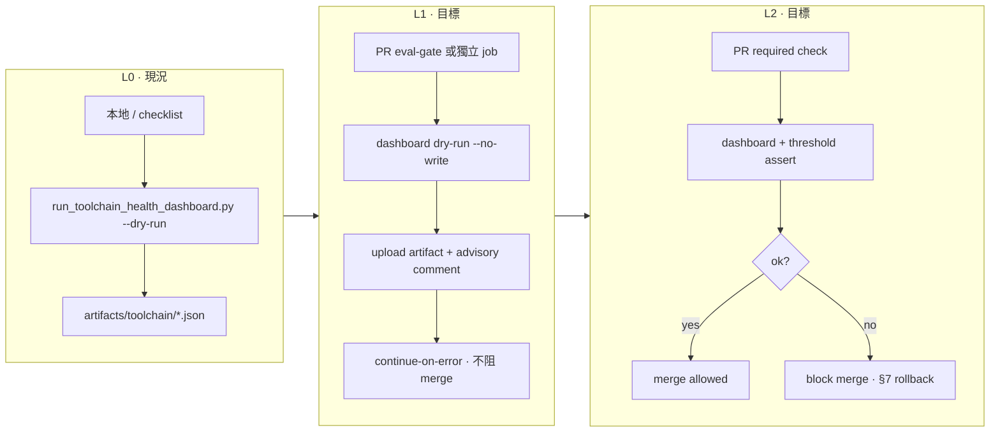

# Toolchain Observability Governance Upgrade v1 — Design Proposal

> **票號**：WC-PRE-06 · `toolchain-observability-governance-upgrade-v1`  
> **角色**：Governance / Design Agent（**doc-only**；**不**實作 CI）  
> **成文日期**：2026-06-11  
> **性質**：治理升級設計稿 + 尚書省／治理委員會批文草案  
> **上位 SSOT**：`docs/phase3-5-cost-model-governance-contract-v1.md` §2 gate 分類 · `docs/toolchain-health-dashboard-v1.md` · `routing/toolchain_smoke_matrix_v1.yaml`

---

## §0 定位與邊界

| 在範圍 | 不在範圍 |
|--------|----------|
| WB-T4 dashboard 從 **optional offline** 升格為 PR gate 的**分階段路徑設計** | 修改 `.github/workflows/*` |
| `OG-TOOLCHAIN-HEALTH` **提案行**（欄位、owner、資料源） | 修改 `docs/phase3-5-cost-model-governance-contract-v1.md` §2 正文表 |
| 可選 hooks 清單與 WC-PRE-02/04/05 產出對照 | 修改 `scripts/run_toolchain_health_dashboard.py` 行為 |
| L2 required gate 的 **rollback playbook 草案** | 把 `aggregated_health_score` 升格為 SLA 承諾 |
| `approval_status` 區段供批文填寫 | Prometheus / Grafana / 即時告警 |

**權威位階**

```text
尚書省批文 ＞ HARNESS_CONSTITUTION.md ＞ phase3-5 contract §2 ＞ 本設計稿 ＞ toolchain-health-dashboard-v1.md
```

本稿為 **proposal**；在 `approval_status` 未獲 `approved` 前，WB-T4 現況（`gate_class=optional` · `blocks_mainline=false`）**不變**。

---

## §1 目前狀態（As-Is · WB-T4）

### 1.1 交付摘要

| 項 | 現況 |
|----|------|
| **實作** | `scripts/run_toolchain_health_dashboard.py` · schema `toolchain_health_v1` |
| **文檔** | `docs/toolchain-health-dashboard-v1.md` |
| **驗證** | `tests/test_toolchain_health_dashboard_v1.py` · P6 附录 A optional smoke matrix |
| **票況** | WB-T4 **done** · Reviewer `accepted_with_gaps` |

### 1.2 Gate 分類（對齊 WA-T3）

| 欄位 | 值 | 說明 |
|------|-----|------|
| `gate_class` | `optional` | 與 P3.5 §2.3 optional 類一致 |
| `blocks_mainline` | `false` | 失敗**不**阻斷 Tabular MVP 主鏈 |
| PR required check | **否** | 未接入 `eval-gate-ci.yml` / `core-agent-smoke.yml` |
| SLA / 業務承諾 | **否** | `aggregated_health_score` 為啟發式 0–100，**非** SLA |
| 預設執行模式 | `--dry-run` | 只讀 outbox；`--no-dry-run` 可選呼叫 agent CI suite |

### 1.3 已聚合區塊（五核心 + 可選 wf）

| Section | 資料源 | 上游票 |
|---------|--------|--------|
| `agent_ci` | `outbox/agent_ci/*_ci_summary.json` | W10-T1 |
| `metrics_summary` | `outbox/agent_metrics/metrics_summary.json` | W10-T2 |
| `monthly_report_head` | `outbox/agent_metrics/monthly_report_*.md` | W11-T3 |
| `fixture_maturity_tiers` | metrics + CI `by_fixture_maturity` | W12-T2 |
| `catalog_health` | `tools/tabular_tool_catalog_v1.json` + `tools/non_tabular_tool_catalog_v1.json` | WB-T1 |
| `wf_status_summary`（可選） | `artifacts/wf/wf_status_summary.latest.json` | Wave B observability |

### 1.4 已知缺口（WB-T8 P2 deferred）

- P3.5 §2.3 表**尚無** `OG-TOOLCHAIN-HEALTH` 正式行（本稿 §4 提案，**不**直接改表）
- `catalog_tool_count` / `audit_gaps_count` / smoke matrix summary **尚未**接入 dashboard sections（§5 hooks 清單）
- `toolchain_smoke_matrix_v1.yaml` **無** mandatory CI runner（WB-T7 doc+test only）

### 1.5 WB-T8 明確禁止假設

> Toolchain dashboard **不得**假設為 PR required check 或 SLA 字段（`WB-T8` 不可假设表）。

---

## §2 目標狀態 — L0 → L1 → L2 分階段路徑

> **命名對照**：本稿 L0/L1/L2 指 **toolchain health gate 治理級別**；與 Monitoring Graph L0/L1/L2（`AGENTS.md`）**不同軸**，禁止混用。

### 2.1 級別定義

| 級別 | 定位 | PR 路徑 | `blocks_mainline` | 業務語義 |
|------|------|---------|-------------------|----------|
| **L0** | Observability-only · offline | **不**出現在 PR workflow | `false` | 本地／發布 checklist 可選；產出 artifact 供人讀 |
| **L1** | PR optional · advisory | PR job **執行** dashboard dry-run；`continue-on-error: true` 或等價 | `false` | 失敗**不**阻 merge；PR 註解／artifact 附 `toolchain_health_v1` 摘要 |
| **L2** | PR required · merge gate | PR job **必過**；branch protection required check | `false`¹ | 失敗阻 merge；仍**不**宣稱 SLA 分數 |

¹ L2 仍保持 `blocks_mainline=false`：toolchain health 失敗阻 PR，但**不**等同 MVP mainline regression 失敗語義（見 `TS-MVP-MAINLINE` · `blocks_mainline=true` · release_only）。

### 2.2 升格門檻（每級必須全部滿足 + 尚書省批文）

#### L0 → L1（PR optional advisory）

| # | 門檻 | 證據類型 |
|---|------|----------|
| G1 | WB-T4 unittest + smoke matrix `TS-TOOLCHAIN-DASHBOARD-*` 連續 **14 日** staging／本地全綠 | CI log 或 ops 週報 |
| G2 | `artifacts/toolchain/toolchain_health.latest.json` 在 **≥80%** 活躍開發週可產出且 `sections_populated ≥ 3` | artifact 抽樣 |
| G3 | §5 hooks 至少 **catalog_health + smoke_summary** 契約測試就緒（WC-PRE-02/05 產出） | contract unittest |
| G4 | 本稿 `approval_status.L1` = `approved` | 批文欄位 |
| G5 | 專票 `WC-IMPL-L1`（CI wiring only）已 FRAME 且 NonScope 不含改 dashboard 評分邏輯 | ticket state |

#### L1 → L2（PR required）

| # | 門檻 | 證據類型 |
|---|------|----------|
| G1 | L1 連續 **21 日**；PR optional step 失敗率 **< 5%**（排除 outbox 空檔已知 degraded） | GHA metrics |
| G2 | `outbox/agent_ci/` + `outbox/agent_metrics/metrics_summary.json` 在 main 分支 **7 日滾動**存在率 **≥ 95%** | nightly 或 scheduled 產出 |
| G3 | §5 hooks 全量（含 `audit_gaps_count`）接入且 investigation spec 投影穩定 | WB-T5 contract test |
| G4 | rollback playbook（§7）演練 **1 次**並留痕 Progress | 戰報 |
| G5 | 本稿 `approval_status.L2` = `approved` + 治理委員會簽核 | 批文欄位 |
| G6 | 專票 `WC-IMPL-L2`（branch protection + required check）已 FRAME | ticket state |

**禁止跳級**：不得從 L0 直接升至 L2。

### 2.3 各級預期行為（設計目標 · 非現況）



### 2.4 L2 pass 條件草案（供 `WC-IMPL-L2` 引用）

| 條件 | 類型 | 說明 |
|------|------|------|
| `ok == true` | hard | 頂層健康旗標 |
| `sections_populated >= 4` | hard | 五核心區塊至少四塊 `ok` 或 `degraded`（非 `missing`） |
| `sections.catalog_health.ok == true` | hard | catalog JSON 可讀且 revision 未 stale |
| `aggregated_health_score >= 60` | soft→hard² | 啟發式下限；**仍非** SLA |
| `gate_class == "optional"` → `"required"` | metadata | 僅 L2 schema 擴展；須 semver bump `toolchain_health_v1.1` 提案 |

² L2 是否採用 score 下限由治理委員會在批文時裁決；預設建議 **僅** `ok` + `sections_populated` hard assert。

---

## §3 與 Phase 3.5 / Phase 6 對齊

### 3.1 現有 P3.5 optional 鄰居

| gate_id | 關係 |
|---------|------|
| `OG-AGENT-LINES-CI` | 同源 outbox；dashboard **讀** CI summary，**不**取代 CI suite |
| `OG-AGENT-LINES-METRICS` | dashboard 讀 `metrics_summary.json` |
| `OG-ROUTING-EVAL-DRYRUN` | smoke matrix `TS-ROUTING-EVAL-*` 同軸 |

### 3.2 Phase 6 附录 A

- `routing/toolchain_smoke_matrix_v1.yaml` 已列 `TS-TOOLCHAIN-DASHBOARD-DRYRUN` / `TS-TOOLCHAIN-DASHBOARD-UNIT`
- 升格 L1/L2 時須**新增** matrix entry（例如 `TS-TOOLCHAIN-DASHBOARD-PR`）於 **實作票**，本稿僅提案

### 3.3 Wave C 分軌提醒

Observability（`obs.*` / `WAVE-B-P*`）與 Toolchain（`WB-T*`）**永久分軌**（`docs/WAVE_C_EXECUTION_PLAN.md` · `docs/WAVE_B_TOOLCHAIN_EXECUTION_PLAN.md` §0）。本稿僅治理 **toolchain health** 軸，不升格 `obs.wf.status_summary` 為 merge blocker。

---

## §4 OG-TOOLCHAIN-HEALTH 提案行

> **重要**：下列為 **提案**，供未來票寫入 P3.5 §2.3；**本票不修改** `docs/phase3-5-cost-model-governance-contract-v1.md` 正文表。

### 4.1 建議表行（P3.5 §2.3 Optional → L1 仍 optional class · L2 另議 class）

| 欄位 | 提案值 |
|------|--------|
| **gate_id** | `OG-TOOLCHAIN-HEALTH` |
| **class** | `optional`（L0/L1）→ 升格 L2 時改 `mandatory` **須另開 P3.5 修訂票** |
| **workflow_or_runner** | `python scripts/run_toolchain_health_dashboard.py --format json --dry-run`（L0/L1）; L2 加 threshold assert 由 `WC-IMPL-L2` 定義 |
| **blocks_mainline** | `false` |
| **authority_doc** | `docs/toolchain-health-dashboard-v1.md` · **本設計稿** · `04_Workflows/tickets/WB-T4-*_state.md` |

### 4.2 Owner 與 RACI

| 角色 | 責任 |
|------|------|
| **Owner（runtime）** | Toolchain Wave B 維護線（Implementer cabin · 戰車根 scripts） |
| **Governance owner** | 尚書省 / 治理委員會（L1/L2 批文與 rollback 裁決） |
| **Consumer** | Release checklist · PR CI（L1+）· Wave C C1 健檢服務（只讀引用） |
| **Reviewer** | 對照 P3.5 class · Phase 6 附录 · smoke matrix YAML |
| **Scribe** | Progress 末尾升格／回退留痕 |

### 4.3 依賴資料源

| 邏輯名 | 路徑模式 | 必填級別 | 上游 |
|--------|----------|----------|------|
| Agent CI summary | `outbox/agent_ci/*_ci_summary.json` | L2 hard | W10-T1 |
| Metrics summary | `outbox/agent_metrics/metrics_summary.json` | L2 hard | W10-T2 |
| Monthly report head | `outbox/agent_metrics/monthly_report_*.md` | L1 soft | W11-T3 |
| Tabular catalog | `tools/tabular_tool_catalog_v1.json` | L2 hard | WB-T1 / W3-TL-T1 |
| NT catalog | `tools/non_tabular_tool_catalog_v1.json` | L1 soft | W9-T3 / WB-T1 |
| WF status（可選） | `artifacts/wf/wf_status_summary.latest.json` | L0/L1 optional | Wave B obs |
| Toolchain artifact | `artifacts/toolchain/toolchain_health.latest.json` | L1+ output | WB-T4 |

### 4.4 與 WB-T4 deferred 的關係

WB-T4 C_REPORT 記載「P3.5 表增 `OG-TOOLCHAIN-HEALTH` 非本票 scope」。本稿 **承接** 該 deferred 項，以 proposal + 批文流程交付，**不**在 WC-PRE-06 直接 patch P3.5 表。

---

## §5 可選 Hooks 清單（WC-PRE-02 / 04 / 05 產出對照）

> WC-PRE 票為 Wave C 前置設計軸；下列對照依 **已交付 SSOT** 與票內 deferred 語意整理。若 WC-PRE-02/04/05 state 檔尚未入庫，以 WB-T1 / WB-T5 / WB-T7 產出為準。

### 5.1 Hooks 總表

| hook_id | 欄位 / 摘要 | 資料源 | WC-PRE 對照 | 上游票 | dashboard section 提案 |
|---------|-------------|--------|-------------|--------|------------------------|
| `HOOK-CATALOG-COUNT` | `catalog_tool_count` · `catalog_revision` · stale 旗標 | 雙 catalog JSON | **WC-PRE-02**（catalog contract 觀測欄位） | WB-T1 §4.1 | `catalog_health`（**已部分實作**） |
| `HOOK-SELECTOR-COUNT` | `selector_candidate_count` | selector 輸出 sidecar | WC-PRE-02 | WB-T1 §4.1 | `catalog_health` 擴展 |
| `HOOK-AUDIT-GAPS` | `audit_gaps_count` · `audit_sections_found` | audit quickview §2.4 投影 | **WC-PRE-04**（investigation view 計數） | WB-T5 §2.4 · §6 | 新區塊 `audit_health`（**未實作**） |
| `HOOK-AUDIT-TIMELINE` | `timeline_event_count` | 同上 | WC-PRE-04 | WB-T5 | `audit_health` 子欄位 |
| `HOOK-SMOKE-SUMMARY` | `smoke_entries_total` · `smoke_optional_count` · `last_matrix_revision` | `routing/toolchain_smoke_matrix_v1.yaml` | **WC-PRE-05**（smoke matrix 治理摘要） | WB-T7 | 新區塊 `smoke_matrix_health`（**未實作**） |
| `HOOK-SMOKE-TS-DASH` | `TS-TOOLCHAIN-DASHBOARD-DRYRUN` exit code | smoke runner 封裝 | WC-PRE-05 | WB-T7 | `smoke_matrix_health` |
| `HOOK-CI-SUMMARY` | `agent_ci.ok` · `by_fixture_maturity` | `outbox/agent_ci/` | — | W10-T1 | `agent_ci`（**已實作**） |
| `HOOK-METRICS-HEAD` | error rate · CP-A/B 計數 | `metrics_summary.json` | — | W10-T2 | `metrics_summary`（**已實作**） |
| `HOOK-FIXTURE-MATURITY` | tier 分佈 | metrics + CI | — | W12-T2 | `fixture_maturity_tiers`（**已實作**） |
| `HOOK-WF-STATUS` | wf 區塊 ok 旗標 | `artifacts/wf/` | — | Wave B | `wf_status_summary`（**可選已實作**） |

### 5.2 接入優先序（實作票建議）

| 優先 | hook | 理由 |
|------|------|------|
| P0 | `HOOK-CATALOG-COUNT` | 已在 `catalog_health`；L2 hard 依賴 |
| P0 | `HOOK-CI-SUMMARY` · `HOOK-METRICS-HEAD` | L2 資料源存在率門檻 |
| P1 | `HOOK-SMOKE-SUMMARY` | WC-PRE-05 · 與 Phase 6 附录對齊 |
| P1 | `HOOK-AUDIT-GAPS` | WC-PRE-04 · WB-T5 已預留計數 |
| P2 | `HOOK-SELECTOR-COUNT` · `HOOK-AUDIT-TIMELINE` | advisory only |

### 5.3 契約形狀（`audit_health` 提案 · skeleton）

```json
{
  "status": "ok | degraded | missing",
  "ok": true,
  "message": "human-readable",
  "audit_sections_found": 6,
  "audit_gaps_count": 0,
  "timeline_event_count": 12,
  "case_ref_sampled": "demo_phase",
  "source_spec": "docs/audit-quickview-and-case-history-spec-v1.md"
}
```

### 5.4 契約形狀（`smoke_matrix_health` 提案 · skeleton）

```json
{
  "status": "ok | degraded",
  "ok": true,
  "smoke_entries_total": 14,
  "smoke_optional_count": 14,
  "smoke_mandatory_count": 0,
  "matrix_revision": "2026-06-11",
  "dashboard_smoke_ids": ["TS-TOOLCHAIN-DASHBOARD-DRYRUN", "TS-TOOLCHAIN-DASHBOARD-UNIT"],
  "source_yaml": "routing/toolchain_smoke_matrix_v1.yaml"
}
```

---

## §6 觀測通道與非目標

### 6.1 觀測通道

| 通道 | L0 | L1 | L2 |
|------|----|----|-----|
| **artifacts** | `artifacts/toolchain/toolchain_health.latest.{json,md}` | 同上 + GHA artifact | 同上 + required check log |
| **logs** | CLI stdout JSON | PR step summary + `governance_advisory.log` artifact | merge blocker message |
| **metrics** | 讀取 `metrics_summary` | 可選上報 `sections_populated` | 可選 gate fail rate |
| **traces** | `case_ref` / `fixture_maturity` 合併 | 不強制 `trace_id` | 同 L1 |

### 6.2 明確非目標

- 不寫入 `gov-trace-v2`
- 不把 dashboard 結果驅動 selector / delivery gate / INT Tier-A
- 不取代 `MG-EVAL-*` / `MG-CORE-AGENT-SMOKE-PR` mandatory trio
- 不修改 `analyze_agent_lines_metrics.py` schema

---

## §7 Rollback Playbook 草案（L2 → L1 或 L2 → L0）

> **觸發條件**：誤報率升高 · outbox 長期空導致全 PR 紅 · 開發者投訴阻塞 · 尚書省下令緊急回退

### 7.1 決策權

| 動作 | 裁決 |
|------|------|
| L2 → L1（降為 optional PR step） | 工程 on-call **可先做**；24h 內尚書省備案 |
| L2 → L0（移除 PR step） | 須尚書省或治理委員會口頭／書面批文 |
| 恢復 L2 | 須重新滿足 §2.2 L1→L2 門檻 + 新批文 |

### 7.2 L2 → L1 回退步驟（建議順序）

| 步驟 | 動作 | 驗證 |
|------|------|------|
| 1 | GitHub branch protection **取消** toolchain health required check | Settings 截圖或 `gh api` 輸出 |
| 2 | Revert / disable `WC-IMPL-L2` 新增的 workflow step（`continue-on-error: true` 或移除 step） | PR 試跑綠 |
| 3 | 更新 `approval_status.L2` = `rolled_back`；`L1` = `approved`（若保留 advisory） | 本檔 §8 |
| 4 | Progress **末尾** append：原因 · 影響 · 是否一次性 | `04_Workflows/00_Agent_Work_Progress.md` |
| 5 | 本地確認：`python scripts/run_toolchain_health_dashboard.py --format json --dry-run` 仍可用 | `ok` + schema 不變 |

### 7.3 L2 → L0 回退步驟（額外）

| 步驟 | 動作 |
|------|------|
| 6 | 移除 PR 內所有 toolchain dashboard step（含 L1 advisory） |
| 7 | `approval_status.L1` = `rolled_back`；維持 L0 僅 offline |
| 8 | 通知 Wave C 消費方：toolchain health **非** PR 訊號 |

### 7.4 回退後禁止事項

- **禁止** 在回退未留痕前宣稱「gate 仍為 required」
- **禁止** 用 rollback 期間的 degraded outbox 判定為產品品質 regression（應標 `infra_gap`）
- **禁止** 順手將 rollback 改為永久關閉而不開 governance 回顧票

### 7.5 恢復 L2 檢查清單

- [ ] §2.2 G1–G6 重新滿足
- [ ] rollback 根因已修（outbox 產出恢復 · 閾值調整 · 假陽性修復）
- [ ] §7.2 演練記錄已審閱
- [ ] 新 `approval_status.L2` = `approved` 批文日期

---

## §8 approval_status（尚書省／治理委員會填寫）

> **本節為批文欄位**；WC-PRE-06 交付時預設均為 `pending`。

| 欄位 | 值 | 填寫人 | 日期 | 備註 |
|------|-----|--------|------|------|
| **proposal_review** | `pending` | | | 本設計稿整體審閱 |
| **L0_baseline_ack** | `pending` | | | 確認 WB-T4 optional 現況為合意基線 |
| **L1_pr_optional** | `pending` | | | 批准後方可開 `WC-IMPL-L1` |
| **L2_pr_required** | `pending` | | | 批准後方可開 `WC-IMPL-L2` |
| **OG-TOOLCHAIN-HEALTH_row** | `pending` | | | 批准後由獨立票寫入 P3.5 §2.3 |
| **score_threshold_L2** | `pending` | | | 是否採用 `aggregated_health_score` hard assert |
| **rollback_drill_required** | `yes` | | | L2 批文前須完成 §7 演練 |
| **effective_date** | — | | | 最早生效日（不得早於實作票 merge） |
| **expiry_review_date** | — | | | 建議每 **90 日**複審 L1/L2 |

**建議批文附錄（空白模板）**

```text
尚書省／治理委員會裁決：
- 核准級別：[ L0 only / L0→L1 / L0→L1→L2 ]
- OG-TOOLCHAIN-HEALTH 寫入 P3.5：[ 是 / 否 / 延後 ]
- L2 score 下限：[ 不採用 / ≥60 / 其他___ ]
- 條件：[ 無 / 見備註 ]
簽核：__________ 日期：__________
```

---

## §9 下游實作票建議（本稿不開工）

| 票號（建議） | 依賴 | 交付 |
|-------------|------|------|
| `WC-IMPL-L1` | `approval_status.L1=approved` | PR optional step + artifact upload |
| `WC-IMPL-L2` | `approval_status.L2=approved` + §7 演練 | required check + threshold assert |
| `WC-IMPL-HOOKS` | WC-PRE-02/04/05 就緒 | dashboard 新 sections（不改評分哲學） |
| `WA-T3-AMEND-OG-TOOLCHAIN` | `OG-TOOLCHAIN-HEALTH_row=approved` | P3.5 §2.3 正式增行 |
| `WB-T7-RUNTIME-SMOKE` | WC-PRE-05 | YAML consumer runner（非 mandatory） |

---

## §10 驗證（本稿 doc-only）

```bash
# 設計稿存在性與交叉引用（人工）
# 1. 本檔存在
# 2. toolchain-health-dashboard-v1.md 腳註指向本檔
# 3. WAVE_PROGRESS_DASHBOARD.md 含 WC-PRE-06 索引行

# 現況基線（不變）
python -m unittest tests.test_toolchain_health_dashboard_v1 -v
python scripts/run_toolchain_health_dashboard.py --format json --dry-run --no-write
python -m unittest tests.test_phase3_5_governance_contract_v1 -v
```

---

## §11 交叉引用

| 文檔 | 關係 |
|------|------|
| `docs/toolchain-health-dashboard-v1.md` | WB-T4 實作 SSOT · 本稿為升格 proposal |
| `docs/phase3-5-cost-model-governance-contract-v1.md` | Gate 分類母本 · §4 提案行目標歸宿 |
| `docs/phase6-int-regression-gate-contract-v1.md` | 附录 A smoke matrix |
| `routing/toolchain_smoke_matrix_v1.yaml` | WC-PRE-05 / WB-T7 產出 |
| `docs/audit-quickview-and-case-history-spec-v1.md` | WC-PRE-04 / WB-T5 hooks |
| `docs/tool-catalog-and-selector-contract-v1.md` | WC-PRE-02 / WB-T1 hooks |
| `docs/WAVE_B_TOOLCHAIN_EXECUTION_PLAN.md` | Toolchain Wave B 執行計劃 |
| `docs/WAVE_PROGRESS_DASHBOARD.md` | Phase% SSOT · WC-PRE-06 索引 |
| `docs/WAVE_C_EXECUTION_PLAN.md` | Wave C 分軌入口 |
| `04_Workflows/tickets/WB-T4-*_state.md` | 現況驗收 |
| `04_Workflows/tickets/WB-T5-*_state.md` | audit hooks deferred |
| `04_Workflows/tickets/WB-T8-*_state.md` | closure · 不可假設清單 |

---

## §12 Wave Master · P10 治理邊界（W5-WC-PRE-06 · 2026-06-26）

> **Wave 5 doc-only 增量** · 對齊 `04_Workflows/tickets/W-MASTER-wave-plan_state.md` §Wave 5 · **不改 Phase%** · **不改 CI**

### 12.1 與 P10（48%）關係

| 維度 | 本稿（WC-PRE-06） | P10 runtime（Wave 5 **不做**） |
|------|-------------------|--------------------------------|
| 交付物 | toolchain health L0→L1→L2 **治理設計** + 批文模板 | S15 notify · intake API · prod 閉環 |
| Phase% | **不**因本稿上調 Dashboard | 48% 基線不變 |
| CI | 提案 `OG-TOOLCHAIN-HEALTH` 升格路徑 | 無 workflow 施工 |

### 12.2 可升格為 gate 的 CI 檢查（提案 · 須批文）

| check / gate_id | 現況 class | 可升格路徑 | 升格條件 SSOT |
|-----------------|------------|------------|---------------|
| `OG-TOOLCHAIN-HEALTH`（dashboard dry-run） | optional · offline L0 | L1 advisory → L2 required | §2.2 G1–G6 · `wc_pre_06_governance_policy_v1.json` |
| `MG-EVAL-*` / `MG-CORE-AGENT-SMOKE-PR` | mandatory trio | **不可** 由本稿升格或替換 | P3.5 §2.1 |
| INT Tier-A（Wave 7） | optional · local | **不在** WC-PRE-06 scope | CH-50 另票 |

### 12.3 Non-Claims（Wave 5 明示）

- 本稿 **`design_ready`** ≠ **`approval_status=approved`** ≠ governance **已啟用**
- L1/L2 升格 **不等於** prod selector 已啟用 · Monitoring Graph L1/L2 已啟用
- `aggregated_health_score` **非** SLA · **非** P10 自動化完成度指標

### 12.4 Trace 欄位（future observability）

| 欄位 | 用途 |
|------|------|
| `wc_pre_approval_id` | 尚書省批文唯一鍵（見 `WC_PRE_06_approval_template.md`） |
| `approval_status.L1` / `L2` | 升格授權狀態 |
| `design_ready` | W5 施工 doc bundle 完成（Reviewer 判定 · **非** human 批准） |
| Dashboard Lane B | `WAVE_PROGRESS_DASHBOARD.md` WC-PRE-06 行 |

### 12.5 Wave 5 交付 cross-ref

| 產物 | 路徑 |
|------|------|
| 批文模板 | `docs/governance/WC_PRE_06_approval_template.md` |
| Policy JSON（minimal） | `docs/governance/wc_pre_06_governance_policy_v1.json` |
| 施工票 state | `04_Workflows/tickets/W5-WC-PRE-06-governance-spec-v1_state.md` |

---

*TOOLCHAIN-OBSERVABILITY-GOVERNANCE-UPGRADE-v1 · WC-PRE-06 · design-only · 2026-06-26*
