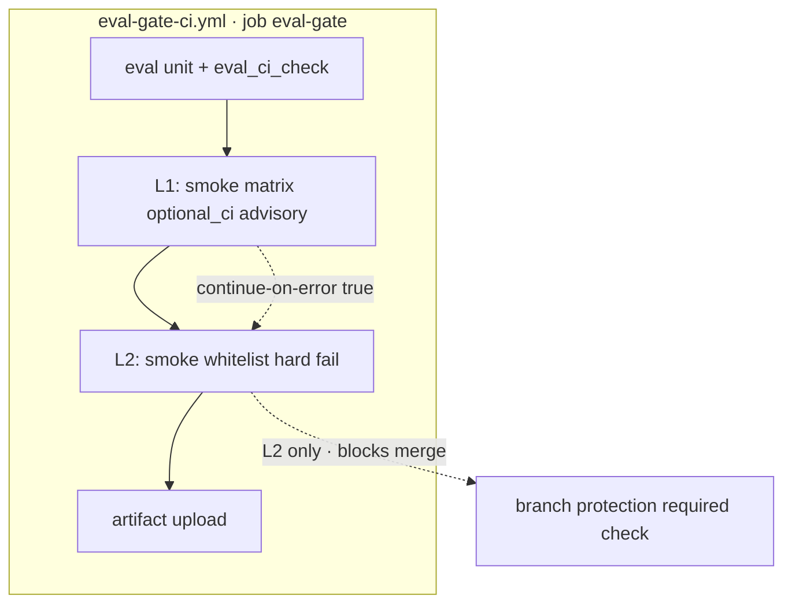

# Toolchain Smoke Mandatory CI Runner v1 — Design Spec

> **票號**：WC-PRE-07 · W5-WC-PRE-07-approval-workflow-v1  
> **角色**：Governance / Design（**doc-only**；**不**改 `.github/workflows/*`）  
> **成文日期**：2026-06-26  
> **Rollout SSOT**：`docs/governance/WC_PRE_06_07_rollout_plan.md` §7 D3/D5  
> **矩陣 SSOT**：`routing/toolchain_smoke_matrix_v1.yaml` · `scripts/run_toolchain_smoke_matrix.py`

---

## §0 定位與邊界

| 在範圍 | 不在範圍 |
|--------|----------|
| Smoke matrix PR CI 行為設計（L1 advisory → L2 selective mandatory） | 修改 `.github/workflows/*` 或 branch protection |
| Tier 對齊（`optional_ci` · 白名單 mandatory 子集） | INT Tier-A 進 PR CI（CH-50 另票） |
| 與 `eval-gate-ci.yml` 掛載點設計（**design only**） | P10 S15 notify · intake API · prod 自動化閉環 |
| `approval_status` / `wc_pre_approval_id` 批文欄位 | 宣稱 PR required 已開啟 |

**三分表提醒（P6 contract AC-6）**

```text
eval-gate + core-agent-smoke 綠  ≠  INT Tier-A 綠  ≠  toolchain smoke 綠
```

**non-claims**

- Mandatory smoke CI **不** 闭合 P10（48%）prod gap
- **不** 等於 prod selector 已啟用
- **不** 等於 WC-PRE-06 L2 health gate 已批准（分軌批文）

---

## §1 As-Is（現況）

| 項 | 現況 |
|----|------|
| Runner | `scripts/run_toolchain_smoke_matrix.py`（WC-PRE-05 · local only） |
| YAML | 14 entries · 全部 `gate_class: optional` |
| CI | **無** workflow step 消費 runner |
| Tier | `local_recommended`（10）· `optional_ci`（2）· `release_only`（1） |
| 與 eval-gate 重疊 | `TS-ROUTING-EVAL-*` 已在 PR job 內執行（P3.5 仍 optional class） |

---

## §2 To-Be — L1 Advisory vs L2 Selective Mandatory

### 2.1 級別定義

| 級別 | PR 行為 | `blocks_merge` | `gate_class`（矩陣語義） |
|------|---------|----------------|--------------------------|
| **L0** | 無 CI step | false | optional · local only |
| **L1** | 跑 `--tier optional_ci`（advisory）· `continue-on-error: true` | false | optional |
| **L2** | 跑 **白名單** smoke_id · hard fail | true（須 branch protection + 批文） | optional 或升格 mandatory（CH-43 另票） |

### 2.2 L1 設計（advisory · rollout D1/D4）

| 項 | 設計值 |
|----|--------|
| 掛載 workflow | `.github/workflows/eval-gate-ci.yml` → job `eval-gate` |
| 命令（草案） | `python scripts/run_toolchain_smoke_matrix.py --tier optional_ci --format json` |
| 行為 | `continue-on-error: true` · 上傳 `smoke_ci_summary.json` 類 artifact |
| 含 routing eval？ | **是**（advisory 全 tier）；與既有 eval-gate step **可能重複** — L1 接受 |
| 實作票 | `WC-IMPL-SMOKE-CI-L1`（CH-32～34） |

### 2.3 L2 設計（selective mandatory · rollout D3）

| 項 | 設計值 |
|----|--------|
| 白名單 smoke_id | `TS-TOOLCHAIN-DASHBOARD-UNIT` · `TS-W3TL-UNIT` |
| **不含** | `TS-ROUTING-EVAL-*`（已在 eval-gate · 避免重複/超時） |
| **不含** | `TS-MVP-MAINLINE`（release_only）· `TS-AGENT-LINES-CI` 全长 |
| 掛載 workflow | 同上 `eval-gate-ci.yml` |
| hard fail 條件 | 白名單 entries `last_result != passed`（由 runner 匯總） |
| 實作票 | `WC-IMPL-SMOKE-CI-L2`（CH-42～43） |

### 2.4 Tier 對照表

| tier | L0 | L1 CI | L2 CI |
|------|----|----|-------|
| `local_recommended` | 本地 | 不跑（超時風險） | 不跑 |
| `optional_ci` | 本地可選 | **全 tier advisory** | 僅白名單子集 hard |
| `release_only` | release checklist | **不進 PR** | **不進 PR** |

---

## §3 Workflow 掛載設計（design only · 無 yml diff）



**順序（rollout D4）**：eval checks 之後 · artifact upload 之前 · 與 `generate_toolchain_governance_snapshot.py` L0 trailer 可並列。

---

## §4 升格門檻 + Human Signoff

### L0 → L1

| # | 門檻 | 證據 |
|---|------|------|
| S1 | WC-PRE-05 runner unittest 全綠 | `test_run_toolchain_smoke_matrix_v1` |
| S2 | `optional_ci` entries 本地 dry-run 可重跑 | CLI JSON |
| S3 | WC-PRE-06 L1 或等價 governance 敘事已 `design_ready` | ticket state |
| S4 | `approval_status.L1` = `approved` + `wc_pre_approval_id` | 批文模板 |
| S5 | `WC-IMPL-SMOKE-CI-L1` FRAME 凍結 | ticket state |

### L1 → L2

| # | 門檻 | 證據 |
|---|------|------|
| S1 | L1 advisory 連續 **21 日** · flake 率 **< 5%** | GHA metrics |
| S2 | 白名單 smokes 本地 execute 穩定 | ops 週報 |
| S3 | rollback 演練 1 次（smoke step → advisory） | Progress |
| S4 | `approval_status.L2` = `approved` + 治理委員會 | 批文模板 |
| S5 | `WC-IMPL-SMOKE-CI-L2` FRAME 凍結 | ticket state |

---

## §5 Rollback

| 場景 | 步驟 SSOT |
|------|-----------|
| L2 mandatory → L1 advisory | rollout plan §4.3 · smoke step 改 `continue-on-error: true` |
| L1 → L0 | revert workflow step · `approval_status.L1=rolled_back` |
| 恢復 L2 | 重新滿足 §4 + 新 `wc_pre_approval_id` |

---

## §6 approval_status（human-only · 預設 pending）

| 欄位 | 值 |
|------|-----|
| proposal_review | **pending** |
| L1_optional_ci_advisory | **pending** |
| L2_mandatory_whitelist | **pending** |
| mandatory_ci_scope | `TS-TOOLCHAIN-DASHBOARD-UNIT,TS-W3TL-UNIT`（設計預設 · 非批准） |
| wc_pre_approval_id | — |

詳見 `docs/governance/WC_PRE_07_approval_template.md`。

---

## §7 下游實作票（本稿不開工）

| 票號 | 依賴 | 交付 |
|------|------|------|
| `WC-IMPL-SMOKE-CI-L1` | `approval_status.L1=approved` | CH-32～34 workflow step advisory |
| `WC-IMPL-SMOKE-CI-L2` | L1 21 日 + `approval_status.L2=approved` | CH-42～43 whitelist hard fail |

---

## §8 交叉引用

| 文檔 | 關係 |
|------|------|
| `docs/toolchain-observability-governance-upgrade-v1.md` | WC-PRE-06 health gate 分軌 |
| `docs/governance/WC_PRE_06_07_rollout_plan.md` | D3/D5 決策 |
| `docs/governance/wc_pre_07_approval_workflow_policy_v1.json` | 機器可讀批文/policy 骨架 |
| `04_Workflows/tickets/W5-WC-PRE-07-approval-workflow-v1_state.md` | Wave 5 施工票 state |

---

*TOOLCHAIN-SMOKE-MANDATORY-CI-RUNNER-v1 · WC-PRE-07 · design_only · pending_approval · 2026-06-26*
