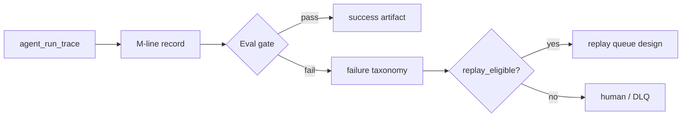
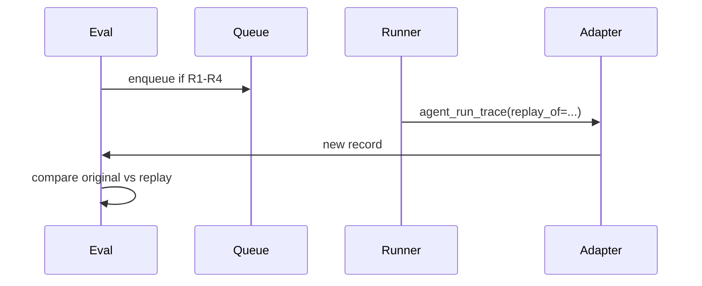

# Eval pipeline (D4 runtime)

> **Scope**: 成功判定、失敗分類、replay 設計（v0 設計稿）  
> **Inputs**: M-line task record（`metrics/metrics_schema.json`）+ `observability/logging_adapter` traces  
> **Outputs**: eval verdict `dict`（`ok`, `verdict`, `failure_class`, `replay_eligible`, `message`）

---

## 1. 管線概覽



1. **Capture** — 每次 agent run 必須有 trace（`start_trace` / `agent_run_trace`）。
2. **Normalize** — 以 ended task `record` 為單一真相來源。
3. **Evaluate** — 套用下方 success 規則與 failure 分類。
4. **Replay**（未實作）— 僅設計；見 §4。

---

## 2. Success 判定規則

### 2.1 硬條件（全部滿足才 `verdict=success`）

| # | 規則 | 欄位 / 檢查 |
|---|------|-------------|
| S1 | 業務成功 | `success == true` |
| S2 | 任務已結束 | `end_time` 非 null |
| S3 | 至少有一步 | `step_count >= 1` |
| S4 | Trace 完整度門檻 | `trace_completeness.score >= 0.875`（7/8 必填欄；見 M-line `TRACE_COMPLETENESS_REQUIRED`） |
| S5 | 無未分類致命錯 | `error_type is null` |
| S6 | Agent run 日誌齊全 | 結構化 log 含 `trace_start` + `trace_end` + `agent_run_end`（由 adapter 保證） |

### 2.2 軟條件（警告，不單獨判 fail）

| # | 規則 | 處理 |
|---|------|------|
| W1 | `memory_hit_rate == 0` 且 workflow 宣告使用 memory | `verdict=success_with_warnings` |
| W2 | `retry_count > 0` 但最終成功 | metadata `had_retries=true` |
| W3 | `handoff_count > 3` | 協調風險警告（D3） |

### 2.3 判定函數（契約形狀）

```python
def evaluate_task_record(record: dict) -> dict:
    """
    Returns:
        ok: bool          # 評估器本身是否執行成功
        verdict: str      # success | success_with_warnings | failure
        failure_class: str | None
        checks: list      # {id, passed, detail}
        message: str
    """
```

**`verdict` 優先序**: `failure` > `success_with_warnings` > `success`

---

## 3. Failure 分類

與 M-line `error_type` enum 對齊（`metrics_schema.json` → `error_type_enum`）。

| failure_class | 來源 | 典型原因 | 預設可 replay |
|---------------|------|----------|---------------|
| `llm_error` | provider / model | rate limit, invalid response | 是（退避重試） |
| `tool_error` | tool / executor | Qdrant, HTTP 4xx/5xx | 是（有限次） |
| `context_overflow` | context 策略 | token 超限 | 否（需縮 context） |
| `timeout` | wall clock / step | 單步或全任務超時 | 是（1–2 次） |
| `unknown` | 未捕獲異常 | bug、裸 Exception | 否（先修復） |
| `trace_incomplete` | D4 | `trace_completeness.score` 低於門檻 | 否（修觀測） |
| `no_steps` | S3 | 未呼叫 span/step | 否（修編排） |
| `agent_log_missing` | S6 | 未走 `agent_run_trace` | 否（修入口） |

### 3.1 分類演算法（v0）

```
if not record.end_time:
    failure_class = "trace_incomplete"
elif record.step_count < 1:
    failure_class = "no_steps"
elif record.trace_completeness.score < THRESHOLD:
    failure_class = "trace_incomplete"
elif not record.success:
    failure_class = record.error_type or "unknown"
else:
    verdict = success (+ warnings if W*)
```

### 3.2 與 eval / monitoring 的關係

- **Langfuse scores**（未來）: `success` → 1.0，否則 0.0；`failure_class` 作 tag。
- **PG alerts**: `failure_class in (tool_error, timeout)` 且 `retry_count >= max` → 告警。
- **DLQ**: `unknown`, `trace_incomplete` 預設不進自動 replay。

---

## 4. Replay（設計稿 v0）

> **Status**: 僅設計；無持久化佇列實作。

### 4.1 目標

- 對 **可重試** 失敗，用相同 `task_id` 或新 `task_id` + `replay_of` 連結重跑。
- 保留原 trace 供 diff（步驟數、token、錯誤類型）。

### 4.2 Replay 資格

| 條件 | 說明 |
|------|------|
| R1 | `failure_class in {llm_error, tool_error, timeout}` |
| R2 | `retry_count < max_retries`（建議 max=3） |
| R3 | 非 `context_overflow` / `trace_incomplete` |
| R4 | 原 `record` 已持久化（JSONL 或 PG） |

### 4.3 Replay 記錄（建議欄位）

```json
{
  "replay_id": "uuid",
  "original_task_id": "string",
  "new_task_id": "string",
  "failure_class": "tool_error",
  "attempt": 2,
  "trigger": "manual | auto_eval | alert",
  "status": "queued | running | success | failed"
}
```

### 4.4 流程（設計）



### 4.5 Diff 指標（replay 驗收）

| 指標 | 期望 |
|------|------|
| `success` | replay 為 true |
| `step_count` | 與原 run 相近（±1 可接受） |
| `context_token_usage.total_tokens` | 不超原 run 120%（成本護欄） |
| `error_type` | null |

### 4.6 實作里程碑（建議）

1. **M1**: `evaluate_task_record()` 純函數 + unit tests（讀 `record` dict）。
2. **M2**: ended tasks 寫 JSONL exporter（從 `MetricsCollector.list_tasks()`）。
3. **M3**: replay 佇列 stub（檔案鎖 + 單 worker）。
4. **M4**: 與 `gov_core_system` DLQ / auto_recovery 對齊票號。

---

## 5. Agent run 日誌契約

每次 agent run **必須**:

1. `agent_run_trace(agent_name)` 或等價 `start_trace` … `end_trace`。
2. 至少一個 span：`start_span`/`end_span` 或 `log_event(..., as_step=True)`。
3. 結束時 M-line `record` 可供 `evaluate_task_record()` 消費。

違反 S6 → `failure_class=agent_log_missing`（eval 失敗，即使業務 `success=true`）。

---

## 6. eval_gate（v0.1 · rule-based review）

> **實作**: `observability/eval_gate.py`  
> **規則文檔**: `observability/eval_gate_rules.md`  
> **狀態**: 本地純函數；不接 Langfuse SDK

### 6.1 用途

在完整 eval verdict（§2 `verdict` / `failure_class`）之外，提供輕量 **「是否需要人工複查」** 篩選，放大 D1–D4 欄位價值：

- 輸入：單筆 `metrics_record` 或 `ibridge_record`（與 M 線 / I-bridge 欄位對齊）
- 輸出：`{ pass, tags, reasons }`
  - `pass=True`：無 review tag，可批量放行
  - `pass=False`：至少一個 tag，建議進人工抽檢或 dashboard 高亮

### 6.2 線下 / 本地腳本

```python
from observability.eval_gate import evaluate_task_record

record = {
    "success": True,
    "retry_count": 0,
    "handoff_count": 0,
    "error_type": None,
    "context_token_usage": {"total_tokens": 1200},
    "trace_completeness": {"score": 0.95},
}
verdict = evaluate_task_record(record)
# verdict["pass"], verdict["tags"], verdict["reasons"]
```

批量掃描（例如從 `/api/ask` 回應 JSONL 或 exporter 輸出）：

```python
needs_review = [
    r for r in records
    if not evaluate_task_record(r)["pass"]
]
```

### 6.3 線上 / CI（export v1.0）

| 場景 | 模組 / 命令 |
|------|-------------|
| **JSONL 導出** | `python -m observability.eval_exporter <path> -o eval_results.jsonl` |
| **CI signal** | `python -m observability.eval_ci_check <path> --limit 50 --max-needs-review-ratio 0.4` |
| **Schema** | `observability/eval_export_schema.md` |
| **Cron** | 從 JSONL / PG ended tasks 讀 `record`，寫 `tags` 至抽檢佇列 |
| **Dashboard** | 按 `tags` 聚合（`high_retry`, `context_heavy`, …） |

與 §2 硬成功規則的關係：eval_gate 為 **複查建議**，不取代 `verdict=success`；兩者可並行（先 gate 篩樣本，再對 `pass=False` 跑完整 evaluate）。

### 6.4 規則索引

見 `eval_gate_rules.md`（HIGH_RETRY、CONTEXT_HEAVY、MANY_HANDOFFS、INFRA_RISK、OBSERVABILITY_GAP）。

### 6.5 Answer-side metrics in eval / CI（Wave 3 · Chat A/C）

> **Scope**: 文档对齐；本 Chat 不改 CI YAML。

Wave 3 后，ask 主线的 **answer 步** 与 retrieve 步对称纳入 `MetricsCollector` / `ibridge_record`。  
**H-historical-migrate（2026-05-25）**：預設 ask 亦經 `build_rooted_context`；selector 決策與 answer metrics 均在 H-line payload 語境下可審計（opt-in 路徑另含完整 `ibridge_record`）。

| Signal | Source | eval / CI 消费 |
|--------|--------|----------------|
| `external_call_count` | `skill_answer_for_ask` 每次 LLM 尝试 | `eval_gate` INFRA_RISK / HIGH_RETRY 上下文；export JSONL `external_call_count` |
| `retry_count` / `error_type` | answer skill top-level + M-line record | HIGH_RETRY tag；完整 eval §2 S5 |
| `call_site` | `langgraph_flow.answer_node`、direct_fallback，或 `tool_executor.ask_pipeline.llm.ask` | export metadata；按 call_site 分组 stats |
| `selector_decision` | `ibridge_v0.selector_decision` | S2/S3 场景 audit；`retrieve_fallback` 与 answer tags 关联 |

**Tool executor 路径**（`J-tool-executor-llm-ask-skill`）：`execute_selected_tools` 选中 `llm.ask` 时，M-line `external_call_count` / `retry_count` 与 LangGraph answer 步同源（`skill_answer_for_ask`）；eval export 可按 `call_site=tool_executor.ask_pipeline.llm.ask` 筛 tool-layer 样本，与 `langgraph_flow.answer_node` 分列统计。

**验证**：`tests/test_skills_ask_wire.py`（answer 单元）；`tests/test_ask_selector_and_answer.py`（S1–S3 流程 + metrics 断言）；`gov_core_system/tests/test_tool_executor_skills_bridge.py`（executor `llm.ask` metrics）。  
**CI 下一步**：`P+-eval-ci-wire` 将含 answer 步的 export 纳入 `eval_ci_check` 批次（阈值见 `observability/eval_stats_report.md`）。

---

## 7. 參考

- `metrics/metric_definition.md` — 欄位與 D1–D5
- `observability/langfuse_mapping.md` — Langfuse 投影
- `observability/logging_adapter.py` — runtime API
- `observability/eval_gate.py` — review gate（§6）
