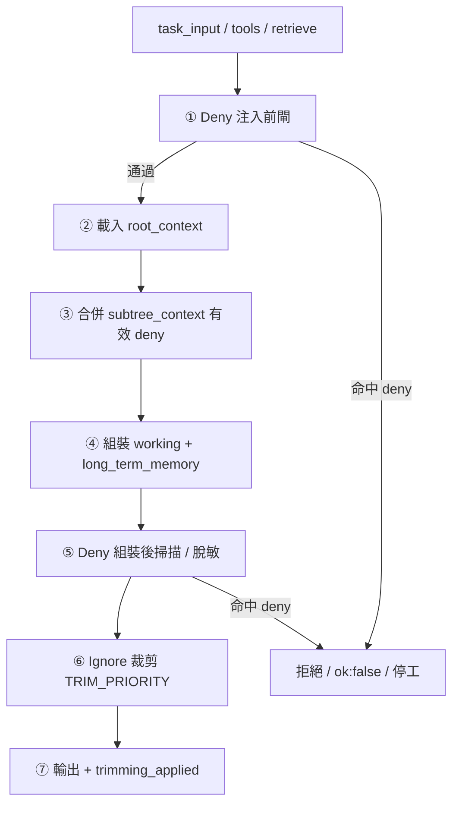

# A3 — Ignore / Deny 規則（Sprint 0 · Context Entry）

| 項目 | 值 |
|------|-----|
| **票號** | A-3 |
| **版本** | v0.1-draft |
| **狀態** | 規格 v0.1（治理層）；deny engine v1 已實作（Sprint 3 R-3a–c，見 §7） |
| **上游** | A-0 overview；A-1 `hard_rules`／§4；A-2 §4.2 繼承；憲法 §7 禁區**類型** |
| **下游** | A-5 runbook（組裝順序、驗收、deny 掃描步驟） |
| **非目標** | navigation map（A-4）、subtree 掛載細則（A-2）、程式實作、實例磁碟路徑 |

---

## 1. 文件目的

本規格定義 Context Entry 治理層的 **ignore**（可丟棄／可裁剪）與 **deny**（不得進入上下文）兩套規則，供 A-5 runbook 操作化與多 agent 對賬。

具體要達成：

1. **語義分離**：避免把「token 不夠先裁掉」與「憲法級禁止寫入」混為一談。  
2. **層級清晰**：規定 deny／ignore 在 root、subtree、working、long_term_memory 的套用邊界。  
3. **與 H 線對賬**：標註執行期 **ignore**（`TRIM_PRIORITY`）與 **deny engine v1**（`context/deny_rules.py` + `GateRunner`）之實際邊界；未覆蓋類型仍標 TODO，不誤宣稱全表已實作。  
4. **可引用**：A-5 可直接複製 §8 待操作化段落與 §9 範例。

本檔可獨立閱讀；衝突時：尚書省 ＞ 憲法 ＞ `context_entry_contract.md` ＞ A-1 ＞ **本檔**。

---

## 2. 核心定義

### 2.1 Ignore（可忽略／可裁剪）

| 維度 | 說明 |
|------|------|
| **語義** | 內容**原則上可進上下文**，但在 token 預算不足或組裝策略要求時，可**丟棄、截斷或壓縮**，不視為違規。 |
| **觸發** | 超 `MAX_TOTAL_TOKEN_BUDGET`、子樹 `max_digest_tokens` 建議、單欄位過長附件等。 |
| **後果** | 模型可能缺部分歷史或次要摘要；**允許**在 `trimming_applied`／戰報中留痕。 |
| **治理歸屬** | 本檔 **ignore 類別表** + A-5 裁剪順序；執行期 v0.1 由 `context_builder` 的 `TRIM_PRIORITY` **部分體現**（見 §7）。 |

**一句話**：ignore = **丟了仍能合法開工**，頂多影響回答完整度。

### 2.2 Deny（拒絕／禁止寫入）

| 維度 | 說明 |
|------|------|
| **語義** | 內容或行為**不得出現**於任一上下文層（含 `assembled_text`），無論 token 是否充裕。 |
| **觸發** | 命中憲法 §7 禁區**類型**、A-1 `forbidden_content_types`／`forbidden_action_types`、記憶路由禁止寫入類型等。 |
| **後果** | **不得**以裁剪代替；應拒絕注入、脫敏占位、或 `ok: false` + `message`（A-5 定具體）；觸及硬禁區行為 → 停工（憲法 §7.2）。 |
| **治理歸屬** | 本檔 **deny 類別表** + root `hard_rules`；執行期 **deny engine v1**（`GateRunner` + 規則表，見 §7）已覆蓋最小集；A-3 全表仍為治理目標。 |

**一句話**：deny = **進了就不合法**，與 token 預算無關。

### 2.3 對照表

| 問題 | Ignore | Deny |
|------|--------|------|
| 金鑰原文能進 prompt 嗎？ | 否（屬 deny） | **絕對禁止** |
| 舊對話輪次能刪嗎？ | **可以**（優先裁） | 否（非 deny，除非含 deny 類內容） |
| 語義檢索 0 hit | 常見 | 非 deny |
| 子樹 runbook 全文 | 應先壓縮（ignore） | 若含禁區類型則 deny |
| 實例磁碟路徑 | 建議不寫入（deny 類型） | **禁止**寫入可移植層 |

---

## 3. 套用層級

### 3.1 總則

| 層 | Deny | Ignore |
|----|------|--------|
| **root_context** | 宣告全局 `forbidden_*` **類型**；禁止實例路徑／金鑰類進入任何層 | 僅壓縮「說明性」digest；**不得**低於 root 最小禁則保留（對齊 A-1 §6、P0） |
| **subtree_context** | **繼承** root deny；可 **追加** 更嚴 `scope_constraints`（A-2 §4.2） | 壓縮 `runbook_digest`／`handoff_digest`；多棵子樹時按 `subtree_priority` 裁 |
| **working_context** | **注入前**攔截 deny 類內容（tool 輸出、附件、手拼欄位） | **組裝後**按優先級裁：scratch → 舊對話 → tool 原文 → … |
| **long_term_memory** | **寫入路由**拒絕（向量／PG 禁止類型）；**讀出**進 prompt 前再掃 deny | 按 score／列重要性裁 hits／rows（P3–P4） |

**硬規則**：deny 規則**向下繼承、只嚴不寬**；ignore **不得**用來「裁掉」仍須保留的 deny 類條目（root 禁則摘要）。

### 3.2 與 A-1 / A-2 的分工

| 來源 | 內容 | 本檔角色 |
|------|------|----------|
| A-1 §3.2 `hard_rules` | `forbidden_content_types`、`forbidden_action_types` | deny 的 **root 權威宣告點** |
| A-1 §4 | root 不應包含的內容 | 多數為 **deny**；少數超大 digest 用 **ignore** 壓縮 |
| A-2 §4.2 | 子樹繼承 + `scope_constraints` | 子樹 **追加 deny**；不得放寬 root |
| A-2 §5 | subtree 禁止欄位 | 與 A-1 §4 相同 **deny 類型** |

### 3.3 long_term_memory 邊界

- **Deny**：`.env` 原文、checkpoint 二進位、未授權 DarkOps 操作證據等（對齊 `context_model.md` §6.3、`memory_routing_rules` 禁止寫入類型）。  
- **Ignore**：mock／真實檢索返回的 chunk 在超預算時按相關性丟棄；**不**表示該 chunk 本可含 deny 類內容。

---

## 4. 典型 Ignore 類別

> 下列為**治理類型名**；A-5 可映射至 `TRIM_PRIORITY` 路徑或 `trimming_applied` 標籤。

| 類型代號 | 說明 | 主要落層 | 裁剪／忽略策略 |
|----------|------|----------|----------------|
| `ign_working_scratch` | 臨時 scratch、草稿筆記 | working | 最先整段丟棄（P7） |
| `ign_conversation_early` | 較早對話輪次 | working | 由舊到新裁（P6） |
| `ign_tool_output_verbose` | 冗長 tool 原文（DOM、日誌） | working | 裁舊條目或截斷（P5） |
| `ign_memory_semantic_low_score` | 低相關語義 hit | long_term_memory | 按 score 由低到高丟（P4） |
| `ign_memory_structured_noncritical` | 非關鍵結構化列（長 lessons 陣列等） | long_term_memory | 先裁非關鍵列（P3） |
| `ign_attachments_overflow` | task 附帶超大附件 | working | 截斷 `attachments`，保留 goal（P1 旁路） |
| `ign_root_digest_verbose` | root 說明性段落（非禁則） | root | 壓縮文字；**不低於** root 最小禁則 token（P0） |
| `ign_subtree_digest_overflow` | 子樹 runbook／handoff 超長 | subtree | 壓縮 bullet；必要時標 `inactive` 子樹 |
| `ign_duplicate_nav_mirror` | 與 root 重複的導航全文 | subtree | 保留邏輯名列表，刪除重複段落 |

**注意**：ignore 類別**不**包含「憲法禁止寫入 prompt 的內容類型」——那些一律走 deny。

---

## 5. 典型 Deny 類別

### 5.1 內容類型（`forbidden_content_types`）

| 類型代號 | 說明 | 憲法／制度對齊 |
|----------|------|----------------|
| `env_secret_plaintext` | `.env`、token、完整連線字串原文 | Z-ENV；AGENTS 紅線 |
| `checkpoint_binary_blob` | 未授權 checkpoint 二進位進 prompt | Z-RUNTIME-CP |
| `instance_absolute_path` | 磁碟代號、venv 絕對路徑、具體 `.db` 檔名 | 可移植層；INSTANCE_ANCHOR 僅 W5 |
| `env_key_literal` | env 鍵原文（非 `[OK]`／`[FAILED]`） | Z-ENV；§7.3 |
| `full_constitution_mirror` | 憲法／合約／AGENTS **全文**鏡像 | A-1 §4；改 digest + 邏輯引用 |
| `full_cli_trace` | 完整 CLI／trace JSON 作為 prompt 主體 | A-1 §4；屬 observability |
| `eval_sample_raw` | 未脫敏 eval 樣本全文 | 觀測／治理邊界 |
| `rag_hit_with_secrets` | 檢索 chunk 含上述任一類 | memory 讀出前 deny |

### 5.2 行為類型（`forbidden_action_types`）

| 類型代號 | 說明 | 對齊 |
|----------|------|------|
| `hand_assemble_three_layer_context` | 入口手拼 root／working／memory | `context_entry_contract.md` §4；AGENTS H 線 |
| `hline_bypass_trim` | 跳過 `build_context` 裁剪以塞入超長 payload | 合同 §4.2 |
| `dual_telegram_listener` | 同時兩個 Telegram 監聽 | 憲法 §7.3；AGENTS |
| `main_cabin_heavy_ml_stack` | 主艙安裝 crewai／langchain 等 | 憲法 §7.3 |
| `new_hashes_txt_fingerprint` | 新建 `hashes.txt` 指紋檔 | 憲法 §7.3；registry 帳本 |
| `unauthorized_z_dark_ops_edit` | DarkOps blocked 時改暗部根 | Z-DARK-OPS；§7.2 |
| `unauthorized_z_hq_liquidation` | 未授權執行總部清算類腳本 | Z-HQ-LIQUIDATION |
| `unauthorized_z_env_edit` | 擅自改根 `.env` 等 | Z-HQ-ENV-EDIT |

### 5.3 憲法禁區類型映射（僅類型名）

| Z 類型 | 主要 deny 關聯 |
|--------|----------------|
| Z-ENV | `env_secret_plaintext`、`env_key_literal` |
| Z-VENV-TREE | `instance_absolute_path`（寫入可移植正文時） |
| Z-RUNTIME-CP | `checkpoint_binary_blob` |
| Z-ORCH-DESTRUCT | `unauthorized_*` 行為類 + 相關內容證據進 prompt |
| Z-DARK-OPS | `unauthorized_z_dark_ops_edit` |
| Z-HQ-LIQUIDATION | `unauthorized_z_hq_liquidation` |
| Z-HQ-ENV-EDIT | `unauthorized_z_env_edit` |

**禁止**：在本檔列舉 W5 具體路徑清單。

---

## 6. 套用順序與層級優先權

### 6.1 治理管線（邏輯順序）

下列為**邏輯順序**；A-5 runbook 已操作化。執行期 **deny engine v1** 已實作 ① 與 ⑤（`GateRunner` · `pre_injection` / `post_assembly`）；③ subtree 聯集與 `subtree` gate 仍 **TODO**（見 §7）。



| 步驟 | 名稱 | 說明 |
|------|------|------|
| ① | **Deny 注入前閘** | 攔截 task_input、tool、ingest 中已知的 `forbidden_content_types` |
| ② | **載入 root** | 帶入 `hard_rules` 類型表（非全文） |
| ③ | **合併 subtree deny** | 與 root 取**較嚴**聯集；`scope_constraints` 不得放寬 root |
| ④ | **組裝 working + memory** | 僅允許通過 ① 的內容進入各層 |
| ⑤ | **Deny 組裝後掃描** | 防止檢索／拼接洩漏（如 `rag_hit_with_secrets`） |
| ⑥ | **Ignore 裁剪** | 在 deny 通過後，按層級與 `TRIM_PRIORITY` 裁 token |
| ⑦ | **輸出** | `token_usage`、`trimming_applied`；deny 命中須有 `message` 或治理留痕 |

### 6.2 層級優先權（衝突裁決）

| 優先序 | 規則 | 說明 |
|--------|------|------|
| **L1** | Deny ＞ Ignore | 任何 deny 命中不得被 ignore「裁掉」以騰出 token |
| **L2** | Root deny ＞ Subtree 放寬 | 子樹僅可追加 deny，不可刪除 root 已宣告類型 |
| **L3** | 較嚴 deny 聯集 | root ∪ active subtree 的 `forbidden_*` 與 `scope_constraints` |
| **L4** | P0 禁則不裁 | root 禁則摘要類條目低於 `ROOT_MIN_TOKENS` 時停工，不得用 ignore 替代 |
| **L5** | Ignore 按 P0→P7 | 在 L1–L4 滿足後，才執行 `TRIM_PRIORITY`（見下表） |

### 6.3 與裁剪優先級（P0–P7）的關係

| 優先級 | 區塊 | 本檔歸類 |
|--------|------|----------|
| P0 | root_context | deny：**禁則條目不裁**；ignore：僅壓縮非禁則說明 |
| P0.5 | subtree_context（治理層） | deny：繼承 + 追加（**subtree gate 未啟用**）；ignore：digest 壓縮（R-2 `metadata.trim` 已實作） |
| P1–P2 | working task / constraints | deny：注入前；ignore：附件截斷 |
| P3–P4 | long_term_memory | deny：路由 + 掃描；ignore：hits／rows |
| P5–P7 | working tool / conversation / scratch | 主要為 **ignore** |

---

## 7. 與現有 contract / code 的對照

> **Sprint 3 收口（R-3a–c）**：deny engine v1 已上線；本節為治理與執行期對賬基線。

| 能力 | 執行期狀態（deny engine v1） | 本檔／A 線 |
|------|---------------------------|------------|
| `build_rooted_context` 唯一入口 | **已實作** | deny 行為 `hand_assemble_*` 由合同 §4 + ActionRuleTable 約束 |
| 三層輸出 + `token_usage` | **已實作** | ignore 部分對應 `trimming_applied` |
| `TRIM_PRIORITY` 裁剪 | **已實作**（`context_builder`） | 對應 §4 ignore；**不是** deny 引擎 |
| root mock `red_lines_summary` | **已實作**（靜態摘要） | 不等同 A-1 全套 `hard_rules` 類型表 |
| **ContentRuleTable / ActionRuleTable** | **已實作**（`context/deny_rules.py` · R-3a） | `RULE_TABLE_VERSION` = `deny-rules-v0.2-r3c` |
| **GateRunner**（pre / post） | **已實作**（R-3b） | ① 注入前閘 + ⑤ 組裝後掃描；`metadata.deny` 合同形狀 |
| **deny observability** | **已實作**（R-3c） | `metadata.deny.observability`；`GOV_CONTEXT_DENY_OBSERVABILITY` 可關 |
| 頂層 `subtree_context` + P0.5 裁剪 | **已實作**（A'-1 / R-2） | A-2 治理片段；**deny 合併**仍待 subtree gate |
| **subtree deny 聯集**（步驟③） | **未實作** | `GATE_PIPELINE.subtree` 為 disabled stub |
| 憲法 Z-* 運行時拒絕器 | **未實作** | 本檔僅類型對齊；違規靠制度 + Review + 後續 O 線 |

**A-3 §5 coverage（對 `CONTENT_RULE_TABLE` / `ACTION_RULE_TABLE`）**：

| 表 | 已實作 | 未實作（TODO · 後續票） |
|----|--------|-------------------------|
| §5.1 內容型（8） | **6/8**：`env_secret_plaintext`、`env_key_literal`、`instance_absolute_path`、`checkpoint_binary_blob`、`full_constitution_mirror`、`eval_sample_raw` | `full_cli_trace`；`rag_hit_with_secrets`（post 衍生標籤，非獨立表行） |
| §5.2 行為型（8） | **2/8**：`hand_assemble_three_layer_context`、`hline_bypass_trim` | `dual_telegram_listener`、`main_cabin_heavy_ml_stack`、`new_hashes_txt_fingerprint`、Z-* 三類 `unauthorized_*` |

**代碼分析摘要對齊（禁止誤宣稱）**：

1. **可以**寫「`build_rooted_context` 已輸出 `subtree_context` 且 P0.5 heuristic trim 已落地（R-2）」。  
2. **可以**寫「deny engine v1 已在運行時強制拒絕（GateRunner 雙閘 + 規則表）」——但須註明 coverage 非 A-3 全表。  
3. **不得**寫「subtree deny 聯集已啟用」或「Z-* 運行時授權器已上線」。  
4. **可以**寫「v0.1 已有 token 裁剪順序（`TRIM_PRIORITY`），對應本檔 **ignore** 語意的一部分」。

---

## 8. A-5 Runbook 待操作化段落

> 下列為 A-5 **應收錄的章節標題與要點**；本檔不寫逐步 CLI。

### 8.1 組裝前

- [x] 確認入口為 `build_rooted_context`（非 H-line bypass）。  
- [x] 載入 root `hard_rules` 類型表（邏輯名引用 A-1／本檔 §5）。  
- [ ] 若任務卡明示 subtree：合併 `scope_constraints`，校驗**較嚴者**（A-2 §4.4）— **subtree gate 未啟用，仍人工審查**。  
- [x] 執行 **① Deny 注入前閘**（`GateRunner` · `pre_injection`）。

### 8.2 組裝後

- [x] 執行 **⑤ Deny 組裝後掃描**（`GateRunner` · `post_assembly`；含 `rag_hit_with_secrets` 衍生標籤）。  
- [x] 執行 **⑥ Ignore 裁剪**；記錄 `trimming_applied` 與 `token_usage`。  
- [ ] 斷言 root 禁則類條目未被裁至低於最小保留（P0）。  
- [ ] 若 `token_usage.total` 仍超預算：標阻塞或降級，**不得**用 ignore 塞入 deny 類內容。

### 8.3 驗收與回歸

- [ ] `python -m unittest tests.test_context_entry -v`（合同 §6）。  
- [ ] 涉 ask 全鏈：`tests.test_ask_selector_and_answer`（S1–S3 場景不受 deny 污染）。  
- [ ] Work Report 區分：被 **ignore** 裁掉的區塊 vs 被 **deny** 攔截的類型。  
- [ ] 觸及 Z-* 硬禁區：立即停工並記 Progress（憲法 §7.2）。

### 8.4 與 Phase 10.5 上游對賬

- [ ] selector 消費的 `context_refs`／`long_term_memory` 不得含 §5.1 deny 類型。  
- [ ] 問候場景（S2）無 payload 時，deny 表仍適用於**後續** tool 注入。  
- [ ] 不改寫 `skills/skills_contract.md` §10.5 路由表。

---

## 9. 最小 Markdown 範例

下列為**治理向示意**；示範一段輸入如何被 ignore／deny 判定。鍵名供 A-5 對齊，非執行契約 JSON。

```markdown
## context_filter_policy（示意 · Sprint0-A3）

### deny（全局 · 來自 root hard_rules）
forbidden_content_types:
  - env_secret_plaintext
  - checkpoint_binary_blob
  - instance_absolute_path
  - full_constitution_mirror
forbidden_action_types:
  - hand_assemble_three_layer_context
  - hline_bypass_trim
  - dual_telegram_listener
constitution_refs:
  - Z-ENV
  - Z-RUNTIME-CP
  - Z-HQ-ENV-EDIT

### deny（子樹追加 · 較嚴不較寬）
subtree_id: line.a.context-entry
append_forbidden_content_types: []   # 本例無放寬
append_scope_constraints:
  - must_not_touch: [core/, production hooks]

### ignore（裁剪優先 · 先於 root 說明性段落之後）
trim_order_hint:
  - ign_working_scratch
  - ign_conversation_early
  - ign_tool_output_verbose
  - ign_memory_semantic_low_score
  - ign_root_digest_verbose
preserve_always:
  - hard_rules.forbidden_*   # deny 條目不參與 ignore

### 決策示例（單段輸入）
| 內容 | 判定 | 處置 |
|------|------|------|
| 用戶 query 原文 | 允許 | working.task_input |
| 第 1 輪舊對話（超預算） | ignore | 裁 P6 |
| tool 返回含 API key | deny | ⑤ 攔截，不得進 assembled_text |
| 憲法全文貼入 handoff | deny | 改 digest + logical_doc_refs |
| 低分 RAG chunk | ignore | 裁 P4 |
| Master_Map runners 索引名 | 允許 | root.navigation |
```

**對照：以下不屬本檔範例職責**

| 內容 | 應見 |
|------|------|
| `entry_refs` 有序列表 | A-4 navigation template |
| `subtree_id` 掛載規則 | A-2 §3、§8 |
| 逐步 PowerShell／venv 路徑 | 禁止；INSTANCE_ANCHOR only |

---

## 10. 驗收對照（本票）

| 檢查項 | 通過標準 |
|--------|----------|
| 獨立可讀 | §2 可區分 ignore vs deny |
| 與 A-1 不衝突 | §3、§5 與 A-1 §3.2／§4 一致 |
| 與 A-2 不衝突 | §3.2 繼承「只嚴不寬」與 A-2 §4.2 一致 |
| A-5 可引用 | §6 順序 + §8 待操作化清單可直接收錄 |
| 不誤宣稱 | §7 明確標註 deny v1 已實作範圍與 subtree／Z-* TODO |
| 不越界 | 無 A-4 nav 正文、無程式、無實例路徑 |

---

## 11. 依賴與缺口

| 依賴 | 狀態 | 影響 |
|------|------|------|
| A-1 `hard_rules` 類型 | DONE | §5 內容類型對齊 |
| A-2 繼承規則 | DONE | §3.2、§6 步驟③ |
| A-5 runbook | DONE | §8 步驟已對齊 GateRunner |
| `context/deny_rules.py` | **已實作**（R-3a–c） | ①⑤ 自動化；③ subtree 聯集 TODO |
| `subtree_context` 頂層鍵 | **已實作**（A'-1） | P0.5 trim（R-2）；deny 合併待 subtree gate |

---

## 12. 引用索引（邏輯名）

- `workflow_upgrade/01_context-entry/A1_root_context_spec.md` — §3.2、§4、§8  
- `workflow_upgrade/01_context-entry/A2_subtree_context_spec.md` — §4.2、§5、§10  
- `context/context_entry_contract.md` — §4 禁止繞過  
- `context/context_model.md` — §5 裁剪優先級、§6.3 禁止  
- `context/deny_rules.py` — `CONTENT_RULE_TABLE` / `ACTION_RULE_TABLE` / `GateRunner`（deny engine v1）  
- `context/context_builder.py` — `TRIM_PRIORITY`（ignore 部分實作）  
- `04_Workflows/HARNESS_CONSTITUTION.md` — §7 禁區類型  
- `AGENTS.md` — 一致上下文入口、紅線  

---

## 變更紀錄

| 日期 | 變更 |
|------|------|
| 2026-05-25 | A-3 初版：`30_ignore_deny_rules.md` 建立 |
| 2026-05-25 | Sprint 3 R-3 收口：§7 對齊 deny engine v1；coverage 6/8 content · 2/8 action |
