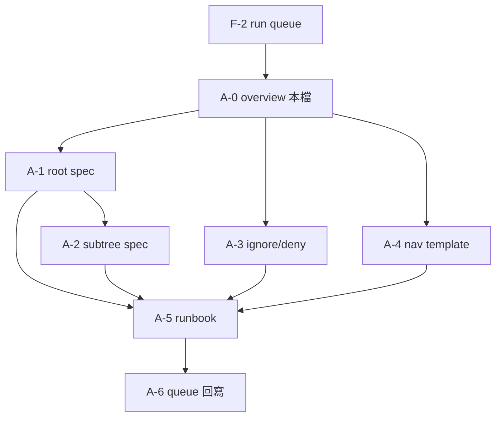

# A0 — Context Entry Overview（Sprint 0 · A 線）

| 項目 | 值 |
|------|-----|
| **票號** | A-0 |
| **版本** | v0.1 |
| **狀態** | Sprint 0 總覽（非 A1～A5 正文） |
| **權威邊界** | 執行期以 `context/context_entry_contract.md` + `core/context_entry.py` 為準；本檔為 **workflow_upgrade 治理層** 導讀 |
| **非目標** | 不複製合同全文、不改 production code、不撰寫 A1～A5 規格正文 |

---

## 1. 為什麼要做 Context Entry

### 1.1 問題（執行期已部分解決）

在 H 線落地前，多條 pipeline 在入口**手寫** `root_context` / `working_context` / `long_term_memory`，或繞過 `build_context` 的裁剪與 token 預算，導致：

- 新入口行為不一致，Code Review 難以判定是否 **H-line bypass**；
- 制度層（憲法／合約／AGENTS）與任務層、檢索層混寫，上下文膨脹或缺欄；
- 下游 ask 圖（selector → retrieve → answer）無法穩定消費同一套頂層欄位。

### 1.2 解法（兩層分工）

| 層 | 職責 | 權威產物 |
|----|------|----------|
| **執行期（H 線）** | 唯一入口 `build_rooted_context`；委派 `build_context`；提升三層 + `token_usage` | `core/context_entry.py`、`context/context_entry_contract.md` |
| **治理期（A 線 · Sprint 0）** | 把 root／subtree／deny／nav／runbook **文字化、可派工**，供新 chat 與多 agent 對賬，**不取代** H 線實作 | `workflow_upgrade/01_context-entry/` |

### 1.3 本輪（Sprint 0）為何仍要做 A 線文件

H 線能力已在戰車根落地（見根 `00_master_plan.md` H 線 done 索引）；**尚缺**的是：

1. **派工可讀**：後續 chat 不必重讀全 repo 即可知道「上下文各層載什麼、誰可改」；
2. **與 Phase 10.5 對賬**：標註哪些 context 欄位是 selector／retrieve／answer 的**上游輸入**（不改寫 `skills/skills_contract.md` §10.5 路由表）；
3. **subtree 治理片段**：戰車 `context_model.md` v0.1 僅三層；A-2 定義的 **subtree** 為治理第四片段，待 A-5 映射至組裝契約。

---

## 2. 在 Sprint 0 / A 線中的位置

### 2.1 Sprint 0 範圍（F + A）

```
workflow_upgrade/
├── 00_master_plan.md          ← F：目標、主線邊界、依賴、DoD
├── 90_run_queue.md            ← F：任務狀態（本輪黑板）
└── 01_context-entry/          ← A：Context Entry 規格層（本目錄）
    ├── A0_context_entry_overview.md   ← 本檔（總覽）
    ├── A1_root_context_spec.md        ← root 治理
    ├── A2_subtree_context_spec.md     ← subtree 治理
    ├── 30_ignore_deny_rules.md        ← A-3（待建）
    ├── 40_navigation_map_template.md  ← A-4（待建）
    └── 50_context_entry_runbook.md    ← A-5（待建）
```

**Sprint 0 不做**：改 `core/`、hooks、connector、dashboard；B/C/D/E 僅 placeholder。

### 2.2 A 線內依賴（邏輯順序）



| 票號 | 狀態（見 `90_run_queue.md`） | 說明 |
|------|------------------------------|------|
| A-0 | 本票 | 總覽與派工導讀；**不**替代 A1～A5 |
| A-1～A-2 | 可能已先行 DONE | 若隊列顯示已完成，新 chat 仍以本檔 §4 對齊關係後再改 spec |
| A-3～A-4 | 可與 A-2 部分並行 | 依賴 A-0 邊界，不依賴 A-2 全文 |
| A-5 | 待 A-1～A-4 可引用草案 | 派工／驗收步驟；組裝順序落地 |
| A-6 | 僅改隊列 | 不寫規格正文 |

### 2.3 與戰車根、歷史目錄的關係

| 路徑 | 關係 |
|------|------|
| `context/context_entry_contract.md` | 執行期合同；A 線不得與之衝突 |
| `core/context_entry.py` | 唯一入口實作 |
| 根 `00_master_plan.md` | 企業化戰役封存；H 線 **已實作**；Sprint 0 A 線為**規格化**，非重開 H 票 |
| `_workflow_upgrade/`（底線） | **歷史**隊列；與本目錄 `workflow_upgrade/` **不同**，勿混用 |

---

## 3. 與 A1～A5 各文件的關係

| 文件 | 票號 | 角色 | 與本檔關係 |
|------|------|------|------------|
| **A0_context_entry_overview.md** | A-0 | 總覽、派工導讀、權威位階 | **本檔**；讀者入口 |
| **A1_root_context_spec.md** | A-1 | root 欄位類型、載入時機、禁則類型、與 working／memory 邊界 | 細化 §1.2 的 **root** 治理；對齊合同頂層 `root_context` |
| **A2_subtree_context_spec.md** | A-2 | subtree 掛載、繼承、欄位、裁剪優先級 P0.5 | 補 **合同未單列** 的第四治理片段；A-5 再映射鍵名 |
| **30_ignore_deny_rules.md** | A-3 | ignore／deny 與憲法禁區**類型**對齊 | 約束「什麼不得進上下文」；不寫實例路徑 |
| **40_navigation_map_template.md** | A-4 | 導航圖模板（邏輯名索引） | 消費 A-1 `navigation`、A-2 `entry_refs`；無 UI |
| **50_context_entry_runbook.md** | A-5 | 派工、組裝順序、驗收、與 §10.5 上游對賬 | **整合** A1～A4；對齊 `build_rooted_context` 呼叫與 unittest |

**閱讀順序建議**：A0 →（按票）A1 或 A3／A4 → A2 → A5。實作或改入口時並讀合同與 `context_entry.py`。

---

## 4. 與現有 contract / code 的對應關係

### 4.1 入口與委派

| 合同約定 | 程式對應 |
|----------|----------|
| 唯一入口 `build_rooted_context(task_input, *, mode=...)` | `core/context_entry.py` → `build_context` |
| `mode` ∈ `ask_pipeline` / `k1_pipeline` / `k2_pipeline` / `api_entry` / `long_task` | `_ENTRY_MODES`；非法 mode 回退 `ask_pipeline` |
| 自動補 `task_id` / `work_order_id` | `_normalize_task_input` |
| 禁止入口手拼三層 | 合同 §4；`AGENTS.md` 一致上下文入口 |

### 4.2 輸出形狀（執行期）

| 頂層欄位 | 來源 | A 線治理對應 |
|----------|------|----------------|
| `root_context` | `result.root_context` | A-1 欄位**類型**與載入時機 |
| `working_context` | `result.working_context` | A-5 runbook（本輪不展開正文） |
| `long_term_memory` | `result.long_term_memory` | 合同 §8：KB 信號供 selector；A-3 deny 交集 |
| `token_usage` | 正規化 `root`/`working`/`memory`/`total`/`total_tokens` | A-5 驗收與裁剪對賬 |
| `metadata.entry` = `"context_entry"` | 固定 | trace／metrics |
| `ok` / `message` / `result` | `build_context` 向後相容 | 工程合約 Rule 4 |

### 4.3 下游消費（只索引）

| 下游 | 消費的 context 語意 | A 線責任 |
|------|---------------------|----------|
| Ask selector `decide_use_rag` | query + H-line payload（`context_refs`、semantic memory） | A-5 標註欄位；A-3 禁止污染 |
| Phase 10.5 圖 | `health → selector → [retrieve \| answer]` | A 線不改路由表；確保上游欄位可對賬 |
| 場景 S1–S3 | 合同 §8.1 | A-5 runbook 引用，不在 A0 展開 |

### 4.4 權威位階（衝突時）

尚書省指令 ＞ 憲法 ＞ 工程合約（含附錄 D）＞ `context_entry_contract.md` ＞ **workflow_upgrade A 線 spec** ＞ 模組 `brief.md`。

---

## 5. 後續派工：新 chat 應先讀哪些檔案

### 5.1 接任一張 A 線票（通用）

1. `workflow_upgrade/90_run_queue.md` — 確認票號、Status、Depends on、Output File  
2. **本檔** `workflow_upgrade/01_context-entry/A0_context_entry_overview.md`  
3. `workflow_upgrade/00_master_plan.md` — Sprint 0 邊界與 F/A 分工  
4. `context/context_entry_contract.md` — 執行期硬規則（禁止 bypass）  
5. `core/context_entry.py` — 入口簽名與提升欄位（只讀，除非另開實作票）  
6. `AGENTS.md` — 接戰紅線與一致上下文入口  

### 5.2 按票加讀

| 目標票 | 加讀 |
|--------|------|
| A-1（維護 root spec） | `A1_root_context_spec.md`；`context/context_model.md` |
| A-2（維護 subtree spec） | `A2_subtree_context_spec.md`；A-1 §8 |
| A-3 | 憲法禁區**類型**（`HARNESS_CONSTITUTION.md` §7，不抄實例路徑）；A-1 §3.2 |
| A-4 | A-1 `navigation`、A-2 `entry_refs` |
| A-5 | A1～A4 全文；`skills/skills_contract.md` §10.5（只讀路由） |
| A-6 | 僅 `90_run_queue.md` |

### 5.3 驗收與 baseline（實作票／回歸）

合同 §6 最短命令（**本 Sprint 0 文檔票不改 code，僅作對賬引用**）：

```bash
python -m unittest tests.test_context_entry -v
```

可選（涉 ask 全鏈時）：`tests.test_ask_selector_and_answer`、K-1 煙測（見合同 §6）。

### 5.4 開工紀律（戰車根）

- 工作目錄：**僅** `workflow_upgrade/`（本輪）；勿與 `_workflow_upgrade/` 混用。  
- 一次一票：`DOING` → 完工 `DONE`，只改該票 Output 與隊列 Status／Notes。  
- 禁區：不印 `.env`、不寫死磁碟路徑、不碰 DarkOps／checkpoint（類型見憲法 §7）。

---

## 6. 本檔完成定義（A-0 DoD）

- [x] 說明 Context Entry 動機（§1）  
- [x] 標註 Sprint 0 / A 線位置與依賴（§2）  
- [x] 對齊 A1～A5 分工，不撰寫其正文（§3）  
- [x] 對賬 contract / code / 下游（§4）  
- [x] 給出新 chat 閱讀清單（§5）  

---

## 變更紀錄

| 日期 | 變更 |
|------|------|
| 2026-05-25 | A-0 初版：overview 建立；隊列 A-0 → DONE |
