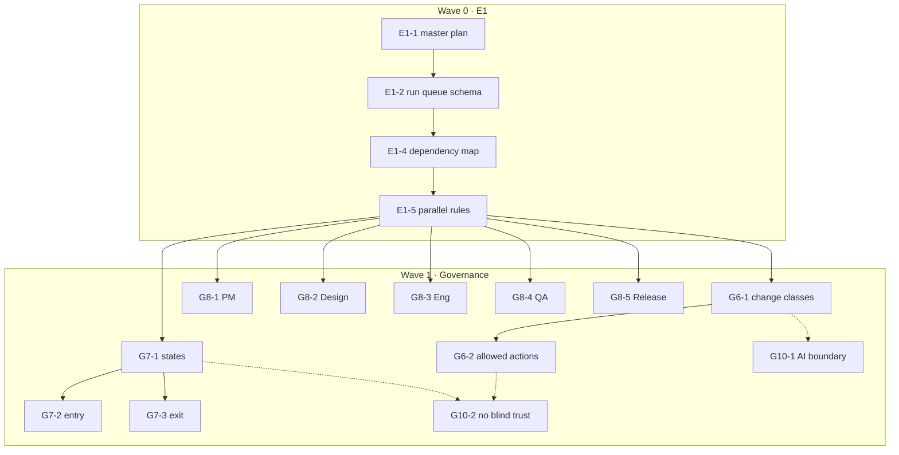
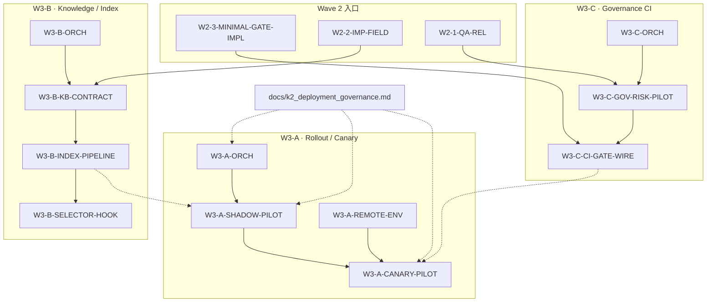

# 02 Dependency Map — Workflow v2

> **权威**：模块间依赖与阶段顺序以本档为准；总览见 `00_master_plan.md`。  
> **更新规则**：E1-4 票负责维护；施工票**不得**擅自重排 Wave 边界。

---

## 1. 阶段总览

实线 = **硬依赖**（前置须 `DONE` 方可开工后继）；虚线 = **软依赖**（可并行草案，合并前须对账）。

---

## 2. Wave 0 — E1 依赖表

| ID | 依赖 | 阻塞说明 |
|----|------|----------|
| E1-1 | — | 无前置；建立 master plan 结构 |
| E1-2 | E1-1 | 队列 schema 须对齐 master plan 模块表 |
| E1-4 | E1-2 | 依赖图须覆盖 queue 已挂票 |
| E1-5 | E1-4 | 并行规则须引用本依赖图 |

---

## 3. Wave 1 — 模块依赖表

### 3.1 G6 Scope Control

| ID | 依赖 | 产出 |
|----|------|------|
| G6-1 | E1-5 | `10_governance/G6_scope_control/10_change_classes.md` |
| G6-2 | G6-1 | `10_governance/G6_scope_control/20_allowed_actions.md` |

### 3.2 G7 State Machine

| ID | 依赖 | 产出 |
|----|------|------|
| G7-1 | E1-5 | `10_governance/G7_state_machine/10_workflow_states.md` |
| G7-2 | G7-1 | `10_governance/G7_state_machine/20_entry_conditions.md` |
| G7-3 | G7-1 | `10_governance/G7_state_machine/30_exit_and_transitions.md` |

> G7-2 与 G7-3 **可并行**，但均依赖 G7-1。

### 3.3 G8 Artifact Contract

| ID | 依赖 | 产出 |
|----|------|------|
| G8-1 | E1-5 | `…/G8_artifact_contract/10_pm.md` |
| G8-2 | E1-5 | `…/G8_artifact_contract/20_design.md` |
| G8-3 | E1-5 | `…/G8_artifact_contract/30_engineering.md` |
| G8-4 | E1-5 | `…/G8_artifact_contract/40_qa.md` |
| G8-5 | E1-5 | `…/G8_artifact_contract/50_release_owner.md` |

> G8-1～G8-5 **彼此无硬依赖**；合并验收前建议交叉引用对账。

### 3.4 G10 Governance Rulebook

| ID | 依赖 | 产出 |
|----|------|------|
| G10-1 | E1-5 | `…/G10_governance_rulebook/10_ai_usage_boundary.md` |
| G10-2 | G10-1 | `…/G10_governance_rulebook/20_no_blind_trust.md` |

**软依赖**：G10-1 宜在 G6-1 至少有可读草案后定稿（非硬阻塞）。

---

## 4. 跨模块对账点（非文件依赖）

| 对账点 | 参与模块 | 说明 |
|--------|----------|------|
| 状态名 × artifact | G7, G8 | exit 条件引用的 artifact 类型须与 G8 命名一致 |
| change class × 禁止情境 | G6, G10 | G10-2 应引用 G6 class，避免重复定义 |
| Release 关口 | G8-5, G7 | Release owner artifact 与终态/冻结态对齐 |
| GOV 风险摘要 | G8-6, G10-2, G7 | **ART-GOV-RISK** ↔ `IMP-RISK-VALIDATION`；G10-2 §6.3 `nbt_validation` |

**CHK-W1（2026-05-27）**：R2 已关闭；R1 部分关闭（余 `ART-REL-RECORD`→`ART-REL-EXEC`，→ **G8-RECON-IMP**）。

对账由 **checker chat** 只读标注风险；模块正文 cleanup 由 **G8-RECON-IMP** 小票执行，不扩写 Wave 2 范围。

---

## 5. Wave 1 出口与 Wave 2 入口

| 阶段 | 状态 | 说明 |
|------|------|------|
| Wave 1 施工 | **DONE** | G6/G7/G8/G10 共 12 票 |
| CHK-W1 | **DONE · PASS-WITH-NOTES** | 见 `99_latest_status.md` §4 |
| Wave 1 总态 | **DONE-WITH-NOTES** | 封板前 P0：**G8-RECON-IMP**、**E1-6** |
| Wave 2 | **WINDING-DOWN** | W2-1 **DONE**（`IMP-OBSERVING`）；W2-2／W2-3 总控 + gate 原型 **DONE**；部分子票 TODO |
| Wave 3 | **OPEN** | W3-0-ORCH 落盘；三条主线 **TODO**（见 §8） |

---

## 6. 与外部系统依赖（只读索引）

| 外部 | v2 关系 |
|------|---------|
| 工程合约 / 憲法 | 硬约束；v2 不得放宽 |
| `workflow_upgrade/` | 无硬依赖；Context Entry 为邻接能力 |
| production `core/` | **无** Wave 0/1 依赖 |
| `docs/k2_deployment_governance.md` | **软依赖** W3-A（shadow／canary Phase；只读，非 v2 正文） |
| 战车根 `00_master_plan.md` §4.8 | **软依赖** W3-A（K-2 rollout 阶段门控） |

---

## 8. Wave 3 — 三条主线依赖

### 8.1 依赖图（mermaid）

实线 = **硬依赖**；虚线 = **软依赖**（建议对账或并行草案，合并前须留痕）。

### 8.2 Wave 3 依赖表

| ID | 依赖 | 阻塞说明 |
|----|------|----------|
| **W3-0-ORCH** | W2-3, W2-2, W2-1-QA-REL（软：CHK-W1） | 总控落盘 §13、`90` Wave 3 区、`02` 本節 |
| **W3-A-ORCH** | W3-0-ORCH | 主线 A 编排骨架；读 K-2 邻接文档摘要 |
| **W3-A-SHADOW-PILOT** | W3-A-ORCH | shadow 至少 1 次；宜知悉 index 状态（软：W3-B-INDEX-PIPELINE） |
| **W3-A-REMOTE-ENV** | W3-A-ORCH | internal canary 环境／cohort 定义 |
| **W3-A-CANARY-PILOT** | W3-A-SHADOW-PILOT, W3-A-REMOTE-ENV | 5–10% internal canary 试点 |
| **W3-A-REL-ARTIFACT** | W3-A-CANARY-PILOT | ART-REL 风格 release／观测记录 |
| **W3-B-ORCH** | W3-0-ORCH | 主线 B 编排骨架 |
| **W3-B-KB-CONTRACT** | W3-B-ORCH, W2-2-IMP-FIELD | index 字段契约；对齐 `imp_state`／ENG-CTX |
| **W3-B-INDEX-PIPELINE** | W3-B-KB-CONTRACT | 可查询 index 状态（非全库实时） |
| **W3-B-GRAPHRAG-MIN** | W3-B-INDEX-PIPELINE | 可选；不阻塞 §13.4 DoD |
| **W3-B-SELECTOR-HOOK** | W3-B-INDEX-PIPELINE | 只读 hook 规格；**不**改 prod selector |
| **W3-C-ORCH** | W3-0-ORCH | 主线 C 编排骨架 |
| **W3-C-GOV-RISK-PILOT** | W3-C-ORCH, W2-1-QA-REL | GOV 案卷实例；可延续 W2-3-GOV-RISK-PILOT |
| **W3-C-CI-GATE-WIRE** | W3-C-GOV-RISK-PILOT, W2-3-MINIMAL-GATE-IMPL | CI 或 nightly 接线 + 指标 |
| **W3-C-AGENT-SOP** | W3-C-ORCH | Cursor／agent SOP 与 gate 对齐（并行可选） |
| **W3-C-IMP-STATE-LINT** | W3-C-ORCH, W2-2-IMP-FIELD | `imp_state` lint 增强（非全状态机 enforcement） |
| **CHK-W3** | W3-A-REL-ARTIFACT, W3-B-SELECTOR-HOOK, W3-C-CI-GATE-WIRE（软） | Wave 3 只读盘点 |

### 8.3 跨主线对账点

| 对账点 | 参与票 | 说明 |
|--------|--------|------|
| shadow 前 index | W3-B, W3-A | `W3-B-INDEX-PIPELINE` 宜先于或并行 `W3-A-SHADOW-PILOT` |
| canary 前 gate 响铃 | W3-C, W3-A | `W3-C-CI-GATE-WIRE` 软依赖 `W3-A-CANARY-PILOT`（至少 nightly 一次 PASS 留痕） |
| K-2 Phase | W3-A, 根 plan §4.8 | v2 仅 internal canary；Phase 3+ → Wave 4 |
| AI-READY 门禁 | W3-B, G7/G8 | `IMP-AI-READY` entry 可查 index；不改 G7 条文 |

---

## 7. 修订记录

| 日期 | 变更 |
|------|------|
| 2026-05-27 | 初版：Wave 0 E1 链 + Wave 1 G6/G7/G8/G10 |
| 2026-05-27 | CHK-W1 后：G7 产出文件名对齐 `90` Output；§5 Wave 1 出口 / Wave 2 入口 |
| 2026-05-27 | W2-3：G8-6 **ART-GOV-RISK** 依赖行；Wave 2 状态 IN_PROGRESS |
| 2026-05-27 | **Wave 3 开盘**：§8 三条主线 mermaid + 依赖表；§5 入口更新 |
