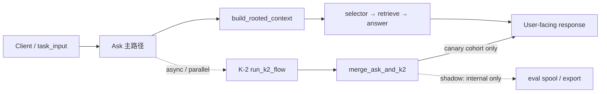

# W3-A — 默认业务链边界（K-2 × ask）

> **票号**：W3-A-ORCH 产出  
> **邻接**：`phase_map_k2_ask.md` · 根 `00_master_plan.md` §4.7–§4.8 · `docs/k2_merge_strategy.md`（合流语义，只读）

---

## 1. 链路与 entrypoint

| 层级 | 组件（逻辑名） | W3-A 角色 |
|------|----------------|-----------|
| **L0 入口** | `/api/ask` 或等价 ask HTTP／pipeline 入口 | **唯一** user-facing 默认入口 |
| **L1 Context** | `build_rooted_context` · `attach_subagent_route` · ibridge enrichment | shadow 对照须含 `ibridge_v0` 摘要（若启用） |
| **L2 Ask 决策** | selector · retrieve · answer | **主权答案**；P1 100% 来自此层 |
| **L3 K-2** | `build_k2_graph` / `run_k2_flow` | P1 异步；P2 cohort 内可作 `primary_source=k2` |
| **L4 合流** | `merge_ask_and_k2` · `ASK_MERGE_INTERFACE` | **单点**合流；**禁止**子票改实现 |
| **L5 观测** | spool · `eval_ci_check` · shadow nightly | 案卷 `execution_evidence` 索引 |

**默认 entrypoint 裁決**：施工与案卷中的「入口」= **L0 ask**；K-2 挂接为 **L3→L4**，**非**替代 L0–L2。

---

## 2. Shadow（Phase 1）执行边界

| 项 | 约定 |
|----|------|
| **环境** | `dev` · `staging` · **远端等价**（staging 集群／预发；**非** prod 全量自动切换） |
| **行为** | user-facing **100% ask**；K-2 异步复制 + merge（`primary_source=ask`） |
| **最短窗口** | **≥7 自然日**（含 ≥1 完整工作周；邻接 playbook §4.1；尚書省可批文下调须留痕） |
| **记录** | `20_pilot/W3-A_case/shadow_run_*.md` + spool／export 路径索引（**无**密钥） |
| **对照** | ask 主答案 vs merge 结果；`infra_risk` / `merge_safe` / `unacceptable` 标签（`eval_ci_check`） |

---

## 3. Internal canary（Phase 2）执行边界

| 项 | 约定 |
|----|------|
| **环境** | 与 shadow 相同类别；须 **W3-A-REMOTE-ENV** 落盘 `canary_env.md` |
| **比例** | **5%** 初值 → 验证后可 **10%**；**仅** internal／staff cohort |
| **行为** | cohort 内 `primary_source=k2`（经 merge）；域外仍 ask-only |
| **试点次数** | Wave 3 DoD：**≥1** 次完整 canary 窗口 + **ART-REL-DEC**／**ART-REL-EXEC** |
| **升格** | Phase 3+（10–30% tenant）→ **Wave 4**；W3-A **禁止**宣称 |

---

## 4. Rollback 与观测依赖（名称 only）

| 类型 | 名称（索引） | 用途 |
|------|--------------|------|
| **自动回退信号** | merge `ci_fail` · `infra_risk` tag · ok 率恶化 | 触发 ask-only（邻接 playbook §7） |
| **批跑验证** | `eval_ci_check` · P+ nightly export · `compare_shadow_profiles` | 出门指标 |
| **单测回归** | `tests.test_k2_ask_shadow` · `tests.test_k2_merge_adapter` | 施工前／后门禁 |
| **数据面** | `k2_shadow_spool` · shadow JSONL · `shadow_ibridge_records.latest.jsonl` | 案卷 evidence 指针 |
| **H 线侧车** | `monitoring_executor` · `ibridge_v0.monitoring_*` · Monitoring Graph **L0** | **仅** observability（**NBT-OBS**；不参与 selector） |
| **v2 治理** | `wf_gov_gate.ps1` · `wf_check_cross_ref.ps1` | W3-C 软依赖；canary 前宜 nightly PASS 留痕 |

**禁止**：将 L0 monitoring_graph 或 spool 计数**单独**作为 release approve 依据（G10-2 **NBT-OBS-***）。

---

## 5. 与根 plan §4.8 对账

| 根 plan 现状 | W3-A v2 试点关系 |
|--------------|------------------|
| Phase 1 prod shadow **本地演練**已启用 | v2 **可引用**指标范式；**不重复宣称**远端 prod 已完成 |
| 远端 prod 本轮 **不 rollout** | W3-A 子票 **硬禁区** |
| Phase 2 批文 **草案** | `W3-A-CANARY-PILOT` 产出案卷；**不**替代尚書省批文 |

---

## 6. 修订记录

| 日期 | 变更 |
|------|------|
| 2026-05-27 | W3-A-ORCH 初版 |
